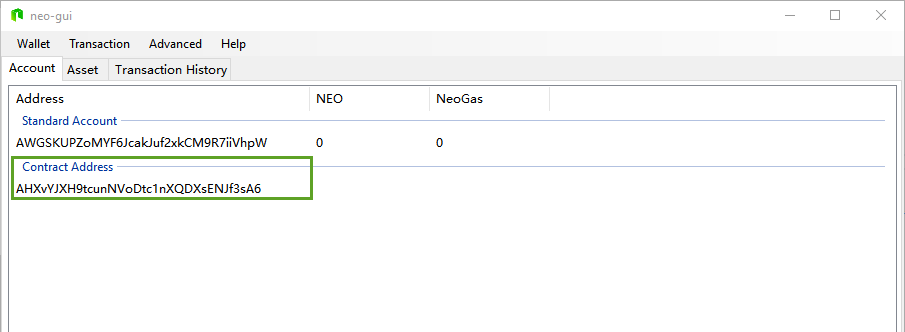

# Einen Lock Contract zur Verfügung stellen

Bevor Sie den folgenden Artikel lesen, lesen sie bitte zuerst diese Artikel:

[How to write NEO smart contract with C#](../getting-started-csharp.md)

[NEO Smart Contract Tutorial](../tutorial.md)

[Smart contract example - Lock (lock)](Lock.md)

Wir gehen davon aus, dass Sie schon ein Basiswissen über Smart Contracts haben, zeigen wir Ihnen wie sie einen Lock Contract mit der Wallet auf einer Adresse zur Verfügung stellen.
Zusätzlich basiert dieses Tutorial auf der Demo von Smart Contract 2.0. Bitte laden sie neuste  Version von **test network client** herunter von [GitHub](https://github.com/neo-project/neo-gui/releases).

PS: Zur Zeit ist die aktuellste Version von **test network client**: [Neo GUI v2.2.0](https://github.com/neo-project/neo-gui/releases/tag/v2.2.0).


> [!Anmerkung]
> Die folgende Operation wird auf dem **test network** laufen, weil das Main Network Smart Contract 2.0 noch nicht zur Verfügung stellt, demnach wird die folgende Operation auf dem Main Network scheitern.
> Um das Test Net zu nutzen müssen Sie 2 Änderungen in den config Dateien vornehmen:
1. Extrahieren Sie den Neo GUI Client in Ihren Ordner. Sie werden die Dateien  config.json, config.mainnet.json, config.testnet.json, protocol.json, protocol.mainnet.json, protocol.testnet.json sehen. 'Config.json' und 'protocol.json' sind standardmässig identisch zu der Mainnet Version.
2. Sie müssen den Code der Testnet Dateien in  die 'config.json' und 'protocol.json' Dateien kopieren, damit sie Zugang zum Testnet statt zum Mainnet bekommen. Das heisst: Kopieren Sie 'config.testnet.json' nach 'config.json' und 'protocol.testnet.json' nach 'protocol.json'

## Kreieren Sie eine Wallet

Dieser Schritt ist sehr einfach, öffnen sie die PC Version des Client, klicken Sie auf 'wallet', 'create the wallet database', wählen sie den Wallet Speicherort aus und legen Sie den Namen und das Passwort für die Wallet fest.


## Holen Sie sich den Public Key

Die neu kreierte Wallet wird automatisch einen standard Achhount, rechtsklicken Sie auf Account, sehen Sie sich den Private Key an und kopieren sie den Public Key in der 2. Linie, wie in der Abbildung gezeigt:


> [!Achtung]
> Bitte beachten Sie: Geben Sie niemals Ihren Private Key preis.

Folgend schreiben wir ein lokales Programm um den Public Key in ein byte array umzuwandeln, mit folgendem C# Code:

```c#
namespace ConsoleApp1
{
    class Program
    {
        static void Main(string[] args)
        {
            // 这里替换为上一步复制的公钥
            byte[] b = HexToBytes("0285eab65f4a0126e4b85b4e5d8b7e303aff7efb360d595f2e3189bb90487ad5aa");
            foreach (var item in b)
            {
                Console.Write($"{item}, ");
            }
            Console.ReadLine();
        }

        static byte[] HexToBytes(string hexString)
        {
            hexString = hexString.Trim();
            byte[] returnBytes = new byte[hexString.Length / 2];
            for (int i = 0; i < returnBytes.Length; i++)
            {
                returnBytes[i] = Convert.ToByte(hexString.Substring(i * 2, 2), 16);
            }
            return returnBytes;
        }
    }
}
```

Nachdem der Code ausgeführt ist, wird auf dem Bildschirm der byte array angezeigt, welcher aus dem Public Key kreiert wurde. Kopieren Sie diesen, da wir ihn später noch brauchen werden.

## Schreiben Sie einen Smart Contract

Kreieren Sie ein Smart Contract Projekt und schreiben Sie folgenden Smart Contract.


```c#
using Neo.SmartContract.Framework;
using Neo.SmartContract.Framework.Services.Neo;

namespace Neo.SmartContract
{
    public class Lock : SmartContract
    {
        public static bool Main(byte[] signature)
        {
            Header header = Blockchain.GetHeader(Blockchain.GetHeight());
            if (header.Timestamp < 1499328600) // 2017-6-6 18:10
                return false;
            // Paste the public key byte array here
            return VerifySignature(new byte[] { 2, 133, 234, 182, 95, 74, 1, 38, 228, 184, 91, 78, 93, 139, 126, 48, 58, 255, 126, 251, 54, 13, 89, 95, 46, 49, 137, 187, 144, 72, 122, 213, 170 }, signature);
        }
    }
}
```

Der Lock Contract hat 2 wichtige Variablen die man ändern kann, einerseits der Public Key, andererseits die Lock Time.

1. Kopieren sie den zuvor gespeicherten byte array des Public Key in den Code des Contracts

2. Ändern Sie die Lock Time im Beispiel Code, welche eine Unix Timestamp ist. Rechnen Sie dies selber aus, vielleicht hilft Ihnen ein online Tool. [Unix timestamp online conversion](https://unixtime.51240.com/)

Nachdem Sie die beiden Variablen ersetzt haben, compilen Sie den Contract um eine Lock.avm Datei zu erhalten.

## Lock Contract zur Verfügung stellen

Um einen Contract bereitzustellen müssen wir zuerst das Contract Script erhalten. Es gibt viele Wege dies zu tun, wir können den untenstehende C# code nutzen um die .avm Datei zu lesen und den bytecode zu erhalten.

```c#
byte[] bytes = System.IO.File.ReadAllBytes("Test.avm");
string str = System.Text.Encoding.Default.GetString(bytes);
```

Wenn Sie es mühsam finden dafür ein Script zu schreiben, hat die 'Deploy Contract' Funktion des Client's eine einfache Möglichkeit den bytecode zu erhalten:

Klicken Sie auf 'Advanced', 'Deploy Contract' und klicken Sie auf den 'Load' Button in der oberen rechten Ecke. Wählen Sie die vorher generierte 'Lock.avm' Datei. In der 'Code' Box sollten Sie nun das Contract Script sehen, wie in der Abbildung. Kopieren Sie diesen.


Rechtsklicken Sie auf den Leerraum im Client unter dem 'Account' tab, wählen Sie 'Create Contract Add.', 'Custom', und fügen sie das Contract Script in die Box ein:


Hier müssen wir einen assoziierten Account auswählen (um genau zu sein assoziieren wir ein Public/Private Key Paar). Die Assoziierung bedeutet, dass wenn ein Smart Contract eine Signatur Operation verlangt, wird der Client den Assoziierten Private Key nutzen um zu signieren. In diesem Schritt müssen Sie den gleichen Public Key wählen wie im ersten Schritt, da sonst die Signatur nicht übereinstimmt und die Ausführeng des Contracts fehlschlagen wird. Da es in unserem Contract einen Signaturparameter gibt, füllen Sie 00 in der Form des Parametereintrags ein (Um zu verstehen was einzugeben für die Parameter, sehen sie nach unter [Parameter](Parameter.md)) und geben Sie den Script Code ein, wie vorher gezeigt. Wenn Sie das getan haben, sehen Sie die Contract Adresse, wie in der Abbildung gezeigt. 



## Test

Es folgt ein Test des Smart Contract Authentifizierungsaccount. Wenn Sie Assets von einem Smart Contract Authentifizierungsaccount transferieren, wird die Consensus Node den Smart Contract ausführen, wenn Sie die Transaktion verifiziert. Wenn die Validierung des Contracts erfolgreich ist (das Resultat ist true), wird die Transaktion bestätigt. Sonst wird die Transaktion immer unbestätigt sein. Unsere Testmethode besteht darin zuerst einige Assets in die Accountadresse zu transferieren und danach wieder heraus transferieren.

> [!Note]
> Um die Genauigkeit des Tests zu garantieren, ist es am besten keine andere Assets in der Wallet zu haben, sonst können Sie nicht sicher sein ob die Assets aus einer Standardadresse oder aus einer Contractadresse kommen, ausser Sie verstehen den 'change finding algorithm' des Client's und wissen welche Transaktion von der Contract Adresse kommt.

### Assets an die Contract Adresse überweisen

Öffnen Sie eine Wallet mit Assets auf dem **testnet** und überweisen sie einen bestimmten Betrag dieser Assets an den Contractaccount.

### Assets von der Contract Adresse überweisen

Überweisen Sie Assets aus Ihrem Smart Contract Account:


Wenn die vorherige Operation korrekt ist, passiert folgendes wenn das Asset überwiesen ist:

Wenn die aktuelle Zeit tiefer ist als die Lockout Time, wird die Überweisung nicht bestätigt, d.h. die Transaktion wird scheitern.

Etwa 5 Minuten nachdem Sie auf 'Rebuild Index' klicken, wird die ubestätigte Transaktion verschwinden und die Assets kehren zum vorherigen Stand zurück

Wenn die aktuelle Zeit grösser ist als die Lock Time, wird die Transaktion erfolgreich sein.


