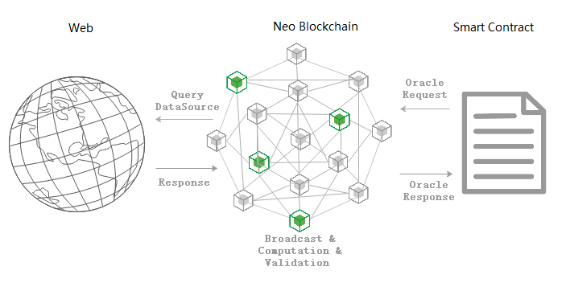
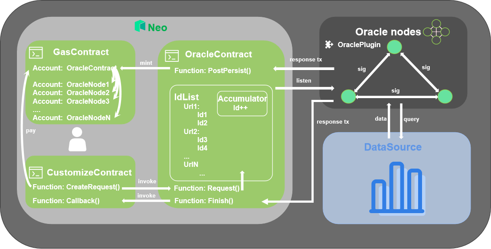

# Neo Oracle Service

Oracle solves the problem that blockchain cannot obtain information from the external network. As a gateway for smart contracts to communicate with the outside world, Oracle opens a window to the outside world for blockchain. Oracle nodes jointly verify the data fetched from the network, then smart contracts query the result in the response transactions on the chain.

Neo Oracle Service is an out-of-chain data access service built into Neo N3. It allows users to request the external data sources in smart contracts, and Oracle nodes designated by the committee will access the specified data source then pass the result in the callback function to continue executing the smart contract logic.



## Key mechanisms

### Commit-Reveal mechanism

The commit-reveal mechanism is a sequential protocol that prevents data plagiarism for multiple Oracle nodes.

**Process**

1. Oracle node submits ciphertext information (hash, signature, etc.) about data to other Oracle nodes and collects ciphertext information submitted by other Oracle nodes.

   Neo Oracle Service adopts the multiple signatures on the Response transaction as the ciphertext information.

2. After collecting enough ciphertext information, Oracle nodes reveal the data to other Oracle nodes to verify the data.

   Accordingly, the revealed data in Neo Oracle Service is the Response transaction.

In this way, we can avoid data plagiarism since oracle nodes cannot predict the data to submit ciphertext information.


### Request-Response pattern

Neo Oracle Service adopts the request-response processing mechanism, which is an asynchronous pattern.



**Process**

1. The user writes the smart constract to call the `Request` method of the Oracle contract.

   Each successfully created Request is put in the Request cache list with an unique RequestId.

2. Oracle node listens for the requests in the Request cache list in real time, and accesses data sources specified in the Request to obtain data.

3. Oracle node processes the obtained data with the specified filter, and encapsulates the result into a `Response` transaction (including RequestId, data, fixedScript, multisig address, etc.).

   The result data is stored in the `TransactionAttribute` field of the Response transaction. The `fixedScript` in the transaction is used to call the `finish` method of the Oracle contract, which will execute the callback function `CallbackMethod`.

4. Oracle nodes independently sign the Response transaction through the commit-reveal mechanism.

5. The Response transaction with enough signatures will be stored on the chain, and the callback function will be executed.

## Protocol supports

Oracle service currently supports two URL schemes, `https` and `neofs`. `https` scheme follows [RFC 2818](https://tools.ietf.org/html/rfc2818) and [RFC 2616](https://tools.ietf.org/html/rfc2616) standards and allows to specify resource to request via HTTP GET method. `neofs` scheme is Neo-specific. Both types of requests are treated equal otherwise.

## Fees and rewards

- **Fees**

  Neo Oracle Service charges the user by the number of requests, 0.5 GAS for each. Besides, the user has to pay additional fees for the callback function. All the fees will be paid when the Request is created.

- **Rewards**

  The fee paid by the user for the Request is distributed to the Oracle node in turn when executing the `PostPersist` logic.

  Distribution order = RequestId % count of Oracle nodes

## Example

Here is an demo about using the Oracle service：

```c#
using Neo.SmartContract;
using Neo.SmartContract.Framework;
using Neo.SmartContract.Framework.Native;
using Neo.SmartContract.Framework.Services;
using System.ComponentModel;

namespace demo
{
    [DisplayName("Oracle Demo")]
    [ManifestExtra("Author", "Neo")]
    [ManifestExtra("Email", "dev@neo.org")]
    [ManifestExtra("Description", "This is a Oracle using template")]
    public class OracleDemo : SmartContract
    {
        static readonly string PreData = "RequstData";

        public static string GetRequstData()
        {
            return Storage.Get(Storage.CurrentContext, PreData);
        }

        public static void CreateRequest(string url, string filter, string callback, byte[] userData, long gasForResponse)
        {
            Oracle.Request(url, filter, callback, userData, gasForResponse);
        }

        public static void Callback(string url, byte[] userData, int code, byte[] result)
        {
            if (Runtime.CallingScriptHash != Oracle.Hash) throw new Exception("Unauthorized!");
            Storage.Put(Storage.CurrentContext, PreData, result.ToByteString());
        }
    }
}
```

As shown above, there are two key functions in the contract:

- `CreateRequest` function can create Oracle Request to request data

- `Callback` function is used to execute contract logic after the Oracle node fetches data

### Oracle request

The following fields are required for Oracle Request：

| Fields           | Type    | Description                                                  |
| -------------- | --------- | ------------------------------------------------------------ |
| Url            | string    | The resource path, with a maximum length of 256 bytes                             |
| Filter         | string    | Used to filter out useful information from the result returned from the data source. It is a JSONPath expression with a maximum length of 128 bytes. For the filters supported by Oracle, see the explanation below. |
| CallbackMethod | string    | method name of the callback function (cannot begin with "_"), with a maximum length of 32 bytes|
| UserData       | var bytes | The custom data                                              |
| GasForResponse | long      | The fee paid in advance for the callback function to pay for executing the script in the Response transaction. The fee should not be less than 0.1 GAS and will be charged when creating the Oracle request transaction |

#### Url

It is expected that URL requested will provide data in JSON format, for HTTP requests it means that server must answer with `Content-Type: application/json` header for request to be successful.

##### NeoFS URLs

NeoFS URLs use the following scheme:

```
neofs://<Container-ID>/<Object-ID/<Command>/<Params>
```

Where `Container-ID` and `Object-ID` are mandatory components, `Command` and `Params` are optional.

Absent any command oracle subsystem will get an object and return its payload, example: neofs://C3swfg8MiMJ9bXbeFG6dWJTCoHp9hAEZkHezvbSwK1Cc/3nQH1L8u3eM9jt2mZCs6MyjzdjerdSzBkXCYYj4M4Znk.

Command `range` can be used to get a part of object's payload, it has a mandatory range parameter specified as `offset|length`, where `offset` is a number of bytes to skip from the beginning on payload and `length` is a number of bytes to return to the caller, they're separated by vertical bar. Example request: neofs://C3swfg8MiMJ9bXbeFG6dWJTCoHp9hAEZkHezvbSwK1Cc/3nQH1L8u3eM9jt2mZCs6MyjzdjerdSzBkXCYYj4M4Znk/range/42|128.

Command `header` can be used to get header of an object, it doesn't have any parameters. Example: neofs://C3swfg8MiMJ9bXbeFG6dWJTCoHp9hAEZkHezvbSwK1Cc/3nQH1L8u3eM9jt2mZCs6MyjzdjerdSzBkXCYYj4M4Znk/header.

Command `hash` can be used to get SHA256 hash of an object or part of it, it has an optional range parameter with the same syntax as for `range` command. Example: Example: neofs://C3swfg8MiMJ9bXbeFG6dWJTCoHp9hAEZkHezvbSwK1Cc/3nQH1L8u3eM9jt2mZCs6MyjzdjerdSzBkXCYYj4M4Znk/hash.

#### Filter

Given the following Json example, the Oracle supported filters are illustrated in the table below.

```json
{
    "store": {
        "book": [
            {
                "category": "reference",
                "author": "Nigel Rees",
                "title": "Sayings of the Century",
                "price": 8.95
            },
            {
                "category": "fiction",
                "author": "Evelyn Waugh",
                "title": "Sword of Honour",
                "price": 12.99
            },
            {
                "category": "fiction",
                "author": "Herman Melville",
                "title": "Moby Dick",
                "isbn": "0-553-21311-3",
                "price": 8.99
            },
            {
                "category": "fiction",
                "author": "J. R. R. Tolkien",
                "title": "The Lord of the Rings",
                "isbn": "0-395-19395-8",
                "price": 22.99
            }
        ],
        "bicycle": {
            "color": "red",
            "price": 19.95
        }
    },
    "expensive": 10,
    "data": null
}
```

| Filter                                | Result                                                       |
| ------------------------------------- | ------------------------------------------------------------ |
| $.store.book[*].author                | The authors of all books                                     |
| $..author                             | All authors                                                  |
| $.store.*                             | All things, both books and bicycles                          |
| $.store..price                        | The price of everything                                      |
| $..book[2]                            | The third book                                               |
| $..book[-2]                           | The second to last book                                      |
| $..book[0,1]                          | The first two books                                          |
| $..book[:2]                           | All books from index 0 (inclusive) until index 2 (exclusive) |
| $..book[1:2]                          | All books from index 1 (inclusive) until index 2 (exclusive) |
| $..book[-2:]                          | Last two books                                               |
| $..book[2:]                           | Book number two from tail                                    |
| $..book[?(@.isbn)]                    | Invalid Filter                                               |
| $.store.book[?(@.price < 10)]         | Invalid Filter                                               |
| $..book[?(@.price <= $['expensive'])] | Invalid Filter                                               |
| $..book[?(@.author =~ /.*REES/i)]     | Invalid Filter                                               |
| $..book[(@.length-1)]                 | Invalid Filter                                               |
| $..*                                  | Invalid Filter                                               |
| $..                                   | Invalid Filter                                               |
| $.*                                   | All store value and expensive,data value                     |
| empty string                          | Give me the original result                                  |

The returned result can be found at https://github.com/json-path/JsonPath.

### Callback function

The type and order of the parameters of the callback function should exactly be the same as below:

| Field     | Type    | Desc                                      |
| -------- | --------- | ----------------------------------------- |
| Url      | string    | the resource path                                |
| UserData | var bytes | the custom data                            |
| Code     | byte      | status Code of the Oracle response, see the Code table for details. |
| Result   | var bytes | the result                                  |

### Code

The Code field defines the status Code for Oracle responses, including the following types:

| Value     | Status                   | Desc             | Type   |
| ------ | ---------------------- | ---------------- | ------ |
| `0x00` | `Success`              | execute successfully         | `byte` |
| `0x10` | `ProtocolNotSupported` | Unsupported protocol     | `byte` |
| `0x12` | `ConsensusUnreachable` | Oracle nodes did not reach a consensus | `byte` |
| `0x14` | `NotFound`             | requested information does not exist | `byte` |
| `0x16` | `Timeout`              | timeout         | `byte` |
| `0x18` | `Forbidden`            | no permission to query the data source       | `byte` |
| `0x1a` | `ResponseTooLarge`     | result size is out of limit | `byte` |
| `0x1c` | `InsufficientFunds`    | the fee is insufficient   | `byte` |
| `0xff` | `Error`                | error orrcurs in the execution         | `byte` |
