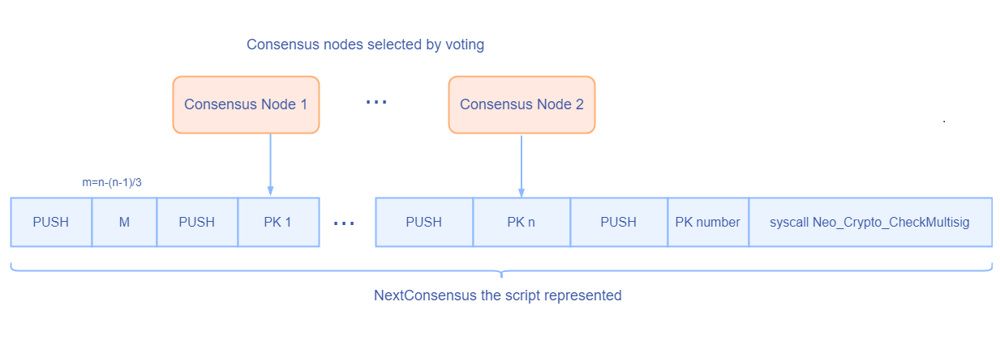

# Block

The Blockchain is a data structure. The block is composed of block header and block body. As each block has a crpytographic hash of the previous block (refer to `PrevHash` in the block header), and a chain structure is formed. 

## Block Header

The data structure of block as following:

| Size | Field         | Name                                | Type    | Description                                                  |
| ---- | ------------- | ----------------------------------- | ------- | ------------------------------------------------------------ |
| 4    | Version       | Block Version                       | uint    | Block version, current is `0`                                |
| 32   | PrevHash      | Previous Hash                       | UInt256 | The previous block's hash                                    |
| 32   | MerkleRoot    | Merkle Tree    Root                 | Uint256 | The merkle tree root of the block's transactions             |
| 8    | Timestamp     | Block Timestamp                     | ulong   | The time when this block is generated                        |
| 4    | Index         | Block Index                         | uint    | Block height, and the Genesis Block's index is 0             |
| 1    | PrimaryIndex  | Speaker index                       | byte    | Index of the proposal validator in the current round         |
| 20   | NextConsensus | Address of the next round validator | UInt160 | The script hash of more than two-thirds of validator's signatures for the next round |
| ?    | Witness       | Witness                             | Witness | The executable verification scripts                          |

The block header contains the basic information of a block and provides verification of a block. 

Block `hash` and `index` can be used to identify a block. The hash value is obtained by concatenating the first seven attributes of the block header and performing SHA256 operation twice. Normally, Neo has only one chain, and each block is confirmed by more than two-thirds of the consensus nodes, before added to the blockchain. Therefore, the height of each block is unique. Block height must be equal to the previous block height plus 1, and the Genesis Block height is 0. 

`Timestamp` is the block's time stamp, must be bigger than the previous one. The internal between two blocks is about 15 seconds, and is set by the variable `MillisecondsPerBlock` in the configuration file `config.json`.

`NextConsensus` is the hash of multi-signature contract, which needs the signatures of more than two-thirds of the consensus nodes as parameters. The example script is shown as below. Each block, with the `NextConsensus` field, locks the nodes participating in the next round of consensus activity. In the previous round of consensus activity, the Speaker calculated the consensus nodes of the next round based on the voting at that time, generated the multi-signature contract, and assigned the hash value of the contract to the block's `NextConsensus` field. 

`Witness` is the verification script of the block, it contains `InvocationScript` and `VerificationScript`. The `InvocationScript` provides the parameters for the `VerificationScript` to execute. 

## Block

The block data structure is as follows:

| Size | Field        | Name             | Type          | Description              |
| ---- | ------------ | ---------------- | ------------- | ------------------------ |
| ？   | Header       | block header     | Header        | block header             |
| ?\*? | Transactions | Transaction List | Transaction[] | The payload of the block |

The block body is a transaction list, which essentially starts with the transaction list length, followed by a list of transactions. In one round of consensus activity, the Speaker selects a series of verified transactions from its memory pool, put the transaction hash into a consensus message (`PrePareRequest`) and then broadcast it to the blockchain network. For more details about consensus, refer to [Consensus Mechanism](../../consensus/dbft.md).

At present, there can be up to 512 transactions per block.

> [!NOTE]
>
> When a block persistent, it stores a hash list of the block's transaction, and the transaction data is stored separately for facilitate query.
