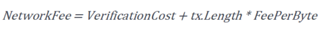

# Transaction

Transaction is the basic operation model of the whole Neo network. Wallets, smart contracts and accounts interact with Neo network through transactions. In Neo's P2P network, information is packed as `InvPayload` for transferring (Inv is abbreviation of Inventory). Different payloads have their special data. `InventoryType.Tx` indicates transaction data is packed into `InvPayload`. 

## Structure

On Neo blockchain the transaction data structure is as follows:

| Size | Field | Description |
|--------------|---------|------------------------------------------|
| `version`    | byte   | Transaction version, currently 0            |
| `nonce`    | uint   | Random number      |
| `sysfee`    | long   | System fee paid for network resource |
| `netfee`    | long   | Network fee paid for the validator packaging transactions |
| `validUntilBlock`    | uint   |  Transaction validity period  |
| `signers`         | Signer[] | Sender and the effective scope of signature |
| `attributes` | TransactionAttribute[]   | Transaction attributes                                    |
| `script`     | byte[]   | Script executed on the NeoVM |
| `witnesses`  | Witness[]   | List of scripts used to validate the transaction    |

### version

The version allows the transaction structure to be updated to make it backward compatible. The current version is 0.

### signers

The first field is the script hash of the transaction sender account. Since UTXO model has been deprecated in Neo N3 and the native assets NEO and GAS turned into NEP-17 assets, the input and outputs fields are no longer recorded in the transaction structure, instead, the `sender` is used to track the sender of the transaction. 

The rest fields are used to define the effective scope of signature. In Neo Legacy transaction signature is globally effective. In order to allow users to control the signature scope at a finer level of granularity, the cosigners field in the transaction structure has been changed in Neo N3, so that the signature can be used only for verifying the specified contract. 

When checkwitness is used for transaction verification, cosigners except the transaction sender need to define the scope of their signature.

| Field              | Description                                      | Type           |
| ------------------ | ------------------------------------------------ | -------------- |
| `Account`          | Script hash of the account                       | `UInt160`      |
| `Scopes`           | Effective range of the signature                 | `WitnessScope` |
| `AllowedContracts` | Signs array of the allowed contract scripts      | `UInt160[]`    |
| `AllowedGroups`    | Signs public keys of the allowed contract groups | `ECPoint[]`    |

#### Scopes

Scopes defines the effective range of the signature, including these types:

| Field  | Name              | Description                                                  | Type   |
| ------ | ----------------- | ------------------------------------------------------------ | ------ |
| `0x00` | `None`            | The signature is used for transactions only, and is disabled in contracts | `byte` |
| `0x01` | `CalledByEntry`   | The signature is only effective to the contract script called by Entry | `byte` |
| `0x10` | `CustomContracts` | The signature is only effective to the specified contract script | `byte` |
| `0x20` | `CustomGroups`    | The signature is effective to contracts in the group.        | `byte` |
| `0x80` | `Global`          | The signature is globally effective. It is the default value of Neo Legacy and is backward compatible. | `byte` |

### sysfee

The system fee depends on the transaction's script, i.e., its size, number and type of NeoVM instructions. The 10 GAS free system fee is canceled in Neo N3. The calculation formula is as follows:


where *OpcodeSet* is opcode set, *OpcodePrice<sub>i</sub>* is the cost of opcode i, *n<sub>i</sub>* is the execution times of instruction i in the contract script. For each opcode fee refer to [Fees for Instructions](../../reference/fees.md#fees-for-instructions).

### netfee

The network fee is charged when the user submits a transactions to Neo blockchain as a reward for consensus nodes generating blocks. There is a  base fee for each transaction. The transaction is only executed if the fee paid by the user is greater than or equal to the base fee; otherwise, the transaction will be treated as invalid. The calculation formula is as follows:



where *VerificationCost* is the fee for instructions executed by NeoVM to verify transaction signatures, *tx.Length* is the transaction data byte length, and *FeePerByte* is transaction fee per byte, currently 0.00001 GAS.

### attributes

Additional attributes are allowed to be added to transactions of specific types. You need to define the usage type, internal and external data size for each attribute.

Up to 16 attributes can be added to one transaction.


### script

The script that is executed on the NeoVM and determines the effects of the transaction.

### witnesses

witnesses verifies the validity and integrity of a transaction. It includes two attributes.

| Field                | Description                                                  |
| -------------------- | ------------------------------------------------------------ |
| `InvocationScript`   | Executes the script and passes parameters to the verification script |
| `VerificationScript` | Verification script                                          |

You can add multiple witnesses to each transaction, or use witnesses with multiple signatures.

#### Invocation Script

Construct an invocation script to add signature:

`0x0C` (PUSHDATA1) + `0x40` ( 64-byte ) + signature

By repeating this step, the invocation script can push multiple signatures for the multi-signature contract.

#### Verification Script

Verification script, commonly known as address script, includes normal address script and multi-signature address script. The address script can be directly obtained from the wallet account. For information about the construction refer to [Wallets](wallets.md#address).

It can also be used as a custom authentication contract script.

## Transaction serialization

In Neo all variable-length integer types except IP addresses and port numbers are stored in little-endian order. When the transaction is serialized, it is executed in the following field order:

| Field             | Description                                                  |
| ----------------- | ------------------------------------------------------------ |
| `version`         | -                                                            |
| `nonce`           | -                                                            |
| `systemFee`       | -                                                            |
| `networkFee`      | -                                                            |
| `validUntilBlock` | -                                                            |
| `signers`         | Need to serializes `WriteVarInt(length) `first and then other elements of the array |
| `attributes`      | Need to serializes `WriteVarInt(length)` first and then other elements of the array |
| `script`          | Need to serializes `WriteVarInt(length) `first and then the byte array |
| `witnesses`       | Need to serializes `WriteVarInt(length) `first and then other elements of the array |


> [!Note]
>
> WriteVarInt (value)  stores a non-fixed-length type based on the value of value, and determines the storage size according to the range of values.

| Value Range         | Storage Type         |
| ------------------- | -------------------- |
| value < 0xFD        | byte(value)          |
| value <= 0xFFFF     | 0xFD + ushort(value) |
| value <= 0xFFFFFFFF | 0xFE + uint(value)   |
| value > 0xFFFFFFFF  | 0xFF + value         |

## Transaction Signature

The transaction signature is to sign the data of the transaction itself by ECDSA method (not including the signature data, i.e. the witnesses part) and then fill in the witnesses in the transaction body.

Here is an example of a JSON-format transaction, where the script and witnesses fields use Base64 instead of the original Hexstring encoding:

```Json
{
  "hash": "0xd2b24b57ea05821766877241a51e17eae06ed66a6c72adb5727f8ba701d995be",
  "size": 265,
  "version": 0,
  "nonce": 739807055,
  "sender": "NMDf1XCbioM7ZrPZAdQKQt8nnx3fWr1wdr",
  "sys_fee": "9007810",
  "net_fee": "1264390",
  "valid_until_block": 2102402,
  "signers": [{
    "account": "0xdf93ea5a0283c01e8cdfae891ff700faad70500e",
    "scopes": "FeeOnly"
  },
  {
    "account": "0xdf93ea5a0283c01e8cdfae891ff700faad70500e",
    "scopes": "CalledByEntry"
  }],
  "attributes": [],
  "script": "EQwUDlBwrfoA9x+Jrt+MHsCDAlrqk98MFA5QcK36APcfia7fjB7AgwJa6pPfE8AMCHRyYW5zZmVyDBSJdyDYzXb08Aq/o3wO3YicII/em0FifVtSOA==",
  "witnesses": [{
    "invocation": "DEDy/g4Lt+FTMBHHF84TSVXG9aSNODOjj0aPaJq8uOc6eMzqr8rARqpB4gWGXNfzLyh9qKvE++6f6XoZeaEoUPeH",
    "verification": "DCECCJr46zTvjDE0jA5v5jrry4Wi8Wm7Agjf6zGH/7/1EVELQQqQatQ="
  }]
}
```

