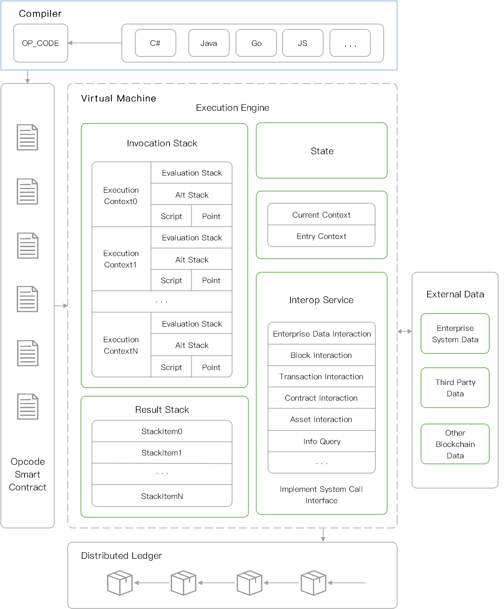

# NeoVM

## Introduction 

NeoVM is a lightweight virtual machine for executing NEO smart contracts. As the core component of NEO, NeoVM has Turing completeness and high consistency, which can implement arbitrary execution logic and ensure consistent execution results of any node in distributed network, providing strong support for decentralized applications. 

With the help of NeoCompiler, source code written in Java, C# or other high-level languages can be compiled into a unified NeoVM instruction set, thus achieving cross-platform. Also, it lowers the development threshold for enabling smart contract developers to participate in the application development in Neo ecosystem without learning a new development language. 

In addition, NeoVM is highly decoupled from the upper-level code and customizable by using techniques such as interop services. NeoVM can be used by simply creating an instance, incredibly easy to use, and can be applied to various blockchain and non-blockchain scenarios.  

##  Infrastructure and Execution Process  

### Infrastructure 

The NeoVM architecture is mainly composed of the execution engine, stack, and interoperation service layer. 

#### ExecutionEngine

ExecutionEngine is the core of NeoVM, mainly responsible for loading scripts and executing corresponding instructions, such as flow control, stack operation, bit operation, arithmetic operation, logical operation, cryptography, etc. It can also interact with external data by interoperable service layer through system call. 

#### Stack  

NeoVM is a stack-based virtual machine. NeoVM has four types of stack:InvocationStack, EvaluationStack, AltStack and ResultStack.  

-  InvocationStack is used to store all execution contexts of current NeoVM, which are isolated from each other in the stack. Context switching is performed based on the current context and entry context. The current context points to the top element of invocation stack, which is ExecutionContext0 in the architecture figure. And the entry context points to the tail element of invocation stack, which is ExecutionContextN in the architecture figure.
- EvaluationStack is for storing the data used by the instruction in execution process. Each execution context has its own evaluation stack.
- AltStack is for storing the temporary data used by the instruction in execution process. Each execution context has its own alt stack.
- ResultStack is used to store execution result after all scripts are executed. 

#### Interoperation Service Layer 

Interoperation service layer is a bridge between VM and external data. By invoking interoperation interfaces, NeoVM can access the block information、 transaction information、contract information、asset information and other data required for the execution of smart contracts. 

Each Neo smart contract can choose whether to enable a private storage area, which stores data in key-value format. With the help of interoperation service layer, NeoVM can dynamically modify the corresponding data in storage area when executing the smart contract. 

Besides, interoperation service layer provides encryption algorithms, zero-knowledge proof, network resource access, etc., to meet the needs of developers to build advanced applications. 

In addition, the interoperation service layer also supports custom extensions and modifications to meet the customization needs of developers.  

### Execution Process 

NEO supports multi-language smart contract development. NeoCompiler compiles multi-language smart contracts into unified avm bytecode files, which are then decoded and executed by NeoVM. Cross-platform compatibility are achieved with multi-language compliers and virtual machines. 

A complete execution process is as follows: 

1. Compiling the source code of smart contracts into unified bytecode files by corresponding compilers.
2. Execution engine of NeoVM loads the bytecode file, and then constructs the bytecodes together with the related parameters in the file as an execution context and finally pushes it into invocation stack.
3. Each time execution engine takes an instruction from current context, and then executes corresponding operations according to the instruction. The data generated in execution process will be stored in the evaluation stack and alt stack of current context. 
4. For accessing external data, encrypting data, zero-knowledge proof and other operations, the interoperation interfaces will be invoked.
5. After all scripts are executed, the result will be stored in the result stack.