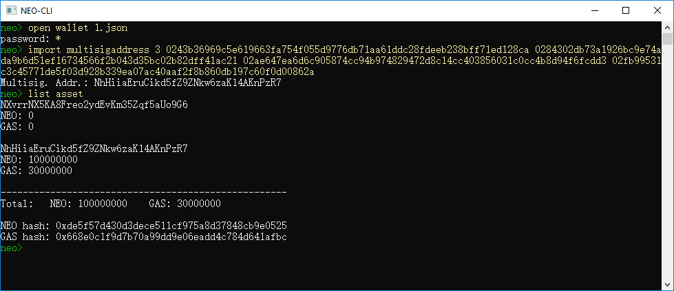
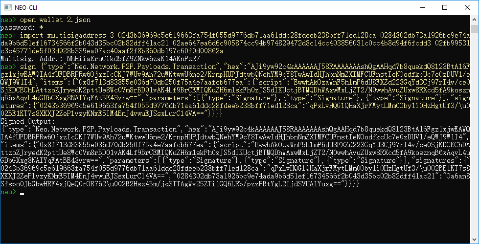
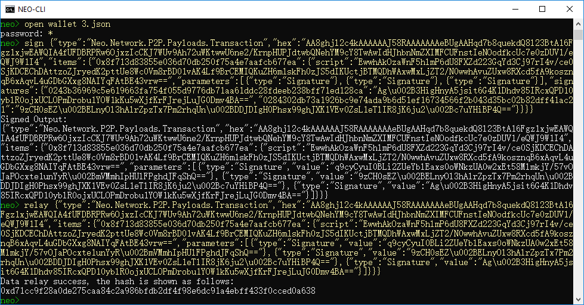

# Build a private chain on local host

In this document we will introduce a simple way to build a private chain on a windows system computer.

## Installing Neo node

Install Neo-CLI and make four copies of the node folder with the name of c1, c2, c3, and c4, successively.

For more information refer to [Installation of Neo-CLI](../../../node/cli/setup.md). 

## Creating wallet files

From Neo-CLI or Neo-GUI create four wallets, 1.json, 2.json, 3.json, and 4.json, and place each in the folder of four nodes. 

## Modifying config.json

Make the following configurations in config.json of each node:

- Specify the ports so that each port is not duplicated and is not occupied by other applications.
- In "UnlockWallet" specify the wallet path and wallet password.
- Set `StartConsensus` and `IsActive` as `true`.
- The private chain ID, which can be any integer in the range of [0 - 4294967295].
- `StandbyCommittee` is the public keys of committee members. The top 4 nodes with the most votes will become consensus nodes. Here enter the public keys of four wallets.
- In the `SeedList` field, set the IP address to localhost and the port to four wallet ports.


You can refer to the following example：

**c1/config.json**

```json
{
  "ApplicationConfiguration": {
    "Logger": {
      "Path": "Logs",
      "ConsoleOutput": true,
      "Active": true
    },
    "Storage": {
      "Engine": "LevelDBStore",
      "Path": "Data_LevelDB_{0}"
    },
    "P2P": {
      "Port": 21333,
      "WsPort": 21334
    },
    "UnlockWallet": {
      "Path": "1.json",
      "Password": "1",
      "IsActive": true
    },
    "PluginURL": "https://github.com/neo-project/neo-modules/releases/download/v{1}/{0}.zip"
  },
  "ProtocolConfiguration": {
    "Network": 5943216,
    "MillisecondsPerBlock": 15000,
    "MaxTraceableBlocks": 2102400,
    "ValidatorsCount": 7,
    "StandbyCommittee": [
      "03bf333ec238acd25f22d533748426a72f6c266bd2681000ac2bf3061fc79c6625",
      "02c2a4c3598467125522ff25995bce99c8bc898c3dc23381642586d0f172957ba7",
      "02577e88f8b1b9b5bfb355c76ac258f1fdf9f51e5312c542dff507e967cc7078ec",
      "03a40348cd681c79ff2f88ea632fa89945cffa70dd960edd8f897e4f41cb20896c"
    ],
    "SeedList": [
      "localhost:21333",
      "localhost:22333",
      "localhost:23333",
      "localhost:24333"
    ]
  }
}
```

**c2/config.json**

```json
{
  "ApplicationConfiguration": {
    "Logger": {
      "Path": "Logs",
      "ConsoleOutput": true,
      "Active": true
    },
    "Storage": {
      "Engine": "LevelDBStore",
      "Path": "Data_LevelDB_{0}"
    },
    "P2P": {
      "Port": 22333,
      "WsPort": 22334
    },
    "UnlockWallet": {
      "Path": "2.json",
      "Password": "1",
      "IsActive": true
    },
    "PluginURL": "https://github.com/neo-project/neo-modules/releases/download/v{1}/{0}.zip"
  },
  "ProtocolConfiguration": {
    "Network": 5943216,
    "MillisecondsPerBlock": 15000,
    "MaxTraceableBlocks": 2102400,
    "ValidatorsCount": 7,
    "StandbyCommittee": [
      "03bf333ec238acd25f22d533748426a72f6c266bd2681000ac2bf3061fc79c6625",
      "02c2a4c3598467125522ff25995bce99c8bc898c3dc23381642586d0f172957ba7",
      "02577e88f8b1b9b5bfb355c76ac258f1fdf9f51e5312c542dff507e967cc7078ec",
      "03a40348cd681c79ff2f88ea632fa89945cffa70dd960edd8f897e4f41cb20896c"
    ],
    "SeedList": [
      "localhost:21333",
      "localhost:22333",
      "localhost:23333",
      "localhost:24333"
    ]
  }
}
```

**node3/config.json**

```json
{
  "ApplicationConfiguration": {
    "Logger": {
      "Path": "Logs",
      "ConsoleOutput": true,
      "Active": true
    },
    "Storage": {
      "Engine": "LevelDBStore",
      "Path": "Data_LevelDB_{0}"
    },
    "P2P": {
      "Port": 23333,
      "WsPort": 23334
    },
    "UnlockWallet": {
      "Path": "3.json",
      "Password": "1",
      "IsActive": true
    },
    "PluginURL": "https://github.com/neo-project/neo-modules/releases/download/v{1}/{0}.zip"
  },
  "ProtocolConfiguration": {
    "Network": 5943216,
    "MillisecondsPerBlock": 15000,
    "MaxTraceableBlocks": 2102400,
    "ValidatorsCount": 7,
    "StandbyCommittee": [
      "03bf333ec238acd25f22d533748426a72f6c266bd2681000ac2bf3061fc79c6625",
      "02c2a4c3598467125522ff25995bce99c8bc898c3dc23381642586d0f172957ba7",
      "02577e88f8b1b9b5bfb355c76ac258f1fdf9f51e5312c542dff507e967cc7078ec",
      "03a40348cd681c79ff2f88ea632fa89945cffa70dd960edd8f897e4f41cb20896c"
    ],
    "SeedList": [
      "localhost:21333",
      "localhost:22333",
      "localhost:23333",
      "localhost:24333"
    ]
  }
}
```

**node4/config.json**

```json
{
  "ApplicationConfiguration": {
    "Logger": {
      "Path": "Logs",
      "ConsoleOutput": true,
      "Active": true
    },
    "Storage": {
      "Engine": "LevelDBStore",
      "Path": "Data_LevelDB_{0}"
    },
    "P2P": {
      "Port": 24333,
      "WsPort": 24334
    },
    "UnlockWallet": {
      "Path": "4.json",
      "Password": "1",
      "IsActive": true
    },
    "PluginURL": "https://github.com/neo-project/neo-modules/releases/download/v{1}/{0}.zip"
  },
  "ProtocolConfiguration": {
    "Network": 5943216,
    "MillisecondsPerBlock": 15000,
    "MaxTraceableBlocks": 2102400,
    "ValidatorsCount": 7,
    "StandbyCommittee": [
      "03bf333ec238acd25f22d533748426a72f6c266bd2681000ac2bf3061fc79c6625",
      "02c2a4c3598467125522ff25995bce99c8bc898c3dc23381642586d0f172957ba7",
      "02577e88f8b1b9b5bfb355c76ac258f1fdf9f51e5312c542dff507e967cc7078ec",
      "03a40348cd681c79ff2f88ea632fa89945cffa70dd960edd8f897e4f41cb20896c"
    ],
    "SeedList": [
      "localhost:21333",
      "localhost:22333",
      "localhost:23333",
      "localhost:24333"
    ]
  }
}
```

> [!Note]
>
> If the plugin RpcServer is installed, you also need to modify the port numbers in the plugin config.json file to make them different from each other and from the ports in config.json of the node.

## Installing consensus plugin

Download [DBFTPlugin]("https://github.com/neo-project/neo-modules/releases/download/v3.0.0-RC3/DBFTPlugin.zip") and place four copies to the `Plugins` folder under each node CLI root path. Modify the file `config.json` as follows：

- Set `Network` the same value as `Network` in `config.json`.
- Set `AutoStart` to `true` so as to automatically start consensus as running CLI.

Refer to the following example:

**Plugins/DBFTPlugin/config.json**

```json
{
  "PluginConfiguration": {
    "RecoveryLogs": "ConsensusState",
    "IgnoreRecoveryLogs": false,
    "AutoStart": true,
    "Network": 5943216,
    "MaxBlockSize": 262144,
    "MaxBlockSystemFee": 900000000000
  }
}
```

## Creating a shortcut to start

Create a notepad file for ease of starting the private chain. In the file, enter the following:

```
start cmd /k "cd c1 &&ping localhost -n 3 > nul&& dotnet neo-cli.dll"
start cmd /k "cd c2 &&ping localhost -n 3 > nul&& dotnet neo-cli.dll"
start cmd /k "cd c3 &&ping localhost -n 3 > nul&& dotnet neo-cli.dll"
start cmd /k "cd c4 &&ping localhost -n 3 > nul&& dotnet neo-cli.dll"
```

Rename it as Run.cmd, and then place four copies under the same level directories outside each node directory.

At this point the private chain has been set up. All the files  we modified are as follows:

```
├─Run.cmd
|
├─c1
│      1.json
│      config.json
│
├─c2
│      2.json
│      config.json
│
├─c3
│      3.json
│      config.json
│
└─c4
|      4.json
|      config.json
```

## Starting the private chain

Enter each node directory and double-click `Run.cmd`. When the screen shows consensus information and block height is increasing as shown below, the private chain is set up successfully.


The private chain is terminated if you close all the windows. 

## Withdrawing NEO and GAS

In the genesis block of the NEO network, 100 million NEO and 30 million GAS are generated. When the private chain is set up, you can withdraw those NEO and GAS from a multi-party address with Neo-CLI for internal development and testing.

### Using Neo-CLI to withdraw

#### Creating multi-party signature addresses

1. Start your private chain.

2. For ease of operation, copy one of consensus nodes directory as an external node. Then put four consensus wallet copies into the external node root directory and disable or remove DBFTPlugin.

3. Create an admin wallet and then create a multi-signature address using the command `import multisigaddress m pubkeys`:

   - `m`: the minimal number of signatures needed to complete the transaction. 
   - `pubkeys`: the public keys in StandbyCommittee in all consensus node wallets.

   For example:

   ```
   import multisigaddress 3 03bf333ec238acd25f22d533748426a72f6c266bd2681000ac2bf3061fc79c6625 02c2a4c3598467125522ff25995bce99c8bc898c3dc23381642586d0f172957ba7 02577e88f8b1b9b5bfb355c76ac258f1fdf9f51e5312c542dff507e967cc7078ec 03a40348cd681c79ff2f88ea632fa89945cffa70dd960edd8f897e4f41cb20896c
   ```

4. Open the wallet `1.json`, `2.json`, `3.json` respectively and repeat the last step to create the multi-signature address.

5. Enter the command `list asset` and you can see 100 million NEO and 30 million GAS displayed.

   

> [!Note]
>
> You must create multi-party signature address in at least three wallets so as to sign the transfer transaction successfully.

#### Transferring NEO to a normal address

Here we want to send NEO from the contract address to the normal address.

1. Open the wallet 1.json and transfer NEO to the admin wallet using the command `send <id|alias> <address> <value>` 

2. Copy the SignatureContext and close the wallet.

   

3. Open another wallet (2.json) listed on the multi-signature

4. Use the command `sign <jsonObjectToSign>` with the object copied in step 2

5. Copy the object in Signed Output.

   

6. Repeat the previous steps in the third wallet 3.json. Then you can use `relay <jsonObjectToSign>` and your wallet is ready.

   

7. Use `list asset` to check the wallet balance:

   

Similarly, you can refer to the preceding steps to withdraw GAS from the multi-party signature address.