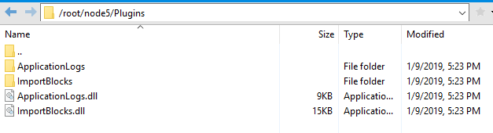

# Deploying NEO Nodes on Server

## Install NEO client

1. Install [.NET Core Runtime](https://www.microsoft.com/net/download/core#/runtime) on the server, 2.0 and the later version.
2. From GitHub, download the [NEO-CLI](https://github.com/neo-project/neo-cli/releases) program and enable the NEO node.

## Install plugins

Since NEO-CLI 2.9.0 some additional functionalities are individually encapsulated in plug-ins for the purpose of improving node security, stability, and flexibility. For more information, refer to [Installing plugins](../../node/cli/setup.md).

Exchanges need to install the following plugins to get the complete functionality of transaction log API and automatic synchronization with the offline package:

- [ApplicationLogs](https://github.com/neo-project/neo-plugins/releases/download/v2.10.2/ApplicationLogs.zip)
- [ImportBlocks](https://github.com/neo-project/neo-plugins/releases/download/v2.10.2/ImportBlocks.zip)
- [RpcWallet](https://github.com/neo-project/neo-plugins/releases/download/v2.10.2/RpcWallet.zip)
- [SimplePolicy](https://github.com/neo-project/neo-plugins/releases/download/v2.10.0/SimplePolicy.zip)
- [RpcSystemAssetTracker](https://github.com/neo-project/neo-plugins/releases/download/v2.10.2/RpcSystemAssetTracker.zip) (Recommended)
- [CoreMetrics](https://github.com/neo-project/neo-plugins/releases/download/v2.10.2/CoreMetrics.zip) (Recommended)
- [RpcNep5Tracker](https://github.com/neo-project/neo-plugins/tree/master/RpcNep5Tracker) (Recommended)

Create a new Plugins folder (The first letter is capitalized) under the NEO-CLI root directory and copy the unzipped plugins into it. 



For NEO-CLI 2.9.4 and later, you can install plugins using CLI commands：

```
install ImportBlocks
install ApplicationLogs
install RpcWallet
install SimplePolicy
install RpcSystemAssetTracker
install CoreMetrics
install RpcNep5Tracker 
```

> [!Note]
>
> - A set of wallet-related RPC API have been moved to the plugin RpcWallet since NEO-CLI 2.10.2. Ensure you have installed the plugin before you invoke these APIs.
> - You must install the ApplicationLogs plug-in before synchronizing the NEO client, otherwise the log in the blocks synchronized before will be lost.

## Configuring config.json

Before running NEO-CLI, you need to configure the following parameters in the config.json file:

- BindAddress: It defaults to local 127.0.0.1. You can set it to the ipv4 address of the specified NIC to allow RPC invoking. If no object is specified, it can be set to 0.0.0.0. 
- UnlockWallet: Optional. You can enable automatic binding and opening of the wallet. The following is an configuration example, where `Path` is the wallet path, `Password` is the wallet password, and `IsActive` is set to `true` to allow the wallet to be opened automatically. 

```
 {
  "ApplicationConfiguration": {
    "Paths": {
      "Chain": "Chain_{0}",
      "Index": "Index_{0}"
    },
    "P2P": {
      "Port": 10333,
      "WsPort": 10334
    },
    "RPC": {
      "Port": 10332,
      "SslCert": "",
      "SslCertPassword": ""
    },
    "UnlockWallet": {
      "Path": "",
      "Password": "",
      "StartConsensus": false,
      "IsActive": false
    },
     "PluginURL": "https://github.com/neo-project/neo-plugins/releases/download/v{1}/{0}.zip"
  } 
}
```

> [!Note]
>
> If you want to enable automatic opening of a wallet, specify the parameter "Path" and "Password" with the corresponding wallet information, and set "IsActive" to true. But be cautious before you do that, make sure your firewall is open and safe as Password specified in the file is in clear text.

For more information, refer to [Installation and deployment of NEO node](../../node/cli/setup.md).
