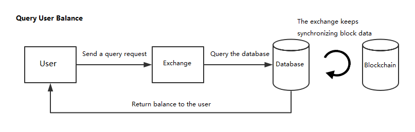
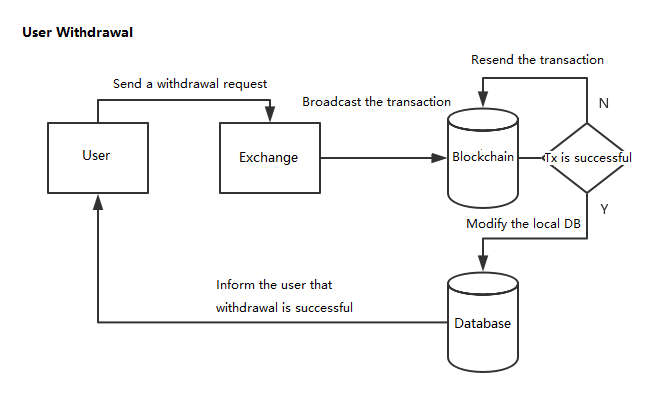

# Dealing with Asset Transactions

## Overview

Neo3 has only one type of digital assets, i.e. NEP-5 assets, which are managed by BALANCE. The exchanges mainly deal with user balance queries,  deposits, withdrawals, and other operations of this type assets.

Following flow charts show the work processes of these operations:






## Network fee

The network fee, as a reward for the consensus nodes generating blocks, is charged when the user submits a transactions to Neo blockchain. There is a  base fee for each transaction and the calculation formula is shown below. The transaction is only executed if the fee paid by the user is greater than or equal to the base fee; otherwise, the transaction will be treated as invalid.  


- VerficationCost：Fees for instructions executed by NeoVM to verify transaction signatures.
- tx.size：The transaction data byte length
- FeePerByte：Transaction fee per byte, currently defined as 0.00001 GAS in PolicyContract.

## System fee

The system fee is charged for the instructions executed by NeoVM. For each instruction fee refer to [System Fee](../sc/fees.md). The total system fee you need to pay depends on the number and type of the instructions executed by your smart contract. The following figure shows the calculation formula:

 

### **Instructions fee**

In Neo3, NeoVM instructions fee has decreased to 1/1000 of the original fee in Neo2, which significantly reduces the development cost. 

In comparison with Neo2.x: 


## Dealing with query transactions

The way for a exchange itself to query balance of the user deposit address is different than the way it deal with the user's request of balance querying. 

### Querying the user deposit address balance

The exchange needs to do the following:

1. Construct JSON files to invoke either of the following RPC methods:
   - getnep5balances
   - invokefunction
2. Send the JSON files to Neo RPC server.
3. Calculate the user balance according to the returned values.

#### Invoking getnep5balances to query

In JSON, a general getnep5balances request body is in the following form: 

```
{
"jsonrpc": "2.0",
"method": "getnep5balances",
"params": ["NVfJmhP28Q9qva9Tdtpt3af4H1a3cp7Lih"],
"id": 1
}
```

After sending the request you will get the following response:

```
{
    "jsonrpc": "2.0",
    "id": 1,
    "result": {
        "balance": [
            {
                "asset_hash": "0x9bde8f209c88dd0e7ca3bf0af0f476cdd8207789",
                "amount": "2",
                "last_updated_block": 52675
            },
            {
                "asset_hash": "0x8c23f196d8a1bfd103a9dcb1f9ccf0c611377d3b",
                "amount": "700000000",
                "last_updated_block": 52675
            }
        ],
        "address": "NVfJmhP28Q9qva9Tdtpt3af4H1a3cp7Lih"
    }
}
```

According to all the returned values,  we can calculate the user balance as follows: The balance = 700000000/10⁸ NEO = 7 GAS, 2 NEO

#### Invoking invokefunction to query

In JSON, a general invokefunction request body is in the following form: 

```json
{
  "jsonrpc": "2.0",
  "method": "invokefunction",
  "params": [
    "script hash",
    "method name",
    [
      {
        "optional arguments"
      }
    ]
  ],
  "id": 1
}
```

You need to replace these strings when querying the user's balance:

- script hash

  The script hash of the NEP-5 asset you are querying. For example:
  
  - NEO is 0x9bde8f209c88dd0e7ca3bf0af0f476cdd8207789
  - GAS is 0x8c23f196d8a1bfd103a9dcb1f9ccf0c611377d3b


- method name

  The name of the method you are invoking. To query the user's balance, you need to invoke these three methods:

  **balanceOf**

  - Syntax: `public static BigInteger balanceOf(byte[] account)`
  - Remarks: "balanceOf" returns the token balance of the '''account'''.

  **decimals**

  - Syntax: `public static byte decimals()`
  - Remarks: "decimals" returns the number of decimals used by the token.

  **symbol**

  - Syntax: `public static string symbol()`
  - Remarks: "symbol" returns the token symbol.


- optional arguments

  Optional. If the method you are invoking requires arguments, you can pass them by constructing these parameters into an array. For example, "balanceOf" in NEP-5 returns the token balance of the "account":

  `public static BigInteger balanceOf(byte[] account)`

  So you need to pass the account as an argument in the "balanceOf" method.

##### Example

##### **Invoking balanceOf**

Suppose the account address is AKibPRzkoZpHnPkF6qvuW2Q4hG9gKBwGpR, you need to convert it into Hash160 type and construct this parameter as a JSON object:

```json
{
    "type": "Hash160",
    "value": "0x09ad8f0b21a7294b3e429f58eaa415ac4b327ec9"
}
```

Then you can construct the JSON message as the following:

Request Body：

```json
{
  "jsonrpc": "2.0",
  "method": "invokefunction",
  "params": [
    "0xe9fa06842455ecf020b15d0e9b9c42de24ea3c6d",
    "balanceOf",
    [
      {
        "type": "Hash160",
        "value": "0x09ad8f0b21a7294b3e429f58eaa415ac4b327ec9"
      }
    ]
  ],
  "id": 3
}
```

After sending the request, you will get the following response：

```json
{
    "jsonrpc": "2.0",
    "id": 3,
    "result": {
        "script": "14c97e324bac15a4ea589f423e4b29a7210b8fad0951c10962616c616e63654f66146d3cea24de429c9b0e5db120f0ec55248406fae968627d5b52",
        "state": "HALT",
        "gas_consumed": "8295750",
        "stack": [
            {
                "type": "ByteArray",
                "value": "AADBb/KGIw=="
            }
        ]
    }
}
```

Decode the returned value ”AADBb/KGIw==“ with base64 and convert it to BigInteger you will get **1x10<sup>16</sup>**, and then divide it by 8-bit decimals you will get the NEP-5 assets balance **1x10<sup>8</sup>**.

##### **Invoking decimals**

Request Body：

```json
{
  "jsonrpc": "2.0",
  "method": "invokefunction",
  "params": [
    "0xe9fa06842455ecf020b15d0e9b9c42de24ea3c6d",
    "decimals", 
    []
    ],
  "id": 2
}
```

After sending the request, you will get the following response：

```json
{
    "jsonrpc": "2.0",
    "id": 3,
    "result": {
        "script": "00c108646563696d616c73146d3cea24de429c9b0e5db120f0ec55248406fae968627d5b52",
        "state": "HALT",
        "gas_consumed": "5673200",
        "stack": [
            {
                "type": "Integer",
                "value": "8"
            }
        ]
    }
}
```

It returns integer 8.

##### **Invoking symbol**

Request Body：

```json
{
  "jsonrpc": "2.0",
  "method": "invokefunction",
  "params": [
    "0xe9fa06842455ecf020b15d0e9b9c42de24ea3c6d",
    "symbol", 
    []
    ],
  "id": 3
}
```

After sending the request, you will get the following response：

```json
{
    "jsonrpc": "2.0",
    "id": 3,
    "result": {
        "script": "00c10673796d626f6c146d3cea24de429c9b0e5db120f0ec55248406fae968627d5b52",
        "state": "HALT",
        "gas_consumed": "8106560",
        "stack": [
            {
                "type": "ByteArray",
                "value": "dDE="
            }
        ]
    }
}
```

It returns "dDE=" which can be decoded to "t1" with base64.

##### **Calculating the User Balance**

According to all the returned values,  we can calculate the user balance as follows:
The balance = return / 10<sup>decimals</sup>

### Dealing with users' queries

The actual user balance in the exchange is recorded in the exchange database. The exchange needs to write programs to monitor each transaction of each block, record all deposits and withdrawals transactions in the database, and modify the user balance in the database accordingly.

## Dealing with User Deposits

To get the user deposits information the exchange needs to do the following:

1. Get each block details using the `getblock` API, including details of all the transactions in the block.
2. Analyze each transaction type and filter out all transactions of the type "InvocationTransaction". Any transaction other than "InvocationTransaction" can not be a transfer transaction of NEP-5 assets.
3. Invoke the `getapplicationlog` API to get the details of each "InvocationTransaction" transaction and analyze the transaction content to complete the user deposit.

### Invoking getapplicationlog

This API is used to get transaction information.

After correctly installing the ApplicationLogs plug-in and starting the neo-cli node, you can find a folder "ApplicationLogs" is generated under the root path. The complete contract log is recorded in this directory, and each NEP-5 transaction is recorded in a leveldb file.

The following shows an example of the API invoking result. 

```JSON
{
    "jsonrpc": "2.0",
    "id": 1,
    "result": {
        "txid": "0xe7b3782ea15c74889ee914de6acb7c311603ea7b5c3209d0e8b8e7a805848750",
        "trigger": "Application",
        "vmstate": "HALT",
        "gas_consumed": "13805550",
        "stack": [
            {
                "type": "Integer",
                "value": "1"
            }
        ],
        "notifications": [
            {
                "contract": "0x293b54c743f7a6433b2619da037beb9ed22aa73b",
                "state": {
                    "type": "Array",
                    "value": [
                        {
                            "type": "ByteArray",
                            "value": "VHJhbnNmZXI="
                        },
                        {
                            "type": "ByteArray",
                            "value": "0wzwBoLXDacAgxEkGaxxo1Ezxh4="
                        },
                        {
                            "type": "ByteArray",
                            "value": "yX4yS6wVpOpYn0I+SymnIQuPrQk="
                        },
                        {
                            "type": "ByteArray",
                            "value": "AADBb/KGIw=="
                        }
                    ]
                }
            }
        ]
    }
}
```


> [!Note]
>
> - The failed NEP-5 transaction can also be recorded in blockchain, so you need to determine whether the vm status parameter "vmstate" is correct (HALT). 
> - "vmstate" indicates the vm status after it executes the contract. If it contains "FAULT", that means the execution is failed and the transaction is invalid. 

The parameters related to a transaction in the file are the following:

- **contract**: the script hash of smart contract, by which the exchange can identify assets type. For example, "0xb9d7ea3062e6aeeb3e8ad9548220c4ba1361d263" is the script hash and the unique identification of the QLC asset.

- The four objects included in the "value" array of "state" are:

  [event, from account, to account, amount]

  - The first object with the type "bytearray" and the value "VHJhbnNmZXI=", as shown in the example, can be decoded to the string "transfer" with base64. "transfer" is a method in NEP-5 that represents an asset transfer.

    ```json
    {
      "type": "ByteArray",
      "value": "VHJhbnNmZXI="
    }
    ```

  - The second object in the array is the account address where the asset is transferred from. Its type "bytearray" and the value "0wzwBoLXDacAgxEkGaxxo1Ezxh4=“ can be  decoded to "Nf9uG9nhF8PEvbSHc8xmNGsG7toNnu4a8T" with base64. Note that for the hexadecimal string with "0x" prefix, it is processed as big endian; otherwise, it is processed as small endian.

    ```json
    {
      "type": "ByteArray",
      "value": "0wzwBoLXDacAgxEkGaxxo1Ezxh4="
    }
    ```

    > [!Note]
    >
    > In Neo, hexadecimal strings are processed in big-endian order if they are preceded by 0x, or little-endian order if they are not.
  - The third object in the array is the account address where the asset is transferred to.  Its type "bytearray" and the value "yX4yS6wVpOpYn0I+SymnIQuPrQk=“ can be decoded to "NeHNBbeLNtiCEeaFQ6tLLpXkr5Xw6esKnV" with base64. If the address is an exchange account address, it is a deposit transaction.
  
    ```json
    {
    "type": "ByteArray",
      "value": "yX4yS6wVpOpYn0I+SymnIQuPrQk="
  }
    ```
  
  - The fourth object in the array is the transfer amount and its type is "bytearray". The value "AADBb/KGIw==“ can be decoded to "0000c16ff28623" with base64. It is processed as little endian and turns to 2386f26fc10000  (i.e. 1x10<sup>16</sup> ) after reversed. Since the decimal is 8 bit the actual value is 100000000.00000000. There are two types of amount,  integer and bytearray. Note that when dealing with amount of the integer type, the value conversion method is different than that of the bytearray type. For the current returned value, the integer type is 10000000000000000.
  
    ```json
    {
      "type": "ByteArray",
      "value": "AADBb/KGIw=="
    }
    ```

> [!Note]
>
> Regarding the notification format conversion of the transfer in the file, you can refer to [Neo3-Tool](https://github.com/neo-ngd/Neo3-Tool).

## Dealing with User Withdrawals

The exchange can choose one of the following way to send assets to users: 

- Neo-CLI command: `send`
- RPC method: `sendfrom`
- RPC method: `sendtoaddress`
- RPC method: `sendmany`

### Neo-CLI Command: send

##### Syntax

`send <txid|script hash> <address> <value> `

##### Parameters

- `txid|script hash`: the asset ID.
- `address`: the payment address.
- `value`: the transfer amount.


This command verifies the wallet password. 

##### Example

To transfer 100 NEP5 assets to the address NeHNBbeLNtiCEeaFQ6tLLpXkr5Xw6esKnV, enter the following:

```
send 0x293b54c743f7a6433b2619da037beb9ed22aa73b NeHNBbeLNtiCEeaFQ6tLLpXkr5Xw6esKnV 100
```

If you want to send NEO or GAS, just change the first parameter to the corresponding asset scriptHash. For example, 
NEO: 0x9bde8f209c88dd0e7ca3bf0af0f476cdd8207789
GAS: 0x8c23f196d8a1bfd103a9dcb1f9ccf0c611377d3b

### RPC Method: openwallet

> [!Note]
>
> Before you can invoke any of the wallet-related RPC methods you must invoke the method `openwallet` first.

The key "params" includes an array of two parameters.

`"params":[path， password]`

For example, to open the wallet `a.json` with a password `111111`, you can construct a JSON file as follows and send it to RPC server.

Request body：

```json
{
  "jsonrpc": "2.0",
  "method": "openwallet",
  "params": ["a.json", "111111"],
  "id": 1
}
```

After sending the request, you will get the following response:

```json
{
    "jsonrpc": "2.0",
    "id": 1,
    "result": true
}

```

### RPC Method: sendfrom

The key "params" includes an array of four parameters.

`"params":[script hash, address from, address to, amount]`

For example, to send 10 NEO from NeHNBbeLNtiCEeaFQ6tLLpXkr5Xw6esKnV to  NQbqLCGg3iZRVp89HefRzCtiuvw11se3SK, construct a JSON file as follows and send it to RPC server.

Request body:

```json
{
  "jsonrpc": "2.0",
  "method": "sendfrom",
  "params": ["0x9bde8f209c88dd0e7ca3bf0af0f476cdd8207789","NeHNBbeLNtiCEeaFQ6tLLpXkr5Xw6esKnV","NQbqLCGg3iZRVp89HefRzCtiuvw11se3SK",10],
  "id": 1
}
```

After sending the request, you will get the following response：

```json
{
    "jsonrpc": "2.0",
    "id": 1,
    "result": {
        "hash": "0xfc69052f7875ab934098c22086e6025b6e99c2d5383ede6b5e7ffc5cada0f526",
        "size": 258,
        "version": 0,
        "nonce": 1499649081,
        "sender": "NeHNBbeLNtiCEeaFQ6tLLpXkr5Xw6esKnV",
        "sys_fee": "100000000",
        "net_fee": "1258270",
        "valid_until_block": 2408902,
        "attributes": [],
        "cosigners": [
            {
                "account": "0x09ad8f0b21a7294b3e429f58eaa415ac4b327ec9",
                "scopes": "CalledByEntry"
            }
        ],
        "script": "WhQzapXCv4GGc3VXYkpfCfc5hNkgIBTJfjJLrBWk6lifQj5LKachC4+tCVPBCHRyYW5zZmVyFBXKoEIUMQZw1eWjmOFH4NvtmM9DaGJ9W1Lx",
        "witnesses": [
            {
                "invocation": "QKw6QhHNOTcvifIw6Jxyomb7Rto2SZZYR/H48tS5f0UYlYKQdRsgxVycB/f/HXEqYZVaL7G9WYGp6WsexKoOb4I=",
                "verification": "IQLqNWb+zTA/d3UpLyQr4Ux3jVnJ6jJDniao8UG2IcxkBlBoCpBq1A=="
            }
        ]
    }

```

### RPC Method: sendtoaddress

The key "params" includes an array of three parameters. 

`"params":[script hash, address, amount]`

For example, to send 1000 GAS to NQbqLCGg3iZRVp89HefRzCtiuvw11se3SK , construct a JSON file as follows and send it to RPC server.

Request Body：

```json
{
    "jsonrpc":"2.0",
    "method":"sendtoaddress",
    "params":[
        "0x8c23f196d8a1bfd103a9dcb1f9ccf0c611377d3b",
        "NQbqLCGg3iZRVp89HefRzCtiuvw11se3SK",
        "1000"
    ],
    "id":1
}
```

After sending the request, you will get the following response：

```json
{
    "jsonrpc": "2.0",
    "id": 1,
    "result": {
        "hash": "0x5e810bf58c9c14f49c821e7d12adb435a4fac413b817390bae850e578202c214",
        "size": 370,
        "version": 0,
        "nonce": 370378736,
        "sender": "Nc2TgT3BTnDZGh21uU14Fudaq9C8GqUKJA",
        "sys_fee": "100000000",
        "net_fee": "2370540",
        "valid_until_block": 2409087,
        "attributes": [],
        "cosigners": [
            {
                "account": "0x09ad8f0b21a7294b3e429f58eaa415ac4b327ec9",
                "scopes": "CalledByEntry"
            }
        ],
        "script": "BQDodkgXFDNqlcK/gYZzdVdiSl8J9zmE2SAgFMl+MkusFaTqWJ9CPksppyELj60JU8EIdHJhbnNmZXIUJYLRsnXobI8Ok6my+s1f23YJdqFoYn1bUvE=",
        "witnesses": [
            {
                "invocation": "QPKQ71AqXJ83CdatB7+jb7oQdFV94g6Qr00y7i59w/bp4WH6OcvZxr2PNkpBCNIO/wkGiiySOB0N4a14ptKQ6b0=",
                "verification": "IQL8lC/gCB0zH17Y7ioOmrUAqlGeGpUXpON83NH7CDJfY1BoCpBq1A=="
            },
            {
                "invocation": "QOmJGUTaynsVo7a4doEnBsDj3qjrBgu6f5jG7IQ9tHWzxHlZg9OknmIWhLYatCLX1qbPb2KartjAYezE5uWra2U=",
                "verification": "IQLqNWb+zTA/d3UpLyQr4Ux3jVnJ6jJDniao8UG2IcxkBlBoCpBq1A=="
            }
        ]
    }
}
```

### RPC Method: sendmany

The key "params" includes an array of at least two parameter:

`"params":[address from(optional), []]`

For example, to send 100 NEO and 1000 GAS to NQbqLCGg3iZRVp89HefRzCtiuvw11se3SK from NeHNBbeLNtiCEeaFQ6tLLpXkr5Xw6esKnV, you can construct a JSON file as follows and send it to RPC server.

Request Body：

```json
{
    "jsonrpc": "2.0",
    "method": "sendmany",
    "params": [
    "NeHNBbeLNtiCEeaFQ6tLLpXkr5Xw6esKnV",
        [
            {
                "asset": "0x9bde8f209c88dd0e7ca3bf0af0f476cdd8207789",
                "value": 100,
                "address": "NQbqLCGg3iZRVp89HefRzCtiuvw11se3SK"
            },
            {
                "asset": "0x8c23f196d8a1bfd103a9dcb1f9ccf0c611377d3b",
                "value": 2,
                "address": "NQbqLCGg3iZRVp89HefRzCtiuvw11se3SK"
            }
        ]
    ],
    "id": 1
}
```

After sending the request, you will get the following response：

```json
{
    "jsonrpc": "2.0",
    "id": 1,
    "result": {
        "hash": "0x01bdee95fe77ebca78bd17a8bbfd4f538671941381560e9f842e07d5bd86ec5e",
        "size": 344,
        "version": 0,
        "nonce": 1882341262,
        "sender": "NeHNBbeLNtiCEeaFQ6tLLpXkr5Xw6esKnV",
        "sys_fee": "100000000",
        "net_fee": "1344270",
        "valid_until_block": 2409235,
        "attributes": [],
        "cosigners": [
            {
                "account": "0x09ad8f0b21a7294b3e429f58eaa415ac4b327ec9",
                "scopes": "CalledByEntry"
            }
        ],
        "script": "AWQUM2qVwr+BhnN1V2JKXwn3OYTZICAUyX4yS6wVpOpYn0I+SymnIQuPrQlTwQh0cmFuc2ZlchQVyqBCFDEGcNXlo5jhR+Db7ZjPQ2hifVtS8QQAwusLFDNqlcK/gYZzdVdiSl8J9zmE2SAgFMl+MkusFaTqWJ9CPksppyELj60JU8EIdHJhbnNmZXIUJYLRsnXobI8Ok6my+s1f23YJdqFoYn1bUvE=",
        "witnesses": [
            {
                "invocation": "QA9OZduN6MyEczPEV12TW7EFise5+riC9wagEv/M2SV7rrcRPiDAjbDbZxY0bcIz4JSafTJtF9FEo9laJwuhSMs=",
                "verification": "IQLqNWb+zTA/d3UpLyQr4Ux3jVnJ6jJDniao8UG2IcxkBlBoCpBq1A=="
            }
        ]
    }
}
```

## See Also

[NEP-5 Token Standard](https://github.com/neo-project/proposals/blob/master/nep-5.mediawiki "NEP5")

[Data Transformation Examples](https://github.com/PeterLinX/NeoDataTransformation)