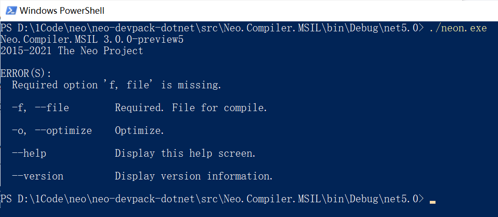
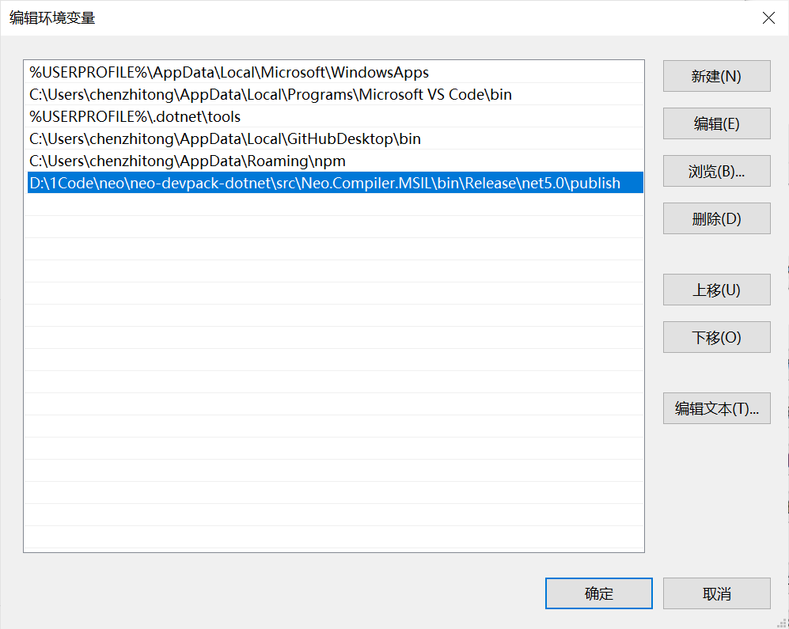
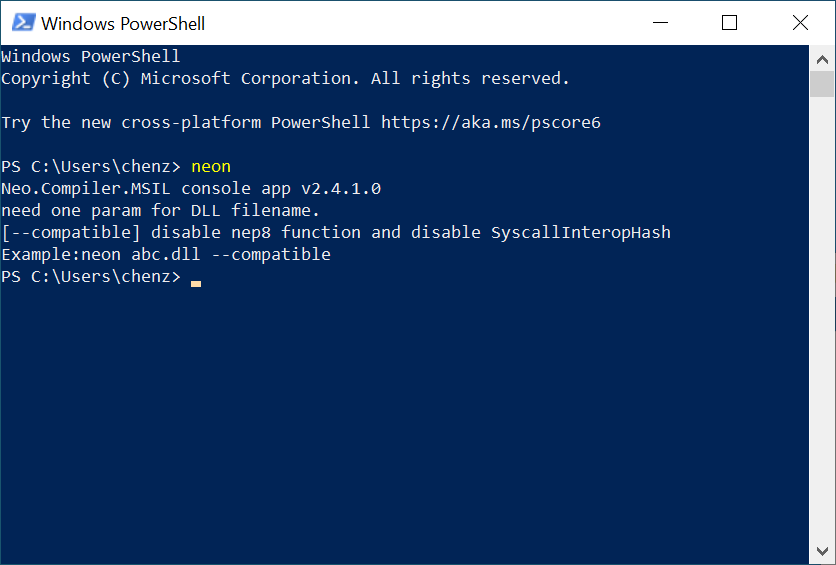

# Compiling a contract sample

In this section we will complete the following tasks with C# and Windows 10:

1. Install contract development environment
2. Create an NEP17 contract project
3. Compile a contract

## Setting up development environment

### Installing Visual Studio 2019

1. Download and install [Visual Studio 2019](https://www.visualstudio.com/products/visual-studio-community-vs).

   Note that you need to select `.NET Core cross-platform development` and `Visual Studio Extension Development` option during installation.

2. Install [.NET Framework 4.6.2 Developer Pack](https://dotnet.microsoft.com/download/dotnet-framework/thank-you/net462-developer-pack-offline-installer), which helps you load the project correctly.

### Installing NeoContractPlugin

> [!Note]
>
> If you have NeoContractPlugin of Neo Legacy installed in Visual Studio, you must uninstall it before you can install the NeoContractPlugin of Neo N3.

1. Pull the project [neo-devpack-dotnet](https://github.com/neo-project/neo-devpack-dotnet) and open `neo-devpack-dotnet.sln` in Visual Studio.

2. In the Solution panel, right-click `src/Installer` and then click `Build` to compile the project.

   The file `Neo.SmartContract.Installer.vsix` is generated under `neo-devpack-dotnet-master\src\Installer\bin\Debug`.

3. Run the file to install the `Neo.SmartContract.Installer.vsix` extension.

   You need to restart Visual Studio after the installation is completed.

### Configuring compiler

1. Run Visual Studio and open the project file `neo-devpack-dotnet.sln` again.

2. In the Solution panel, right-click `Neo.Compiler.MSIL` and click `Publish`. Follow the prompts to publish the project to the default directory `\bin\Release\net5.0\publish`

3. Go to the publishing directory, run PowerShell and enter the command `./neon.exe` to check if neon works as below:

   

4. Add the publishing directory to the environment variable Path:

   > [!Note]
   >
   > Remove the old Neo Legacy neon path if there is one.

   

5. Start PowerShell anywhere and run the command `neon.exe` to check if it works.

   

### Compiling Smart Contract Framework

1. Get back to Visual Studio, right-click `Neo.SmartContract.Framework` in the `neo-devpack-dotnet` project solution panel, and click `Build` to build the project.
2. Go to the output directory and copy the file `Neo.SmartContract.Framework.dll` . We will use it later.

## Creating an NEP17 contract project

### Creating a project

1. In Visual Studio 2019 click `File` -> `New` -> `Project`.

2. In the project template dialog that appears, search for `neocontract` and select NeoContract for C#. Follow the wizard to create the project.

   

3. In the Solution panel, right click the project and then select `Manage NuGet Package`. Uninstall the NuGet reference for `Neo.SmartContract.Framework`. (Neo.SmartContract.Framework in the template is Neo 3.0.0 preview5).

4. Right click the project name and then `Paste` to paste the `Neo.SmartContract.Framework.dll` copied before into the NeoContract project list.

5. Right click `Dependencies` and then `Add Reference`. Follow the prompts to add the `Neo.SmartContract.Framework.dll` pasted in last step to the project.

### Editing NEP17 Code

When the project is created, a simple smart contract template is automatically created, which writes a key-value pair of "Hello" "World" to the storage.

Since many developers are concerned about how to publish their own contract assets on the Neo block chain, now let's work through the process on private chain.

1. Download the NEP17 template from [NEP17 example of Neo N3](https://github.com/neo-project/examples/tree/bcad04d6e634592e7fa4ceeb78e9fbebab2b07a2/csharp/NEP17).

2. In the NeoContract project created in previous steps, open the sample file Contract1.cs

   The code contains basic information of the assets and the methods available to be invoked. You can make changes when needed.

> [!Note]
>
> In comparison with Neo Legacy, the Neo N3 NEP17 sample has the following changes:
>
> - Added the customized attributes above the smart contract class
>
>    ```c#
>    [DisplayName("Token Name")]
>    [ManifestExtra("Author", "Neo")]
>    [ManifestExtra("Email", "dev@neo.org")]
>    [ManifestExtra("Description", "This is a NEP17 example")]
>    [SupportedStandards("NEP-17")]
>    [ContractPermission("*", "onNEP17Payment")]
>    public class NEP17 : SmartContract
>    ……
>    ```
>
> - Removed the Name method
>
> - Added _deploy method, which will be executed immediately after the contract is deployed
>
> - Added the Update and Destroy methods
>
> - All the Crowdsale methods are in the NEP17.Crowdsale.cs file. Developers can choose to use this file if need be.
>
> - Called the onNEP17Payment method of the recipient in the Transfer method
>
> - Implemented onNEP17Payment to automatically execute the smart contract when NEP17 assets are received.
>

Reference: [NEP-17](../develop/write/nep17.md)

## Compiling contract file

When you complete coding, click `Build` -> `Build Solutions` (hotkeys: Ctrl + Shift + B) in the menu to start compilation.

When the compilation is done, the following files are generated under the `bin/Debug` directory of the project.

- `NEP17.nef` : The smart contract execution file for Neo N3, just as .avm for Neo Legacy.
- `NEP17.manifest.json` : The descriptive file of the smart contract, covering descriptions of functions, ScriptHash, entry, method, parameters, and return values of the contract.
