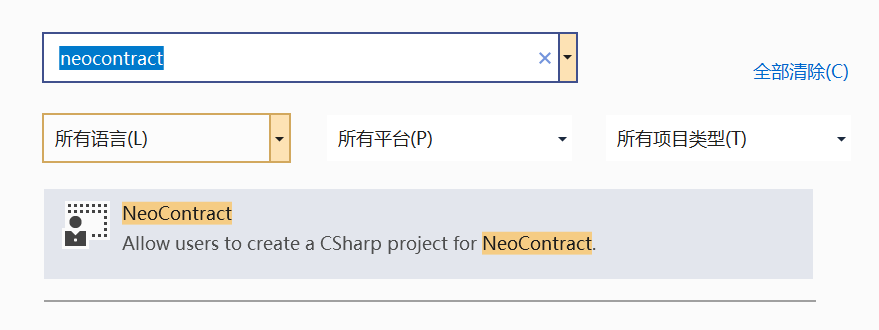

# Developing a contract sample

We have completed setting up the private chain and configuring the node. In this section we will walk you through configuring the environment, writing, and compiling an NEP17 contract using C#.

You can choose either Visual Studio or Visual Studio Code to develop contracts. The latter way is more simplified and suitable for macOS users.

## Using Visual Studio to develop

The following steps are performed based on Windows 10.

### Installing tools

1. Download and install [Visual Studio 2019](https://www.visualstudio.com/products/visual-studio-community-vs).

   Note that you need to select `.NET Core cross-platform development` and `Visual Studio Extension Development` option during installation.

2. Install [.NET Core 5.0 Developer Pack](https://dotnet.microsoft.com/download/dotnet/thank-you/sdk-5.0.202-windows-x64-installer) 

3. Install [.NET Framework 4.6.2 Developer Pack](https://dotnet.microsoft.com/download/dotnet-framework/thank-you/net462-developer-pack-offline-installer), which helps you load the project correctly.

4. Download  [neo-devpack-dotnet](https://github.com/neo-project/neo-devpack-dotnet) from GitHub.

### Configuring environment variable

1. In Visual Studio open the solution file `neo-devpack-dotnet.sln`
2. Compile the project `Installer` and output Neo.SmartContract.Installer
3. Install Neo.SmartContract.Installer
4. Compile the project `Neo.Compiler.CSharp` and output nccs.dll
5. Add the path where nccs.dll locates to the environment variable path.

### Upgrading dependency

Option 1：

1. Add the file NuGet.Config to the solution directory:

   ```xml
   <?xml version="1.0" encoding="utf-8"?>
   <configuration>
    <packageSources>
    <clear />
    <add key="MyGet-neo" value="https://www.myget.org/F/neo/api/v3/index.json" />
    <add key="NuGet.org" value="https://api.nuget.org/v3/index.json" />
    </packageSources>
   </configuration>
   ```

2. Upgrade Neo.SmartContract.Framework to the latest.

   

Option 2：

1. Delete the reference Neo.SmartContract.Framework in NuGet.
2. Add reference to Neo.SmartContract.Framework in the solution neo-devpack-dotnet or the complied dll.

### Creating a project

1. In Visual Studio 2019 click `File` -> `New` -> `Project`.

2. In the project template dialog that appears, search for `neocontract` and select NeoContract for C#. Follow the wizard to create the project.

   

### Editing NEP17 Code

When the project is created, a simple smart contract template is automatically created, which writes a key-value pair of "Hello" "World" to the storage.

Since many developers are concerned about how to publish their own contract assets on the Neo block chain, now let's proceed with the NEP17 contract development on private chain.

Download the NEP17 template from [NEP17 example of Neo N3](https://github.com/neo-project/examples/tree/master/csharp/NEP17).

In comparison with Neo Legacy, the Neo N3 NEP17 sample has the following changes:

- Added the customized attributes above the smart contract class

   ```c#
   [DisplayName("Token Name")]
   [ManifestExtra("Author", "Neo")]
   [ManifestExtra("Email", "dev@neo.org")]
   [ManifestExtra("Description", "This is a NEP17 example")]
   [SupportedStandards("NEP-17")]
   [ContractPermission("*", "onNEP17Payment")]
   public class NEP17 : SmartContract
   ……
   ```

- Removed the Name method

- Added _deploy method, which will be executed immediately after the contract is deployed

- Added the Update and Destroy methods

- All the Crowdsale methods are in the NEP17.Crowdsale.cs file. Developers can choose to use this file if need be.

- Called the onNEP17Payment method of the recipient in the Transfer method

- Implemented onNEP17Payment to automatically execute the smart contract when NEP17 assets are received.

- Major changes occurred in smart contract framework. For details refer to [Smart Contract API](../reference/scapi/api.md)

For more information refer to [NEP-17](../develop/write/nep17.md).

### Compiling contract file

Option 1:

When you complete coding, click `Build` -> `Build Solutions` (hotkeys: Ctrl + Shift + B) in the menu to start compilation.

Option 2:

From the solution or project directory, start the command line and run `nccs`.

When the compilation is done, the following files are generated under the `bin/Debug` directory of the project.

- `NEP17.nef` : The smart contract execution file for Neo N3, just as .avm for Neo Legacy.
- `NEP17.manifest.json` : The descriptive file of the smart contract, covering descriptions of functions, ScriptHash, entry, method, parameters, and return values of the contract.

## Using Visual Studio Code to develop

The following steps are suitable for multiple system platforms, such as Windows，macOS,  and Ubuntu.

### Installing tools

1. Download and install [Visual Studio Code](https://code.visualstudio.com/Download)

2. Download and install [.NET 5.0 SDK](https://dotnet.microsoft.com/download)

3. Run the command line and enter the following command to check if you have installed SDK successfully. 

   ```
   dotnet --list-sdks
   ```

   If there is no issue the SDK version number is displayed.

### Installing contract template

[Neo3.SmartContract.Templates](https://www.nuget.org/packages/Neo3.SmartContract.Templates/) contains the latest contract compiler and a HelloContract template. The latest version is recommended：

```
dotnet new --install Neo3.SmartContract.Templates
```

If you want to develop the contracts of **NEO N3 RC1** version, you need to add reference to its compatible version **1.0.2**：

```
dotnet new --install Neo3.SmartContract.Templates::1.0.2
```

### Creating a contract project

1. Create a folder named `Nep17` as the contract project。

2. In the command line go to the `Nep17` path and then enter the command `dotnet new neo3-contract` to generate code files based on the templete HelloContract.

   You can find the files named by the folder name under `Nep17` directory: Nep17.cs and Nep17.csproj.

   If you want to specify the file name, add the option -n, for example, `dotnet new neo3-contract -n tokenA`.

### Editing NEP17 code

1. Download all the .cs files from [NEP17 Template](https://github.com/neo-project/examples/tree/master/csharp/NEP17) and place them under the  `Nep17` directory.

2. Remove the original Nep17.cs generated by the HelloContract template.

3. Run VS Code and install the C# extension as prompted.

   

4. Open the `Nep17` folder to edit the Nep17 template. Refer to [Editing NEP17 Code](#editing-nep17-code).

### Compiling contract file

Run the following command to build your contract：

```
dotnet build
```


Related contract files are outputted under \bin\Debug\net5.0 path in the contract project directory.

## See also

For more information about writing contracts,refer to [Basics](../develop/write/basics.md)

For information about differences between Neo N3 and Neo Legacy contracts, refer to [Differences than Neo Legacy](../develop/write/difference.md)

