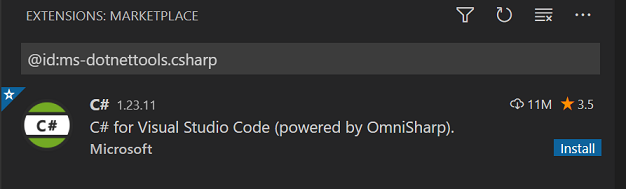

# Developing a contract

We have completed setting up the private chain and configuring the node. In this section we will walk you through configuring the environment, writing, and compiling an NEP17 contract using C#.

The following steps are applicable to multiple system platforms, such as Windows, macOS, and Ubuntu.

## Installing tools

1. Download and install [Visual Studio Code](https://code.visualstudio.com/Download)

2. Download and install [.NET 6.0 SDK](https://dotnet.microsoft.com/download)

3. Run the command line and enter the following command to check if you have installed SDK successfully. 

   ```powershell
   dotnet --list-sdks
   ```

   If there is no issue the SDK version number is displayed.

## Installing contract template

[Neo3.SmartContract.Templates](https://www.nuget.org/packages/Neo3.SmartContract.Templates/) contains the latest contract compiler and a hello contract template. The latest version is recommended：

```powershell
dotnet new -i Neo3.SmartContract.Templates
```

## Creating a contract project

1. Create a folder named `Nep17` as the contract project。

2. In the command line go to the `Nep17` path and then enter the command to generate code files based on the template.

   ```powershell
    dotnet new neo3-contract
   ```
   
   You can find the files named by the folder name under `Nep17` directory: Nep17.cs and Nep17.csproj.
   
   If you want to specify the file name, add the option -n, for example, `dotnet new neo3-contract -n tokenA`.

## Editing NEP17 code

Since many developers are concerned about how to publish their own contract assets on the Neo block chain, now let's proceed with the NEP17 contract development on private chain.

1. Download all the .cs files from [NEP17 Template](https://github.com/neo-project/examples/tree/master/csharp/NEP17) and place them under the  `Nep17` directory.

2. Remove the original Nep17.cs generated by the HelloContract template.

3. Run VS Code and install the C# extension as prompted.

   

4. Open the `Nep17` folder to edit the Nep17 template。

In comparison with Neo Legacy, the Neo N3 NEP17 sample has the following changes:

- Added the customized attributes above the smart contract class

  ```
  [DisplayName("Token Name")] 
  [ManifestExtra("Author", "Neo")] 
  [ManifestExtra("Email", "dev@neo.org")] 
  [ManifestExtra("Description", "This is a NEP17 example")] 
  [SupportedStandards("NEP-17")] 
  [ContractPermission("*", "onNEP17Payment")] 
  public class NEP17 : SmartContract 
  …… 
  ```

- Removed the Name method

- Added _deploy method, which will be executed immediately after the contract is deployed

- Added the Update and Destroy methods

- All the Crowdsale methods are in the NEP17.Crowdsale.cs file. Developers can choose to use this file if need be.

- Called the onNEP17Payment method of the recipient in the Transfer method

- Implemented onNEP17Payment to automatically execute the smart contract when NEP17 assets are received.

- Major changes occurred in smart contract framework. For details refer to [Smart Contract API](https://docs.neo.org/docs/en-us/reference/scapi/interop.html)

For more information refer to [NEP-17](https://docs.neo.org/docs/en-us/develop/write/nep17.html) .

## Compiling contract file

Run the following command to build your contract：

```powershell
dotnet build
```

Related contract files are outputted under `bin\sc` path in the contract project directory.

## See also

For more information about writing contracts, refer to [Basics](../develop/write/basics.md).

For information about differences between Neo N3 and Neo Legacy contracts, refer to [Differences than Neo Legacy](../develop/write/difference.md)

