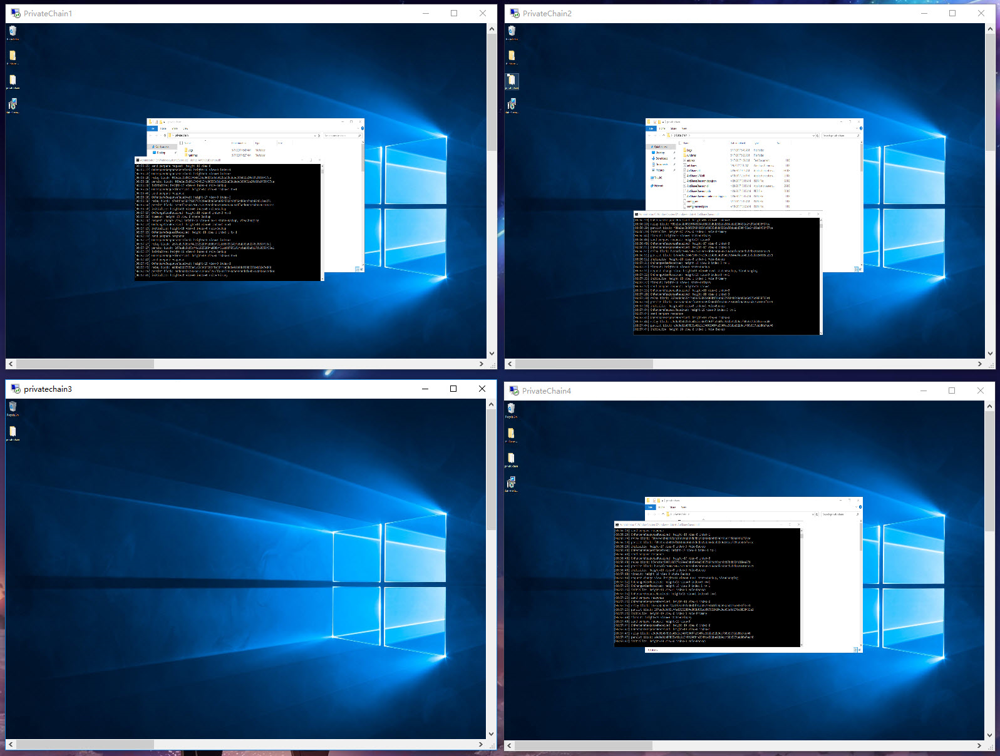
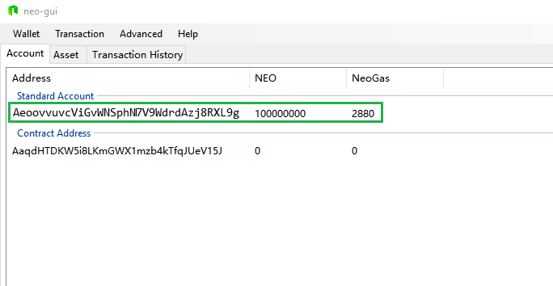

# Build a private chain with virtual machines

This section guides you to build a private chain using four virtual machines and withdraw NEO and GAS from the private chain.

## Configuring the virtual machine

The deployment of an NEO private chain requires at least four servers to reach a consensus, where each server corresponds to a consensus node and a dedicated NEO wallet. Here we created four Windows virtual machines on Azure, the size is Standard DS1 v2 (1 core, 3.5 GB RAM). 


After creating the four virtual machines, open the port 10331-10334 by adding new rules from   `firewall` ->`advanced setting`-> `inbound rules`.

> [!Note]
>
> If you create a virtual machine on a cloud server, you need to log into the administrative backend of the virtual machine and set up a network security group:  `network interface`-> `network security group` ->`inbound security rules`-> `add` ->add the port 10331-10334.

Record the IP addresses after the four virtual machines have been created.

## Installing NEO-CLI

Do the following on four virtual machines:

1. Refer to [Installation of NEO-CLI](../../node/cli/setup.md) and install NEO-CLI.
2. Download [SimplePolicy](https://github.com/neo-project/neo-plugins/releases/download/v2.9.2/SimplePolicy.zip). Extract the file and place the Plugins folder under the neo-cli root directory.

## Creating wallet files

1. Create four wallet files, wallet1.db3 - wallet4.db3, using NEO-CLI or NEO-GUI. The following screenshot shows the creation with NEO-CLI.
2. Record the public keys of four wallets, i.e. directly copy them on the screen and save to a txt file or use `list key` in [CLI Command](../../node/cli/cli.md) to view the public key, and then copy it.
3. Copy the four wallet files into each of the four virtual machines neo-cli folder.


## Modifying configuration files

1. Under each neo-cli directory of the four nodes, open the file `protocol.json` and modify the following:

   - `Magic`: Magic is used to identify the source network of the message, and specifying a different Magic ensures that different network information in the NEO block are not sent to other networks, during transmission. The type of Magic is unit, so note that the value you fill in is in the range [0 - 4294967295].
   - `StandbyValidators`: Enter the four wallet public keys recorded before.
   - `SeedList`: Enter the four virtual machines IP addresses recorded before. Leave the port number as it is. 

   ```json
   {
     "ProtocolConfiguration": {
       "Magic": 1704630,
       "AddressVersion": 23,
       "StandbyValidators": [
   "02f27545181beb8f528d13bbb66d279db996ecb56ed9a324496d114acb48aa7a32",
         "02daa386d979ae6643869a365294055546023acb332ee1a74a5ae5d54774a97bac",
         "0306f12f7217569cdbe9dde9ff702d0040e0a4570873eee63291adaa658128e55c",
         "035781b4d55dc58187f61b5d9277afbaae425deacc5df57f9891f3a5c73ecb24df"
      ],
       "SeedList": [
         "13.75.112.62:10333",
         "137.116.173.200:10333",
         "168.63.206.73:10333",
         "137.116.171.134:10333"
      ],
       "SystemFee": {
         "EnrollmentTransaction": 0,
         "IssueTransaction": 0,
         "PublishTransaction": 0,
         "RegisterTransaction": 0
       }
     }
   }
   ```

2. Modify the config.json file of each node to make the node open the wallet and start consensus automatically once the node is started:

   - `Path`：Enter the corresponding wallet file name.
   - `Password`：Enter the wallet password.
   - `StartConsensus`：Set to `true` to enable consensus.

   ```json
   "UnlockWallet": {
     "Path": "1.json",
     "Password": "11111111",
     "StartConsensus": true,
     "IsActive": true
   }
   ```

## Starting the private chain

In the four virtual machines run the command line and enter the neo-cli directory. Run the command to start the node:`Dotnet neo-cli.dll /rpc`. The wallet is opened automatically and the consensus process is started. If everything goes all right the four nodes will begin a consensus process as shown below:


Four nodes can still achieve consensus, even if one machine is turned off, as shown:




## Withdrawing NEO and GAS

In the genesis block of the NEO network, 100 million NEOs are generated. Additionally, GAS is generated with the generation of new blocks. When the private chain is set up, you can withdraw those NEO and GAS from a multi-party address with NEO-GUI, to facilitate your blockchain development and testing.

### Installing and configuring NEO-GUI

1. Download  [NEO-GUI](https://github.com/neo-project/neo-gui/releases) from Github and extract the file.
2. Configure the file protocol.json under the neo-gui folder to connect the client to the private chain:
   - StandbyValidators`：enter the public keys of four wallets created before.
   - `SeedList`：enter the four virtual machines IP addresses here and leave the port number as it is.
3. Configure the file config.json to make sure the NEO-GUI port is not conflict with the ports of other four nodes. If using the same port, NEO-GUI cannot work as NEO-CLI is running.

Start NEO-GUI and open any of the wallets, if you see the connection number in the lower left corner is not 0 and the client has been downloading the blocks, the client has been successfully connected to the private chain.

### Creating multi-party signature addresses

From NEO-GUI, open four wallets in turn and do the following:

1. Right-click on the blank area of account page, click `Create Contract Address` -> `Multi-Signature`.

2. Enter the four public keys and set the minimum number of signatures to 3 (the number of consensus nodes/2 + 1). Click `Confirm`. 

   

3. Click Wallet -> Rebuild wallet index.

   > [!Note]
   >
   > You must create the multi-party signature address in each wallet so that the transfer transaction can be signed successfully  .

Now you should see the contract address has 100 million NEO shares.


### Transferring NEO to a normal address

Here we want to send the NEO from the contract address to the normal address. 

1. From any of the four wallets, click `transaction`->`transfer` 

2. Enter the recipient address and 100 million NEO as the transfer amount

3. The system prompts you that there have not been enough signatures to complete the transaction. Copy the code to your clipboard.

4. Open the second wallet, click `transaction`->`signature` and paste the code that you have just copied. 

5. Click `signature` and copy the code. 

6. Open the third wallet, click `transaction`->`signature` and paste the code that you have just copied. Click  `signature` . 

   At this time you will notice a pop-up window that displays a `broadcast` button in the lower left corner, which means all the signatures required to send the transaction have been collected. 

7. Click `broadcast`. 

   Once the transfer transaction begins broadcasting it will take a while for successful remittance to the account.


### Transferring GAS to a normal address

Open the wallet you want to transfer GAS to and click `Advanced`->`Claim GAS`-> `Claim`. 

> [!Note]
>
> GAS has two status, available and unavailable. Once NEO is spent (i.e. transferred out) from the account, the relevant GAS turns to available. Therefore you can transfer GAS to your own account to make them available.


The next operation is similar to the transfer of the NEO. Copy the code that has insufficient signatures, open the second wallet and the third wallet successively to complete transaction signing and broadcasting. 

After successful extraction the GAS will enter the first standard address of the wallet (i.e. the top wallet address) where you initiated the extraction of the GAS, as shown.


