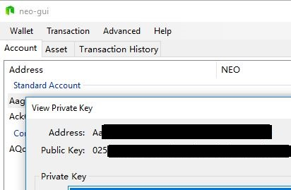
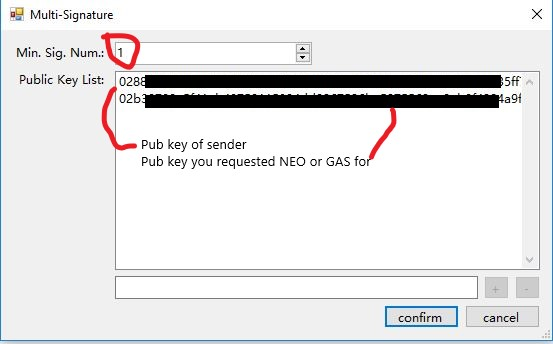

# Main Net and Test Net

The Neo node runs on the main net by default. The Main net is a block chain network that has been officially launched and operates independently.  

The Test net is an environment where the user can develop, commission and test programs. Testing programs on the testnet incurs the network fee of testnet GAS (not real GAS!). Testnet NEO and GAS can be applied free of charge, on the official website, detailed instruction are below.

All the blockchain of the test network are independent of the main network. If you develop a simple smart contract or try to register assets, the use of testnet should suffice. After the testing is complete, the development can be moved to the Neo mainnet online operation.

## TestNet characteristics

1. Asset registration, asset distribution, contract execution, etc. (Does not consume real money)
2. Globalized deployment in the Internet environment.
3. Test of network blocks; Transactions and other information can be easily viewed in the blockchain browser.
4. Smart contract deployment in the test environment, where anyone in the world can employ it.
5. Test network can not be used as commercial application of an actual landing environment.

## Switching between test net and main net

After downloading Neo client, you can switch the client to connect to test net by modifying the client configuration file. Here we take Neo-GUI for an example:

> [!Note]
>
> Neo3 clients can only connect to test net for the moment as the Neo3 main net has not launched yet.

1. Copy the contents of the program directory under the `protocol.testnet.json` into ` protocol.json` as shown.

2. Copy the contents of the program (GUI) directory `config.testnet.json` into the `config.json` as shown in Figure

## Applying for Test GAS and Test NEO

If you are a developer, you can ask for Neo and GAS on the TestNet. You will need 500 Test GAS to deploy a contract to the TestNet.  

### Obtaining test coin automatically

Up to 1000 GAS and 1000 Neo per day can be requested via the [NGD faucet](https://neowish.ngd.network/). 

### Applying for test coin from Neo website

If you need more than that, you'll have to request it from Neo website manually.

#### Step 1 - Look up your public key
In Neo the address and PUBLIC key are different.  
The PUBLIC KEY is shown when you view the PRIVATE KEY. (Never share your PRIVATE key.)

  

#### Step 2 - Fill in the request
Complete the form here: https://neo.org/testcoin/apply specifying your EMAIL and PUBLIC key.
After a day or so you will be sent an email containing a "Multi-party signed address" and the PUBLIC key of the sender. See [Multi-party signed address](../node/gui/sc.md).

#### Step 3 - Create a multi-party signed address
To access the assets, in your neo-gui you will create a "Multi-party signed address" in your wallet using 

- The "Multi-party signed address" (from the email) 
- The PUBLIC KEY of the sender (from the email)
- Your PUBLIC KEY (from STEP 1 above) 

1. From Neo-GUI, right-click on the account area and select `Create Contract Address` -> `Multi-Signature`.

  

2. In the public key list, enter the public keys used for signing. (PUB Key of sender and your PUB key) 
3. Specify the minimal number of signatures to be  `1`.
4. Click `confirm`.

The contract address specified in the email is created and displayed in the account page.

You will see the quantity of Neo and/or GAS shown beside the Contact address.

#### Step 4 - Transfer the assets to another account

1. Select the `Contact address` by clicking on it.

2. From Neo-GUI menu, select `Transaction` -> `Transfer`

   

3. Select the Asset and the amount to send and the account you want to transfer the asset to. 

## Alternatives to the TestNet

Testing your Smart Contract on the TestNet is a good idea before publishing it on the LIVE network but earlier in your development cycle you should consider using other methods to test your Smart Contacts such as running you own PRIVATE Testnet.