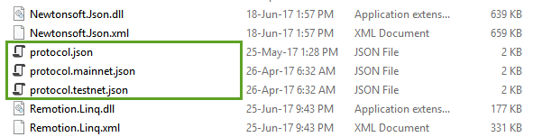

# Main Net and Test Net

The Neo node runs on the main net by default. The Main net is a block chain network that has been officially launched and operates independently.  

Neo also provides the Test net where developers can develop, debug, and test their programs. Testing programs on the testnet incurs the network fee of test GAS (not real GAS). Test net NEO and GAS can be applied free of charge on the official website (see detailed instructions below).

All the block data of the test net are independent of the main net. If you want to develop some simple smart contracts or try to register assets, test net is sufficient. After the testing is complete, the development can be moved into the Neo mainnet.

> [!Note]
>
> Neo3 clients can only connect to test net for the moment as the Neo3 main net has not been launched yet.

## Test net features

- Asset registration, asset distribution, contract execution, etc. (Does not consume real money)
- Globalized network that is deployed on Internet.
- Blocks, transactions, and other information in the test net can be easily viewed in the blockchain browser.
- Smart contracts deployed in the test net can be invoked by anyone in the world.
- Test net can not be used as a real environment for commercial applications.

## Connecting to test net

For Neo-GUI, it connects to the test net by default when running.

For Neo-CLI, since it connects to the main net that is not available yet by default, you need to switch the client to connect to test net by doing the following:

1. Copy the contents of the program directory under the `protocol.testnet.json` into ` protocol.json` as shown.

   

2. Copy the contents of the program directory `config.testnet.json` into the `config.json` as shown in Figure

   

## Applying for Test GAS and Test NEO

If you are a developer, you can ask for Neo and GAS on the TestNet. You will need a certain amount of test GAS to deploy or invoke a contract in the TestNet.  

### Obtaining test coin automatically

You can request up to 500 GAS per day via [NGD faucet](https://neowish.ngd.network/neo3/). 

### Applying for test coin from Neo website

If you need more than that, you'll have to request it from Neo website manually.

#### Step 1 - Look up your public key
In Neo the address and PUBLIC key are different. 

The PUBLIC KEY is shown when you view the PRIVATE KEY. (Never share your PRIVATE key.)  

#### Step 2 - Fill in the request
Complete the form here: https://neo.org/testcoin/apply. Note that you need to change `Neo Version` to Neo3.

After a day or so you will be sent an email containing a "Multi-party signed address" and the PUBLIC key of the sender. See [Multi-party signed address](../node/gui/sc.md).

#### Step 3 - Create a multi-party signed address
To access the assets, in your Neo-gui you will create a "Multi-party signed address" in your wallet using 

- The "Multi-party signed address" (from the email) 
- The PUBLIC KEY of the sender (from the email)
- Your PUBLIC KEY (from STEP 1 above) 

1. From Neo-CLI command line, enter the command  `import multisigaddress m pubkeys` to create a multi-party signed address, where:

   `m` is 1 as the minimal signature number and `pubkeys` are the public key used for signing (PUB Key of sender and your PUB key) 

2. Enter `list asset`，then you should see the quantity of Neo and/or GAS shown

3. Enter `send gas <address> <amount>` to send a certain amount of GAS to the desired account address.

## Alternatives to the TestNet

Testing your Smart Contract on the TestNet is a good idea before publishing it on the live network but earlier in your development cycle you should consider using other methods to test your Smart Contacts such as running you own private chain, for more information, refer to [Setting up private chain](private-chain/solo.md).