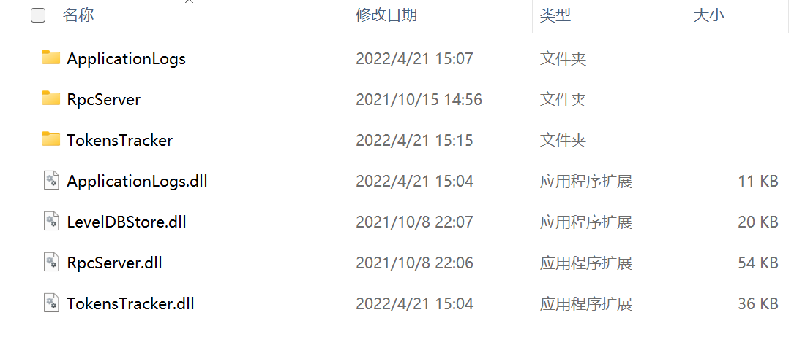

# Configuring and Starting Neo-CLI 

After installation of Neo-CLI, this section we will walk you through the necessary configurations before running Neo-CLI and the steps to start Neo-CLI using commands. 

## Modifying configuration files

Neo-CLI accesses the configuration file `config.json`  during execution. You need to make necessary configurations in the file before starting Neo-CLI.

### Configuring a wallet

To make Neo-CLI automatically open a wallet when running, you can configure the wallet in  `config.json`  beforehand, as follows:

- `Path`: the wallet path
- `Password`: the wallet password
- `IsActive`: Set to `true` to allow Neo-CLI to open the wallet automatically.

Here is an example:

```json
{
  "ApplicationConfiguration": {
    "Logger": {
      "Path": "Logs_{0}",
      "ConsoleOutput": false,
      "Active": false
    },
    "Storage": {
      "Engine": "LevelDBStore",
      "Path": "Data_LevelDB_{0}"
    },
    "P2P": {
      "Port": 20333,
      "WsPort": 20334
    },
    "UnlockWallet": {
      "Path": "",
      "Password": "",
      "IsActive": false
    },
    "PluginURL": "https://github.com/neo-project/neo-modules/releases/download/v{1}/{0}.zip"
  },
  "ProtocolConfiguration": {
    "Network": 844378958,
    "MillisecondsPerBlock": 15000,
    "MaxTraceableBlocks": 2102400,
    "ValidatorsCount": 7,
    "StandbyCommittee": [
      "023e9b32ea89b94d066e649b124fd50e396ee91369e8e2a6ae1b11c170d022256d",
      "03009b7540e10f2562e5fd8fac9eaec25166a58b26e412348ff5a86927bfac22a2",
      "02ba2c70f5996f357a43198705859fae2cfea13e1172962800772b3d588a9d4abd",
      "03408dcd416396f64783ac587ea1e1593c57d9fea880c8a6a1920e92a259477806",
      "02a7834be9b32e2981d157cb5bbd3acb42cfd11ea5c3b10224d7a44e98c5910f1b",
      "0214baf0ceea3a66f17e7e1e839ea25fd8bed6cd82e6bb6e68250189065f44ff01",
      "030205e9cefaea5a1dfc580af20c8d5aa2468bb0148f1a5e4605fc622c80e604ba"
    ],
    "SeedList": [
      "seed1t.neo.org:20333",
      "seed2t.neo.org:20333",
      "seed3t.neo.org:20333",
      "seed4t.neo.org:20333",
      "seed5t.neo.org:20333"
    ]
  }
}
```

Where:

- `ConsoleOutput`: Whether to print log information on console. `true` means foreground and background printing, while `false` means background logging.
- `Active`: Whether to enable Log
- `Engine`: It defaults to LevelDBStore, which means the engine used by the blockchain to store data.
- `PluginURL`: The downloading URL of the plugin, which will be used when using the CLI install command.

### Connecting the node to network

To connect the node to test net, replace the content of `config.json` with the content of  `config.testnet.json`. For RC2 package downloaded from [Neo node](https://github.com/neo-project/neo-node/releases), it has been configured connecting to the test net by default.

> [!Note]
>
> If your Neo-CLI is published from the source code in GitHub by yourself, you must also modify the Magic field value in config.json to **844378958** before you can connect to the Neo N3 RC1 test network.

To connect the node to your private net, refer to [Setting up Private Chain](../../develop/network/private-chain/solo.md).

## Installing plugins

Some additional functionalities are individually encapsulated in plug-ins for the purpose of improving node security, stability, and flexibility. The user can select the desired extension functionality instead of invoking it with additional parameters every time starting neo-cli, thus avoiding many human errors and some tedious instructions such as opening a wallet and calling APIs. 

You can choose one of the following ways to install plugins:

- Download the plugin package from GitHub
- Use the CLI command to install automatically

### Downloading plugins from GitHub

Download the plugins you need from the following table.

<table class="table table-hover">
    <thead>
        <tr>
            <th style="width: 25%;">Plugin</th>
            <th style="width: 35%;">Description</th>
            <th style="width: 20%;">API Included</th>
            <th style="width: 20%;"></th>
        </tr>
    </thead>
    <tbody>
            <tr>
            <td><a
                    href="https://github.com/neo-project/neo-modules/releases/download/v3.0.0-rc2/ApplicationLogs.zip">ApplicationLogs</a>
            </td>
            <td>Synchronizes the smart contract log with the NativeContract log (Notify)</td>
            <td><a href="../../reference/rpc/latest-version/api/getapplicationlog.html">getapplicationlog</a></td>
            <td>Recommended</td>
        </tr>
          <tr>
            <td><a
                    href="https://github.com/neo-project/neo-modules/releases/download/v3.0.0-rc2/DBFTPlugin.zip">DBFTPlugin</a>
            </td>
            <td>dBFT consensus plugin</td>
            <td></td>
            <td>Mandatory when served as a consensus node</td>
        </tr>   
        <tr>
            <td><a
                    href="https://github.com/neo-project/neo-modules/releases/download/v3.0.0-rc2/LevelDBStore.zip">LevelDBStore</a>
            </td>
            <td>Uses LevelDB to store the blockchain data</td>
            <td></td>    
            <td>Mandatory</td>
        </tr>
             <tr>
            <td><a
                    href="https://github.com/neo-project/neo-modules/releases/download/v3.0.0-rc2/OracleService.zip">OracleService</a>
            </td>
            <td>Oracle service plugin</td>
            <td></td>
            <td>Mandatory when served as an Oracle node</td>
        </tr>
        <tr>
            <td><a
                    href="https://github.com/neo-project/neo-modules/releases/download/v3.0.0-rc2/RocksDBStore.zip">RocksDBStore</a>
            </td>
            <td>Uses RocksDBStore to store the blockchain data</td>
            <td></td>
            <td>An alternative to LevelDBStore</td>
        </tr>
                <tr>
            <td><a
                    href="https://github.com/neo-project/neo-modules/releases/download/v3.0.0-rc2/RpcNep17Tracker.zip">RpcNep17Tracker</a>
            </td>
            <td>Enquiries NEP17 balance and transactions history of accounts through RPC</td>
            <td><a href="../../reference/rpc/latest-version/api/getnep17balances.html">getnep17balances</a><br><a
                    href="../../reference/rpc/latest-version/api/getnep17transfers.html">getnep17transfers</a></td>
            <td>Recommended</td>
        </tr>
        <tr>
            <td><a
                    href="https://github.com/neo-project/neo-modules/releases/download/v3.0.0-rc2/RpcServer.zip">RpcServer</a>
            </td>
            <td>Enables RPC for the node</td>
            <td><a href="../../reference/rpc/latest-version/api.html"> RPC API </a></td>
            <td>Mandatory</td>
        </tr>
        <tr>
            <td><a
                    href="https://github.com/neo-project/neo-modules/releases/download/v3.0.0-rc2/StatesDumper.zip">StatesDumper</a>
            </td>
            <td>Exports Neo-CLI status data.</td>
            <td></td>
            <td>Optional</td>
        </tr>  
         <tr>
            <td><a
                    href="https://github.com/neo-project/neo-modules/releases/download/v3.0.0-rc2/StateService.zip">StateService</a>
            </td>
            <td>StateRoot consensus service plugin</td>
            <td><a href="../../reference/rpc/latest-version/api/getstateroot.html">getstateroot</a><br>
                <a href="../../reference/rpc/latest-version/api/getproof.html">getproof</a><br>
                <a href="../../reference/rpc/latest-version/api/verifyproof.html">verifyproof</a><br>
                <a href="../../reference/rpc/latest-version/api/getstateheight.html">getstateheight</a>
            </td>
            <td>Mandatory when served as a StateRoot consensus node</td>
        </tr>   
    </tbody>
</table>

To install plugins, unzip plugin packages under the the Neo-CLI root directory, as shown below:



### Downloading plugins using command

It is easier to automatically install or uninstall the plugin using commands, for example:

```
neo> install StatesDumper
Downloading from https://github.com/neo-project/neo-modules/releases/download/v3.0.0-rc2/StatesDumper.zip
Install successful, please restart neo-cli.
```

```
neo> uninstall StatesDumper
Uninstall successful, please restart neo-cli.
```

After installation, restart Neo-CLI for the plugin to take effect.

## Starting the NEO node

Open the command line, navigate to the Neo-CLI directory, and enter the following command to start the Neo node:

On **Windows 10**:

```
dotnet neo-cli.dll
```

or 

```
neo-cli.exe
```

On **Linux (ubuntu 16.04/18.04)**:

```
./neo-cli
```

or

```
dotnet neo-cli.dll
```

> [!Note]
>
> If you  use dotnet install .net core in advance.

If you want the external program to access the node API need to open the firewall port: 10331-10334, 20331-20334

> [!WARNING]
>
> If you open the API service and the wallet in Neo-CLI, you need to set up your firewall policy. For example, set a whitelist for the firewall to only allow access to these ports by whitelisted IP addresses. If completely opening the service to external network, others may be able to export the private key or transfer assets using API.