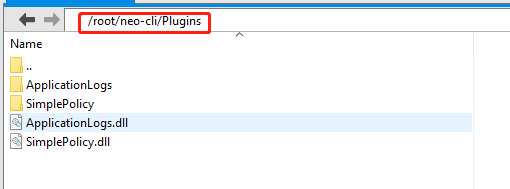

# Installation of NEO-CLI 

This section describes the procedure for installing the official NEO-CLI released package and starting the NEO node. Alternatively, you can directly publish NEO-CLI source from GitHub into an executable file. Especially when you use macOS, that is the only way to set up NEO-CLI. For more information refer to [Publishing from Source](publish.md).

## Hardware Requirment

A solid state disk with the computer running the NEO-CLI client  is recommended to avoid waiting too long when synchorizing blocks.


## Installing the NEO-CLI package

1. Download the latest [Neo-CLI](https://github.com/neo-project/neo-cli/releases) package according to your operating system on Github and unzip it.

2. On Linux, install the LevelDB and SQLite3 dev packages. For example, on ubuntu 17.10 run the following:

   ```
   sudo apt-get install libleveldb-dev sqlite3 libsqlite3-dev libunwind8-dev
   ```

   On Windows, you can skip this step as those files are already included in the installation package.

## Configuring config.json

Before starting NEO-CLI, you need to configure the config.json file to enable automatic binding and opening of the wallet. You can invoke the wallet related API only when the wallet is opened. The following is an configuration example, where `Path` is the wallet path, `Password` is the wallet password, and `IsActive` is set to `true` to allow the wallet to be opened automatically.

```
  {
  "ApplicationConfiguration": {
    "Paths": {
      "Chain": "Chain_{0}",
      "Index": "Index_{0}"
    },
    "P2P": {
      "Port": 10333,
      "WsPort": 10334
    },
    "RPC": {
      "BindAddress": "127.0.0.1",
      "Port": 10332,
      "SslCert": "",
      "SslCertPassword": ""
    },
    "UnlockWallet": {
      "Path": "wallet.json",
      "Password": "11111111",
      "StartConsensus": false,
      "IsActive": true
    }
  }
}
```

> [!Note]
>
> The BindAddress option has been added to NEO-CLI 2.9.1, which defaults to local 127.0.0.1. You can set it to the ipv4 address of the specified NIC to allow RPC invoking. If no object is specified, it can be set to 0.0.0.0.

## Installing plugins

Since NEO 2.9.0 some additional functionalities are individually encapsulated in plug-ins for the purpose of improving node security, stability, and flexibility. The user can select the desired extension functionality instead of invoking it with additional parameters every time starting neo-cli, thus avoiding many human errors and some tedious instructions such as opening a wallet and calling applicationlogs. 

Download the plugins you need from the following table.

<table class="table table-hover">
    <thead>
        <tr>
            <th style="width: 25%;">Plugin</th>
            <th style="width: 35%;">Description</th>
            <th style="width: 20%;">API Included</th>
            <th style="width: 20%;"></th>
        </tr>
    </thead>
    <tbody>
        <tr>
            <td><a
                    href="https://github.com/neo-project/neo-plugins/releases/download/v2.10.3/ApplicationLogs.zip">ApplicationLogs</a>
            </td>
            <td>Synchronizes the smart contract log (ApplicationLogs) automatically in RPC mode. Currently the log has been changed to be stored in the format of LevelDB.</td>
            <td><a href="../../reference/rpc/latest-version/api/getapplicationlog.html">getapplicationlog</a></td>
            <td>Mandatory for exchanges</td>
        </tr>
        <tr>
            <td><a
                    href="https://github.com/neo-project/neo-plugins/releases/download/v2.10.3/CoreMetrics.zip">CoreMetrics</a>
            </td>
            <td>Enquiries the timestamp of history blocks.</td>
            <td><a href="../../reference/rpc/latest-version/api/getmetricblocktimestamp.html">getmetricblocktimestamp</a></td>
            <td>Recommended for exchanges</td>
        </tr>
        <tr>
            <td><a
                    href="https://github.com/neo-project/neo-plugins/releases/download/v2.10.3/ImportBlocks.zip">ImportBlocks</a>
            </td>
            <td>Synchronizes the client using offline packages.</td>
            <td></td>
            <td>Mandatory</td>
        </tr>
        <tr>
            <td><a
                    href="https://github.com/neo-project/neo-plugins/releases/download/v2.10.3/RpcWallet.zip">RpcWallet</a>
            </td>
            <td>Provides wallet-specific RPC functionalities.</td>
            <td><a href="../../reference/rpc/latest-version/api/claimgas.html">claimgas</a><br><a
                    href="../../reference/rpc/latest-version/api/dumpprivkey.html">dumpprivkey</a><br><a
                    href="../../reference/rpc/latest-version/api/getbalance.html">getbalance</a><br><a
                    href="../../reference/rpc/latest-version/api/getnewaddress.html">getnewaddress</a><br><a
                    href="../../reference/rpc/latest-version/api/getunclaimedgas.html">getunclaimedgas</a><br><a
                    href="../../reference/rpc/latest-version/api/getwalletheight.html">getwalletheight</a><br><a
                    href="../../reference/rpc/latest-version/api/importprivkey.html">importprivkey</a><br><a
                    href="../../reference/rpc/latest-version/api/listaddress.html">listaddress</a><br><a
                    href="../../reference/rpc/latest-version/api/sendfrom.html">sendfrom</a><br><a
                    href="../../reference/rpc/latest-version/api/sendmany.md">sendmany</a><br><a
                    href="../../reference/rpc/latest-version/api/sendtoaddress.html">sendtoaddress</a><br><a
                    href="../../reference/rpc/latest-version/api/invokefunction.html">invokefunction</a><br><a
                    href="../../reference/rpc/latest-version/api/invokescript.html">invokescript</a></td>
            <td>Mandatory</td>
        </tr>
        <tr>
            <td><a
                    href="https://github.com/neo-project/neo-plugins/releases/download/v2.10.3/SimplePolicy.zip">SimplePolicy</a>
            </td>
            <td>Enables policies for filtrate illegal transactions</td>
            <td></td>
            <td>Mandatory</td>
        </tr>
        <tr>
            <td><a
                    href="https://github.com/neo-project/neo-plugins/releases/download/v2.10.3/RpcSecurity.zip">RpcSecurity</a>
            </td>
            <td>Enhances the security of RPC requests by enabling base64 encryption for HTTP requests. You need to configure the user name and password in the plugin config.json file.</td>
            <td></td>
            <td>Optional</td>
        </tr>
        <tr>
            <td><a
                    href="https://github.com/neo-project/neo-plugins/releases/download/v2.10.3/RpcSystemAssetTracker.zip">RpcSystemAssetTracker</a>
            </td>
            <td>Enquiries the UTXO assets related information.</td>
            <td><a href="../../reference/rpc/latest-version/api/getunclaimed.html">getunclaimed</a><br><a
                    href="../../reference/rpc/latest-version/api/getclaimable.html">getclaimable</a><br><a
                    href="../../reference/rpc/latest-version/api/getunspents.html">getunspents</a></td>
            <td>Recommended for exchanges</td>
        </tr>
        <tr>
            <td><a
                    href="https://github.com/neo-project/neo-plugins/releases/download/v2.10.3/StatesDumper.zip">StatesDumper</a>
            </td>
            <td>Exports NEO-CLI status data.</td>
            <td></td>
            <td>Optional</td>
        </tr>
        <tr>
            <td><a
                    href="https://github.com/neo-project/neo-plugins/releases/download/v2.10.3/RpcNep5Tracker.zip">RpcNep5Tracker</a>
            </td>
            <td>Enquiries NEP-5 balance and transactions history of accounts through RPC</td>
            <td><a href="../../reference/rpc/latest-version/api/getnep5balances.html">getnep5balances</a><br><a
                    href="../../reference/rpc/latest-version/api/getnep5transfers.html">getnep5transfers</a></td>
            <td>Recommended for exchanges</td>
        </tr>
    </tbody>
</table>


To install plugins, create a new Plugins folder (The first letter is capitalized) under the NEO-CLI root directory and copy the unzipped plugins into it. 



For NEO-CLI 2.9.4 and later, it is easier to automatically install or uninstall the plugin using commands, for example:

```
install ImportBlocks
uninstall ApplicationLogs
```

After installation, restart NEO-CLI for the plugin to take effect.

## Starting the NEO node

Open the command line, navigate to the NEO-CLI directory, and enter the following command to start the NEO node:

On **Windows 10**:

```
dotnet neo-cli.dll
```

or 

```
neo-cli.exe
```

On **Linux (ubuntu 17.10)**:

```
./neo-cli
```

or

```
dotnet neo-cli.dll
```

> [!Note]
>
> If you  use dotnet install .net core in advance.

NEO-CLI provides a series of APIs for external access. If you want to start the node while opening the API, you can add the parameter `--rpc`, `/rpc`, or `-r`, for example:

```
neo-cli.dll --rpc
```
If you want the external program to access the node API need to open the firewall port: 10331-10334, 20331-20334

> [!CAUTION]
>
> If you open the API service and the wallet in NEO-CLI, you need to set up your firewall policy. For example, set a whitelist for the firewall to only allow access to these ports by whitelisted IP addresses. If completely opening the service to external network, others may be able to export the private key or transfer assets using API.

## Synchronizing blockchain data

The client must be fully synchronized before use. In order to speed up network synchronization you can download an offline package of the blockchain data up to a certain block height.  This means the client will only need to sync the additional blocks from the NEO network rather than the entire blockchain. For more information,  see  [Synchronizing the blockchain faster](../syncblocks.md).