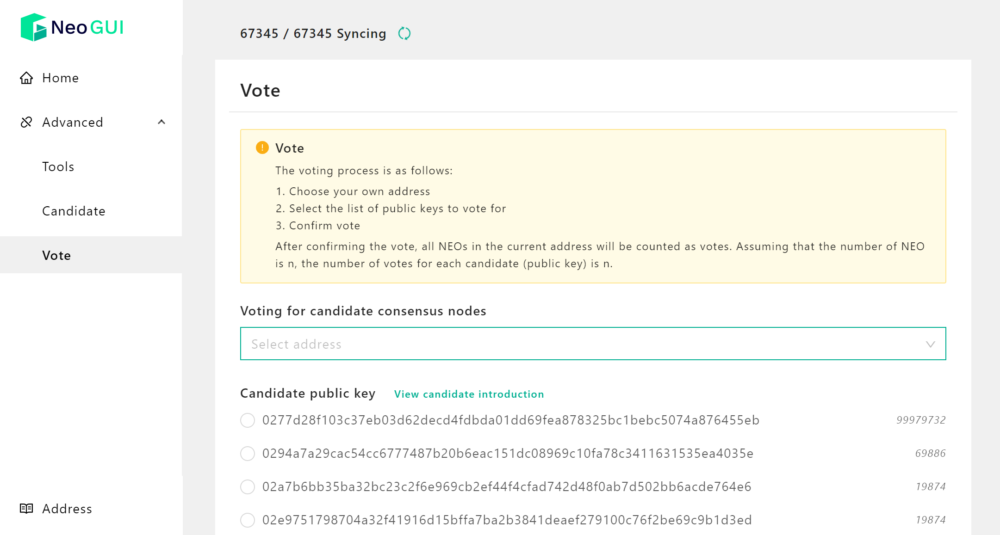

# Election and Voting

Using Neo-GUI you can elect candidates and vote for Neo consensus nodes. After all the Neo consensus nodes reach a consensus through the DBFT algorithm, new blocks are generated. Voting for consensus nodes is conducted constantly in real time in the Neo blockchain. The main process is:

1. Neo nodes register as candidates
2. NEO token holders vote for candidates
3. Neo blockchain determines the consensus nodes based on the number of candidates and their votes cast.

## Election

After the candidates are registered, the NEO token holders can vote for consensus nodes. Before you participate in the election make sure:

- You open the wallet
- There are enough GAS in your wallet (approximately 6 GAS) for payment of  candidate registration.

To register as a candidate:

1. In Neo-GUI home page click `Advanced` -> `Election`
2. Select the public key of the account in the list and click `OK`. 

After the transaction is sent successfully, you can do one of the following to check if the candidate has been registered:

- Use the API [getvalidators](../../reference/rpc/latest-version/api/getvalidators.html).  The candidate's public key should be displayed in the returned response text.
- Go to the Neo-GUI **Vote** page. The candidate's public key should be displayed in the candidate list:

## Voting

Each Neo node can vote for the candidates. The number of NEO in the current voting account will be automatically calculated as the number of the candidate's votes. For example, if you vote for a candidate from an account that has 100 NEO, the candidate receives 100 votes. If NEO in the account is spent after the vote, the candidate' votes will simultaneously be decreased to the current NEO balance.

To vote:  

1. In Neo-GUI open a wallet and then click `Advanced` -> `Vote`
2. Choose the account to vote
3. In the Candidates field, enter the public key of the candidate to vote. 
4. Click `OK`. 

After voting you can use the API [getvalidators](../../reference/rpc/latest-version/api/getvalidators.html) to check the candidate votes, or you can check the votes in the candidates list after the block data has been updated.

