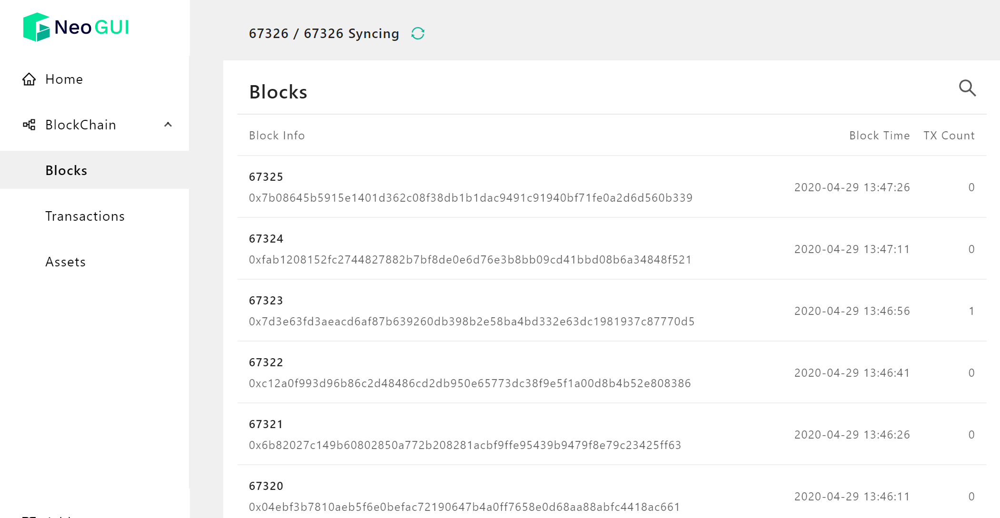
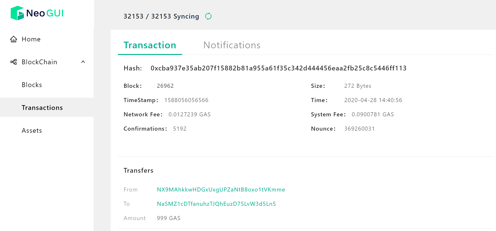

# Viewing Blockchain Information

You can click `Block` on the Neo-GUI main page to enter the blockchain page to view detailed information of blocks, transactions, and assets on the Neo blockchain.

## Block

The block is a logical structure and the most basic unit of the blockchain. Data is permanently recorded on the blockchain via blocks. For information about the basic concept of the block refer to [Block](../../basic/concept/blockchain/block.md).

### Viewing block list

The Block List page shows the newly generated blocks. You can view each block information such as block height, generation time, block hash, the number of transactions included, and etc.

You can search a specific block by entering the block index in the search box of the page.

To view more detailed information of the block, click the block entry in the list.

### Block Information

The Block Info page displays the following information:

- Block header: basic data of the block, such as block height, generation time, block size, block hash, random number, witness, etc.
- Transaction list: all transactions packaged in this block. Click any of transaction items to view details.

## Transaction

A block can have one or more transactions. A transaction may be a collection of one or more transfers, or an invocation of a smart contract.

You can view the transactions of two states in the Transaction page:

- Transactions: all transactions packaged on the blockchain.
- Pending: transactions in the memory pool of the node, waiting to be packaged on the blockchain.

### Transaction List

The transaction list shows the confirmed transactions on the current blockchain.  You can enter the transaction details page by clicking any of transaction entries.

You can view the following information by switching tabs in this page:

- **Transaction**: Displays the basic information of the transaction, such as the block, size, time stamp, as well as the transaction transfer record and the witness of the transaction.
- **Notifications**: Displays the execution log of the smart contract in the transaction, including information such as whether the NEP-17 transfer was successful.

For information about the basic concept of transactions refer to [Transaction](../../basic/concept/transaction.md).

## Assets

All digital assets in Neo N3 are contract assets, including NEO and GAS.

### Asset list

The Asset list shows all assets on the blockchain, including information such as the asset script hash, precision, and etc.

Click on the specific asset entry to enter the asset details page. Here you can view all transaction records related to the asset.
