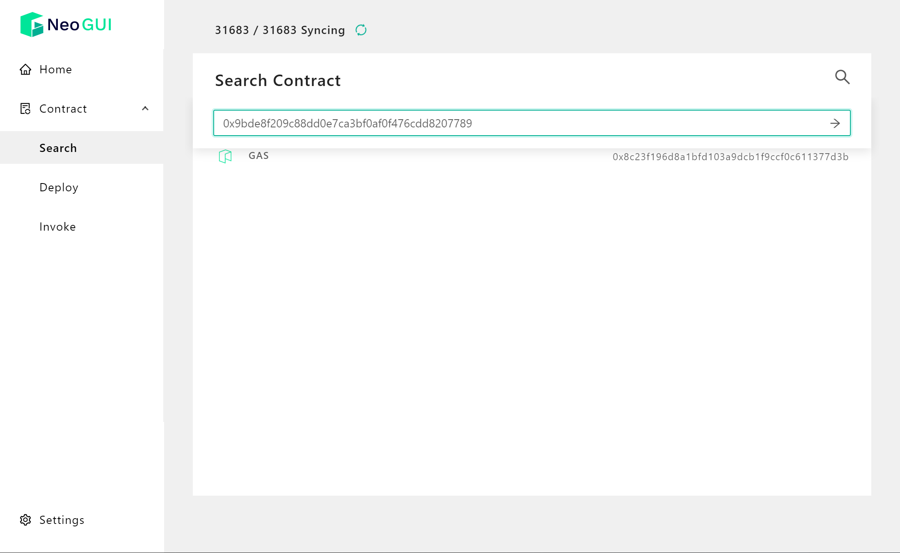
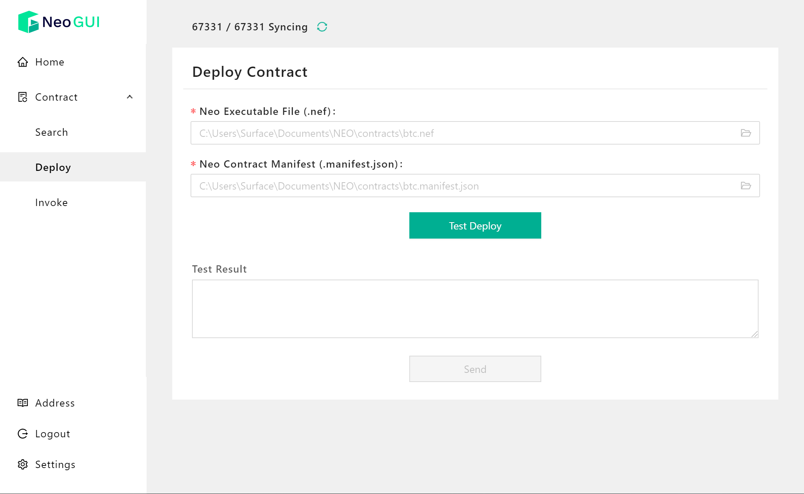
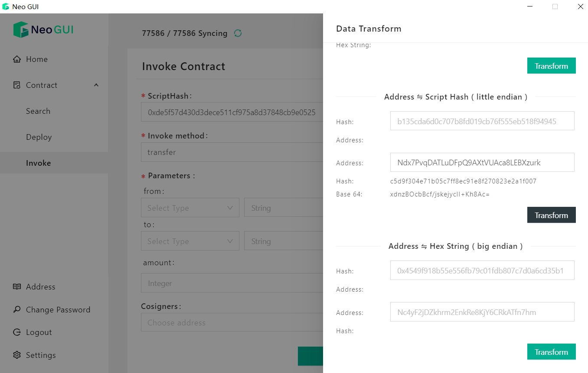
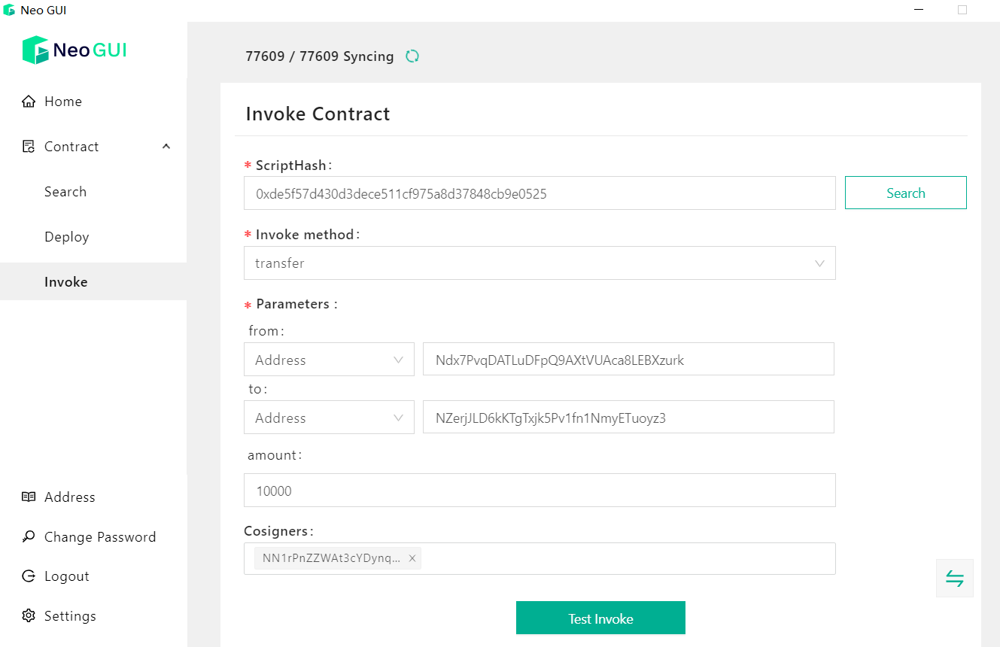

# Contract

In the Neo-GUI homepage click **Contract** to enter the contract page, where you can quickly search, deploy, or invoke a contract.

## Searching a contract

In the search box, you can search for a contract by its contract hash.

Upon searching the contract details page is displayed, where you can view the following information:

-  `Contract Hash`: The hash generated by the contract script using the RIPEMD-160 algorithm.
- `ID`：The serial number of the contract, where negative numbers represent native contracts and positive numbers represent ordinary smart contracts.
- Contract features：
  - `storage` : The contract uses a storage area。
  - `payable` : The contract can receive assets. In the NEP-5 standard, the payable field of the payee is checked when transferring assets.
- Contract methods&notifications: methods and events/notifications included in the contract, including the method name, parameter, and returned value details.

## Deploying a contract

To deploy a contract on the blockchain, open a wallet first and then do the following:

1. Go to the **Deploy Contract** page.

2. Select the nef and manifest files compiled along with the contract previously.

   

3. Click `Trial Run` to test running and check the result.

   If something goes wrong, there may be these reasons:

   - The contract already exists
   - nef file and manifest file do not match
   - Nef file or manifest error
   - Insufficient handling fee

4. If the trial run goes successfully, click `Deploy` to confirm the deployment.

After the contract is deployed on the blockchain successfully, you can search and invoke the contract with the contract hash.

For more information refer to [Deploying Smart Contracts](../../develop/deploy/deploy.md).

## Invoking a contract

After the contract deployed on the blockchain you can enter the **Invoke** page to invoke the contract.

1. Enter the contract script hash in the search box and click `Search` .

   The methods and parameters included in the current contract are displayed. These information was obtained from the contract manifest file on the blockchain.

2. Select the desired method and fill in the parameters. Suppose we invoke a transfer method in the nep17 standard, fill in the following：

   + `from`/`to`: Addresses you transfer assets from and to. You can select one of the following data types and enter corresponding string:

     + Address - standard address
     + Hash160 - endian hash of the address
     + ByteArray - little endian hash (Base64-encoding) of the address

     You can use the Data Transform tool built in Neo-GUI to convert the wallet address into required string.

     

   + `amount`：1*10000 (accuracy)

     When invoking the tranfer method in the nep17 standard, the amount filled in needs to be multiplied by the nep17 accuracy.

   

   + `Cosigners`: (Optional) In case that cosigners are required by some methods when invoked, you need to add one or multiple standard accounts in the Cosigners field.

4. Click `Test Invoke` to test running and check the result.

   A trial run just creates a NeoVM locally and simulates execution. It does not affect the blockchain.

5. If the trial run goes successfully, click `Invoke`.

For more information refer to [Invoking Smart Contracts](../../develop/deploy/invoke.md).

