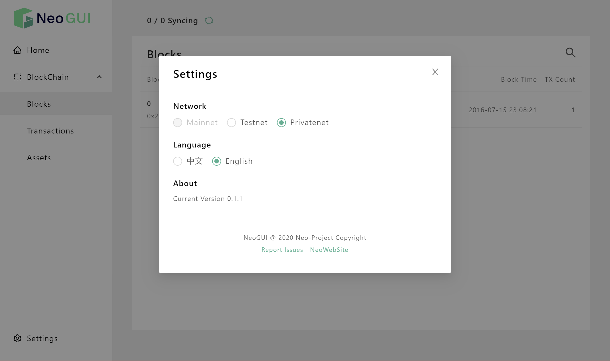

# Installing Neo-GUI

Neo-GUI is a full-node application on the Neo blockchain. It uses Electron cross-platform technology and currently can run on Windows 10 and macOS systems.

It has these main functions:

- Viewing and searching blockchain information
- Basic wallet operations, including creating wallets, importing wallets, transferring transactions, etc.
- Deploying and invoking smart contracts
- Election and voting consensus nodes

## Downloading the client

Neo-GUI is an open source project, thus you can download the installation package of the corresponding system version on [GitHub](https://github.com/neo-ngd/Neo3-GUI/releases) , and complete the installation according to the prompts.

> [!Note]
>
> - Make sure your Windows / macOS system has [.NET Core 3.1](https://dotnet.microsoft.com/download/dotnet-core/current/runtime) installed.
>
> - When installing on the Windows system, do not install Neo-GUI under the default path C:\Program Files, or you have to run the client with the administrator privileges to connect the client to the network and download the blockchain data.

## Connecting to the network

After installation Neo-GUI connects to the Neo test net automatically. 

If you have already built a private chain (see [Setting up private chain](../../network/private-chain/solo.md)), you can also connect Neo-GUI to it.

1. Find the `config.json` and `protocol.json` files of your private chain.

   Make sure that the address port configured in `protocal.json` SeedList can be accessed from this machine.

2. Go to the path `resources\build-neo-node` under Neo-GUI installation directory and find the two files `config.private.json` and `protocol.private.json` 

3. Replace the content of two files with the content of config.json and protocol.json the private chain files you found in Step 1

4. Run Neo-GUI and go to any page.

5. Click `Setting` in the lower left corner.

6. Under **Network** check `Privatenet`.

   

After a while, when you see the block synchronization data displayed at the top of the main page is increasing, that indicates your client has connected to the network successfully. 