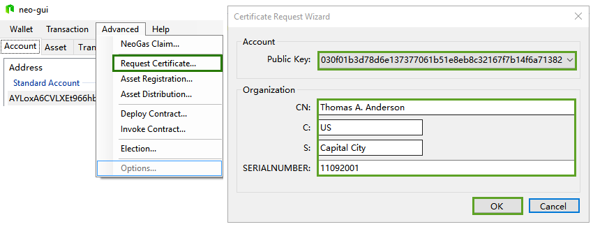

# Other Features

## Claiming GAS

GASs are generated with generation of each new block and are allocated to the address of NEO holders. At any time, the NEO holder can initiate a claim to redeem GASs to the corresponding address of the NEO. 

Unclaimed GAS has two states, unavailable and available, which corresponds to the two states of NEO, unspent and spent. When NEOs are transferred to an account, their states are unspent, the GASs generated during this period are unavailable for claiming. When NEOs are transferred out their states become spent and related GAS become available. How to make the GAS in your account available? Transfer the NEO to any address in your wallet.

To claim GAS, do the following:

1. Transfer all the NEO within the wallet. It is possible to send the NEO back to the current address Once the claim for the GAS is settled, the GAS can be withdrawn. 
2. Click `Advanced  ` -> `Claim GAS`
3. Enter the address to receive the GAS and then click `Claim All`.

## Requesting a certificate

Note that this feature can only generate a certificate application file, the user will still need to go to the relevant digital certificate authority to apply for a certificate.
Click `Advanced`, `Request certificate`, and fill in the request form according to the instructions given.

The generated file will be as shown in the following figure:

