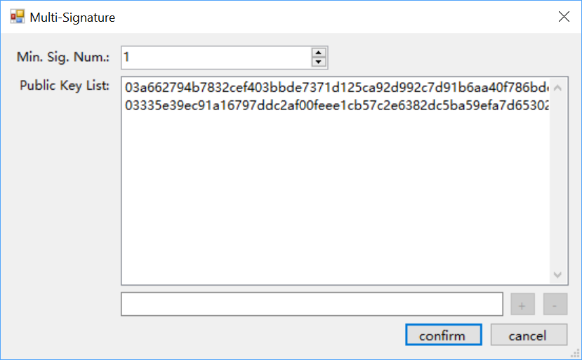
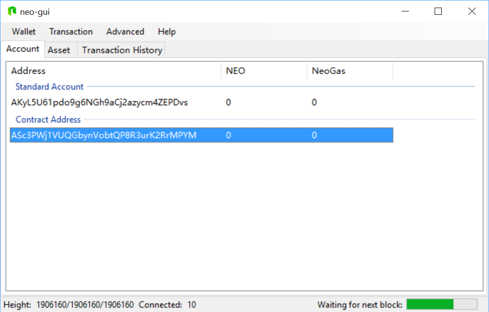
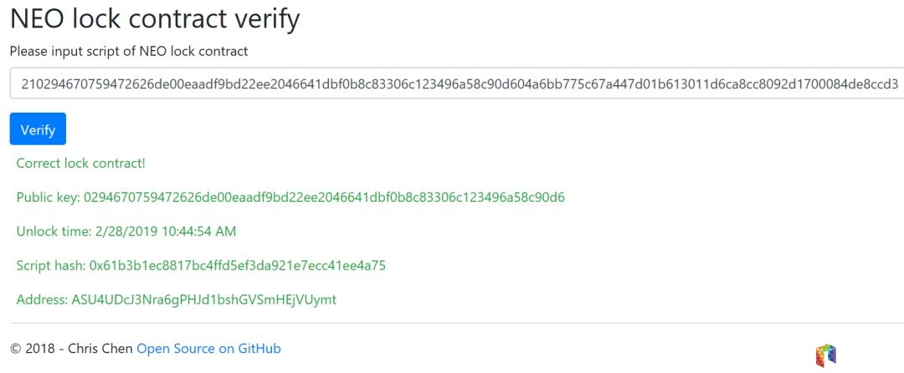

# Interacting with Smart Contracts

## Multi-party signed address

Multi-party signed address is a contract address that requires one or more parties to sign during the process of transaction.

To create a multi-party signed address:

1. From NEO-GUI, right-click on the account area and select `Create Contract Address` -> `Multi-Signature`.

2. In the public key list, enter the public keys used for signing.

3. Specify the minimal number of signatures.

   

4. Click OK.

The contract address is created and displayed in the account page.

## Lock Contract

A lock contract specifies a time stamp for the account. Any assets in the account cannot be transferred out until the specified time arrives.

There are two options to create a lock contract:

- Write the contract by yourself, refer to [Lock Contract Tutorial](../../sc/sample/Lock2.md).
- Use NEO-GUI to create the contract, which will be descried in the following section.

### Creating a lock contract

1. From NEO-GUI, create a wallet.
2. Right-click on the blank area of the account page, and then click `Create Contract Add` -> `Lock`。
3. Select the account and specify the unlock date. Click `Create`。

The new contract address is created on the page. Right-click on the contract address and select `View Contact`，you can view the contract address and script.

### Verifying lock contract script

You can verify if a lock contract script is standard and valid using http://lockverify.azurewebsites.net/.

The following screenshot shows a normal verification result which displays the lock contract address and unlock time. 

If the script inputted is not correct, an error is displayed.

## Deploying and invoking smart contracts

For the smart contracts you have compiled, you can depoy and invoke them in the NEO blockchain using NEO-GUI. For more information, refer to [deploying and invoking smart contracts](../../sc/deploy/deploy.md).

