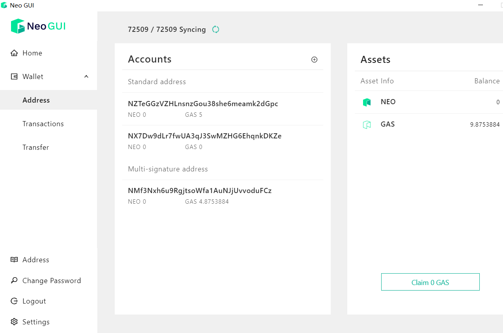

# Wallet

The wallet is a database file of Neo-GUI used to store Neo account and asset information in the account. This file is very important and must be properly kept and safely backed up.

> [!CAUTION]
>
> #### Warning
>
> Do not open or create a wallet on an insecure computer. Once the wallet file or wallet password is lost, it will cause the loss of your assets. So back up your wallet file securely, keep it safe, and remember your wallet password.

## Creating a wallet

1. In Neo-GUI main page click `Wallet` -> `New Wallet Database`.

2. Select the wallet file storage path, set the file name, and then click `Save`.

3. Enter `Password` and `Re-Password` and save your own password.

4. Click `OK` and the wallet is successfully created, which by default comes with a standard account.

> [!Warning]
>
> After the wallet is created, please back up the wallet file safely;
>
> It is not recommended to save your wallet files directly under the neo-gui root directory, or you may lose your wallet files when upgrading the software.

## Opening a wallet

1. In Neo-GUI main page click `Wallet` -> `Open Wallet Database`.
2. Select the wallet and enter the password. Click `OK` to open the wallet.

> [!Note]
>
> The wallets created in Neo2 cannot be opened in Neo3-GUI. To work around this issue you can import the wallet to Neo3-GUI through the private key.

## Importing a wallet

Neo-GUI supports importing wallets through the private key and encrypted private key. Importing  mnemonics will be supported in the future.

## Viewing account list

After creating or opening the wallet, you will go to the account list page, which displays the following information:

- Account list: all accounts in the wallet, and the number of NEO and GAS in each account

- Asset list: all asset types and balance in the wallet, including NEO, GAS and other NEP-5 assets, etc.

  The GAS balance shows the amount of GAS claimed, and the Claim GAS button at the bottom of the page shows the amount of unclaimed GAS. To withdraw the GAS into the account, click the button.

Clicking on the account address you can enter a new page to view the private key or delete the address.

> [!CAUTION]
>
> #### Warning
>
> At no point should the private key be disclosed to others. Once the private key is disclosed, it may result in the loss of your assets.

## Viewing transaction list

You can view all transaction records related to the wallet by clicking the transaction list. This includes the confirmed transactions and the transactions that have just been initiated but have not yet been confirmed.

+ **Unconfirmed transaction**: Transactions waiting to be packaged on the blockchain
+ **Latest transaction**: Transactions already packaged on the blockchain by consensus nodes

## Transfer

On the Transfer page, you can enter the receiving account and the transfer amount, and then select the asset to send.

> [!Note]
>
> The batch transfer function will be supported soon.

## Address book

The address book shows all the addresses in the currently wallet.
