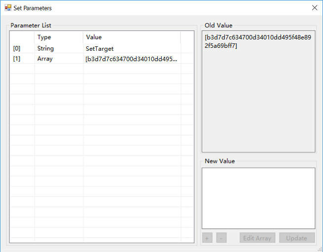

# Invoking Smart Contracts

The smart contract invoking described in this section refers to invoking a smart contract that has been deployed as a class library.

## Static Call

To invoke another contract from one contract, you need to first add a statement in C# using Appcall and the script hash of the contract to invoke, and then you can invoke it in the code. 

```c#
[Appcall("XXXXXXXXXX")]//ScriptHash
public static extern int AnotherContract(string arg);

public static void Main()
{
    AnotherContract("Hello");    
}
```

## Dynamic Call

In some cases the contract script hash you want to invoke is uncertain and needs to be passed in as a variable, you can invoke the contract dynamically.

### Dynamic call code

The following is an example of dynamic call contract:

```c#
using Neo.SmartContract.Framework;
using Neo.SmartContract.Framework.Services.Neo;
using Helper = Neo.SmartContract.Framework.Helper;
using System;
using System.Numerics;

namespace DynCall
{
    public class DynCallDemo : SmartContract
    {
        delegate object Dyncall(string method, object[] args);

        public static object Main(string operation, object[] args)
        {
            if (operation == "DynCall")
            {
                if (args.Length != 2)
                {
                    return false;
                }
                byte[] target = Storage.Get(Storage.CurrentContext, "BaseAddress");
                Dyncall dyncall = (Dyncall)target.ToDelegate();
                object[] newarg = new object[1];
                string method = (string)args[0];
                newarg[0] = args[1];
                return dyncall(method, newarg);
            }
            else if (operation == "SetTarget")
            {
                Storage.Put(Storage.CurrentContext, "BaseAddress", (byte[])args[0]);
                return true;
            }
            else if (operation == "ShowTarget")
            {
                byte[] target = Storage.Get(Storage.CurrentContext, "BaseAddress");
                if (target.Length != 0)
                {
                    return target;
                }
                else
                {
                    return 0;
                }
            }
            else
            {
                return false;
            }

        }
    }
}
```

where three methods are defined:

- DynCall: invoke contracts based on the specified script hash.
- SetTarget: set the contract script hash (little endian) you want to invoke by inputting parameters.
- ShowTarget: return the contract script hash to invoke.

### Dynamic call demonstration

In Visual Studio 2017 compile the preceding dynamic call code into d.avm. Next we are going to do a dynamic call to invoke an ordinary contract a.avm using NEO-GUI. 

#### Deploying the smart contract

Follow these steps to deploy two contracts, a.avm and d.avm, respectively.

1. From NEO-GUI, open any wallet and click `Advanced` -> `Deploy Contract`.

2. In the Deploy Contract dialog，Click `Load` and select the desired smart contract file.

   Copy the contract script hash displayed under the code box for use in a later step.

3. Enter the information and metadata fields. You need to fill in each fields to enable the `Deploy` button.

   For metadata related parameters, refer to [Parameters and Return Values](Parameter.md).

   Check the `Need Storage` option. For d.avm, check `Need dynamic call` as well.

4. Click `Deploy`.

5. Click `Test` in the dialog that appears. If no issue, click `Invoke`.

   Deploying a smart contract costs 100 ~1000 GAS. For more information, refer to [Fees](../fees.md).

#### Converting script hash to little endian

Convert the a.avm script hash from big endian to little endian using [DataTransformationTool](https://peterlinx.github.io/DataTransformationTools/). Copy the string for later use.

#### Invoking the contract

Now we use the contract d.avm to invoke the contract a.avm.

1. Click `Advance` -> `Invoke contract` -> `Function call`。

2. Paste d.avm scripthash copied in the early step to `ScriptHash` and press search button. Relevant contract information is displayed automatically.

3. Click `...` beside `arguments` to enter the edit interface.

   

4. Invoke the method SetTarget：

   1. Click [0] and enter the value “SetTarget”
   2. Click [1] and enter the little endian script hash of a.avm
   3. Click`Update`

   

5. Invoke the method ShowTarget to check if the specified contract script hash can be returned：

   

6. Invoke the method DynCall to invoke a.avm. Suppose we invoke the Height method in the contract and its parameter is Simple, set as shown below:

   


