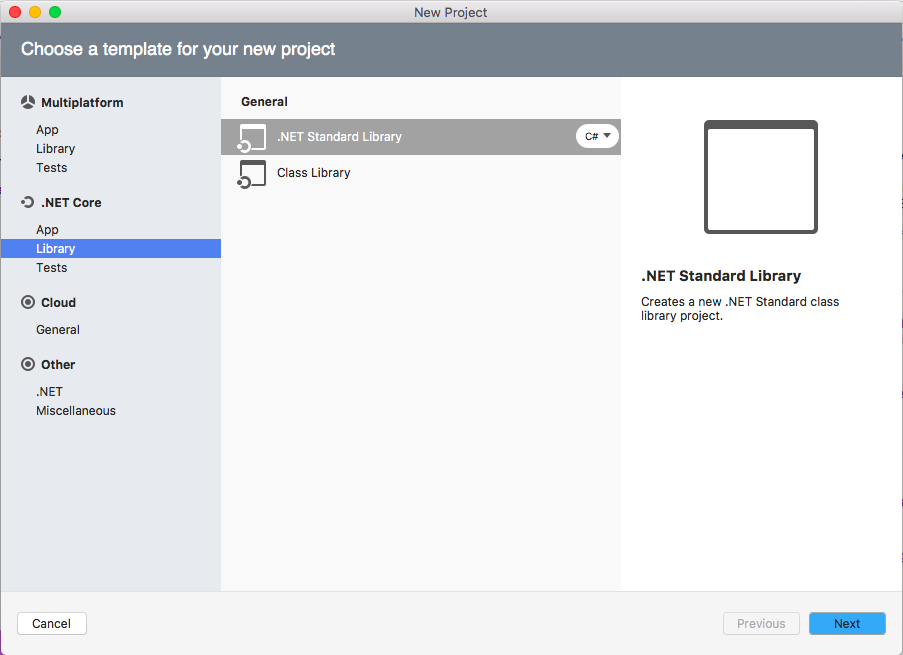
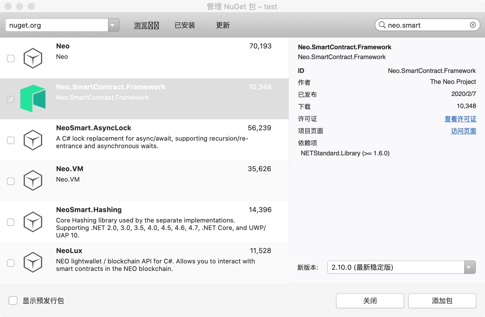
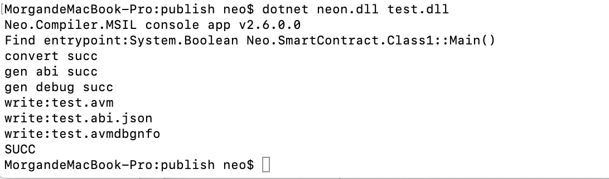

# How to write smart contracts in C# on macOS

This document will guide you through the process of setting up the C# development environment in macOS, creating contract projects with sample code, and compiling the smart contract.

## Downloading Visual Studio for Mac 

Download [Visual Studio for Mac](https://www.visualstudio.com/vs/mac/) and follow the on-screen instructions to install the software. 

> [!Note]
>
> Just check the basic functions when installing, without selecting the platform specific components like Android / iOS / macOS.

## Creating a new project

1. Open Visual Studio for Mac, create a new project, and select .NET Standard Library.

   

2. Select .NET Standard 2.0 for the .NET Core version and follow the instructions to create the project with the name “test”.

3. Right click on `Dependencies` and choose `Manage NuGet Package`. 

4. Search for `neo.smart` and choose `Neo.SmartContract.Framework`, then click `Add Packge`.

   

5. Write the following sample code in your Class1.cs file.

   ```c#
   using Neo.SmartContract.Framework;
   using Neo.SmartContract.Framework.Services.Neo;
   
   namespace Neo.SmartContract
   {
       public class Class1 : Framework.SmartContract
       {
           public static bool Main()
           {
               return true;
           }
       }
   }
   ```

6. In the menu choose `Build` ->`Build All` to compile the corresponding code. 

   A test.dll file is created in the folder `bin/Debug/netstandard2.0/`.  Next we will use neon to compile it into a .avm smart contract file that can be deployed on the blockchain.

## Downloading contract compiler

1. Download [neo-devpack-dotnet](https://github.com/neo-project/neo-devpack-dotnet) from GitHub. 

2. Locate the file Neo.Compiler.MSIL.csproj at `neo-devpack-dotnet/src/Neo.Compiler.MSIL/`, open it using a text editor and replace 

   ```
   <TargetFrameworks>netcoreapp3.1;netstandard2.1</TargetFrameworks>
   ```
   with
   ```
   <TargetFramework>netcoreapp3.1</TargetFramework>
   ```
   
3. Run Visual Studio for Mac and open the solution neo-devpack-dotnet.sln. Right-click Neo.Compiler.MSIL and then select `Publish`.

4. Publish neon to the default path. After published, you can find neon.dll is generated under the path.


## Compiling your smart contract to .avm

1. Download and install [.NET Core](https://www.microsoft.com/net/download/macos ).

   

2. Copy the new-created project file test.dll generated in previous steps into the directory where neon.dll locates in.

3. Run Terminal, and use `cd` to go to the directory where neon.dll locates. Enter `dotnet neon.dll -f test.dll `  to compile the .dll file into .avm.

   The output should look like this
   
   

You should now find the `.avm` file in the test output folder.