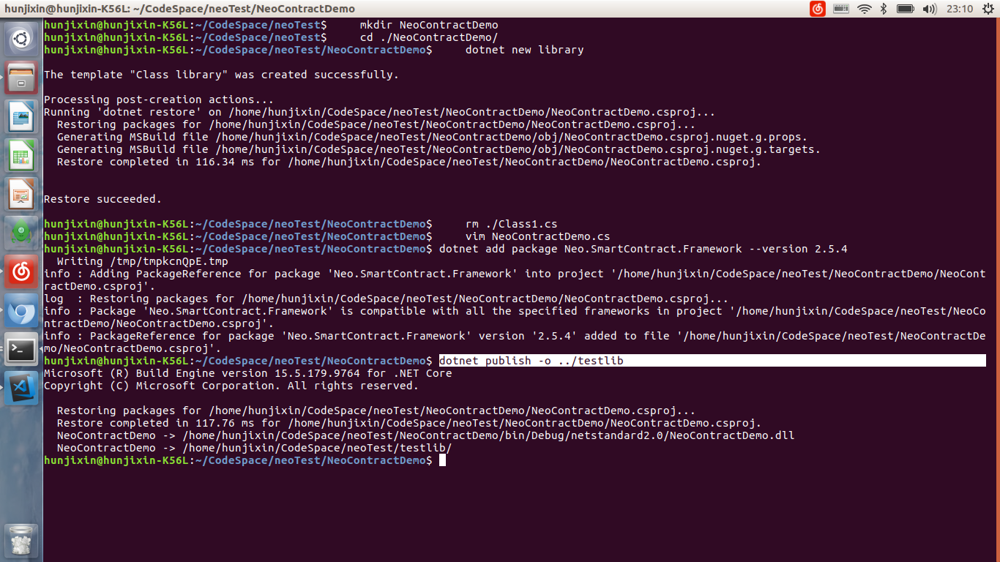
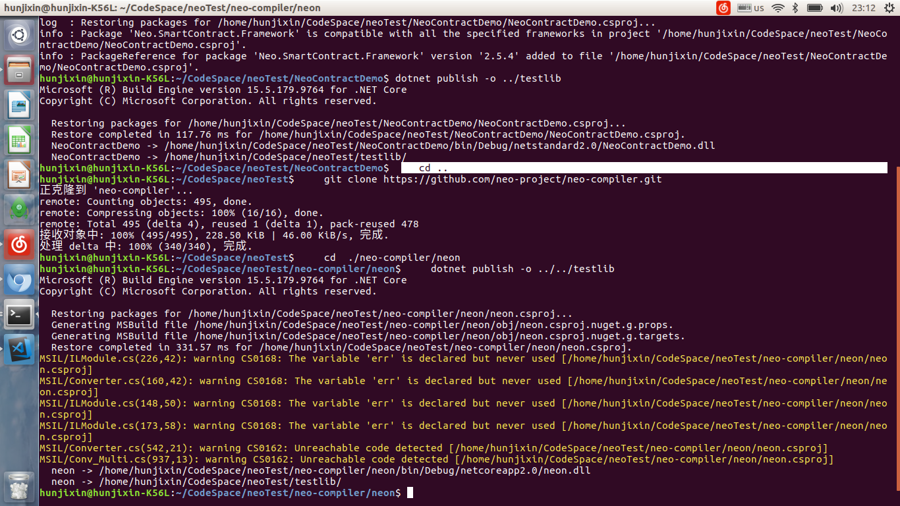
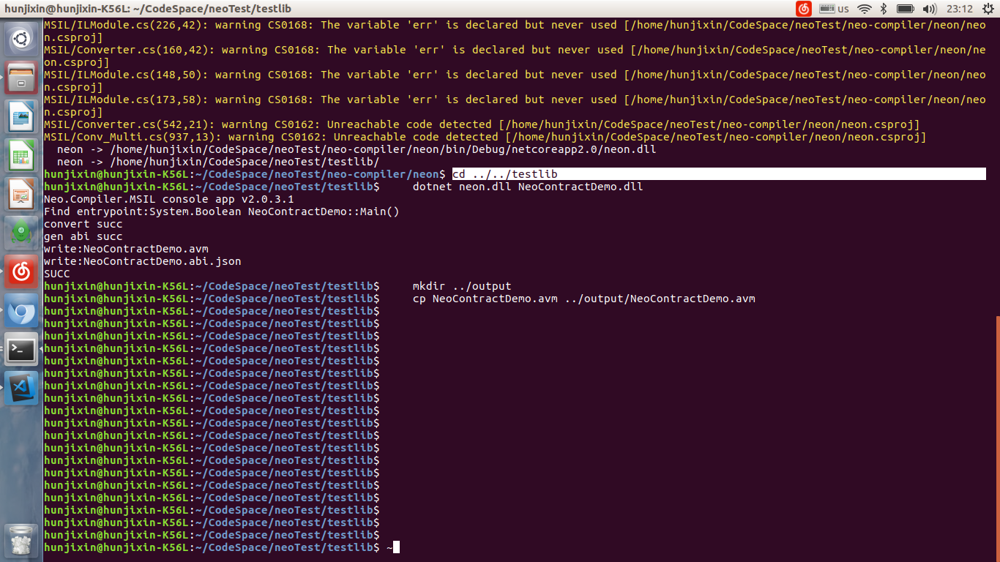

# How to write smart contracts in C# on ubuntu

To develop smart contracts in C# on ubuntu, basically you need to do the following:

1. Create a library project, write code, and add the smart contract library.
2. Execute `neo-compiler/neon` to generate the compiler.
3. Run `neon` to generate the .avm file.

## Create a smart contract project

1. In the dotnet command line, create a library project:

   ```c#
   mkdir NeoContractDemo
   cd ./NeoContractDemo/
   dotnet new classlib
   rm ./Class1.cs
   vim NeoContractDemo.cs
   ```

   

2. In NeoContractDemo.cs, enter the following code and then press `ESC`+`wq!` .

   ```c#
   using Neo.SmartContract.Framework;
   using Neo.SmartContract.Framework.Services.Neo;

   public class NeoContractDemo: SmartContract
   {
       public static bool Main()
       {
           return true;
       }
   }
   ```

3. Add the smart contract reference:

   ```
   dotnet add package Neo.SmartContract.Framework --version 2.5.4
   ```

   

4. Compile the smart contract project：

   ```
   dotnet publish -o ../testlib
   ```

   

## Generate the compiler

    cd ..
    git clone https://github.com/neo-project/neo-compiler.git
    cd  ./neo-compiler/neon
    dotnet publish -o ../../testlib



## Generate the .avm file

    cd ../../testlib
    dotnet neon.dll NeoContractDemo.dll
    mkdir ../output
    cp NeoContractDemo.avm ../output/NeoContractDemo.avm



For complete scripts, refer to https://raw.githubusercontent.com/hunjixin/NeoContractBuildScriptOnUbuntu/master/SmartContract.sh
