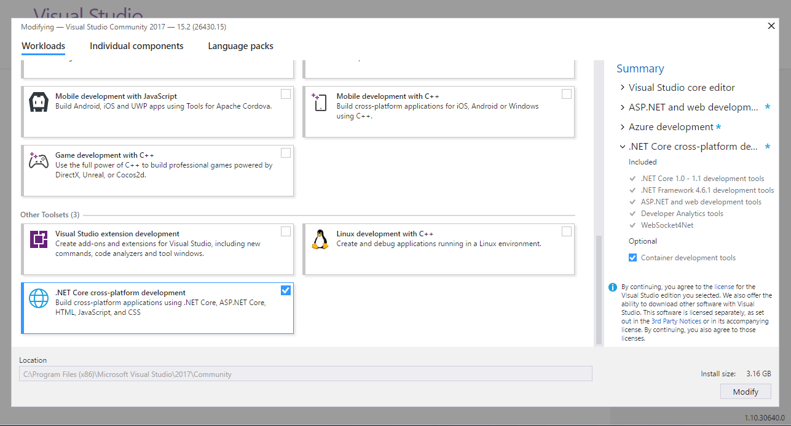
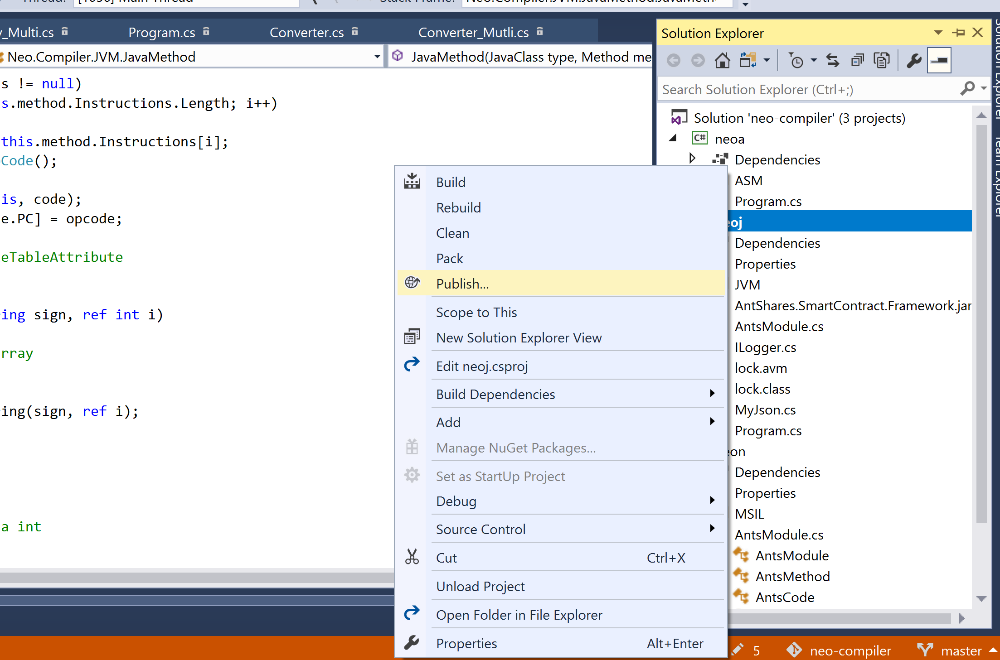
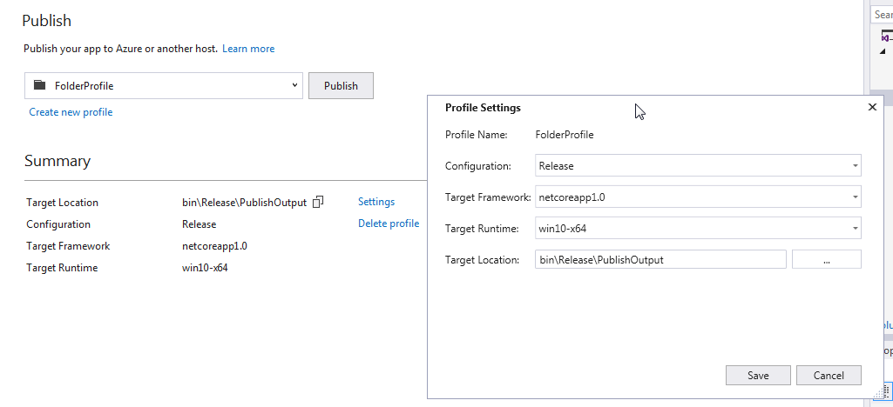
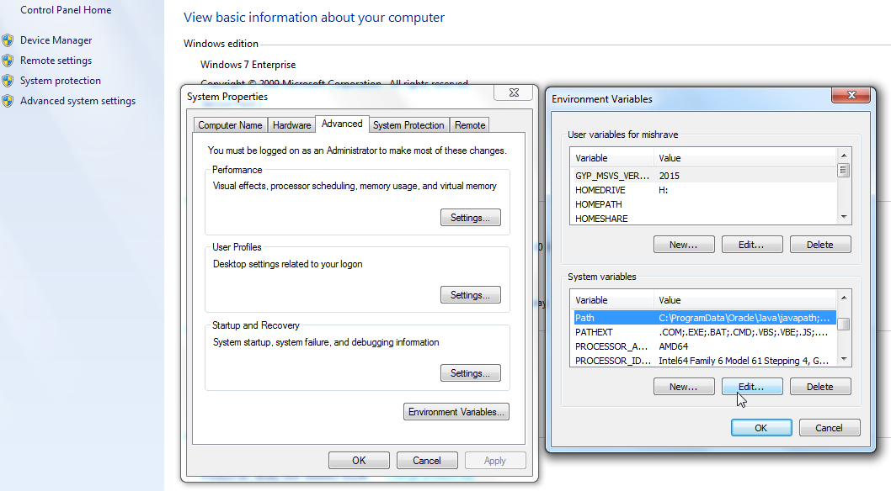
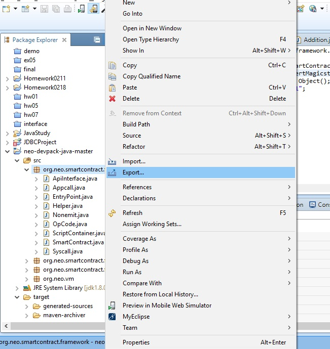
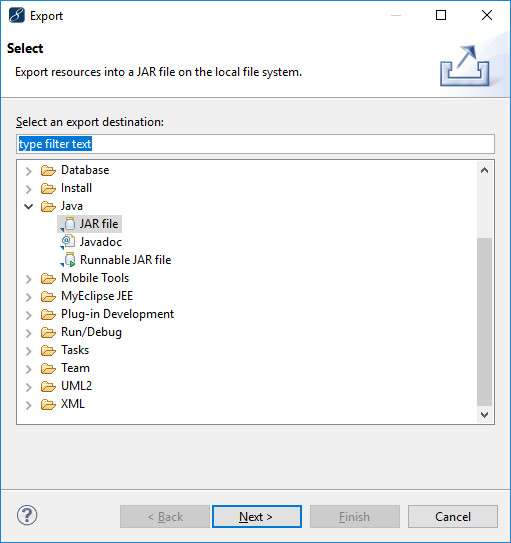
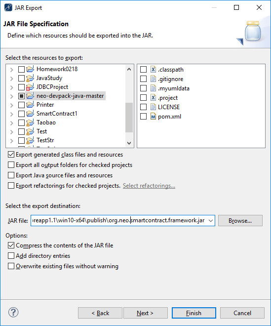

# How to use Java to write a NEO smart contract

Smart contracts are written in high-level languages such as Java, C#, Python, Kotlin (and more...) and compiled into AVM (Neo's Virtual Machine bytecode) so that they can run on the Neo network.

We currently recommend C# for developing smart contracts. The Java compiler is still in development but the current version (neoj) can handle basic methods.

This section contains a tutorial that guides you in configuring the Java development environment for NEO smart contracts. It also gives you an idea of how to create a smart contract project and how to compile it.

The process involves the following steps:
1. Write Java code (.java) for classes that extend FunctionCode or VerificationCode which is part of the Neo Framework Library (JAR)
2. Use the normal Java compiler to compile code into Java bytecode (.class)
3. Build the neoj (C#) compiler that converts JVM code into AVM code (neoj.exe on Windows)
4. Use neoj to compile your .class file (.avm)
5. Download Neo's Node GUI to connect to Neo's Testnet network
6. Deploy your .avm script to publish the smart contract to the network
7. Invoke your .avm script to execute your smart contract

### Detailed Instructions

## Tools

The most efficient way of getting these steps done is to download and compile all the tools you will need:

1. Download Neo's Node GUI. At the time of writing, it is recommended you use the BETA developer GUI as it has some extra debugging features which are helpful. [CoZ NEO GUI](https://github.com/CityOfZion/neo-gui-developer). It will have default presets to Testnet and you will have to wait (up to a few hours) for it to fully sync up.
2. Download the Neo Framework Library JAR. The current latest version is here: [org.neo.smartcontract.framework JAR](https://github.com/CityOfZion/neo-java-sdk/blob/master/target/org.neo.smartcontract.framework.jar)
3. Download an IDE for Java (optional but recommended), e.g. IntelliJ or Eclipse.
4. (Windows only) Download an IDE for C# - currently the neoj compiler needs to be built manually as it is not in wide distribution release format. Recommended is to get Visual Studio 2017 which is free.

> [!Note]
>
> If using Eclipse, you need to install the plug-in maven and make sure the JDK version is the same as it configured in pom.xml.

## Development Tools


#### Visual Studio 2017 (Windows and Mac)

If you have already installed Visual Studio 2017 on your computer and checked for .NET Cross-Platform Development at the time of installation, you can skip this section.

Download and install:

[Visual Studio download address](https://www.visualstudio.com/products/visual-studio-community-vs)

The installation process is very simple, follow the operation prompts step-by-step, it should be noted that you need to check the installation of `.NET Core cross-platform development`, otherwise you will not be able to open neo-vm project in step #3. The installation takes about ten minutes or up to an hour.



### neo-compiler

Installation and configuration steps:

**Windows:**
Download the [neo-compiler](https://github.com/neo-project/neo-compiler) project on Github, open the solution with Visual Studio 2017, and publish the neoj project.

Publish the neoj compiler (which converts Java bytecode to the AVM bytecode).





After the release is successful, the neoj.exe file is generated in `bin\Release\PublishOutput`.

**Linux and Mac OS:**

Since there's no "publish" function in Visual Studio Code for Linux or Mac OS we build it manually.
Make sure you have dotnet installed.

[dotnet for Linux](https://docs.microsoft.com/en-us/dotnet/core/linux-prerequisites?tabs=netcore2x#install-net-core-for-ubuntu-1404-ubuntu-1604-ubuntu-1610--linux-mint-17-linux-mint-18-64-bit)

[dotnet for Mac OS](https://docs.microsoft.com/en-us/dotnet/core/macos-prerequisites?tabs=netcore2x#supported-macos-versions)

Download the [neo-compiler](https://github.com/neo-project/neo-compiler) project on Github.

```
cd neo-compiler/neoj
dotnet build
```

NOTE: At this point, after having launched the build command, you could get the following error:
`It was not possible to find any compatible framework version
 The specified framework 'Microsoft.NETCore.App', version '1.0.4' was not found.`

If this is the case, open neoj.csproj and change the RuntimeFrameworkVersion's tag with your dotnet version.
For example `<RuntimeFrameworkVersion>2.0.5</RuntimeFrameworkVersion>`


We now need to add this directory to our execution path. The PATH is the system variable that your operating system uses to locate needed executables from the command line or Terminal window.

**Windows 10 and Windows 8:**

  In Search, search for and then select: System (Control Panel)
  Click the Advanced system settings link.
  Click Environment Variables. In the section System Variables, find the PATH environment variable and select it. Click Edit. If the PATH environment variable does not exist, click New.
  In the Edit System Variable (or New System Variable) window, specify the value of the PATH environment variable. Click OK. Close all remaining windows by clicking OK.

**Windows 7:**

  From the desktop, right click the Computer icon.
  Choose Properties from the context menu.
  Click the Advanced system settings link.
  Click Environment Variables. In the section System Variables, find the PATH environment variable and select it. Click Edit. If the PATH environment variable does not exist, click New.
  In the Edit System Variable (or New System Variable) window, specify the value of the PATH environment variable. Click OK. Close all remaining windows by clicking OK.



Now run Command or PowerShell, and enter neoj.exe. If there is no error and the output shows the version number (as shown) the environment variable configuration is successful


NOTE. Windows 7 SP1 users might encounter an error "Unhandled Exception: System.DllNotFoundException: Unable to load DLL 'api-ms-win-core-console-l2-1-0.dll': The specified module could not be found". The required 'api-ms-win-core-console-l2-1-0.dll' file is only found in Windows 8 or later versions. This error can be resolved by obtaining a copy of 'api-ms-win-core-console-l2-1-0.dll' and putting it in the directory C:\Windows\System32. This dll can potentially be found in a number of places throughout one's system(search your computer and copy/past it into \System32), but alternatively can be found online.

**Linux**

Add this to your ~/.profile or ~/.bashrc file:

`export PATH=$PATH:/path/to/neo-compiler`

then execute `source ~/.profile` or `source ~/.bashrc`

## Create project

After the above installation is complete you can create a Java project (e.g. using Eclipse or IntelliJ).

1. Compile the .jar package of smart contract from the neo java devpack project ([neo-devpack-java](https://github.com/neo-project/neo-devpack-java)) and add it as an external library.

2. Export the package of `org.neo.smartcontract.framework` as the .jar package `org.neo.smartcontract.framework.jar` and put it under the directory ..\neoj\bin\Release\netcoreapp1.1\win10-x64\publish\

   

   

   

3. Create a class, e.g. Go.java, and paste the following code into the class file.

   ```java
   import org.neo.smartcontract.framework.SmartContract;
   
   public class Go extends SmartContract{
   	public static void Main(byte[] signature)
   	{
   		
   	}
   }
   ```


## Compile the Java Project

Everything is now ready to add the entry method that defines the smart contract:

```Java
import org.neo.smartcontract.framework.SmartContract;
import org.neo.smartcontract.framework.services.neo.Storage;

public class HelloWorld extends SmartContract {

    public static byte[] Main(String[] args){
        Storage.put(Storage.currentContext(), "Greeting to the World", "Hello World!");
        return Storage.get(Storage.currentContext(),"Greeting to the World");
    }

}
```

Build the project which will give you `HelloWorld.class` in your out folder.

Alternatively, you can build from the command line in Mac OS.

**Mac OS:**

`cd /path/to/HelloWorld/project`

`javac -cp /path/to/org.neo.smartcontract.framework.jar HelloWorld.java`

You should now have a HelloWorld.class in the same directory as HelloWorld.java

## Transform HelloWorld.class to HelloWorld.avm

**Windows:**

Then using neoj, run cmd.exe and execute:

`neoj.exe HelloWorld.class`

**Linux:**

Copy the jar into the dotnet's folder. For example:

`sudo cp org.neo.smartcontract.framework.jar /usr/share/dotnet`

and then call

`dotnet run HelloWorld.class`

**Mac OS:**

Copy the jar to the neo-compiler's neoj folder. For example:

`sudo cp org.neo.smartcontract.framework.jar /path/to/neo-compiler/neoj`

Also copy HelloWorld.class to the neoj folder. For example:
`sudo cp HelloWorld.class /path/to/neo-compiler/neoj`

Then from the neoj folder call

`dotnet run HelloWorld.class`


If successful, it will create HelloWorld.avm which you can now use as smart contract bytecode.

For more information and to see working Java examples please refer here: [Java Examples](https://github.com/neo-project/examples-java)

## Deploy smart contracts

Once you are at this stage, the instructions are the same no matter what language you used to write the smart contracts.
Follow this tutorial: [Deploy a lock contract](../sample/Lock2.md)