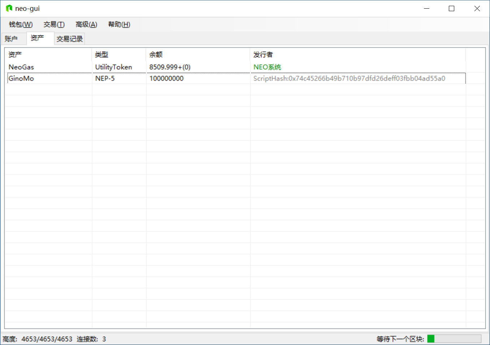

# Deploying and invoking contract

Next we deploy the NEP-5 contract we have created previously.

## Deploying contract

We may use NEO-GUI to deploy the newly generated contract file.

1. Open 0.json wallet file, click `advance` -> `deploy contracts`.

2. Click `load` to select the compiled contract file in the contract deployment dialog.

   Copy the contract script hash displayed under the code box for late use in contract invocation.

3. Fill in the params in the information and meta data fields. Do not leave any parameter undefined, otherwise the `deploy` button won't function properly.

   For NEP-5 asset contract, the argument is written as 0710 and the return value is 05.

   Detailed rules can be referred to  [Smart Contract Parameters and Return Values](../deploy/Parameter.md).

   Check the box of `required to create a storage area` as according to NEP-5 standard, storage areas are used to maintain accounts.

   No need to check the options` require dynamic invocation` and `Payable`.

4. After all the params are defined, click `deploy`.

5. Click `trial run` in the popped up contract invocation interface. Double check and click `invoke`.

   Contract deployment costs about 100-1000 GAS, which is further explained in [Fees](../fees.md). 

Upon successful deployment, your smart contract is now released to the blockchain.

## Invoking contract

Now you may invoke the smart contract released just recently.

1. Click `advance` -> `contract call` -> `function call`。

2. Paste the contract scripthash copied in the early step to `ScriptHash` and press search button. Relevant contract information will be displayed automatically.

3. Click `...` beside `arguments` to enter the edit interface.

   

4. Concerning the smart contract you wrote, [0] represents the function name while [1] the input param of the function (ignore if not exist). If you need to invoke deploy function and release the assets onto the chain, take the following steps: click [0], fill in "deploy" (all in lowercase letters) in the new value, click `update `and close the window.

   

5. Click `trial run` to test the contract. If no error is spotted, click `invoke`, which may cost several GAS.

## Viewing contract assets

Click `advance`-> `options` in NEO-GUI and fill in the scripthash of the recently deployed assets. The NEP-5 assets will show up in your asset page.

You have successfully released a smart contract on NEO private chain. Congratulations!

