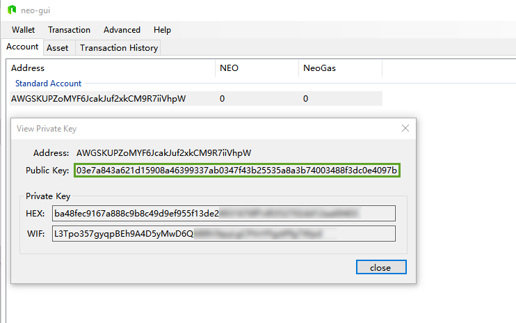
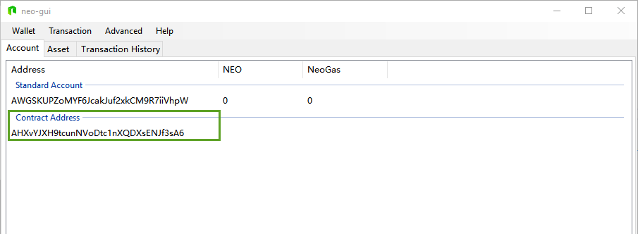
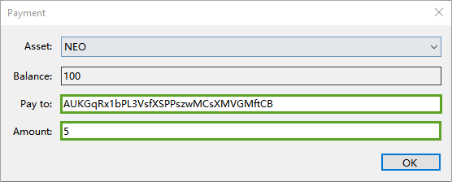

# Lock Contract

A lock contract specifies a certain timestamp, before which no one is allowed to withdraw assets from the contract. Once the time specified is reached, the contract owners can then withdraw the assets.

The current time obtained through the contract is the time of the latest block in the blockchain (the error is about 15 seconds). For details, refer to [Blockchain class](../../reference/scapi/fw/dotnet/neo/Blockchain.md), [Header class](../../reference/scapi/fw/dotnet/neo/Header.md).

This section describes how to deploy a lock contract in the blockchain, so that it can be called by others. 

In addition, this tutorial is based on the demo of Smart Contract 2.7.4. You need to download the latest client  [Neo GUI ](https://github.com/neo-project/neo-gui/releases) from GitHub and run the [test net](../../network/testnet.md).

## Creating a wallet

In NEO-GUI, click `Wallet` -> `New Wallet Database ` to create a wallet.


## Getting the public key

The newly created wallet will automatically generate a standard account. Right-click on the account, view the private key, and copy the public key from the second line, as shown in the figure:



Here we write a local program to convert the public key into a byte array, as follows:

```c#
namespace ConsoleApp1
{
    class Program
    {
        static void Main(string[] args)
        {
            // Replace the string with the public key copied in the last step
            byte[] b = HexToBytes("0285eab65f4a0126e4b85b4e5d8b7e303aff7efb360d595f2e3189bb90487ad5aa");
            foreach (var item in b)
            {
                Console.Write($"{item}, ");
            }
            Console.ReadLine();
        }

        static byte[] HexToBytes(string hexString)
        {
            hexString = hexString.Trim();
            byte[] returnBytes = new byte[hexString.Length / 2];
            for (int i = 0; i < returnBytes.Length; i++)
            {
                returnBytes[i] = Convert.ToByte(hexString.Substring(i * 2, 2), 16);
            }
            return returnBytes;
        }
    }
}
```

After running it, the screen will display the byte array created from the public key. Copy this down as we will be using it later.

## Writing a smart contract

Create a smart contract project and write the following smart contract. 

```c#
using Neo.SmartContract.Framework;
using Neo.SmartContract.Framework.Services.Neo;

namespace Neo.SmartContract
{
    public class Lock : SmartContract
    {
        public static bool Main(byte[] signature)
        {
            Header header = Blockchain.GetHeader(Blockchain.GetHeight());
            if (header.Timestamp < 1499328600) // 2017-6-6 18:10
                return false;
            // Paste the public key byte array here
            return VerifySignature(signature，new byte[] { 2, 133, 234, 182, 95, 74, 1, 38, 228, 184, 91, 78, 93, 139, 126, 48, 58, 255, 126, 251, 54, 13, 89, 95, 46, 49, 137, 187, 144, 72, 122, 213, 170 });
        }
    }
}
```

You need to change these two variables in the code: the public key and the lock time.

- public key: Paste the previous copy of the public key byte array.

- lock time: Change the lock time in the sample code, which is a Unix timestamp. You can calculate it yourself or use an online tool [Unix timestamp online conversion](https://unixtime.51240.com/).

After replacing the two variables, compile the contract into the file Lock.avm.

## Obtaining the contract script

You can choose one of the following ways to obtain the contract script:

- Use the C# code below to read the .avm to get the bytecode.


```c#
byte[] bytes = System.IO.File.ReadAllBytes("Test.avm");
for (int i = 0; i < bytes.Length; i++)
    Console.Write(bytes[i].ToString("x2"));
```

- Use NEO-GUI to obtain the script:
  1. Click  `Advanced`-> `Deploy Contract`.
  2. click the `Load` button on the bottom right corner. Choose the `Lock.avm` file generated earlier.
  3. Copy the contract script displayed in the `Code` box, as shown below.


## Creating a contract address

1. Right-click on the address area and select `Create Contract Add` -> `Custom` to create a contract address with the contract script generated before.
2. In the Import Custom Contract dialog, specify the following:
   1. Parameter List: Because our contract has a parameter for signature, you should fill in `00`. For details, refer to [Parameter](../deploy/Parameter.md).
   2. Script: enter the contract script copied from previous step.
   3. Private Key: Optional. When the contract needs to be signed, specify the private key used for signing.
3. After clicking `OK`, the smart contract verification account is created successfully.



## Test

The following is a test of the smart contract verification account. Our testing process is to first transfer some assets into the account address, then transfer them out.

> [!Note]
>
> In order to ensure the accuracy of the test, it is best not to have any other assets in the wallet, as you may not know if the assets are coming from a standard address or a contract address, unless you understand the client's change finding algorithm and know which transaction is coming from the contract address.

### Transfer assets to contract address

Open a wallet with assets on **testnet** and transfer a certain amount of assets to the contract account.

### Transfer assets out of contract address

Transfer assets from your smart contract account:



### Conclusion

If the above operation is correct, the following happens when the asset is transferred:

When the current time is less than the lockout time, the transfer is not confirmed, ie. the transfer fails.

After clicking `Rebuild Index` about 5 minutes, the unconfirmed transfer will disappear and the assets will return to the previous state.

If the current time is greater than the lock time, the transfer will be successful.
