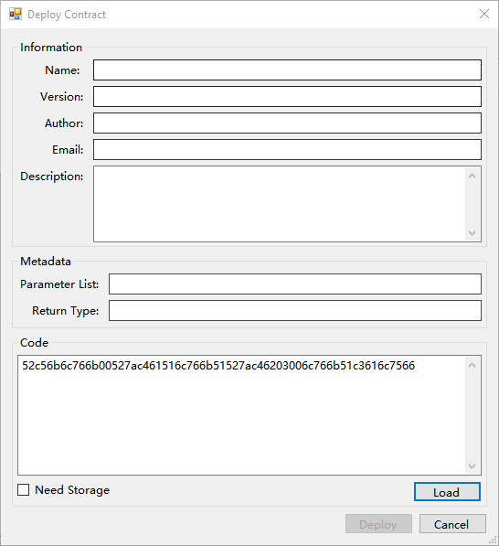
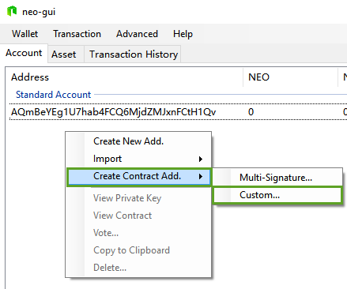
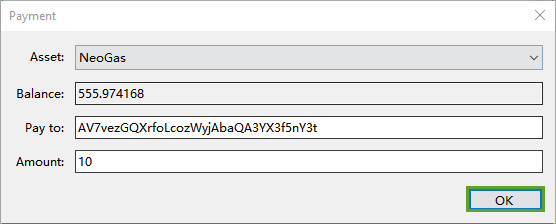

# Verification Contract Tutorial

When transferring assets out of a smart contract verification account, the consensus nodes execute the contract when validating the transaction. If the contract validation is successful (returns the result `true`), then the transaction is confirmed. Until the result `true` is received, the transaction will have status unconfirmed. 

This tutorial is based on Visual Studio 2017. Ensure that your Visual Studio is upgraded to the 2017 version. Additionally, this tutorial is based on the demo of Smart Contract 2.7.4. You need to download the latest client [NEO-GUI](https://github.com/neo-project/neo-gui/releases) from GitHub and run the [test net](../../network/testnet.md).

## Compiling a contract script

First of all, refer to [Developing a contract](../gettingstarted/develop.md) to compile a smart contract file Test.avm using the following code. 

```c#
using Neo.SmartContract.Framework;
using Neo.SmartContract.Framework.Services.Neo;
using Neo.SmartContract.Framework.Services.System;
namespace Neo.SmartContract
{
    public class Test : SmartContract
    {
        public static bool Main(byte[] signature)
        {
            return true;
        }
    }
}
```

## Creating a wallet

In the NEO-GUI client, click `Wallet` -> `New Wallet` Database to create a new wallet, as shown below: 


## Obtaining the contract script

You can choose one of the following ways to obtain the contract script:

- Use the following C# code to read it directly from the `.avm` file:

```c#
byte[] bytes = System.IO.File.ReadAllBytes("Test.avm");
for (int i = 0; i < bytes.Length; i++)
    Console.Write(bytes[i].ToString("x2"));
```

You can get the contract script (Test.avm binary data) of Test.avm is: 52c56b6c766b00527ac461516c766b51527ac46203006c766b51c3616c7566

- Use NEO-GUI to obtain the script:
  1. Click  `Advanced`-> `Deploy Contract`
  2. click the `Load` button on the bottom right corner. Choose the `Test.avm` file generated earlier.
  3.  Copy the contract script displayed in the `Code` box, as shown below.



## Creating a contract address

1. After creating your own wallet, right-click on the address area and select `Create Contract Add` -> `Custom` to create a contract address with the contract script generated before:

   

2. In the Import Custom Contract dialog, specify the following:

   1. Parameter List: Because our contract has a parameter for signature, you should fill in `00`. For details, refer to [Parameter](../deploy/Parameter.md)),
   2. Script: enter the contract script copied from previous step.
   3. Private Key: Optional. When the contract needs to be signed, specify the private key used for signing.

3. After clicking `OK`, the smart contract verification account is created successfully.

## Testing

The following is a test of the smart contract authentication account. The test method is to first transfer some assets to the contract authentication account, and then transfer it out.

> [!Note]
>
> In order to ensure the accuracy of the test, do not have any other assets in the wallet. Otherwise you may not know whether the asset was transferred from the standard account or transferred from the contract account, unless you understand the client's change search algorithm and can confirm that the transaction is transferred from the smart contract address.


### Transfer asset to contract address

Transfer a set amount of assets into your contract account:



### Transfer contract assets

Transfer assets out from your smart contract account:


### Conclusion

The balance of the assets in the client is the sum of the balance in the standard account and the balance in the contract address, that is, assets of all addresses combined. Whether or not you can use the assets in the contract address depends on the result of the smart contract execution, if the contract execution is successful (the result is `true`) then the asset can be transferred out, otherwise it cannot be transferred.