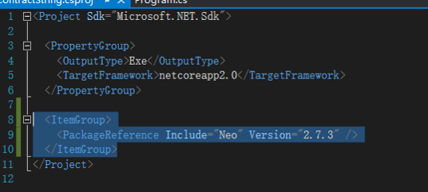
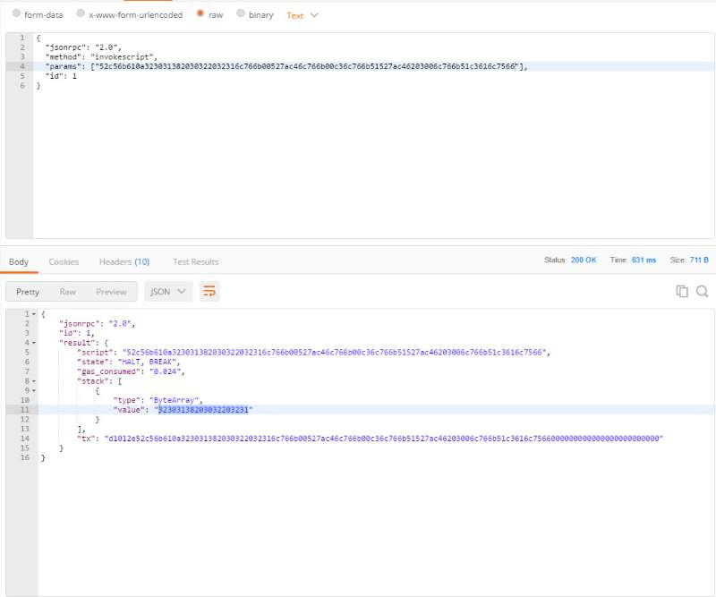
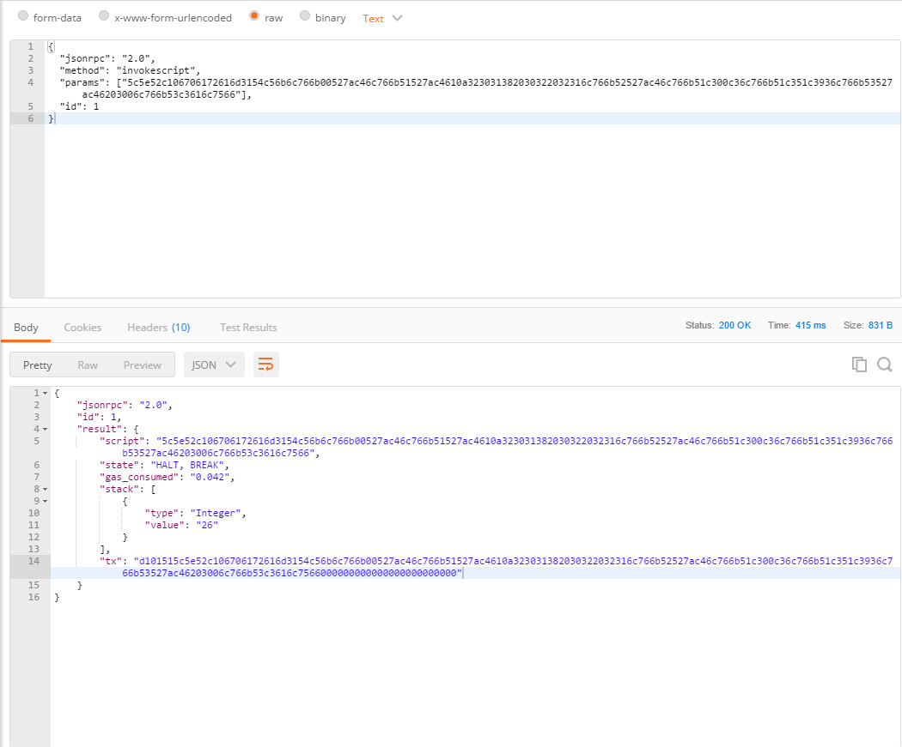

# Testing

You can use the [invokeScript](../reference/rpc/latest-version/api/invokescript.md) method provided by NEO-CLI for testing.

### Testing tool

A test is initiated by a POST request. This section we use a common POST tool POSTMAN to do the  testing. You can write a POST tool for testing as well. 

After compiling your smart contract and getting the related script hash, you can use POSTMAN to test by following these steps:

1. Configure the CLI address. Select POST in the list and enter the RPC interface address of NEO-CLI.

2. Select **raw** and **JSON**, and configure as follows：

   ```
   {
    "jsonrpc":"2.0",
    "method":"invokescript",
    "params":["03230fa0"],
    "id":1
   }
   ```

   Replace the string in `params` with the script hash of the smart contract to test. Click **Send** to start a testing. See the figure below:

   

###  Example 1 - Testing a contract without parameters

1. Write the following code and save the generated .avm file as  `d:\\1.avm`.

    ```c#
    public class Test01 : SmartContract
    {
        public static object Main()
        {
            var magicstr = "Hello, World!";
            return magicstr;
        }
    }
    ```


2. Create an netcore project and import the NEO project. 

   

   Write the following code to obtain the smart contract script hash:

   ```c#
   class Program
       {
           static void Main(string[] args)
           {
               var noparamAVM = System.IO.File.ReadAllBytes("d:\\1.avm");
               var str = Neo.Helper.ToHexString(noparamAVM);
               Console.WriteLine("AVM=" + str);
               Console.ReadLine();
           }
   }
   ```

   After running above code you can get the contract script:       “52c56b6c766b00527ac461516c766b51527ac46203006c766b51c3616c7566”.

3. Use postman to test, as shown below:

   

"state": The value "HALT, BREAK" indicates the test is successful. 

Stack is the value left on the Stack, which is the bytearray corresponding to the string "Hello, World!".

###  Example 2 - Testing a contract with parameters

1. Write the following code and save the generated .avm file as `d:\\2.avm`。

   ```c#
   public class Test01 : SmartContract
   {
       public static object Main(string param1,int[] value)
       {
             var magicstr = "2018 02 21";
             return value[0]+value[1];
       }
   }
   ```


2. Write the following code for testing:

   ```c#
    static void Main(string[] args)
           {
               var noparamAVM = System.IO.File.ReadAllBytes("d:\\2.avm");
               var str = Neo.Helper.ToHexString(noparamAVM);

               Neo.VM.ScriptBuilder sb = new Neo.VM.ScriptBuilder();
               sb.EmitPush(12);
               sb.EmitPush(14);
               sb.EmitPush(2);
               sb.Emit(Neo.VM.OpCode.PACK);
               sb.EmitPush("param1");
               var _params = sb.ToArray();
               var str2 = Neo.Helper.ToHexString(_params);

               Console.WriteLine("AVM=" + str2 + str);
               Console.ReadLine();
           }
   ```

3. Use PostMan to test:

   


### Example 3 - Testing a contract deployed on the blockchain

Majority of steps are similar. Refer to the first two examples.

The following is the code for testing：

```c#
static void Main(string[] args)
{
     //var noparamAVM = System.IO.File.ReadAllBytes("d:\\2.avm");
     //var str = Neo.Helper.ToHexString(noparamAVM);
     Neo.VM.ScriptBuilder sb = new Neo.VM.ScriptBuilder();
     sb.EmitPush(12);
     sb.EmitPush(14);
     sb.EmitPush(2);
     sb.Emit(Neo.VM.OpCode.PACK);
     sb.EmitPush("param1");
     //To call the deployed contract, add EmitAppCall at the end
     var addr = Neo.UInt160.Parse("0x10ad2338f972e90406fd2ebea9a60f38f4aebd53");
     sb.EmitAppCall(addr.ToArray());
     var _params = sb.ToArray();
     var str2 = Neo.Helper.ToHexString(_params);
     Console.WriteLine("AVM=" + str2);
     Console.ReadLine();
}
```

