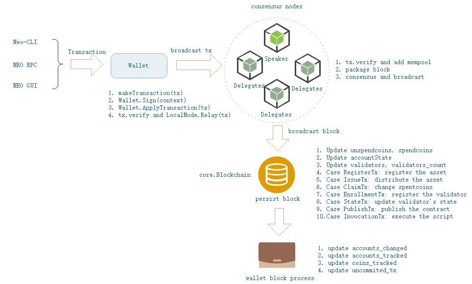
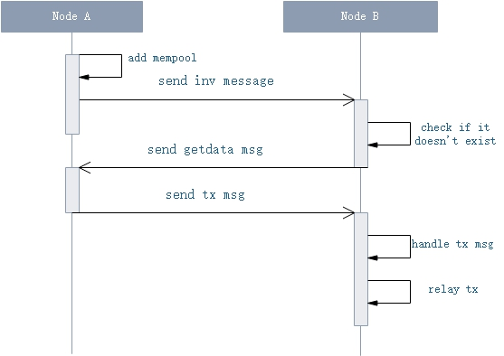
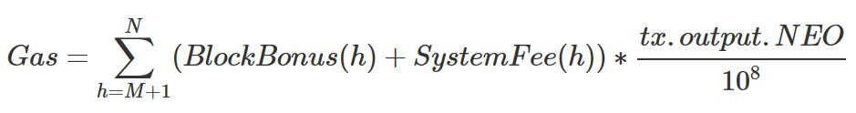

# Transaction Execution

Transaction is the only designed method for interaction within block chain network. Actions like registering and transferring asset, deploying and invoking smart contract, etc, are all processed based on transactions in NEO.

Transactions in NEO are similiar to the design in Bitcoin, including 3 important parts: input, output and scripts. These items stand for asset income, outflow and verification for UTXO (Unspent Transaction Output). The input-output combination is the basis of asset flow's chain structure.

## General Process

[](../images/tx_execution/tx_flow_graph.jpg)

A transaction is created using NEO-CLI, NEO-GUI or RPC requests. Fulfilled transaction data is signed, and then broadcasted over the whole network.

Consensus nodes will verify this new transaction and put it into memory pool upon receiving. A specified speaker node will pack the transaction into a new block. Finally, this transaction is processed over the whole network after new block is broadcasted. The overall process is briefly shown as follows:

[](../images/tx_execution/tx_process_flow_en.jpg)

1. Transaction construction: a user creates a transaction

2. Transaction signing: sign the transaction and verify transaction's inputs

3. Transaction broadcasting: broadcast the transaction over the whole network

4. Transaction packing: pack the transaction into a new block by the consensus speaker

5. Transaction processing: the new block is broadcasted and processed over the whole network

### Transaction construction

Transaction can be constructed via NEO-CLI, NEO-GUI or RPC requests, and completed by wallet.

1. Via NEO-CLI commands

   ```bash
   send <id|alias> <address> <value>|all [fee=0]
   ```

   where
   - id|alias：asset id or alias
   - address：receiver's address
   - value: transfering amount or `all` for the whole amount
   - fee：transfer charge, default value = 0

2. Via NEO-RPC calling

   - sendfrom: transferring from a specified address to another specified address
   
   - sendtoaddress: transferring to a specified address
   
   - sendmany：bulk transferring command, can specify the change address
   
   For detailed information, refer to[API Reference](../../reference/rpc/latest-version/api.md). 

3. Via NEO-GUI
  
   For detailed information can be found at [NEO GUI Transactions](../../node/gui/transc.md)。

Transaction construction interface in wallet:

```c#
public Transaction MakeTransaction(List<TransactionAttribute> attributes, IEnumerable<TransferOutput> outputs, UInt160 from, UInt160 change_address, Fixed8 fee);
```

where, 
   - attributes: transaction attributes
   - outputs: transferring list
   - from: transferring payer
   - change_address: address to whom small change is sent to
   - fee: system fee

**Transaction construction steps by wallet**:

1. If non-Global and NEP-5 asset is involved, `transfer` function of `InvocationTransaction` is used for asset transferring.

2. Compute overall GAS consumption，including network fee and system fee.

3. Automatically complete UTXO (Unspent Transaction Output) needed by inputs

    1. Group outputs with <assetId, amount>

    2. Compute the minimum needed UTXO for each asset. Transferring will fail if balance is not enough.

        1. If input account is assigned, compute the minimum available UTXO under this account.

        2. Otherwise, search for the minimum available UTXO from all unlocked and non-watch only accounts within wallet.

4. If small change exists, create corresponding output.

### Signing verification

As mentioned in previous chapters, an account address, actually stands for a piece of `OpCode.CHECKSIG` or `OpCode.CHECKMULTISIG`[contract code](./wallets.md#3_address), and signature parameters are needed upon execution. A classic UTXO transferring transaction is actually a piece of script that unlocks input address. Successfully unlocking all inputs means transaction is successfully accomplished. Upon NEO transaction's verification, corresponding scripts are required as well. Therefore, corresponding script parameters, such as transaction signature parameters, are needed for script execution. These parameters as well as related scripts are eventually encapsulated into transaction's [Witness](./blockchain/transaction.md#witness) list.

Signing a transaction is actually, adding address scripts' signature parameters, to construct completed executable witness. The detailed steps are as follows:

**Signature Steps**：

1. Encapsulate the transaction to `ContractParametersContext` object (`ContractParametersContext` encapsulates signature verification objects and is responsible for adding contract script parameters and contructing completed witness).

2. Get corresponding account for every ScriptHash of transaction scripts to be verified. Skip if corresponding account is null or doesn't have key pair.

3. Use the key pair to sign unsigned serialized data of transaction, with `ECDsa` method.

4. Add signature parameters to the corresponding position in the parameter list as follows:

    1. If input script is multi-signature, construct corresponding `ContextItem` object according to input script contract (`ContextItem` is an encapsultion of script contract parameters).
      
        1. Check the required address public keys in address script byte code. If signing address is not included, signature process fails.

        2. Save the signature.

        3. If least signature amount is satisfied, insert signature parameters according to the order-preserving mapping relationship (If address A is ahead of address B in script, then signature parameters of A should be ahead of that of B) of signature-related public keys within script (In the case of multiple signatures, more addresses are required for signing, to supplement the signature parameters).

    2. Otherwise, check if there is only one 0x00 (which stands for ContractParameterType.Signature) in contract.ParameterList:

        1. If no one exists, return false.

        2. If multiple ones exist, throw exception.
        
        3. contract.Parameters[index] = signature.

5. If all script parameters are completed, so is the transaction's witness list (Need to sign other corresponding account addresses and supplement signature parameters in case of multi-signature).

**Transaction Verification**

1. **Legality Verification**

   1. Whether duplicated referrences exist in any transaction input.

   2. Whether any transaction input is double-spent.

   3. Whether asset exists or has expired.

   4. Whether transferring amont is correct, and whether the input amount and the output amount are correct.
     
       1. If transferring fee exists, input.GAS > output.GAS

       2. In case of extracting GAS from NEO, input.GAS < output.GAS

       3. In case of distributing assets, input.Asset < output. Asset

   5. Whether asset type suits amount. Asset increasing scenarios can only be MinerTransaction/ClaimTransaction + GAS, or IssueTransaction + non-GAS assets.

   6. Whether transaction transferring fee is enough

   7. Whether transaction attributes are proper.
   
      1. If transaction attributes include `TransactionAttributeUsage.ECDH02` or `TransactionAttributeUsage.ECDH03`, verification fails.

2. **Transaction script verification**

   1. Obtain hash list of transaction script to be verified, including following script:

      1. scriptHash of output within transactions of input, unlocking UTXO.

      2. The payee address scripthash of special assets which have flag `AssetType.DutyFlag` within output.

      3. Attribute whose usage is `TransactionAttributeUsage.Script` in Attributes.

   2. Get a list of witnesses for the transaction. If the witness corresponding to the script hash does not exist, then the hash is the address of the script. Then creates a temporary Opt.APPCALL hash script.

   3. Load each verification script respectively and execute the script within NVM. If it returns false, verification fails.

Occasions where transaction verification is needed:

1. When a node receives a transaction.

2. When a node creates / relays a transaction.

3. When a node verifies transactions after receiving a new generated block.

4. When a node verifies transactions during consensus process.

> [!NOTE]
> 
> - Provide parameters for scripts that need to be verified. Then execute the script in NVM. If Script passes verification then true is returned.
> - Every address is a code fragment with `OptCode.CHECKSIG`, so signature parameters are required upon execution. Similarly, multi-signed address uses `OptCode.CHECKMULTISIG` method with specified quantity of signature parameters.
> - Every to-be-verified script within transactions contains tx.output.scriptHash (payee's address script of input transaction) pointed by input. This ensures only corresponding wallet is able to spend this UTXO.
> - For customised scripthash, need to provide parameters accordingly beforehand for verification.

### Broadcasting

The node where the wallet is located, will broadcast the transaction through the P2P network.

[](../images/tx_execution/tx_p2p_flow.jpg)

**Broadcasting Steps**：

1. If consensus module is started by local node, it runs [New transaction event in consensus module](../concept/consensus/consensus_protocol.md#6_tx_handler).

2. Local node will verify the transaction and add it into memory pool before broadcasting:

    1. Verification fails if the transaction is `MinerTransaction`.

    2. Verification fails if the transaction already exists in memory pool or blockchain.

    3. Transaction checking, including legality checking and verification script execution.

    4. Load [plug-in](https://github.com/neo-project/neo-plugins/blob/master/SimplePolicy/SimplePolicyPlugin.cs#L18) to do customized filtering.

    5. Add the transaction into memory pool if the above verification passes.

3. Local node sends `inv` message along with transaction's hash data.

4. Will do nothing if remote node has already received the data of the hash, or has received the same inv message repeatedly in a short period. Otherwise proceed to next step.

5. Remote node broadcast `getdata` message along with hash data saved in the `inv` message.

6. Local node will send `tx` message along with transaction data upon receiving `getdata` message.

7. Remote node will go to step 1 and start relaying process upon receiving transaction data.

### Transaction Package

During consensus process, the Speaker raise a proposal about packing transactions, and finally broadcast new block to network.

1. The Speaker takes out all transactions in memory pool and processes filtering actions defined in plug-in.

2. The Speaker encapsulates transactions into a new created proposal block and raises consensus voting.

3. If more than `N-f` nodes vote for the new block, then the new block will be generated and broadcasted.

### Transaction Processing

The node will verify and persist new blocks upon receiving. Transaction processing methods varies with transaction types, i.e. voting transaction, contract execution transaction, asset registration transaction, etc.

**Block processing in Core.Blockchain**

Transaction processing method in block persist process:

1. In asset transferring cases, it updates asset changes for corresponding accounts.

2. In validator voting case, it updates validators and validators_count.

3. Then it updates UTXO, and updates output records whose state is spent and unclaimed.

4. In case of `RegisterTransaction`, it records new registered asset.

5. In case of `IssueTransaction`, it updates asset's total circulation record.

6. In case of `ClaimTransaction`, it updates output records whose state is spent and unclaimed.

7. In case of `EnrollmentTransaction`, it updates validator record.

8. In case of `StateTransaction`, it handles votes or validator enrollment according to transaction type, and it update validators & validators_count.

9. In case of `PublishTransaction`, it creates new smart contract.

10. In case of `InvocationTransaction`, it runs script or smart contract.

11. Delete accounts if it is neither frozen nor being a validator and its balance of all assets are all 0.

12. After all these processes, it persists the data.

**BLock processing by Wallet**

Wallet starts a thread listening to new blocks. It will updates transaction status, unconfirmed transaction list and account data according to asset changes as follows:

1. Outputs processing, renew corresponding transaction status and account changes.

2. Intputs processing, remove tracked addresses and transactions.

3. Remove ClaimTransactions, track addresses and transactions.

4. Trigger asset changing event.

5. Remove confirmed new transactions from unconfirmed transaction list.

## Processing special transactions

### Common attributes

All transaction types are inherited from type `Neo.Core.Transaction`. Shared functions and attributes are defined in this Type:

- Transaction attributes

Every transaction has an attribute list and maximum attribute amount is 16. Transaction type (as shown above), version (default value = 1), etc.

- Transaction functions

Input / output list, transaction verification script, Witness list, Network / System Fee, transaction references, GetScriptHashesForVerifying，GetTransactionResults，Transaction verification, etc.

- Transaction IO operations

ReflectionCache, Size, Serialize / Deserialize, etc

- TransactionAttribute

The `TransactionAttribute` is a member variable of Transaction, which stands for transaction's extra attributes. It's data structure is as follows:

| Size | Name | Type | Description |
|---|-------|------|------|
| 1 | Usage | TransactionAttributeUsage | Specified transaction attribute's usage   |
| 0\|1 | length | uint8 | data length (optional) |
| ? | Data | byte[length] | external data for specified usage |

All types of TransactionAttributeUsage is shown as follows：

| Name | Value | Description |
|-------|-----|----|
| ContractHash | 0x00 | Hash of external contract |
| ECDH02 | 0x02 | Public key used for ECDH private key exchange, first byte of this public key is 0x02 |
| ECDH03 | 0x03 | Public key used for ECDH private key exchange, first byte of this public key is 0x03 |
| Script | 0x20 | Used for extra verification of transaction, i.e. stock transferring, payee's script hash, etc |
| Vote | 0x30 | Voting |
| DescriptionUrl | 0x81 | External description URL |
| Description | 0x90 | Brief description |
| Hash1 - Hash15 | 0xa1-0xaf | Customized hash value |
| Remark-Remark15 | 0xf0-0xff | Remarks |

Currently two kinds of TransactionAttributeUsage are in use: TransactionAttributeUsage.Script and TransactionAttributeUsage.Remark, which are both used by InvocationTransaction. InvocationTransaction is used for asset registration, contract publishing, and it can also be used for transferring. In short, TransactionAttribute is used to store extra information.

### MinerTransaction

| Size | Name | Type | Description |
| ---- | ---- | ---- | ----- |
| - | - | - | fields of common Transaction |
| 4 | Nonce | uint | In genesis block, the nonce value is 2083236893,<br/> In other cases, nonce value is randomly generated. |
| - | - | - | fields of common Transaction |

Special transaction used for distributing network fee and can not be created by a user. The first MinerTransaction is created by system in the genesis block. After that it is created by speaker to distribute network fee in new created block.

**Creating Transaction**

1. On consensus step, speaker filters and sorts transactions in memory pool.

2. Speaker computes overall network fee of trasactions to be encapsulated, as the output amount of MinerTransaction.

3. Set the receiving address of MinerTransaction's output to current speaker's address. Other fields such as inputs, attributes, witnesses would be left unset. As MinerTransaction is a special transaction, the sum of input and the sum of output is different.

4. Encapsulte the created MinerTransaction above and other transactions into a consensus proposal block, then broadcast it.

Other processing steps are the same with a basic transaction.

### RegisterTransaction (Deprecated)

| Size | Name | Type | Description |
|----|-----|------|------|
|  -  | - | - | fields of common Transaction |
| 1 | AssetType | byte | asset's type |
| ? | Name | string | assets's name |
| 8 | Amount | Fixed8 | asset's overall amount |
| 1 | Precision | byte | asset's precision |
| ? | Owner | ECPoint | public key of asset's owner |
| 20 | Admin | UInt160 | administrator's address script hash |
|  -  | - | - | fields of common Transaction |

Asset registration transaction. System registered two kinds of assets with RegisterTransaction in Genesis Block: NEO (or AntShare) and NEOGas (or AntCoin / GAS). RegisterTransaction is not utilized in current system. InvocationTransaction is actually used in asset registration in GUI.

The 'Amount' field is distribution amount, it has two modes:

   1. **Limited mode**: If amount is above 0, the maximum distribution amount is set to this value and cannot be modified (The stock asset type may support amount increasing in future, i.e. based on company signature or certain proportion of stockholder's signatures).

   2. **Unlimited mode**：If amount = -1, the asset can be issued unlimitedly by token creator. This mode has maximum freedom but minimum credibility.

Other processing steps are the same with a basic transaction.

### IssueTransaction

Special transaction to issue assets. Assets can be issued by asset creator as long as its overall amount does not overpass the specified limit. Issued asset can be used in a transaction. Asset issuing consumes an amount of GAS as system fee.

> [!NOTE]
> 
> - If version >= 1, system fee is 0.
> - If the assset type in output list is NEO or GAS, system fee is 0. Otherwise it is 500 GAS as defined in `protocol.json`.

**Transaction Verification**

1. **Legality Verification**

   1. It executes common legality verification first.

   2. Then it checks the sum of asset input and output.

   3. Verification fails if the referenced input UTXO(system fee) doesn't exist.

   4. Verification fails if the asset to be issued doesn't exist.

   5. Verification fails if issued amount plus amount of this asset already issued > total amount defined.

2. **Script Verification**

    1. Issuer's hash will be verified in common script verification steps.

Other processing steps are the same as basic transaction.

### ClaimTransaction

| Size | Name | Type | Description |
|----|-------|------|------|
| - | - | - | fields of common Transaction |
| 34\*? | Claims | CoinReference[] | References of NEO UTXO which has collectable GAS |
| - | - | - | fields of common Transaction |

New GAS is obtained by NEO holder's claiming operation rather than issued automatically to NEO holder's account upon every new block. The amount of claimable GAS is related to corresponding NEO asset's start and end height. The total amount of GAS is 100 million. No new GAS will be claimable after block height reaches 46 million.

Every NEO output record has 2 status: unspent and spent. Every unclaimed GAS also has 2 status: available and unavailable. Life cycle of an NEO starts from transferring in and ends at transferring out. Its original state is unspent upon transferred in, and switches to spent when transferred out. For a NEO output record whose state is unspent, its generated GAS is unclaimable. Otherwise, when its state is spent, its generated GAS is claimable. In order to claim generated GAS, a user can switch the state of a certain NEO output record from unspent to spent by transferring it to others (or even to himself).

Therefore, claiming GAS is actually:

1. looking for a NEO output record whose status is spent but unclaimed (Such output list is maintained by system)

2. computing corresponding claimable GAS

3. transferring GAS to user's address

**Transaction creating**

1. From spentcoins (spent and unclaimed NEO output records), select output to claim as the value of `ClaimTransaction.Claims`.

2. Compute the amount of claimable GAS as `ClaimTransaction.Output.Value`.

3. Set receiving address of `ClaimTransaction.Output` as current account's address, and set inputs, attributes to be empty.

4. Sign and P2P broadcast this transaction.

Here, **the amount of GAS of an NEO tx.output** is calculated as follows:

[](../images/tx_execution/tx_claim_gas.jpg)

[](../images/tx_execution/formula_gas.jpg)

- Gas: An NEO transaction's claimable GAS amount.
- M: input transaction's block height, or start height.
- N: output transaction's height, or end height.
- `BlockBonus(h)`: Gas reward of block at height h, as shown below.
- `SystemFee(h)`: System fee of block at height h, which equals sum of fees of all transaction within this block: `amount_sysfee = block.Transactions.Sum(p => p.SystemFee)`
- `tx.output.NEO`: transaction NEO amount
- 10^8: NEO's total amount 100 million

| Cycle | Block height | Block reward GAS amount |
|------|-------------|---------------|
|  1   |  0 - (200W -1) |    8 |
|  2   |  200W ~~ (400W -1) |    7 |
|  3   |  400W ~~ (600W -1) |    6 |
|  4   |  600W ~~ (800W -1) |    5 |
|  5   |  800W ~~ (1000W -1) |    4 |
|  6   |  1000W ~~ (1200W -1) |    3 |
|  7   |  1200W ~~ (1400W -1) |    2 |
|  8~22   |  1400W ~~ (4600W -1) |    1 |
|  23~    |  4600W ~ |    0 |

> [!NOTE]
>
> Rewarded Gas of an NEO transaction, equals (block Gas reward + block system fee) * percentage of transaction NEO in the block, for all blocks within unspent height interval.

**Transaction verification**

1. **Legality Verification**
  
   1. Common legality verification.

   2. Verification fails if there exists duplicated transactions within Claims.

   3. Verification fails if there exists duplicated transactions between Claims and memory pool.

   4. Verification fails if the transaction references a non-exist Output.

   5. Verification fails if the sum of the input GAS of this claim transaction is greater than or equal to the sum of the output GAS.

   6. Verification fails if the amount of GAS calculated by the claim transaction reference is not equal to the amount of GAS declared by the claim transaction.

2. **Script Verification**

    Claimer's hash within Claims will be verified in common script verification steps.

Other processing steps are the same as basic transaction.

### EnrollmentTransaction (Deprecated)

| Size | Name | Type | Description |
|----|-------|------|------|
|  -  | - | -  | fields of common Transaction |
| ? | PublicKey | ECPoint | Validator's public key |
|  -  | - | -  | fields of common Transaction |

Special transaction to enroll to be a validator, for detailed information please refer to [Election and Voting](../concept/consensus/vote_validator.md).

### StateTransaction

| Size | Name | Type | Description |
|----|-------|------|------|
|  -  | - | -  | fields of common Transaction  |
| ?\*? | Descriptors | StateDescriptor[] | Voting information |
|  -  | - | -  | fields of common Transaction |

Descriptor type contains following information:

| Size | Name | Caption | Type | Description |
|---|-------|-------|------|------|
| 1 | Type  | Type | byte  | `0x40` represents voting, `0x48` represents application or cancellation of becoming a validator |
| ? | Key   | key value | byte[] | When Field = `Votes`: The hash of the voter address script<br>When Field = `Registered`: Store the applicant's public key |
| ? | Field | field value | byte[] | When Type = `0x40`, Field is `Votes`<br/>When Type = `0x48`, Field is `Registered` |
| ? | Value | The value | byte[] | When Type = `0x40`, Value stores the list of voting addresses<br/> When Type = `0x48`, Store the Boolean value of the validator |

Special transaction for validator application / consensus node voting. Validator candidate registration costs 1000 GAS. For detailed information, refer to [Election and Voting](../concept/consensus/vote_validator.md).

### ContractTransaction

Contract transaction is the most commonly used transaction. It's used for transferring (send command in NEO-CLI, API, and send option in NEO-GUI). Processing steps are the same as a basic transaction.

### PublishTransaction (Deprecated)

| Size | Name | Type | Description |
|----|-------|------|------|
| - | - | - | fields of common Transaction |
| ? | Script | byte[] | Contract script |
| ? | ParameterList | ContractParameterType | parameter type list |
| 1 | ReturnType | ContractParameterType | return type |
| 1 | NeedStorage | bool | whether storage is needed |
| ? | Name | string | contract name |
| ? | CodeVersion | string | contract version code |
| ? | Author | string | contract author's name |
| ? | Email | string | contract author's email address |
| ? | Description | string | contract description |
| - | - | - | fields of common Transaction |

Special transaction for smart contract publishing. Processing steps are the same as a basic transaction. Note that it is deprecated and InvocationTransaction is actually used in GUI when publishing a smart contract.

### InvocationTransaction

| Size | Name | Type | Description |
|----|-------|------|------|
|  -  | - | -  | fields of common Transaction |
| ? | Script | byte[] | Contract script |
| 8 | Gas | Fixed8 | Consumed Gas |
|  -  | - | - | fields of common Transaction |

Special transaction for smart contract invocation. With `invoke/invokefunction/invokescript` command in NEO API or NEO GUI, user can create InvocationTransaction object according to input smart contract information. Note that, InvocationTransaction is actually used for GUI when creating assets and publishing smart contracts.

| InvokeTransaction Usage | Script | Attributes | Attribute content |
|----|-------|------|------|
| Invoking smart contract | contract script | null |   |
| Publishing smart contract | Neo.Contract.Create  | null |   |
| Asset Registration | Neo.Asset.Create | not null | TransactionAttributeUsage.Script, Asset holder's address scripthash. |
| GUI transferring | NEP-5 asset: transaferring script <br/>Global asset: null  | not null | TransactionAttributeUsage.Script，transferring payee address(es) <br/> TransactionAttributeUsage.Remark, remark data |

**Transaction creating**

1. Construct corresponding execution script according to usage, and assign to `InvocationTransaction.Script`

2. Run the script above in local NVM environment to calculate consumed GAS

3. Assign `Math.max(0, GasConsumed - 10).Ceiling()` to `InvocationTransaction.Gas` as transaction's system fee. Note that system provides 10 Gas for free in each InvocationTransaction.

4. Set other transaction attributes, sign it and then broadcast it via P2P network.

**Transaction Verification**

1. **Legality verification**

    1. Verification fails if consumed Gas cannot be divided by 10^8 (In other words Gas amount must be integer format Fixed8. Decimal value is not acceptable).
  
    2. Common verification

Other processing steps are the same as a basic transaction.
