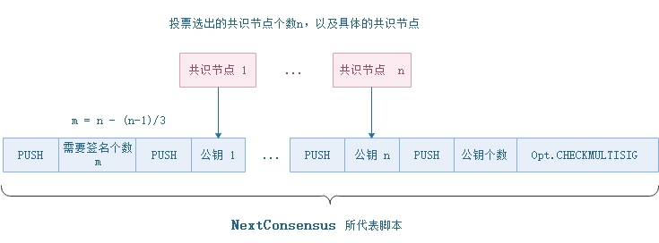

# Block

The Blockchain is a data structure. The block is composed of block header and block body. As each block has a crpytographic hash of the previous block, a timestamp, and transaction data (generally represented as a merkle tree root hash), and a chain structure is formed.

The data structure of block as following:

| Size | Field         | Name                    | Type          | Description                                                  |
| ---- | ------------- | ----------------------- | ------------- | ------------------------------------------------------------ |
| 4    | Version       | Block Version           | uint          | Block version, current is `0`                                |
| 32   | PrevHash      | Previous Hash           | UInt256       | The previous block's hash                                    |
| 32   | MerkleRoot    | Merkle Tree Root        | Uint256       | The merkle tree root of the block's transactions             |
| 8    | Timestamp     | Block Timestamp         | ulong         | The time when this block is generated                        |
| 4    | Index         | Block Index             | uint          | Block height, and the Genesis Block's index is 0             |
| ?    | ConsensusData | Nonce and speaker index | ConsensusData | It's a random value                                          |
| 20   | NextConsensus | Next Consensus Address  | UInt160       | The script hash of consensus nodes' multi-signature contract in the next round |
| ?    | Witness       | Witness                 | Witness       | The executable verification scripts                          |
| ?\*? | Transactions  | Transaction List        | Transaction[] | The payload of the block                                     |

### Block Header

The block header contains the basic information of a block and provides verification of a block. 

Block `hash` and `index` can be used to identify a block. The hash value is obtained by concatenating the first seven attributes of the block header and performing SHA256 operation twice. Normally, NEO has only one chain, and each block is confirmed by more than two-thirds of the consensus nodes, before added to the blockchain. Therefore, the height of each block is unique. Block height must be equal to the previous block height plus 1, and the Genesis Block height is 0. 

`Timestamp` is the bock's time stamp, must be bigger than the previous one.The invternal between two blocks is about 15 seconds, and is set by the variable `MillisecondsPerBlock` in the configuration file `protocol.json`.

`NextConsensus` is the hash of mulit-signature contract, which needs the signatures of more than two-thirds of the consensus nodes as parameters. The example script is shown as below. Each block, with the `NextConsensus` field, locks the nodes participating in the next round of consensus activity. In the previous round of consensus activity, the Speaker calcualted the consensus nodes of the next round based on the voting at that time, generated the multi-signature contract, and assigned the hash value of the contract to the block's `NextConsensus` field. 

`Witness` is the verification script of the block, it contains `InvocationScript` and `VerificationScript`. The `InvocationScript` provides the parameters for the `VerificationScript` to execute. 

### Block Body
The block body is a transaction list. In one round of consensus activity, the Speaker selects all the transactions in the memory pool, sort and filter by plugin, package them into a new proposal block. For more details about consensus, please read "Consensus Mechanism" section.

At present, there can be up to 512 transactions per block and 20 free transactions among them.

> [!NOTE]
>
> When a block persistent, it stores a hash list of the block's transaction, and the transaction data is stored separately for facilitate query.
