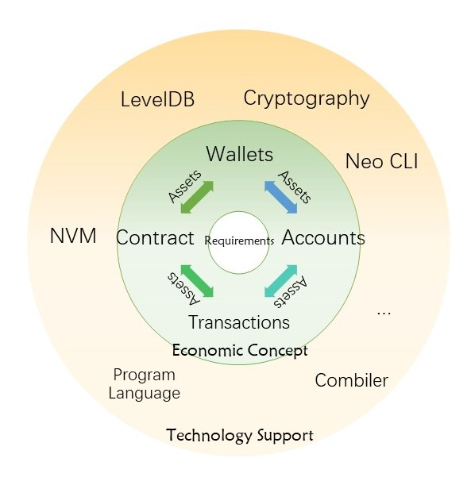


<h2>Neo Blockchain Model</h2>

&emsp;&emsp;Asset is the core of Neo system. Transaction, contract, account and wallet serve asset registration, flowing and administration. Neo CLI, compiler and virtual machine, etc, are technical means for function realization. Their function is as follows:

&emsp;&emsp;All operations are accomplished by transaction in Neo blockchain network. Assets can be transferred between different accounts through `ContractTransaction`. Users can extract deserved GAS through `ClaimTransaction`. Smart-Contracts are invoked by `InvocationTransaction`.

> [!NOTE]
> A 'ContractTransaction' is not a SmartContract, but the most common transaction type that transfer assets from accounts to accounts.

&emsp;&emsp;In Bitcoin, Script is responsible for transaction signature verification. Contracts take corresponding responsibility in NEO. Contract can be simply regarded as an upgrade of Bitcoin Script. Bitcoin Script is not Turing complete. Even though it's able to complete transaction signature verification, its functionality is limited. Bitcoin has only UTXO model and concerns only transaction itself. Writing language for Neo smart contract like C# and Python, are all Turing-complete, and can satify various needs in the real world. In case of accounting method, Bitcoin uses UTXO model; Ethereum uses a widely-used model, account balance, or balance model. In Neo system, UTXO model and account balance model both exist. UTXO model is mainly used for global assets, while account balance model is mainly used for user-published NEP-5 assets like stock, token, etc.

&emsp;&emsp;In Neo system, assets exist in the token's form. There are many kinds of assets like NEO, GAS and NEP-5. There are also equity assets like stock. All assets, including NEP-5 assets, and corresponding transaction information of a specifed address can be shown in the following steps: open a wallet in Neo Tracker (https://neotracker.io/), and choose one `address`. Address is also called "account". An address can be computed from specified private key with encryption algotithm and code switching, and used directly in transaction settlement. It can also be smart contract address used during smart contract execution. Method computing address please refer to `Address` section in `Wallet` chapter.

> [!NOTE]
> In case of dead link, please contact <feedback@neo.org>

