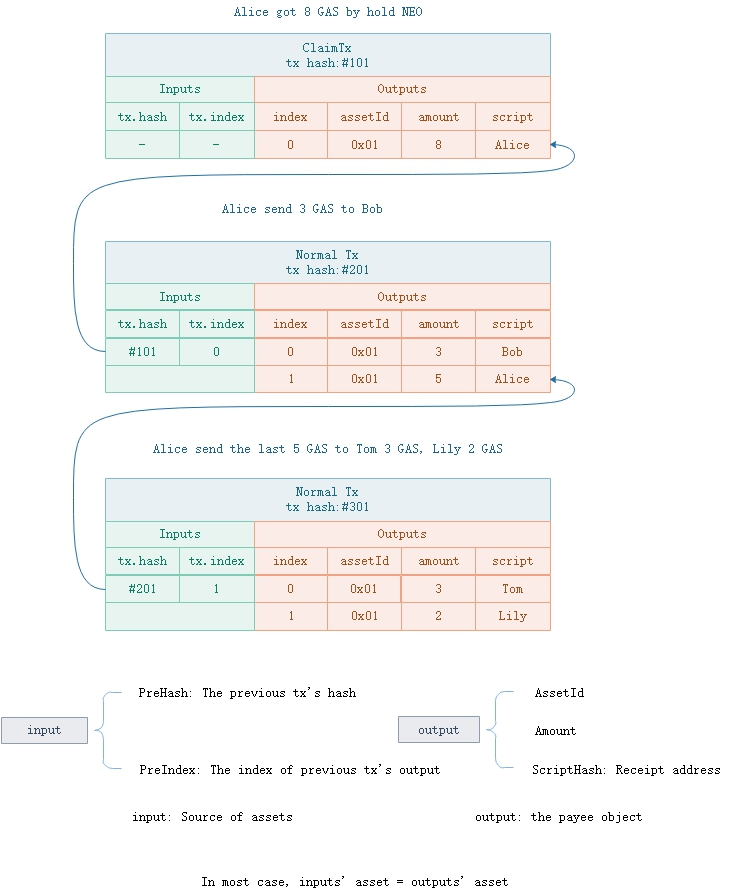
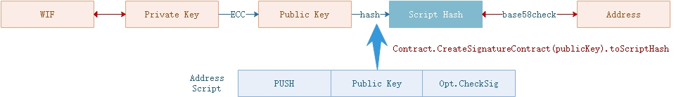

# UTXO Model

Unlike the account balance model, the UTXO (Unspent Transaction Output) model does not directly record account assets, but calculates user assets through unspent output. Each UTXO asset (such as a global asset) is an `input-output` association model: `input` specifies the source of funds, and `output` indicates the asset destination. In the picture below, Alice gets 8 GAS of share incentives from her holded NEO, which is recorded in the first output in transaction # 101. When Alice transfers 3 GAS to Bob, `input` of new transaction records the asset is 8 GAS, which is represented by output position 0 of transaction #101. Furthermore, in another transaction #201, one output points to the 3 GAS transferred to Bob, while another one to 5 GAS back to Alice herself (small change).

> [!Warning]
>
> - If a transaction contains fee, input.GAS > output.GAS
> - If a NEO holder claims GAS, input.GAS < output.GAS
> - When issuing assets, input.Asset < output.Asset

When transfering a UTXO, it actually consumes the output whose `Output.scriptHash` can be unlocked, and puts its signature parameters in the witnesses of the new transaction. Account address is actually base58check-encoded script hash. It represents a signature authentication script, as shown below.

To execute [`Op.CheckSig`](../neo_vm.md#checksig), it requires the public key and the signature. Public key parameters are already included in address script, therefore only signature parameters are required to be added in the transaction.

