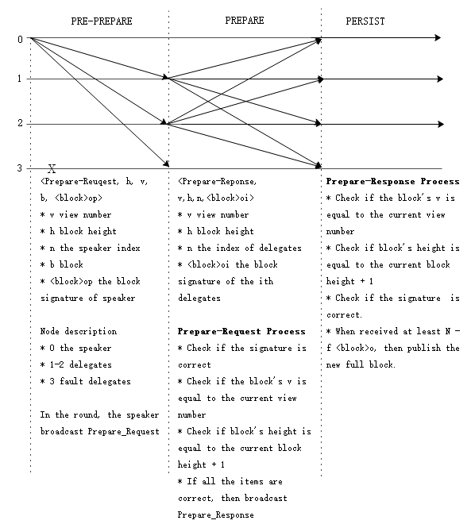
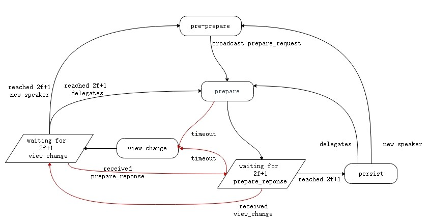

# The dBFT Algorithm

The dBFT(Delegated Byzantine Fault Tolerant) algorithm is based on PBFT(Practical Byzantine Fault Tolerance) algorithm, which is more suitable in blockchain than the latter. PBFT algorithm can solve distributed network consensus effectively, but the more nodes join consensus, the quicker the performance drops, as the time complexity is O(n2). For this reason, NEO proposes an algorithm named dBFT, which combines the characteristics of dPoS. By voting on the blockchain, it decides the name list of consensus nodes for next round, namely authorizing a few nodes to reach consensus and create new block, the other nodes will act as ordinary nodes to receive and verify blocks.

* **Consensus Node**: This node participates in the consensus activity, make a block proposal and vote.

* **Ordinary Node**: This node can transfer, make a transaction, but does not participate in the consensus activity.

* **Speaker(Unique in each round)**: The Speaker is responsible to create and transmit a proposal block to the system.

* **Delegates(Multiple)**: Delegates are responsible for voting on the proposal block. The proposal will be accepted if more than `2f+1` consensus nodes vote it. `f` is the limit of Byzantine nodes. More details is in Symbolic Definition below.

* **Validator candidate**: Nodes participating in elections. Candidate nodes for consensus activity.

* **View**: The dataset used during one consensus activity. The view number start from 0 in each round, and the number will increase when it failed to reach consensus in a round.

## Algorithm Flow

### Symbolic Definition

- N: The number of active consensus nodes.

- f：The threshold of dishonest consensus nodes (Byzantine nodes) in the system. No more than ⌊(N-1)/3⌋.

- v: The view number, start from 0.

- h：The current block height during consensus activity.

- p: The index of Speaker in array. `p = (h - v) mod N`

- i：The index of consensus node in array. 

- t: The block interval, config in `protocol.json/SecondsPerBlock`, default 15 seconds.

- 𝑏𝑙𝑜𝑐𝑘：The proposal block

- 〈𝑏𝑙𝑜𝑐𝑘〉𝜎𝑖: The block's signature of the `i`th consensus node.

### General Procedures

Assume the total number of active consensus nodes is `N`, up to `f` fault tolerance nodes. At the begin, the nodes have the same view number `v = 0`, and block height `h = current block height`. If not at the same height, it can be achieved by block synchronization between P2Ps. The process involved in the consensus algorithm is as follows:

1. A user initiate a transaction through a wallet.(to transfer or to deploy smart contract, to issue new asset, etc.)

2. The wallet signs the transaction data, and broadcasts it to the p2p network.

3. The consensus nodes receive the transaction, and put into the memory pool.

4. In a certain round of consensus, the speaker packages transactions from the memory pool into a new proposal block, then broadcasts it as 〈𝑃𝑟𝑒𝑝𝑎𝑟𝑒𝑅𝑒𝑞𝑢𝑒𝑠𝑡,ℎ,𝑣,𝑝,𝑏𝑙𝑜𝑐𝑘,〈𝑏𝑙𝑜𝑐𝑘〉𝜎𝑝〉.

   1. Load all the transactions in memory pool.

   2. Load [`IPolicyPlugin`](https://github.com/neo-project/neo-plugins) plugin, sort and filter the transactions.

   3. Calculate the network fee (`= inputs.GAS - outputs.GAS - transactions_system_fee `), and take it as the reward for the current Speaker in `MinerTransaction`.

   4. Combine the above transactions and the previous validators votes to calculate the hash of next round consensus nodes, and assign the hash of multi-signature script to `block.NextConsensus`, locking the consensus nodes of the next round.

   5. Set the timestamp of block to the current time and calculate the signature of the speaker.
   
   6. Broadcast the `PrepareRequest` messsage.

   7. Broadcast an `inv` message, attached with transaction's hash except `MinerTransaction`, to notify other nodes to synchronize the transactions in the proposal block.

5. Delegates recieve the proposal block, and verify it, then broadcast 〈𝑃𝑟𝑒𝑝𝑎𝑟𝑒𝑅𝑒𝑠𝑝𝑜𝑛𝑠𝑒,ℎ,𝑣,𝑖,〈𝑏𝑙𝑜𝑐𝑘〉𝜎𝑖〉 message.

6. Any consensus node, on receiving at least `n-f` 〈𝑏𝑙𝑜𝑐𝑘〉𝜎𝑖 , reaches a consensus and publishes the new block.

7. Any node, on receiving a new block, deletes all transactions in the block from memory pool. If the node is a consensus node, then it starts the next round consensus.

The algorithm can be divided into three stages. 

1. `PRE-PREPARE`, the speaker of this round is responsible for broadcasting `Prepare-request` message to the delegates and initiating the proposal block. 
2. `PREPARE`, on receiving `PRE-PREPARE`, the delegates broadcast `Prepare-Response` if the proposal block is verified successfully. When a consensus node receives at least `N-f` 〈𝑏𝑙𝑜𝑐𝑘〉𝜎𝑖, it enters the third stage. 
3. `PERSIST`, the node publishes a new block and enter the next consensus round. 

> [!Note]
>
> - At the very beginning of the blockchain network, `StandbyValidators` are read from the configuration file `protocol.json` as backup validators. For there isn't any enrolled validator yet.
> - Unlike ordinary block, the Genesis block is the first block in the blockchain by default, which is not published by consensus nodes. In the Genesis block, the field `NextConsensus` is set to the hash value of `StandbyValidators`, so the consensus nodes for the next block is determined.

### View Change

As the process of consensus is in an open p2p network environment, there are cases that no consensus can be reached. For example a key consensus message is delayed in the network, or a dishonest node sends illegal data, etc. The consensus nodes can initiate a `ChangeView` proposal in such situations. They will enter a new view with new speaker, and restart consensus, after receiving at least `N-f` `ChangeView` messages with the same view number.

The View-Change process will be initiated, when one consensus node could not reach consensus in 2v+1⋅ 𝑡  time interval, or it received an illegal proposal(invalid transactions).

1. Given 𝑘 = 1, 𝑣𝑘 = 𝑣 + 𝑘； 

2. The `𝑖`th node initiate a 〈𝐶ℎ𝑎𝑛𝑔𝑒𝑉𝑖𝑒𝑤,ℎ,𝑣,𝑖,𝑣𝑘〉 proposal.

3. When any one node received at least `N-f` `ChangeView` with the same 𝑣𝑘 from different consensus nodes, the View Change will be completed. Set 𝑣 = 𝑣𝑘 and start the consensus process.

4. If the View Change is not completed in 2𝑣𝑘 +1 ⋅ 𝑡 time interval, then increase k and back to step 2).

With the increase of k, the waiting time before another change view will increase exponentially, which can avoid frequent View Change and make the nodes reach agreement within a reasonable time. The original view `v` is still valid until the completion of View Change, avoiding unnecessary View Change due to accidental network latency.

[1] [A Byzantine Fault Tolerance Algorithm for Blockchain](http://docs.neo.org/zh-cn/basic/consensus/whitepaper.html) 
[2] [Consensus Diagram](http://docs.neo.org/zh-cn/basic/consensus/consensus.html) 
[3] [Practical Byzantine Fault Tolerance](http://pmg.csail.mit.edu/papers/osdi99.pdf) 
[4] [The Byzantine Generals Problem](https://www.microsoft.com/en-us/research/wp-content/uploads/2016/12/The-Byzantine-Generals-Problem.pdf) 
[5] [Consensus Plugin](https://github.com/neo-project/neo-plugins)

