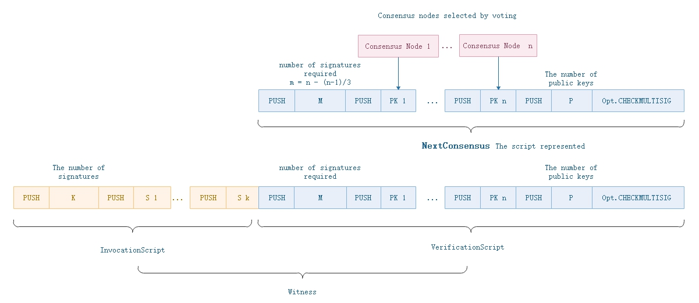

# Transaction

Transaction is the basic operation model of the whole NEO network. Wallets, smart contracts and accounts interact with NEO network through transactions. In NEO's P2P network, information is packed as `InvPayload` for transferring (Inv is abbreviation of Inventory). Different payloads have their special data, thus three types of inventory types are created. `InventoryType = 0x01` means transaction data is packed into `InvPayload`. Besides, there are block data package (`InventoryType = 0x02`) and consensus data package (`InventoryType = 0x03`).

## Structure

The basic data structure of a transaction is as following:

| Size | Field | Type | Description |
|-----|-----|------|-------|
| 1   | Type    | byte | Type of transaction |
| 1 | Version | byte | Trading version, currently 0 |
| ? | - | - | Data specific to transaction types |
| ?*? | Attributes | tx_attr[] | Additional features that the transaction has |
| 34*? | Inputs | tx_in[] | Input |
| 60 * ? | Outputs | tx_out[] | Output |
| ?\*? | Scripts | Witness[] | List of scripts used to validate the transaction |

### Input

Input specifies the source of assets. There can be zero or multiple Inputs in each transaction. The Input of `MinerTransaction` is empty. The data structure of Input is shown as follows: 

| Size | Field | Type | Description |
|---|-------|------|------|
| 32 | PrevHash | UInt256 | Previous transaction's hash |
| 2 | PrevIndex | ushort | Previous transaction's indexPrevious transaction's index |

The combination of `PrevHash` and `PrevIndex` are called a coin reference. It reference to a previous Unspent Transaction Output(UTXO). For more details, read "UTXO" section.

### Output

Each transaction can have up to 65536 outputs. An output represents the transfer result of any asset. The data structure of output is shown as follows:

| Size | Field | Type | Description |
|---|-------|------|------|
| 32 | AssetId | UIntBase | Asset id |
| ?  | Value | BigDecimal | Value |
| 20 | ScriptHash | UInt160 | Address of remittee |

### Attribute

| Size | Field | Type | Description |
|---|-------|------|------|
| 1 | Usage | byte | Usage |
| 0\|1 | length | uint8 | Length of data (It will be omitted in specific circumstances) |
| ? | Data | byte[length] | External data |

TransactionAttributeUsage, each transaction attribute has different usages:

| Field | Value | Description |
|-------|-----|----|
| ContractHash | 0x00 | Hash value of contract |
| ECDH02 | 0x02 | 	Public key for ECDH key exchange |
| ECDH03 | 0x03 | 	Public key for ECDH key exchange |
| Script | 0x20 |Additional validation of transactions |
| Vote | 0x30 | For voting  |
| DescriptionUrl | 0x81 | Url address of description |
| Description | 0x90 | Brief description |
| Hash1 - Hash15 | 0xa1-0xaf | 	Used to store custom hash values |
| Remark-Remark15 | 0xf0-0xff | Remarks |

For ContractHash, ECDH series, Hash series, data length is fixed to 32 bytes and length field is omitted;  
For Script, data length is fixed to 20 bytes and length field is omitted;  
For DescriptionUrl, the data length must be clearly defined, and the length should not exceed 255; 
For Description, Remark series, the data length must be clearly defined, and the length should not exceed 65535.

### Witness

Before each transaction is added into a block, it needs to be digitally signed to ensure that it will not be modified during transmission. NEO uses ECDSA digital signature method. The script hash of the transaction output is the public key used for ECDSA signature. NEO does not use SegWit in Bitcoin. Each transaction contains its own `Script.Witness`, while the `Script.Witness` is actually a smart contract.

Witness is an executable verification script. The `InvocationScript` provides the parameters for the `VerificationScript` to execute.  Verification succeeds only when the script execution returns true.

| Size | Field | Type | Description |
|--|-------|------|------|
| ?  | InvocationScript | byte[] |Invocation script |
| ?  | VerificationScript | byte[] | Verification script  |

Invocation script performs stack operation instructions, provides parameters for verification script (eg, signatures). The script interpreter executes the invocation script code first, and then the verification script code.

`Block.NextConsensus` represents the script hash of multi-signature contract ([`Opt.CHECKMULTISIG`](../neo_vm.md#checkmultisig)), which needs the signatures of the consensus nodes, shown in the following figure. When executed in NVM internally, it completes the verification of signatures and public keys.

## Transaction Type

In NEO, there are 9 types of transaction.

| Type | Value  | System Fee (GAS) |  Description  |
|--------|-----|----------|----------|
| MinerTransaction | 0x00 | 0 |The first transaction of a block, used to allocate byte fees|
| RegisterTransaction | 0x40 | 10000/0 | (Deprecated) Registers assets |
| IssueTransaction | 0x01 | 500/0 |Issues assets|
| ClaimTransaction | 0x02 | 0 | Claims GAS |
| StateTransaction | 0x90 | 1000/0 |Enrolls as a validator candidate or votes for consensus nodes|
| EnrollmentTransaction | 0x20 | 1000 | (Deprecated) Enroll as validator candidate |
| ContractTransaction | 0x80 | 0 | The most commonly used transaction |
| PublishTransaction | 0xd0 | 500\*n | (Deprecated) Publishes smart contracts |
| InvocationTransaction | 0xd1 | Fees vary with execution instructions. | Invokes smart contracts |

> [!NOTE]
>
> Transaction system fee: Different transactions have different system fees. The detail is defined in the configuration file `protocol.json`. Collected system fees are distributed to NEO holders, how this is done will be explained later in the guide.
>
> Transaction network fee: `NetworkFee = tx.inputs.GAS - tx.outputs.GAS - tx.SystemFee`. In consensus activity, the network fee will be the reward for the Speaker, who packages transactions into a block. The network fee is stored in the first transaction (`MinerTransaction`) of the block. The higher the network fee is, the easier the transaction will be packaged into the new created block.

## How to use transaction

The following example of Genesis Block generation shows the usage of a transaction.

### Eg-1. Create Genesis Block

Genesis Block is the first block in the blockchain by default in hard code, and the block index is 0. NEO and GAS assets are registered in Genesis Block, and NEO asset are distributed. Note that global asset such as NEO and GAS are registered with `RegisterTransaction`, NEP5 tokens are generated through `InvocationTransaction`.

The block head of Genesis block is as follows:

| Size | Field  | Type | Value |
|----|-----|-------|------|
|  4  | Version  | uint | Version is `0` |
| 32   | PrevHash | UInt256 |  `0x0000000000000000000000000000000000000000000000000000000000000000` |
|  32  | MerkleRoot | UInt256 |`0x803ff4abe3ea6533bcc0be574efa02f83ae8fdc651c879056b0d9be336c01bf4`  |
| 4  | Timestamp  | uint | `1531667301` |
| 4   | Index  | uint | `0` |
|  8  | ConsensusData  | ulong | `2083236893`, the nonce value of the Bitcoin Genesis Block, as a respect to Bitcoin  |
| 20  | NextConsensus  | UInt160 | The script hash of consensus nodes' multi-signature contract in the next round.   |
| 1  | -- | uint8 | It's fixed as 1 |
|  ?   | Witness  | Witness | `0x51`, respresenting `OptCode.PUSHT`, always return TRUE. |
|  ?\*? | **Transactions**  | Transaction[] | It stored four txs as following. |

The first transaction of each block must be `MinerTransaction`, which is used for distribution of transaction's network fees in the block.

| Size | Field  | Type | Value  |
|----|-----|-------|------|------|
| 1 | Type    | uint8 | `0x00` |
| 1 | Version | uint8  | `0` |
| 8 | Nonce | ulong  | `2083236893` |
| ?\*? | Attributes | tx_attr[] |    Empty |
| 34\*? | Inputs | tx_in[]  | Empty |
| 60\*? | Outputs | tx_out[]  | Empty |
| ?\*? | Scripts | Witness[]  | Empty |

The second transaction is a `RegisterTransaction`, which registers NEO asset.

| Size | Field | Type | Value  |
|----|-----|-------|------|------|
| 1   | Type    | byte  | `0x40` |
| 1 | Version | byte  | `0` |
| 1 | AssetType | byte   | `0x00` |
| ? | Name | string   | The name of `NEO` |
| 8 | Amount | Fix8   | `100000000` |
| 1 | Precision | byte   | `0` |
| ? | Owner | ECPoint  |  |
| 32 | Admin | UInt160   | `0x51`.toScriptHash |
| ?\*? | Attributes | tx_attr[]  |    Empty |
| 34\*? | Inputs | tx_in[]  | Empty |
| 60\*? | Outputs | tx_out[]  | Empty |
| ?\*? | Scripts | Witness[]  | Empty |

The name of `NEO` = `[{"lang":"zh-CN","name":"小蚁股"},{"lang":"en","name":"AntShare"}]`

The third transaction is another `RegisterTransaction`, which registers GAS asset.

| Size | Field  | Type | Value  |
|----|-----|-----|------|
| 1   | Type    | byte  | `0x40` |
| 1 | Version | byte | `0` |
| 1 | AssetType | byte  | `0x01` |
| ? | Name | string   | The name of`GAS` |
| 8 | Amount | Fix8   | `100000000` |
| 1 | Precision | byte   | `8` |
| ? | Owner | ECPoint   | |
| 32 | Admin | UInt160   | `0x00`.toScriptHash, representing `OpCode.PUSHF` script |
| ?\*? | Attributes | tx_attr[]  |    Empty |
| 34\*? | Inputs | tx_in[]  | Empty |
| 60\*? | Outputs | tx_out[]  | Empty |
| ?\*? | Scripts | Witness[]  | Empty |

The name of `GAS` =  `[{"lang":"zh-CN","name":"小蚁币"},{"lang":"en","name":"AntCoin"}]`

The fourth transaction is an `IssueTransaction`, which issues NEO to contract address.

| Size | Field  | Type | Value  |
|----|-----|-------|------|------|
| 1   | Type    | byte  | `0x01` |
| 1 | Version | byte  | `0` |
| ?\*? | Attributes | tx_attr[] |    Empty |
| 34\*? | Inputs | tx_in[]  | Empty |
| 60\*? | Outputs | tx_out[] | has one output, see the below table |
| ?\*? | Scripts | Witness[]  | `0x51`, representing `OpCode.PUSHT` |

The output defines the transfer of all NEO tokens to the multi-signature contract address of the standby validators(consensus nodes). The scripts are empty, meaning that the transactions do not need to be validated because it is a Genesis block transaction.

| Size | Field  | Type | Value  |
|----|-----|-------|------|
| 1   | AssetId    | byte  | `0x00`, representing `NEO` token. |
| 8 | Value | Fix8  | `100000000` |
| 20 | ScriptHash | UInt160 |   The script hash of standby consensus nodes' multi-signature contract. |
