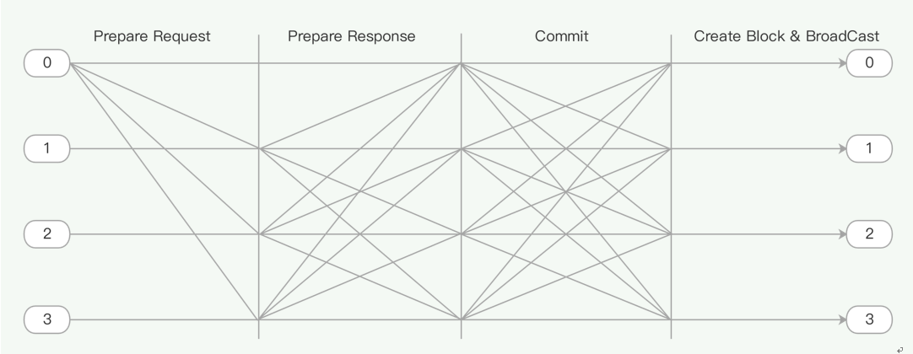
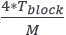
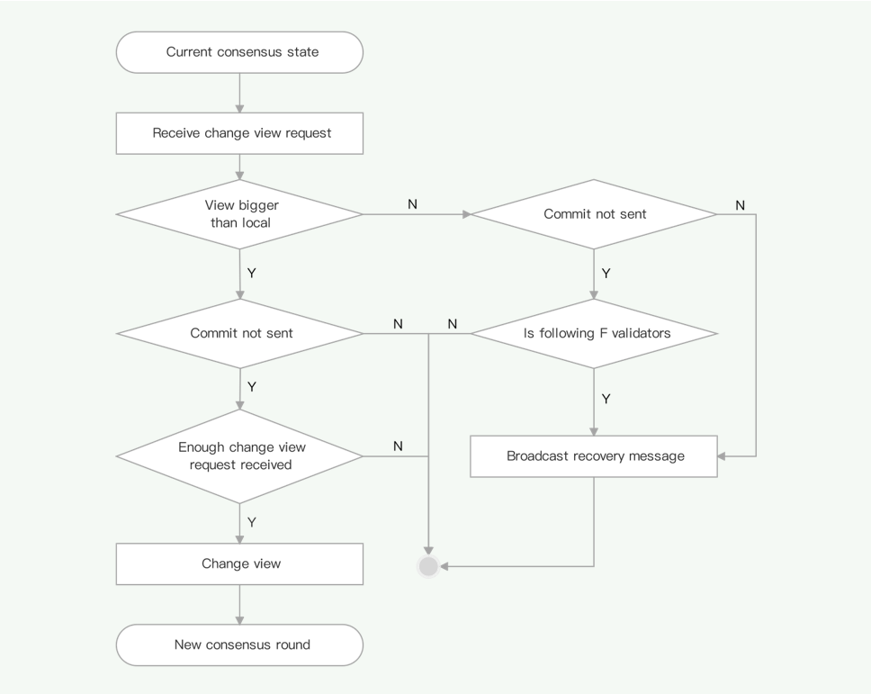
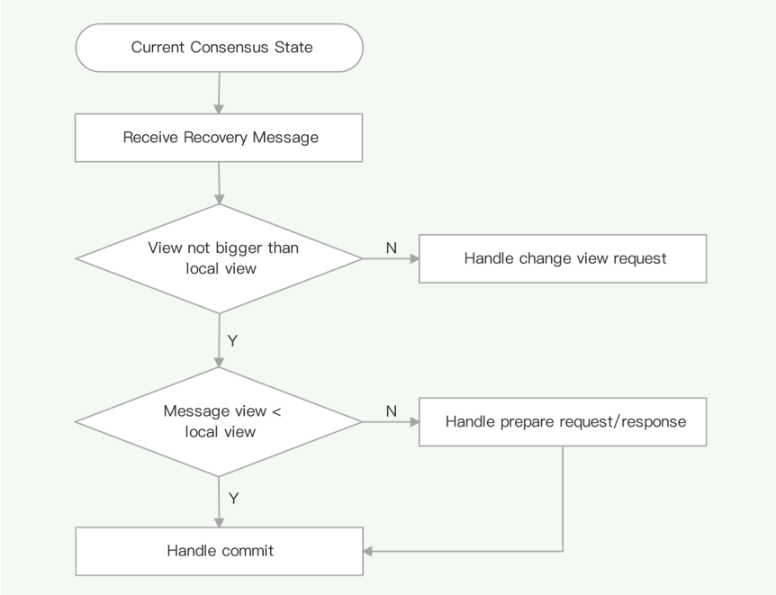

# dBFT 2.0 Algorithm

Neo proposes dBFT (delegated Byzantine Fault Tolerance) consensus algorithm based on the PBFT (Practical Byzantine Fault Tolerance) algorithm. The dBFT algorithm determines the next-consensus-round validators based on real-time blockchain voting, which effectively enhances the efficiency of the algorithm, and saves block time and transaction confirmation time. dBFT2.0, as an upgraded version, was released in March, 2019, which improves robustness and safety by introducing the 3-stage consensus mechanism as well as a recovery mechanism.

## Terms

| **Term**  | **Definition**                                               |
| --------- | ------------------------------------------------------------ |
| Consensus Node | Nodes that can propose a new block and vote for the proposed block      |
| Normal Node | Nodes that can transfer and create transactions, are also ledges, but can neither propose new blocks nor vote  |
| Speaker   | Validator in charge of creating and broadcasting a proposal block to the network |
| Delegate  | Validator responsible for voting on the block proposal       |
| Candidate | Account nominated for validator election                     |
| Validator | Account elected from candidates to take part in consensus    |
| View      | Referred to the dataset used during a round of consensus. View number *v* starts from 0 in each round and increases progressively upon consensus failure until the approval of the block proposal, and then is reset to 0. |

## Consensus Message

Six types of consensus messages are defined in dBFT2.0:

| **Message**           | **Definition**                                               |
| --------------------- | ------------------------------------------------------------ |
| Prepare Request     | Message for starting a new round of consensus                    |
| Prepare Response    | Message informing other validators that all necessary transactions have been collected for block creation |
| Commit              | Message informing other validators that enough Prepare Response messages have been collected |
| Change View Request | Message of view changing attempt                           |
| Recovery Request    | Request for consensus data synchronization                 |
| Recovery Message    | Response to Recovery Request message                         |

## Consensus Flow

### 3-Stage Consensus Flow

A round of consensus consists of 4 steps, as shown in the Figure above:

1. Speaker starts consensus by broadcasting a Prepare Request message

2. Delegates broadcast Prepare Response after receiving the Prepare Request message

3. Validators broadcast Commit after receiving enough Prepare Response messages

4. Validators produce & broadcast a new block after receiving enough Commit messages

Here we introduce two variables as follows:

       

where *N* is the number of validators.

A normal algorithm flow is shown below.

##### 1)  Initialize local consensus information

1. Initialize consensus context

2. Set the validator whose index equals  *(h - v) mod N*  as the speaker. Here h is current block height, v is the current view, and N is the number of validators

3. Set speaker's timeout to  *Tblock*  (Block time, currently 15s) and delegates' timeout to  2v+1 *Tblock

4. Broadcast the Recovery Request message to acquire the current consensus context

##### 2)  Validators listen to the network and collect transactions until timeout

##### 3)  Start consensus

- For speaker:

  1. Select transactions from memory pool according to consensus policy after *Tblock*, create and broadcast Prepare Request message with these transactions' hashes to start a new round of consensus

  2. Package and broadcast each 500 selected transactions

  3. Set timeout to (2v+1 - k(v))*Tblock, where    

- For delegates:

   - In case of receiving Prepare Request from the speaker before timeout:
   
     1. Verify the validity of the message and whether it conforms to the local consensus context

     2. Prolong local timeout by 

     3. Update local consensus context

     4. For each hash contained in the message, attempt to acquire corresponding transactions from memory pool or unverified transaction pool, and add these transactions to consensus context

     5. Ask for transactions not found in step 4 from other nodes

    - Otherwise, attempt to change view

##### 4)  Broadcast Prepare Response

- If a delegate collects all transactions required in Prepare Request before timeout:

  1. For each transaction received, in case of transaction verification failure or against consensus policy, attempt to change view, otherwise add the transaction to consensus context

  2. Broadcast Prepare Response message

  3. Prolong local timeout by 

- Otherwise, attempt to change view

##### 5)  Collect Prepare Response and broadcast Commit

- For the speaker and delegates who have received Prepare Request, if Prepare Response messages from M different delegates are received before timeout:

   - For each Prepare Response message received:

     1. Verify the validity of the message and whether it conforms to the local consensus context

     2. Prolong local timeout by 

   - Broadcast Commit message

- Otherwise, attempt to change view

##### 6) Collect Commit message and create new block

- For each validator already having all transactions required in Prepare Request message, in case of Commit messages from M different validators received:

   - For each Commit message received:

     1. Verify the validity of the message and whether it conforms to the local consensus context

     2. Prolong local timeout by 

   - Create and broadcast the new block

- Otherwise, broadcast the Recovery Message, and set the timeout to 2*Tblock

##### 7)  Go back to step 1 to start a new round of consensus.

### Change View Request

#### Triggering conditions

- If the transaction verification fails, the delegate will broadcast Change View Request attempting to replace speaker

- In case of timeout while waiting for Prepare Request or Prepare Response, the delegate will broadcast Change View Request, attempting to replace the speaker

#### Flow

1. Set the timeout to 2v+2 * Tblock 

2. If the sum of nodes with Commit sent and fault nodes (referring to the validators from which no other validator receives messages during a block time) is greater than F, broadcast Recovery Request message

3. Otherwise, broadcast Change View Request message, and check the amount of Change View Request received. If not less than M validators reach consensus upon view changing, change local view, initialize local consensus context, and determine the next round's speaker according to new view.

#### Process logic

When a validator receives Change View Request message:

1. If the message's view is not greater than the local view, this message will be handled as Recovery Request

2. Verify the validity of the message

3. Check the amount of Change View Request received. If not less than M validators reach consensus upon view changing, change the local view, initialize local consensus context, and determine next round's speaker according to new view

### Recovery Request Message

#### Triggering conditions

- Broadcast Recovery Request message upon enabling the consensus policy to update local consensus context

- Upon creating Change View Request, if there are not enough active validators (sum of nodes with Commit sent and fault nodes is greater than F), broadcast Recovery Request message to update the local consensus context

#### Process logic

Upon receiving Recovery Request, a validator will generate and broadcast Recovery Message only if the following conditions are met:

- This node has already broadcast Commit message

- This node's index belongs to the given interval:  , where j is the index of Recovery Request sender

### Recovery Message

#### Content

- Change View Request messages from no more than M delegates

- Prepare Request/Response messages

- Commit messages

#### Triggering conditions

- Upon receiving Recovery Request message, if this node has already broadcast Commit message or its index belongs to the given interval: , where j is the index of Recovery Request sender

- Upon receiving Change View Request message, if the message's view is not greater than the local view, this message is handled as Recovery Request

- In case of a timeout while waiting for Commit message, broadcast Recovery Message to resend Commit message (common in network issues)

#### Process flow

1. Verify the validity of the message and the local consensus context. If the message's view is greater than the local view, and this node has already sent Commit message, ignore this message 

2. Otherwise, if the message's view is greater than the local view, handle Change View Request messages inside

3. If the message's view equals local view:

   - Handle Prepare Request message inside

     1. If this node has neither sent nor received Prepare Request message, handle Prepare Request message inside

     2. Otherwise if this node is the speaker, broadcast Prepare Request message

   - Handle Prepare Response messages inside

4. If the message view is not greater than the local view, handle Commit messages inside

The mechanism with Change View Request, Recovery Request and Recovery Message can keep consensus safe from timeout caused by the network, abnormal nodes (malicious nodes, fault nodes, etc.) and other issues.

## Consensus Policy

Consensus policy is used in the following scenarios:

- Upon receiving transactions from other nodes, nodes will perform verification to filter out transactions against consensus policy

- Upon receiving transactions, the consensus module needs to verify whether these transactions satisfy the consensus policy, if not, it will attempt to change the view

- The Validator needs to filter transactions in its context upon enabling the consensus policy, only confirmed transactions can be added into the memory pool

- The speaker needs to select transactions from memory pool according to the consensus policy for new Prepare Request
