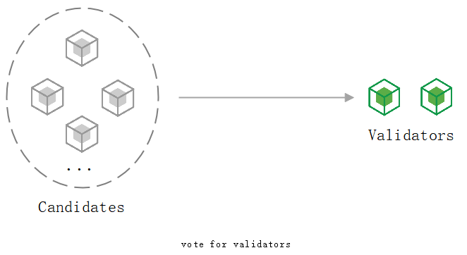
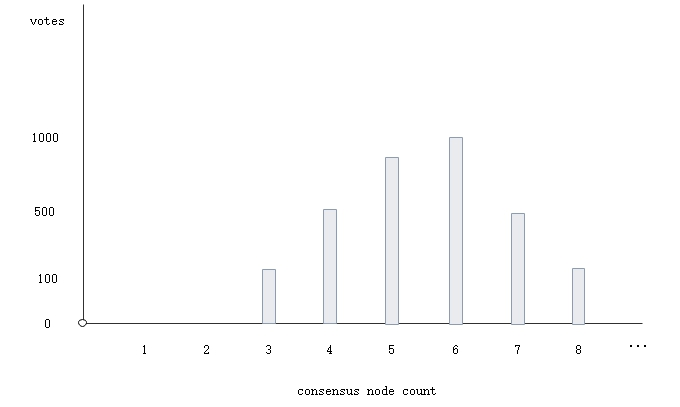
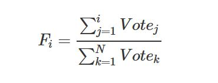
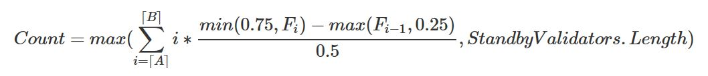
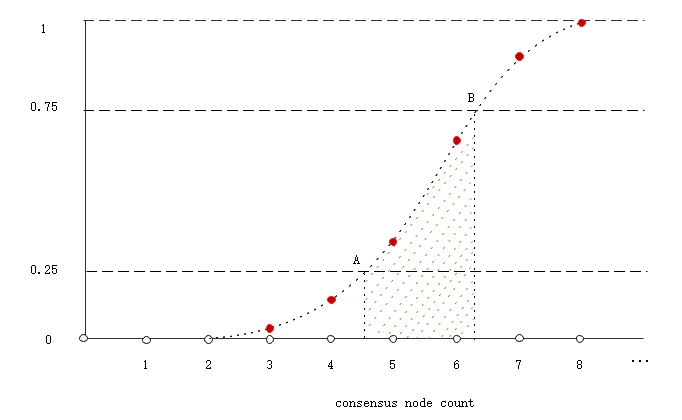

# Consensus Nodes Election

Neo is an open and transparent blockchain network where anyone who holds the NEO token can either initiate a transaction to apply for being a validator candidate or vote to decide which validator candidate can become a consensus node and the number of consensus nodes at anytime. The votes of consensus nodes are calculated by an algorithm described in this chapter. 

Voting is a dynamic and continuous process. If the NEO asset of a voter is changed, the number of votes at the previous voting address will also change, and the list of consensus nodes will change accordingly.

There are 2 steps in voting for consensus nodes: 

1. calculate the number of consensus nodes;

2. determine the specific consensus nodes.

### The number of consensus nodes

According to the voting described above, we may get a diagram of votes for the number of consensus nodes.

The following formula is to demonstrate the probability distribution function F(discrete function), in which the probability of the `i`th consensus node equals its proportion of votes.

On the probability distribution function, take the portion F ∈ [0.25, 0.75] that covers consensus nodes. Then take the expected value for these points. Compare it with the count of backup validators. Take the larger one as the final number of consensus nodes.

- `⌈A⌉` represents the first Fi >= 0.25 point

- `⌈B⌉` represents the first  Fi >= 0.75 point

- min(0.75, Fi) - max( Fi - 1, 0.25 ) is the shadow part

- `StandbyValidators` is standby validators

> [!Note]
>
> We only consider the middle part in the voting diagram, filter out too large or too small points which may have great impact on the average value.

### Consensus Nodes

In the above steps, we calcuate the number of consensus nodes as `Count`, and take validators from the candiate list ranked by votes in descending order. When candidates is not enough, it will be supplemented from `StandbyValidators`. Finally, the consensus nodes are determined.

> [!Note]
>
> Genesis Block is the first block，its `NextConsensus` is set to the script hash of standby consensus nodes' multi-signature contract.

## From Delegate to Speaker

A speaker is a consensus node who creates the next proposal block. The list of consesus nodes is obtained by the method above, and the speaker is determined by the formula `p = (h - v) mod N` in the dBFT algorithm. `h` is the height of the proposal block. `v` is view number, start from 0. `N` is the number of consensus nodes.

During the consensus phase, a speaker will send `PrepareRequest` message with `NextConsensus`, which determines the next block consensus nodes. The Speaker calculates the next round of consensus nodes by combining the transactions in the proposal block with the previous votes in blockchain, and assign the script hash of 2/3 multi-signature contract to `NextConsensus`. 
