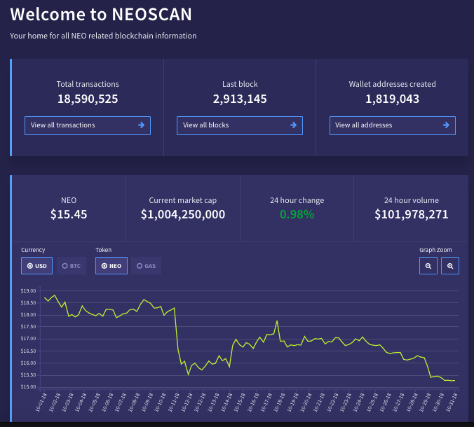
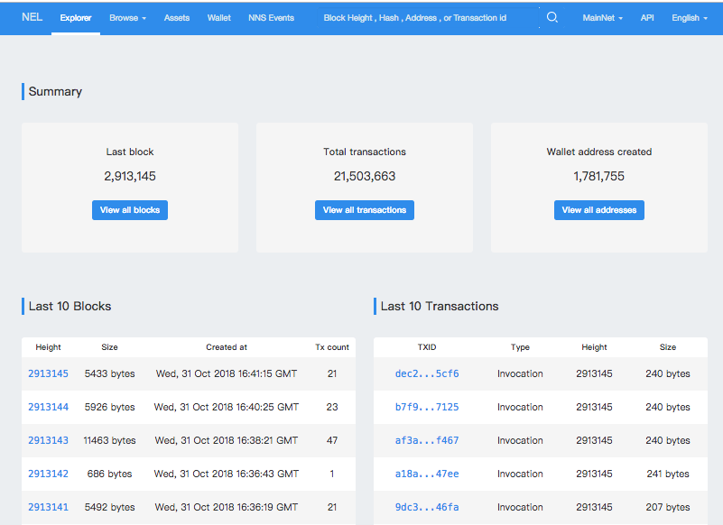
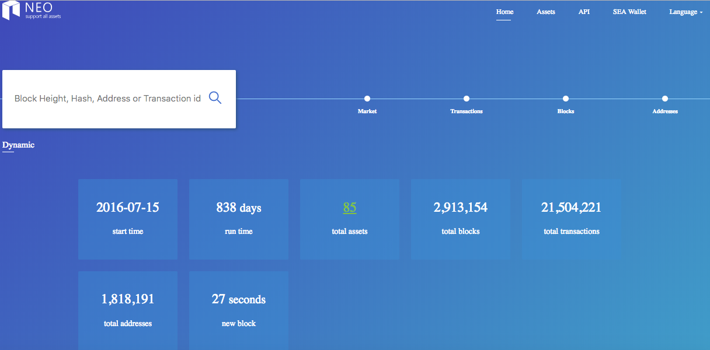
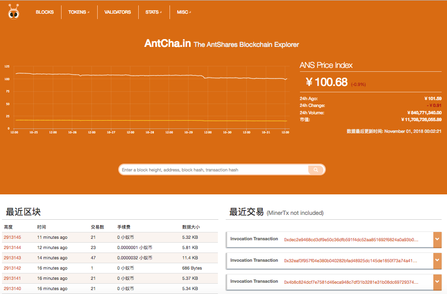

# Blockchain Explorers
In order to read information from the blockchain, without keeping a copy, is possible using the blockchain using the RPC, but for a more user-friendly experience, you can use one of the blockchain explorers available.

> [!Note]
>
> These are auxiliary tools, consider using the node RPC when possible.

## Community blockchain explorers
### [Neoscan](https://neoscan.io/)

**API Docs:** https://neoscan.io/docs/index.html  
**GitHub:** https://github.com/CityOfZion/neo-scan

### [NeoTracker](https://neotracker.io/)

**GitHub:** https://github.com/neotracker/neotracker

### [Scan](https://scan.nel.group/#mainnet)

**API Docs:** http://www.xiaoyaoji.cn/share/1H0gjTDtfk/ - Chinese only  
**GitHub:** https://github.com/NewEconoLab/NELBrowser-Web

### [StateBrowser](https://state.otcgo.cn/?idx=0)

**API Docs:**
https://otcgo.github.io/doc/  
**GitHub:** https://github.com/OTCGO/state-browser

### [Antcha.in](http://antcha.in/) - Chinese only

For more explorers, go to http://ndapp.org/ and click the `Explorer` tab.