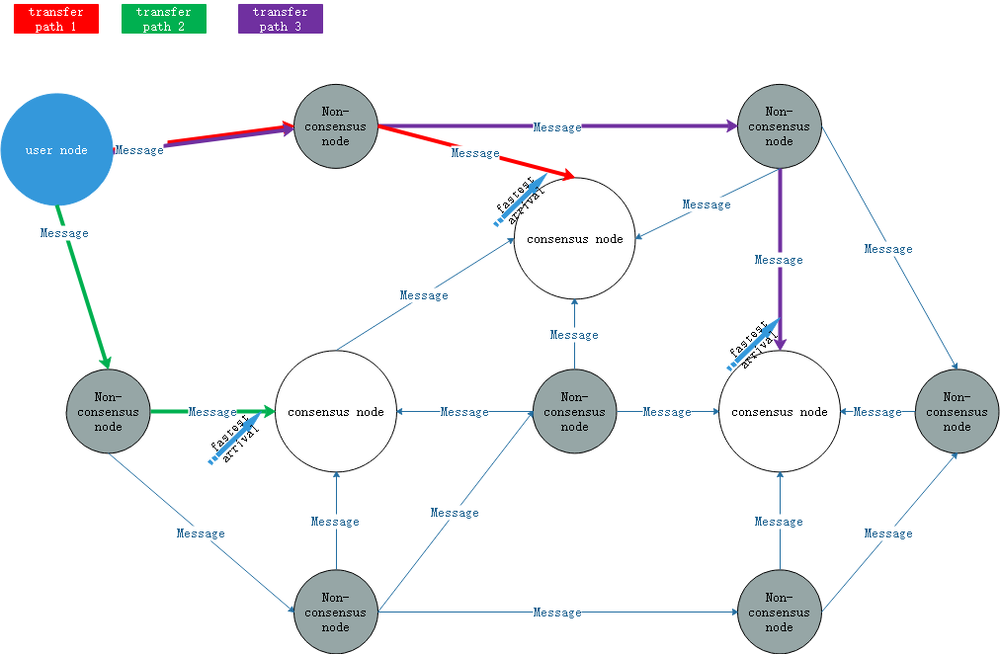

# Neo-CLI Structure

NEO is a blockchain system based on a peer-to-peer network. It provides a digital asset ledge based on the UTXO model and an execution environment for smart contracts based on the NEO virtual machine. This chapter describes the overall structure and basic behavior of the node program Neo-CLI in the network.

## The Whole Network

[](../images/neo_cli_structure/neo-p2p-network.png)

Each node in the network runs a Neo-CLI program or a protocol-compatible program. Among them, the consensus nodes are involved in the consensus process. Non-consensus nodes are not involved in the consensus process. The consensus process will be described in subsequent chapters.

## Neo-CLI

The structure of Neo-CLI is shown below. (Some parts of structure may change due to version upgrade)

[](../images/neo_cli_structure/NEO-CLI.png)

### Neo-CLI command line tools

Neo-CLI is a command line program which provides basic functionality for interacting with the blockchain through the command line console. For more information, refer to [Neo-CLI command line tools](../node/cli/cli.md).

### Ledger API

The ledger API defines the basic data types of the UTXO model, including basic data structures such as transaction, block, and validator. The details are covered in subsequent chapters.

### Wallets

NEO officially provides two types of wallets, one is the sqlite database format wallet, and the other is the NEP-6 wallet. The advantage of the sqlite format wallet is that its performance is relatively better. The disadvantage is that its compatible platforms are not as many as the NEP-6 wallet.

### LevelDBStore / Blockchain

Blockchain data management module based on leveldb which provides storage and query services of blockchain data to the other parts.

### LocalNode

It is the module for network communication between nodes. It is responsible for exchanging information with other nodes in the network. Details are covered in subsequent chapters.

### RpcServer

A module that provides an interface for RPC requests. For more information, refer to [RPC API](../reference/rpc/latest-version/api.md).

### ConsensusService

In NEO's network, only consensus nodes need to start consensus service. The consensus node exchanges information with other consensus nodes through the peer-to-peer network to complete the process of generating new blocks in the blockchain. Details will be covered in subsequent chapters.

### Plugin

The logic of some specific modules in the blockchain is implemented in the form of a plugin to facilitate customization and debugging of specific functions. The following four categories are included:

 - **ILogPlugin** : The storage plugin for execution result of smart contracts.
 - **IPolicyPlugin** : The sorting strategy plugin for transactions when generating new blocks.
 - **IRpcPlugin** : A plugin for RPC module.
 - **IPersistencePlugin** : The customized behavior plugin when the node receives a new block and saves it to the local database.

### NeoVM

A virtual machine implemented by NEO. It's used to execute verification scripts and smart contracts. Details will be covered in subsequent chapters.

The ApplicationEngine is a layer of encapsulation of the NEO VM. The NEO VM is designed as a standalone module which can be deployed outside of the blockchain. ApplicationEngine is more closely linked to the blockchain itself.

## Configuration files

The node program Neo-CLI accesses the following configuration files during execution.

 - **config.json** : Basic configuration file
 - **protocol.json** : Protocol configuration file

### config.json

It defines basic configurations such as database path, network configuration, and startup settings.

```json
{
  "ApplicationConfiguration": {
    "Paths": {
      "Chain": "Chain_{0}",
      "Index": "Index_{0}"
    },
    "P2P": {
      "Port": 10333,
      "WsPort": 10334
    },
    "RPC": {
      "BindAddress": "127.0.0.1",
      "Port": 10332,
      "SslCert": "",
      "SslCertPassword": ""
    },
    "UnlockWallet": {
      "Path": "",
      "Password": "",
      "StartConsensus": false,
      "IsActive": false
    }
  }
}
```

Attribute Description:

 - Paths/Chain : The prefix of storage directory for the blockchain database. The suffix of the storage directory is an 8-digit hexadecimal called the MagicNumber. MagicNumber will be mentioned later.
 - Paths/Index : The prefix of storage directory for the wallet index.
 - P2P/Port: The listening port number of the TCP/IP protocol connection between network nodes.
 - P2P/WsPort : The listening port number of the WebSocket protocol connection between network nodes.
 - RPC/BindAddress : The listening IP address of the JSON-RPC service.
 - RPC/Port : The listening port number of the JSON-RPC service.
 - RPC/SslCert : Authentication of the secure connection of the JSON-RPC service. When the default is empty, no secure connection is used.
 - RPC/SslCertPassword : The password for the secure connection of the JSON-RPC service. When the default is empty, no secure connection is used.
 - UnlockWallet/IsActive : Whether to automatically unlock the wallet when starting the network node.
 - UnlockWallet/Path : The path of the wallet file to unlock when starting the network node.
 - UnlockWallet/Password : The password to unlock the wallet file when starting the network node.
 - UnlockWallet/StartConsensus : Whether to automatically start consensus when starting a network node. Auto-starting consensus relies on automatically unlocking the wallet.

`config.mainnet.json` and `config.testnet.json` are two backup files that store the configuration for the mainnet and testnet.

### protocol.json

It defines protocol-level variables, public keys of spare consensus nodes, list of seed nodes, and system fee prices.

```json
{
  "ProtocolConfiguration": {
    "Magic": 7630401,
    "AddressVersion": 23,
    "SecondsPerBlock": 15, 
    "StandbyValidators": [
      "03b209fd4f53a7170ea4444e0cb0a6bb6a53c2bd016926989cf85f9b0fba17a70c",
      "02df48f60e8f3e01c48ff40b9b7f1310d7a8b2a193188befe1c2e3df740e895093",
      "03b8d9d5771d8f513aa0869b9cc8d50986403b78c6da36890638c3d46a5adce04a",
      "02ca0e27697b9c248f6f16e085fd0061e26f44da85b58ee835c110caa5ec3ba554",
      "024c7b7fb6c310fccf1ba33b082519d82964ea93868d676662d4a59ad548df0e7d",
      "02aaec38470f6aad0042c6e877cfd8087d2676b0f516fddd362801b9bd3936399e",
      "02486fd15702c4490a26703112a5cc1d0923fd697a33406bd5a1c00e0013b09a70"
    ],
    "SeedList": [
      "seed1.ngd.network:10333",
      "seed2.ngd.network:10333",
      "seed3.ngd.network:10333",
      "seed4.ngd.network:10333",
      "seed5.ngd.network:10333",
      "seed6.ngd.network:10333",
      "seed7.ngd.network:10333",
      "seed8.ngd.network:10333",
      "seed9.ngd.network:10333",
      "seed10.ngd.network:10333",
      "seed1.neo.org:10333",
      "seed2.neo.org:10333",
      "seed3.neo.org:10333",
      "seed4.neo.org:10333",
      "seed5.neo.org:10333"
    ],
    "SystemFee": {
      "EnrollmentTransaction": 1000,
      "IssueTransaction": 500,
      "PublishTransaction": 500,
      "RegisterTransaction": 10000
    }
  }
}
```

Attribute Description:

 - Magic : Magic Number. Mainnet: 7630401 (0x00746E41) Testnet: 1953787457 (0x74746E41). When building a private chain network, the magic number can be changed to any integer, but the magic number used by all the nodes in the same network must be the same.
 - AddressVersion : The address version. Fixed value 23
 - SecondsPerBlock : The block interval. The consensus nodes in the same network must have the same value.
 - StandbyValidators: A list of public keys of the alternate consensus node.
 - SeedList : List of seed nodes. The seed node is not a consensus node. New nodes in the network can ask the seed nodes for the IP addresses and port number of other nodes.
 - SystemFee: System Fee Definition.

protocol.mainnet.json and protocol.testnet.json are two backup files that store the configuration for the mainnet and the testnet.

> [!NOTE]
> 
> - In Neo-CLI 2.7.6, a temporary file peers.dat was used to save IP addresses of known nodes, Neo-CLI 2.9.0+ no longer uses the file.
> - If Neo-CLI meets an exception during execution and is terminated, the error's content will be written to a file (error.log) for debugging.

## Brief startup process

### Neo-CLI startup

1. Initialize LevelDBStore and create or open the leveldb database.

2. Start LocalNode asynchronously to start peer-to-peer network communication.

3. Open wallet and start the consensus service according to the configuration file.

4. Start the JSON-RPC service based on the command line argument (rpc).

5. Start a command line loop and execute the commands entered in the command prompt.

6. When the system exits, stop the RPC service. Stop the LocalNode and peer-to-peer network communication. Close the leveldb database.

### LevelDBStore initialization

1. Open the leveldb database or create the database if it does not exist.

2. Read the data format version number. If the version number is less than 2.9.1, clear the database and then write the latest version number.

### Blockchain initialization

1. Read the list of block headers of the blockchain from the database and save them in memory for fast index access (header_index).

2. If there is no block information in the database, write the genesis block to the database.

### LocalNode initialization

1. Scan the IP address of all local network adapters and save them.

2. Start a background loop and check the number of connections to other peers every 5 seconds. If it is less than the maximum number of connections (10), it will try to connect to more peers. If the information of other peers are unknown, it will connect to the seed nodes and then ask for the addresses and port number of other peers.

3. If the device is in a LAN behind a NAT and does not have an IP address on the internet, it will try to discover the external IP address and set up a new port mapping using the Internet Gateway Device Protocol(IGD) implemented as part of UPnp. Then it will start listening on port for TCP/IP connections and start listening on port for websocket connections on the external IP address.

4. Start listening on port locally and accept TCP/IP connections from other peers.

5. Start the WebSocket service locally and accept WebSocket connections from other peers.

### ConsensusService initialization

  1. Initialize the consensus context

  2. Listen to consensus messages and process them

### JSON-RPC service initialization

Listen on the specified address and port. Enable secure links (https) if specified.

### Other initialization

Initialize all plugins. For more information about plugins, refer to [Install Plugins](../node/cli/setup.md).
