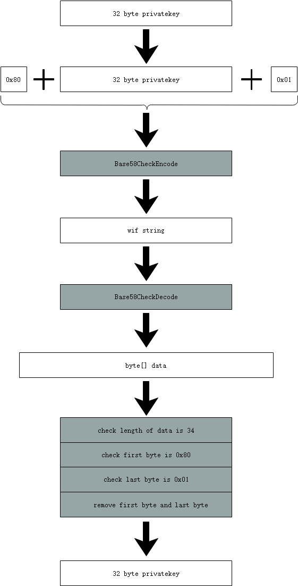

# Wallets

Wallets are basic components of NEO and the bridges for users to access NEO network. They are responsible for transaction operations such as transfer, contract deployment, asset registration, etc.

You can redesign and modify NEO wallets following your own thoughts, but the below rules and patterns must be followed.

## Format

### Private Key

A private key is a random value generated between 1 and n (n is a constant, less than 2^256 slightly), and is represented by a 256 bit (32 bytes) number generally.

There are two main encoding formats for private keys in NEO:

- Hexstring Format

   The hexstring format is a string that uses hexadecimal characters to represent byte array.

- Wif Format

   The wif format is to add prefix `0x80` and suffix `0x01` in the original 32-byte data, and get the string after Base58Check encoding.

[](../images/wallets/privateKey-wif-en.png)

 Example: 

| Format | Value |
|---|---|
| byte[] | [0xc7,0x13,0x4d,0x6f,0xd8,0xe7,0x3d,0x81,0x9e,0x82,0x75,<br>0x5c,0x64,0xc9,0x37,0x88,0xd8,0xdb,0x09,0x61,0x92,0x9e,<br>0x02,0x5a,0x53,0x36,0x3c,0x4c,0xc0,0x2a,0x69,0x62] |
| hexstring | c7134d6fd8e73d819e82755c64c93788d8db0961929e025a53363c4cc02a6962 |
| wif | L3tgppXLgdaeqSGSFw1Go3skBiy8vQAM7YMXvTHsKQtE16PBncSU |

### Public Key

The public key is a point (X, Y) calculated through the ECC algorithm with the private key. The X, Y coordinates can be represented by 32-byte data. Different from Bitcoin, NEO chooses secp256r1 as the curve of the ECC algorithm. There are two public key formats in NEO:

- Uncompressed Public Key

    0x04 + X (32 bytes) +  Y (32 bytes) 

- Compressed Public Key

    0x02 + X (32 bytes) or 0x03 + X (32 bytes)

Example:

| Format | Value |
|----------|:-------------:|
| Private Key | c7134d6fd8e73d819e82755c64c93788d8db0961929e025a53363c4cc02a6962|
| Public Key (Compressed) | 035a928f201639204e06b4368b1a93365462a8ebbff0b8818151b74faab3a2b61a |
| Public Key (Uncompressed)  | 045a928f201639204e06b4368b1a93365462a8ebbff0b8818151b74<br>faab3a2b61a35dfabcb79ac492a2a88588d2f2e73f045cd8af58059282e09d693dc340e113f  |

> [!NOTE]
> 
> The above uncompressed public key is splited into multiple lines, since it's too long. Actually it's in one line.

### Address

Address is a string of numbers and letters after a series of transformations of the public key. In NEO, the steps of conversion from a public key to an address are as follows:

1. Build the address script contract, the script format:

    `0x21` (1 byte, representing `OptCode.PUSHBYTES21`) + compressed public key (33 bytes) + `0xac` (1 byte, representing `OptCode.CHECKSIG`)

2. Calculate script hash of the contract (20 bytes, obtained from once SHA256, then once RIPEMD160 hash operation of the script). 

3. Add the version prefix in the hash. (Currently, the NEO version is `0x17`)

4. Use Base58Check encoding for the above byte data.

Example：

| Format | Value |
|----------|:-------------:|
| Private Key | c7134d6fd8e73d819e82755c64c93788d8db0961929e025a53363c4cc02a6962|
| Public Key (Compressed) | 035a928f201639204e06b4368b1a93365462a8ebbff0b8818151b74faab3a2b61a |
| Address | AXaXZjZGA3qhQRTCsyG5uFKr9HeShgVhTF  |

### Digital Certificate

A digital certificate is a document that is digitally signed by the certificate authority(CA) and contains the information of the public key's owner and the public key. NEO certificates use X509 format.

## Wallet Files

### db3 wallet files

A db3 wallet file uses SQLite to store data, and the file name extension is `.db3`. The file mainly stores the following four attributes:

- `PasswordHash`: the hash of the passowrd, by using SHA256 hash operation.

- `IV`: an initial vector of AES, randomly generated.

- `MasterKey`: an encrypted ciphertext, obtained by encrypting the private key using AES256 algorithm with `PasswordKey`, `IV` parameters.

- `Version`: the version of the wallet

db3 wallet uses the AES (symmetrical encryption) for encryption and decryption.

### NEP6 wallet files

An NEP6 wallet file complies with the NEP6 standard, and the file name extension is `.json`. The JSON format is as follows:

```json
{
	"name": null,
	"version": "1.0",
	"scrypt": {
		"n": 16384,
		"r": 8,
		"p": 8
	},
	"accounts": [{
		"address": "AZ6AsQ42HLkzN1SdwDfWMfNdECN41QGvWP",
		"label": null,
		"isDefault": false,
		"lock": false,
		"key": "6PYKXU9ZkVTkdRzFdHUBH8SL6ESGS5SYx94UeYpeEUnG2z8H2Fvdh47EN9",
		"contract": {
			"script": "210209c86ad123403f7ddaa80f6b4c72e6f46607cabed5b2c297e27812cdd755f2c2ac",
			"parameters": [{
				"name": "signature",
				"type": "Signature"
			}],
			"deployed": false
		},
		"extra": null
	}, {
		"address": "AeiXnh6T47CQ5HwpJ9rE3CrMr6UT6VsGXt",
		"label": null,
		"isDefault": false,
		"lock": false,
		"key": "6PYUdZvc35rD9MetztTCScgwsGV81r167M1rMx5FeG5YLHSkmcTCGEShUh",
		"contract": {
			"script": "2102cb8f7571d8ed87f3a6c8c5af8bc0fbfababf4d9927dc8899af57bc362271c0a0ac",
			"parameters": [{
				"name": "signature",
				"type": "Signature"
			}],
			"deployed": false
		},
		"extra": null
	}],
	"extra": null
}
```

**Description of attributes**:

- `name`: a label that the user has given to the wallet file

- `version`: currently fixed at 1.0, may be changed for functional upgrades in the future

- `scrypt` (n/r/p): three parameters of scrypt algorithm to regulate calculation performance

- `accounts`: a list of accounts which describe the details of each account in the wallet

- `address`: the standard NEO address of each account

- `label`: a short description of the account, can be `null`

- `isDefault`: means if this account is the default account in the wallet

- `lock`: means if this account is locked or not

- `key`: nep2Key encrypted according to NEP2

- `contract`: details of the address script contract

- `script`:  the script (represented in a hexdecimal string) of the address script contract 

- `parameters`: a list of contract parameters

- `parameters.name`: name of the contract parameter

- `type`: type of the contract parameter

- `deployed`: means if this contract is deployed or not

- `accounts.extra`: extra attributes of the account, can be `null`

- `extra`: extra attributes of the wallet, can be `null`

An NEP6 wallet uses scrypt algorithm as the core method of wallet encryption and decryption.

**Encryption steps**:

1. The address is derived from the public key, and the address hash is the first four bytes of `SHA256(SHA256(Address))`

2. Calculate a `derivedkey` by the scrypt algorithm, and divide the 64-byte data into two halves as `derivedhalf1` and `derivedhalf2` Scrypt uses the following parameters:

    - ciphertext: The entered password (UTF-8 format)
	- salt: address hash
	- n: 16384
	- r: 8
	- p: 8
	- length: 64

3. Do xor operation on the private key and `derivedhalf1`, and then get `encryptedkey` by using AES256 to encrypt it with `derivedhalf2`

4. Concatenate data according to the following format and obtain `NEP2Key` by using Base58Check encoding of it

	`0x01` + `0x42` + `0xe0` + address hash + `encryptedkey`

**Decryption steps**：

1. Decode NEP2Key by using Base58Check decoding

2. Check whether the length of decoded data is 39 bytes, and the first three bytes (data[0-2]) are `0x01`, `0x42` and `0xe0`

3. Take data[3-6] as `addresshash`

4. Put the password and addresshash into the Scrypt algorithm. Specify the result length to 64. Then get the `derivedkey`

5. Take Derivedkey[0-31] as `Derivedhalf1`, and Derivedkey[32-63] as `Derivedhalf2`

6. Take data[7-38] as `Encryptedkey` (32 bytes), and decrypt it using AES256 with `derivedhalf2` as the initial vector

7. Do xor operation on the decrypted data and `derivedhalf1` to obtain the private key

8. Get the public key from the private key with ECC algorithm, and then get the address. Check whether the first four bytes of the result of `SHA256(SHA256(Address))` is equal to the `addresshash`. If it's the same, then you get the correct private key

More details about NEP2 and NEP6 proposals are in the NEO document.

NEP2 proposal: <https://github.com/neo-project/proposals/blob/master/nep-2.mediawiki>

NEP6 proposal：<https://github.com/neo-project/proposals/blob/master/nep-6.mediawiki>

## Wallet Function

| Function Name   |  Description                                                  |
| ---------------- | ------------------------------------------------------------ |
| Import wallet file     |  Import the account information from the specified wallet file   |
| Export wallet file     |  Store the account information (including private key, password, address, etc.) in the specified wallet file such as db3 wallet file, nep6 json file.  			  |
| Unlock wallet         | Verify user password to prevent leaks                   |
| Create private key         | Recommend safe random generator			     	  |
| Import private key         | Add new private key to the wallet with wif format or digital certificate   |
| Export private key         | Export accounts' private key         			  |
| Generate public key         | Obtain public key by ECC algorithm with private key |
| Generate address         |  Generate address based on private key               |
| Import address         | Add new address to the wallet  						  |
| Export address         | Export accounts' address                               |
| Import offline data |  Load block data in `chain.acc` file to reduce synchronization time    |
| Export offline data | Export block data in `chain.acc` file 				  |
| Synchronize block data     |                                        		      |
| Transfer             | Transfer to other addresses                              |
| Sign             | Sign data, such as transactions                              |
| Claim Gas          | Claim the newly allocated gas from the neo held by the account |
| Get balance         | Show the balance of current wallet  |
| Get transaction         | Show transaction history of current wallet |
| Construct multi-signature contract | Construct multi-signature contract  |
| Extend         |                                                                |
| Deploy smart contract     |  Deploy smart contract |
| Test smart contract     | Test smart contract |

## Wallet software

### Full-node wallet

The full-node wallet is a complete backup of blockchain data, which saves all the onchain data and participates in p2p network, therefore it needs a large storage space.

NEO-CLI and NEO-GUI are all full-node wallet.

### SPV wallet

The SPV (Simplified Payment Verification) wallet is different from full-node wallet. It dosen't store all block data, only block header data, and verifies the data by using bloom filter and merkle tree algorithm. It's mostly used in mobile app or light client, as it can save storage space effectively.

For developing SPV wallet, refer to the NEO network protocol interface.

Usage:

   1. The SPV wallet sends a bloom filter to the full node, and the full node loads the bloom filter.

   2. The SPV wallet sends the bloom filter's parameters to the full node, and the full node load the parameters. (Optional)

   3. The SPV wallet queries transactions from the full node, and the full node returns the transaction data after filtering with the bloom filter and the constructed merkle tree path.

   4. The SPV wallet uses the merkle tree path to verify the transaction data.

   5. The SPV wallet sends `clear the bloom filter` instruction to the full node, and the full node clear it.
