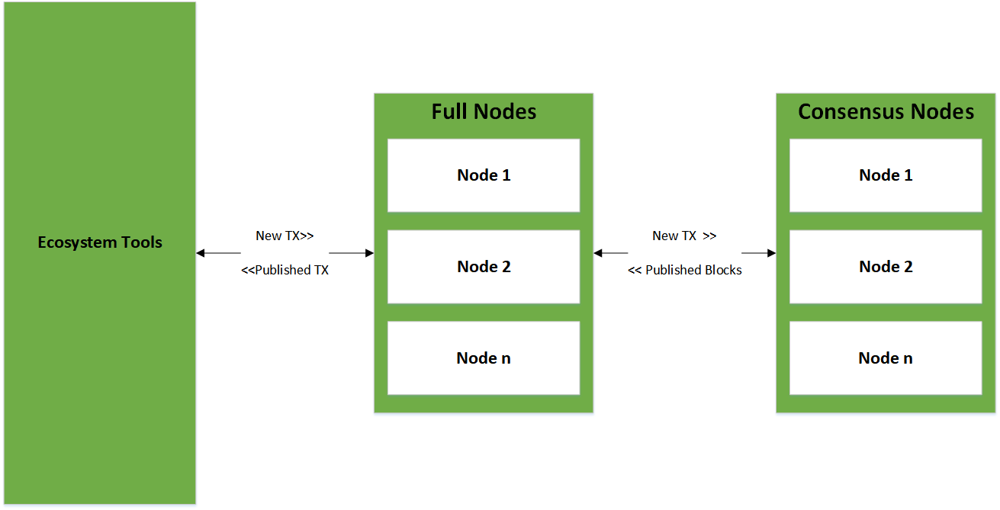

<p align="center">
  
</p>

<p align="center" style="font-size: 48px;">
  <strong>Workshop 001: Introduction to Neo</strong>
</p>

# Introduction
* <b>Duration:</b> 
	* 1 Hour
* <b>Prerequisites:</b> 
	* None
* <b>Infrastructure Requirements:</b>
	* (Required) Whiteboard or Projector
* <b>Instructor Prework:</b>
	* (Required) Workshop content review
* <b>Student Prework:</b>
	* (Recommended) General Understanding of blockchain fundamentals
* <b>Workshop Materials List:</b>
	* None

## Outline
In this workshop, we will cover the foundations of the blockchain: Basic operating principles, the consensus algorithm, and key differentiators which can be leveraged when developing a decentralized application on the platform. This workshop attempts to provide the information required for an individual to make sound judgment call on whether something belongs on a blockchain and whether any of the unique Neo offerings can be leveraged.


## What is Neo?
Neo, originally Anthshares, is a globally supported blockchain platform for smart contract development.  The platform has two native assets: <b>NEO</b> and <b>GAS</b>.  NEO is an asset which entitles a holder to vote on the decision making nodes on the platform.  There is a total supply of 100 Million NEO.  Like NEO, there are 100 Million GAS.  GAS is distributed to NEO holders through claims of realized GAS generation which are calculated by integrating an address' NEO holdings over the blocks.

## The Ecosystem

<p align="center">
  
</p>

<b>Neo can be broken out into 3 layers by purpose:</b>
* <b>Consensus Nodes:</b> At the core of the network, we have consensus nodes.  This nodes are responsible for committing transactions to new blocks for minting.  Comparatively, there are very few consensus nodes relative the the next layer.  
* <b>Full Nodes:</b> Full nodes are technically identical to consensus nodes, but serve a different purpose in the network.  They are meant to propagate published transactions to the rest of the network and relay new transactions to the consensus nodes.  Through voting, a full node may be elected into the role of consensus node. For a list of publically available full nodes, look [here](http://monitor.cityofzion.io/)

* <b>Ecosystem Tools:</b> Ecosystem tools (like wallets, trackers, and other dApps) are built on top of the full-node infrastructure.  They interface will full nodes to push transactions into the network and receive published transaction data.  In NEO, the primary interface mechanic is via HTTP/RPC, however, interfacing may also be made via TCP/IP

### Communities
Neo is a community driven project.  There are a number of different open-source groups which have formed around the project to improve the core platform and ecosystem.  Ecosystem communities include:
* [CoZ]() 
* [NeoResearch]()
* [NEL]()
* [O3]() 

## The Consensus Algorithm
NEO implements a dBFT (delegated Byzantine Fault Tolerance) algorithm for consensus.  Use of this algorithm defines the following behaviors:
   1. The network retains functionality so long as > 2/3 consensus nodes are reach block consensus.
   2. Block production halts below 2/3 node consensus on blocks.
   
<i><b>Note:</b> For detailed information about the consensus algorithm refer to the following: [1](https://github.com/neo-project/docs/blob/master/en-us/basic/consensus/consensus.md), [2](https://docs.neo.org/en-us/basic/consensus/whitepaper.html)</i>

Consensus nodes in the system are elected by vote from holders of the NEO system asset.  As of this workshop, there are 7 consensus nodes and implementation of voting is in progress. 

One of the primary strengths of dBFT is the concept of finality. Once a block has been minted to the chain, it is final.  This provides a certainty with the chain which allows interfacing systems to respond to transactions as soon as they are seen rather than taking a probabilistic approach which is common in the space (In proof of work, a `longest chain is truth` strategy introduces a probability that the more recent block may not persist as the truth).  

### Blocks
As transactions are sent to the consensus nodes, a speaker node groups the transactions into a block proposal.  The proposal is then sent to the other consensus nodes for a vote.  Below is a json formatted example of a block on the chain:

```python
query = {"jsonrpc": "2.0", "method": "getblock", "params": [3371168,1], "id": 0}
res = requests.post(host, data = json.dumps(query), timeout=4)
pprint.pprint(res.json())
```

<b>A structured version can be found [here](https://neoscan.io/block/96FABD2F37ABED4FF1D6FA8901E9EF7C508F0EBD156417FA0F9FE4F1AA8DC2B7)</b>

```
{u'id': 0,
 u'jsonrpc': u'2.0',
 u'result': {u'confirmations': 4,
             u'hash': u'0x96fabd2f37abed4ff1d6fa8901e9ef7c508f0ebd156417fa0f9fe4f1aa8dc2b7',
             u'index': 3371168,
             u'merkleroot': u'0x92a393fc4d18f8e326228368ce2a6e75aec6e42a28caa402a01362b615dc6b79',
             u'nextblockhash': u'0xe0ebd0851cafad7d32b3746fd2ea1e8cd099f086fa4b43fae07fe59474dc0faa',
             u'nextconsensus': u'ANuupE2wgsHYi8VTqSUSoMsyxbJ8P3szu7',
             u'nonce': u'541cacf4a650cf54',
             u'previousblockhash': u'0x29b39b92fa968e56eedc745299a2fd1fc23121977aee6c7a85795efe14c3e259',
             u'script': {u'invocation': u'402f5439ee63ccdadbeda83471cf9111c52775e341163e531c17393b38ca852bb7a2b4bc1fec85debb5c45bac6b0ce0a98c23d15e20ec00572a185bd169683783c408b2bd93959d968ffe94821042a6177294b15f9f45d59047ef1500366e416fb41ac079740c81ed359c71fa8ede3972c3d8d0165f1f8012e0d081dcdedfeef7828402f46f922818f94f0d625ca4cb692ae43880dd82b73689a9386e4c9e9b8156ccbbad5a981cb4c8d06388489ed299bcba3f26c349ebb06da2728c3139f628d9c9540f32c448380ad329a5f81e42b8d605c87920d0e390b745b4d2f57114bf930919dd3aaf277407a4e96dd1308f02d3163fb722f4411ccf4a7238f3abd148e4dd5c0408556e63d50dde0ccf493031ae3cba1799851c686791b1117259155149f325ce9ad5a57ebe6a5072364874ddef2e5be73a47bb1820b59888304cfd2c54062662f',
                         u'verification': u'5521024c7b7fb6c310fccf1ba33b082519d82964ea93868d676662d4a59ad548df0e7d21025bdf3f181f53e9696227843950deb72dcd374ded17c057159513c3d0abe20b6421035e819642a8915a2572f972ddbdbe3042ae6437349295edce9bdc3b8884bbf9a32103b209fd4f53a7170ea4444e0cb0a6bb6a53c2bd016926989cf85f9b0fba17a70c2103b8d9d5771d8f513aa0869b9cc8d50986403b78c6da36890638c3d46a5adce04a2102ca0e27697b9c248f6f16e085fd0061e26f44da85b58ee835c110caa5ec3ba5542102df48f60e8f3e01c48ff40b9b7f1310d7a8b2a193188befe1c2e3df740e89509357ae'},
             u'size': 1589,
             u'time': 1550263192,
             u'tx': [{u'attributes': [],
                      u'net_fee': u'0',
                      u'nonce': 2790313812L,
                      u'scripts': [],
                      u'size': 10,
                      u'sys_fee': u'0',
                      u'txid': u'0xb82a526c897dd2a5a7af183046c725326c7fdfb9584a7592b4371c985de57b6d',
                      u'type': u'MinerTransaction',
                      u'version': 0,
                      u'vin': [],
                      u'vout': []},
                     {u'attributes': [],
                      u'net_fee': u'0',
                      u'scripts': [{u'invocation': u'40ddcf4abd2c9832e9f5350bd70802132fefaf40669a12961e3ca07f2c7a8e9068e55f401f723839e727c198ef3f0d60807bfc4b32358f23c157e2a3f2bca773c9',
                                    u'verification': u'2102e80b5db9d6037df8ef8cc3589e58c087fa1b83629d7b292e8eefb02cbcf4ae69ac'}],
                      u'size': 202,
                      u'sys_fee': u'0',
                      u'txid': u'0x31b4aafb417c0fbee49f2b919888963cd1b69eed38d51847fabb814cda3d6c98',
                      u'type': u'ContractTransaction',
                      u'version': 0,
                      u'vin': [{u'txid': u'0x2b54c53861af3b1a88a68768df998eff1b44f1b8f724b171215ba2d319e2fa06',
                                u'vout': 0}],
                      u'vout': [{u'address': u'ANUTf3uNmeJqMQGoAZbm8m2ytrSajSwfRR',
                                 u'asset': u'0xc56f33fc6ecfcd0c225c4ab356fee59390af8560be0e930faebe74a6daff7c9b',
                                 u'n': 0,
                                 u'value': u'2000'}]},
                     {u'attributes': [],
                      u'net_fee': u'0',
                      u'scripts': [{u'invocation': u'40cbe837a92194d7f68d3aa230d9ff402f0ce5bd2a471f6a51bfdff16b4d882606346f131674271c554b9375bbb934bb7fc57539b8c553596d88abb83b29b07afe',
                                    u'verification': u'21030ab39b99d8675cd9bd90aaec37cba964297cc817078d33e508ab11f1d245c068ac'}],
                      u'size': 262,
                      u'sys_fee': u'0',
                      u'txid': u'0xe9c8c257980bb8495c98bc3ab6e476757cbe0b8d259ab8a2e2a8f1d30ee8c015',
                      u'type': u'ContractTransaction',
                      u'version': 0,
                      u'vin': [{u'txid': u'0x3918e581ab8ee7f8bf901939d23c559bf9812775377c9a21408fbaccb6ec12f9',
                                u'vout': 2}],
                      u'vout': [{u'address': u'AUoGQZRrPjd4Km7NRuJE7NpPUd18YADJub',
                                 u'asset': u'0x602c79718b16e442de58778e148d0b1084e3b2dffd5de6b7b16cee7969282de7',
                                 u'n': 0,
                                 u'value': u'6.02692256'},
                                {u'address': u'AJzoeKrj7RHMwSrPQDPdv61ciVEYpmhkjk',
                                 u'asset': u'0x602c79718b16e442de58778e148d0b1084e3b2dffd5de6b7b16cee7969282de7',
                                 u'n': 1,
                                 u'value': u'0.1947762'}]},
                     {u'attributes': [],
                      u'claims': [{u'txid': u'0x6164ca03692b8c1996f251cac75366fbd6a3709f379402fac6f92d6d88bb8ba8',
                                   u'vout': 0},
                                  {u'txid': u'0x27daaa7dbf465a350a5d13f4b8995da8b89598222ae1c409c938600dde018848',
                                   u'vout': 0}],
                      u'net_fee': u'0',
                      u'scripts': [{u'invocation': u'404fdf206400cb255927ef998969b22da0e22d0e6d645fd38dc70daa28f53aa4b7c534f91560205988c8293d854bf95844d37b6211de3716526ba24abce9608f25',
                                    u'verification': u'2103e0ecedf3d82cd624ea135ec43c191f62cee445b60590aec33b1328e26b5cb926ac'}],
                      u'size': 237,
                      u'sys_fee': u'0',
                      u'txid': u'0x41fcc06a86b625f5da35b94e66a44aa019e88894c192840b580d524c46ffe793',
                      u'type': u'ClaimTransaction',
                      u'version': 0,
                      u'vin': [],
                      u'vout': [{u'address': u'Af2uC232n57mMmk7uWJCfvHnDCezoytZCH',
                                 u'asset': u'0x602c79718b16e442de58778e148d0b1084e3b2dffd5de6b7b16cee7969282de7',
                                 u'n': 0,
                                 u'value': u'0.0383859'}]},
                     {u'attributes': [],
                      u'net_fee': u'0',
                      u'scripts': [{u'invocation': u'40caf2151ac054c95d2b992fafd22c16afbac283572510d128a97ece4bba376575d61360d0fadc29ae233c7c5d03ce1318da7994177fb6e3e017805e6fc7aa1313',
                                    u'verification': u'21023fc984fdfb47ef171dfe49dab0c5fac71da97eb40b7d85f7068e94a37cacd88fac'}],
                      u'size': 202,
                      u'sys_fee': u'0',
                      u'txid': u'0x226cbb97c3f0fa6d88ecebb03261b86a03f87591e3e8b7672cedcb095f7a35e4',
                      u'type': u'ContractTransaction',
                      u'version': 0,
                      u'vin': [{u'txid': u'0x3f6108079300a763603456e1c744470d7a62ea9241468c8bde2afaab3c11fa9c',
                                u'vout': 0}],
                      u'vout': [{u'address': u'AeNnpNeMM3ugrD2sBjbsSQRJeqEdncTZi8',
                                 u'asset': u'0x602c79718b16e442de58778e148d0b1084e3b2dffd5de6b7b16cee7969282de7',
                                 u'n': 0,
                                 u'value': u'0.00001757'}]}],
             u'version': 0}}
 ```
   
## Assets
The neo platform supports two different models to persistant objects (as of NEO 2.0) which are both accessible to developers.  In this section we outline them both.

### UTXO (Unspent Transaction Output) model
The UTXO model is common to many blockchain platforms, but in Neo, developers have the ability to deploy their own.  UTXO is the model used by the native assets (NEO and GAS) and classically forms a chain of interlinked transactions within the blocks on the platform.  To calculate an the asset balance of an address, each transaction in the transaction chain for an address is analyzed as a series of `diffs` to determine the balance at a block height. To support this, balance changing invocations are <b>WRITE</b>  Below, we see an example of how this is presented in the transactions on the platform.

In the above block, we find a number of different transactions including multiple <b>GAS CLAIMS</b> and a UTXO transfer of NEO here:
```
{u'attributes': [],
                      u'net_fee': u'0',
                      u'scripts': [{u'invocation': u'40ddcf4abd2c9832e9f5350bd70802132fefaf40669a12961e3ca07f2c7a8e9068e55f401f723839e727c198ef3f0d60807bfc4b32358f23c157e2a3f2bca773c9',
                                    u'verification': u'2102e80b5db9d6037df8ef8cc3589e58c087fa1b83629d7b292e8eefb02cbcf4ae69ac'}],
                      u'size': 202,
                      u'sys_fee': u'0',
                      u'txid': u'0x31b4aafb417c0fbee49f2b919888963cd1b69eed38d51847fabb814cda3d6c98',
                      u'type': u'ContractTransaction',
                      u'version': 0,
                      u'vin': [{u'txid': u'0x2b54c53861af3b1a88a68768df998eff1b44f1b8f724b171215ba2d319e2fa06',
                                u'vout': 0}],
                      u'vout': [{u'address': u'ANUTf3uNmeJqMQGoAZbm8m2ytrSajSwfRR',
                                 u'asset': u'0xc56f33fc6ecfcd0c225c4ab356fee59390af8560be0e930faebe74a6daff7c9b',
                                 u'n': 0,
                                 u'value': u'2000'}
					 ]
 }
 ```
* In the transaction above, we see that 2000 of the asset `0xc56f33fc6ecfcd0c225c4ab356fee59390af8560be0e930faebe74a6daff7c9b`(NEO) were sent to the address: `ANUTf3uNmeJqMQGoAZbm8m2ytrSajSwfRR`.  Note that the index of this vout is `0`.
* The input(vin) is actually a pointer to another transaction `0x2b54c53861af3b1a88a68768df998eff1b44f1b8f724b171215ba2d319e2fa06` index `0` (the index of a vout from the transaction).  Lets take a look at that transaction:

```python
query = {"jsonrpc": "2.0", "method": "getrawtransaction", "params": ['0x2b54c53861af3b1a88a68768df998eff1b44f1b8f724b171215ba2d319e2fa06',1], "id": 0}
res = requests.post(host, data = json.dumps(query), timeout=4)
pprint.pprint(res.json())
```

```
 {u'attributes': [],
                      u'net_fee': u'0',
                      u'scripts': [{u'invocation': u'40a39ddcf0de88b36ea1181857298e9d8eec0218a415888a0b8d04e2a960bec50f89e2af3f77c32fb41f8061f2d776e0be8d10bcc1831f835eab19da7d6e972225',
                                    u'verification': u'2102e80b5db9d6037df8ef8cc3589e58c087fa1b83629d7b292e8eefb02cbcf4ae69ac'}],
                      u'size': 202,
                      u'sys_fee': u'0',
                      u'txid': u'0x2b54c53861af3b1a88a68768df998eff1b44f1b8f724b171215ba2d319e2fa06',
                      u'type': u'ContractTransaction',
                      u'version': 0,
                      u'vin': [{u'txid': u'0xaefc154a138032c527f6129457ec4762d92a3faecb682c89ec70073ed953f4f9',
                                u'vout': 0}],
                      u'vout': [{u'address': u'ANUTf3uNmeJqMQGoAZbm8m2ytrSajSwfRR',
                                 u'asset': u'0xc56f33fc6ecfcd0c225c4ab356fee59390af8560be0e930faebe74a6daff7c9b',
                                 u'n': 0,
                                 u'value': u'2000'}
					 ]
 }
 ```
 
 * In vout index `0`, we find the the the 2000 NEO were transfered from `ANUTf3uNmeJqMQGoAZbm8m2ytrSajSwfRR` so we can conclude that this address transferred 2000 NEO to themselves (This transaction was most likely associated with the GAS claim process to realize generation). 
 * If we want to track down where the 2000 NEO came from, we could then follow the vin pointer for this transaction using the same process.
 
### Account model
NEO also supports account model assets (called tokens) using the [NEP-5](https://github.com/neo-project/proposals/blob/master/nep-5.mediawiki) standard. Tokens are are smart contracts which exist on the chain and provide a standard interface for users.  For NEP-5 tokens, rather than maintaining a chain of diffs like UTXO assets, the token values of addresses are absolute.  To support this, tokens use an <b>UPDATE</b> strategy to maintain balances.  We provide an example simple NEP-5 below:

<b>Example: 
[Moonlight ICO Template](https://github.com/Moonlight-io/moonlight-ico-template)</b>

{{Give Everyone some GAS}}