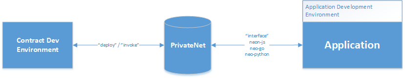
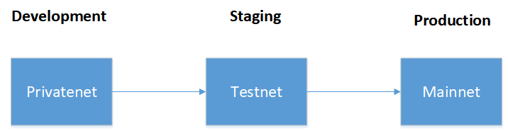
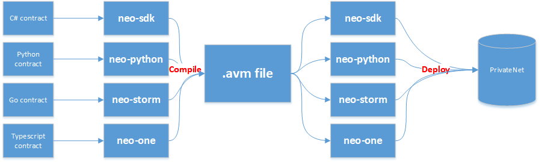

<p align="center">
  
</p>

<p align="center" style="font-size: 48px;">
  <strong>Workshop 002: Neo Development Environments</strong>
</p>

# Introduction
* <b>Duration:</b> 
	* 1 Hour
* <b>Prerequisites:</b> 
	* [001 Introduction to Neo](../1_introduction_to_neo/README.md)
* <b>Infrastructure Requirements:</b>
	* (Required) Whiteboard or Projector
	* (Required) High-Speed Internet Connection
* <b>Instructor Prework:</b>
	* (Required) Workshop content review
* <b>Student Prework:</b>
	* (Recommended) General Understanding of blockchain fundamentals
	* (Recommended) Familiarization with Amazon Web Services(or other CSP)
* <b>Workshop Materials List:</b>
	* None

## Outline
There are many ecosystem tools available to provide developers with a quality experience when creating decentralized applications on the Neo platform. This workshop will outline how to create an ideal development environment to meet your needs. Multiple tracks will be provided to support the multiple languages available for smart contract development with an emphasis on C#, python, and typescript. Each of which have some distinct differences in their development environment.

## Environment Needs
<p align="center">
  
</p>

Development environment selection is largely the same and independent of your language selection for the smart contract.  In many cases, you can expect to use cross-language utilities in your environment (using a C# IDE, neon-js, and neo-python for example).  Generally, here are the recommended tools in a complete development ecosystem: 
* private-net
* contract development utilities
* contract interface/debug
* test infrastructure (not covered)
* application development environment (not covered)

### Private-net
* A private-net allows a developer to run tests against their application while in full control of the network.  Remember that invokes have a cost associated with them so there is a large incentive to run heavy testing in a development ecosystem prior to deployment.  In this workshop, we recommend the following workflow:

<p align="center">
  
</p>

<b>To deploy a private-net, refer to the [privateNet deployment reference](../support/privateNet.md)</b>

### Contract Development Utilities
There are a number of smart contract development utilities available for the Neo Platform.  Generally these are broken out by language preference.  Maturity of the compilers are highly variable.  Below you can find a number of environments broken out by language:

#### C\#:
* <b>Recommended IDE:</b> Visual Studio or Ryder
* <b>Required Nuget Package:</b> [Neo](https://www.nuget.org/packages/Neo)
* <b>Chain Interface:</b> Recommend using [neo-python](https://github.com/CityOfZion/neo-python) or [Neo-GUI](https://github.com/neo-project/neo-gui/releases)
	
#### Python:
* <b>Recommended IDE:</b> Any python IDE
* <b>Compiler and Chain interface:</b> [neo-python](https://github.com/CityOfZion/neo-python) (-p flag on startup to connect to a privatenet)
 
#### Golang:
* <b>Recommended IDE:</b> Any go IDE
* <b>Chain Interface:</b> [neo-go](https://github.com/CityOfZion/neo-go)
* <b>Contract Compiler:</b> [neo-storm](https://github.com/CityOfZion/neo-storm)

#### Typescript:
* <b>Recommended IDE:</b> Any javascript IDE
* <b>Compiler and Chain Interface:</b> [neo-one](https://neo-one.io/)

### Contract Interfacing and Testing
For contract interface testing, we recommend using neo-python, neo-go, and neon-js
* <b>For chain level interfacing:</b> neo-python or neo-go
* <b>For system testing:</b> [neon-js](https://github.com/CityOfZion/neon-js)


### Deploying Your Environment
For this workshop, we <b>HIGHLY</b> recommend that students use clean AWS EC2 instances for configuration of development utilities and privatenet.

1.  <b>Configure your privatenet:</b>

    Follow the instructions [here]((../support/privateNet.md))  .  Remember that deployments cost <b>GAS</b> so you will want to take note of how to access the origin wallet on the private net.
	
	<i><b>Note:</b> For remote access, remember to configure your security group.  The network requires the following ports to be publicly accessible: ? </i>
	
2. <b>Configure your developement utilities:</b>

    Due to time constraints, the workshop will not cover setup of environments for each language.  The instructor will have the option to cover as many as time allows.  We make an assumption the initial installation of the utilities has been successful per their documentation and provide information on how to connect to the privatenet below.  Its also important to note that there is an intermediate step in the development => deploy workflow. 

	<p align="center">
	  
	</p>	
	
	Because Neo contracts are run in a VM, all contracts are compiled into a bytecode .avm file which is language agnostic.  In some scenarios, it (may) be beneficial to develop using one environment and deploy using another. This topic will be covered in a later workshop on developing, deploying, and invoking contracts
	
	To connect to your privatenet, you'll need the domain and port (default: 10333)
	
	#### 2.1 C# (neo-gui):
	
	* Make sure the application is closed
	* In the application root directory, populate your privatenet domain in the "Seedlist" attribute in protocol.json
	* Start the application
		
	#### 2.2 Python (neo-python):
	```bash
		np-prompt -p {{privatenet}}
	```
	#### 2.3 Golang (neo-go):
	```bash
	    ./bin/neo-go node -seed {{privatenet}}
	```
	#### 2.4 Typescript (neo-one):
	

	
	
	


