### Crear un contrato inteligente en Java
Esta sección contiene un pequeño tutorial que guía al desarrollador la configuración del entorno de desarrollo en Java y le ofrece una idea de cómo crear un proyecto para crear y compilar un contrato inteligente.


## Herramientas de desarrollo

## 1. Visual Studio 2017

Visual Studio 2017 es necesario para compilar el compilador Java de Neo.

Si ya se tiene instalado Visual Studio 2017 junto con la opción `Desarrollo Multiplataforma de .Net Core`, se puede omitir este punto. Descarga e instalación: [Visual Studio 2017](https://www.visualstudio.com/products/visual-studio-community-vs)

El proceso de instalación es muy sencillo, basta con seguir el asistente, teniendo en cuenta que debe de estar marcada la opción de `Desarrollo Multiplataforma de .Net Core`. La instalación de Visual Studio podría llevar entre diez minutos a una hora.

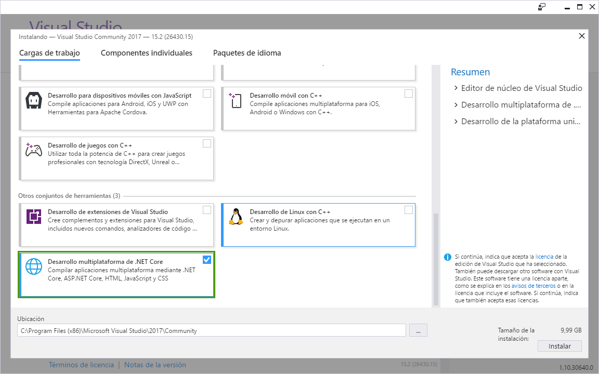

## 2. Java SDK

Descarga la versión más reciente del JDK de Java en el siguiente [enlace](http://www.oracle.com/technetwork/java/javase/downloads/jdk8-downloads-2133151.html)

Una vez descargado ejecuta el archivo `jdk-8u144-windows-x64.exe` (en nuestro ejemplo, versión Windows x64) y sigue los pasos de instalación.

## 3. Java IDE

En nuestro ejemplo vamos a usar el IDE Eclipse. Si estas familiarizado con el desarrollo Java usa el entorno que más se ajuste a tus necesidades. Descarga el IDE Eclipe en el siguiente [enlace](http://www.eclipse.org/downloads/)

Una vez descargado ejecuta el archivo  `eclipse-inst-win64.exe` (en nuestro ejemplo, versión Windows x64) y sigue los pasos de instalación.


### 3. NEOCompiler.JAVA

Instalación y configuración:

Descarga el proyecto [NEO-compiler](https://github.com/neo-project/neo-compiler) de GitHub, abre la solución en Visual Studio 2107 y publica `neoj` (el compilador Java). Botón derecho del ratón y click en `Publicar` tal y como se muestra en la imagen:

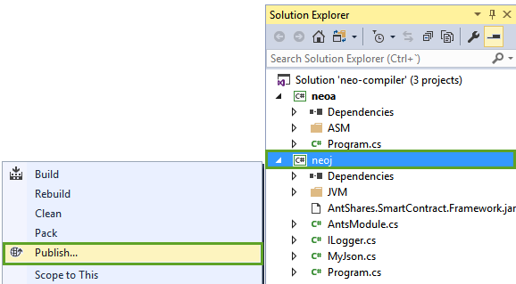

Por defecto publicará en mismo directorio del proyecto, en la carpeta: `bin\Release\PublishOutput`

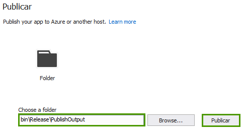

Click en `Publicar`

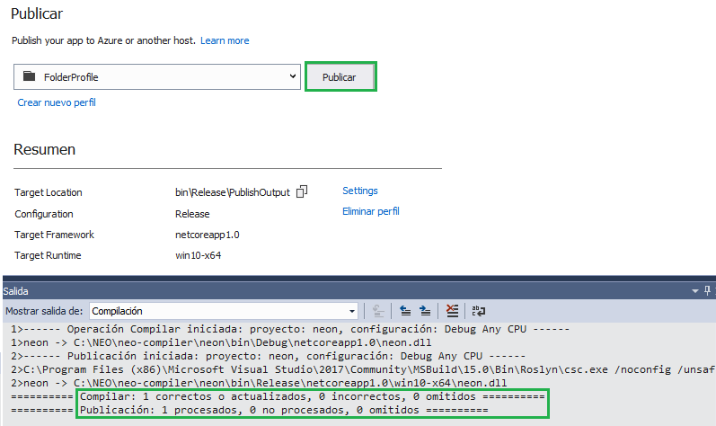

Una vez compilado y publicado sin errores debemos añadir la ruta de la publicación en el PATH del sistema. La varible PATH es una variable del SO que el sistema usa para localizar los ficheros necesarios para la ejecución de programas.

**Windows 10 y Windows 8**

  Para modificar la variable PATH del sistema: 
  Boton derecho en el bottón de `Inicio -> Panel de control -> Sistema y Seguridad -> Sistema -> Configuración avanzada del Sistema -> Opciones avanzadas -> Variables de entorno`
  
   En el apartado `Variables del Sistema` selecciona `Path`, click en `Editar` y click en `Nuevo` e introduce el path donde se en encuentre el fichero `neon.exe`, en mi ejemplo en: `C:\NEO\neo-compiler\neoj\bin\Release\PublishOutput`
 
 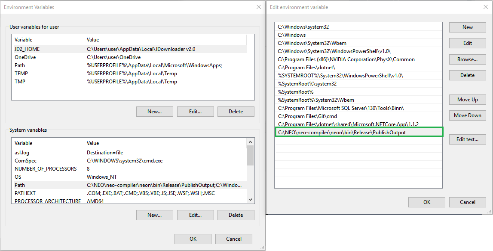
  

**Windows 7**

  Para modificar la variable PATH del sistema: 
  `Panel de control -> Sistema y Seguridad -> Sistema -> Configuración avanzada del Sistema -> Opciones avanzadas -> Variables de entorno`
  
  En el apartado `Variables del Sistema` selecciona `Path` y click en `Editar` e introduce el path donde se encuentre el fichero `neoj.exe`,  en mi ejemplo en: `;C:\NEO\neo-compiler\neoj\bin\Release\PublishOutput`. Una vez modificar, pulsa `Aceptar` en todas las ventanas.
 
> [!IMPORTANT] Cuando se añade una ruta adicional en Windows 7 el PATH debe empezar con un punto y coma ';'
 
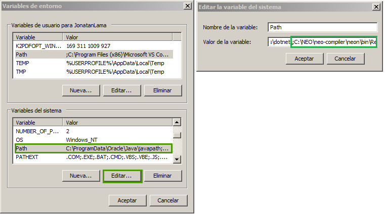

  Desde el línea de comandos o la Powershell introduce `neoj.exe`. Si no hay errores en la salida debería aparecer la versión del compilador (tay como se muestra en la imagen). La variable de entorno PATH para el compilador `neoj` está bien configurada.
  


> [!NOTE]
> En Windows 7 SP1 puede aparecer el siguiente error "Unhandled Exception: System.DllNotFoundException: Unable to load DLL 'api-ms-win-core-console-l2-1-0.dll': The specified module could not be found". 
> 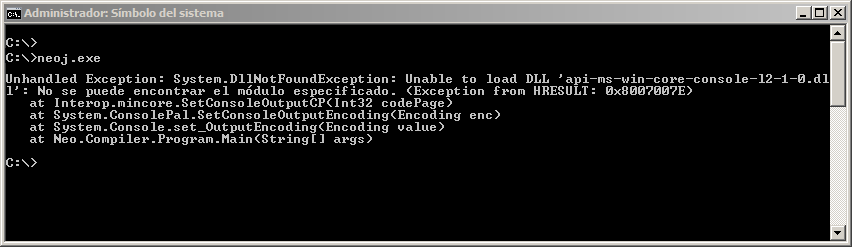
> La libreria **'api-ms-win-core-console-l2-1-0.dll'** sólo se encuentra en Windows 8 o versiones superiores. Para solucionar el problema obten una copía de la libreria **'api-ms-win-core-console-l2-1-0.dll'** y cópiala en el directorio `c:\Windows\System32`

## Crear un proyecto

Desde el entorno de desarrollo Eclipse, click en `File`, click en `New` y click en `Java Project`


En las propiedades del proyecto Java, indica el nombre (en nuestro ejemplo HelloWorld) y click en `Next`

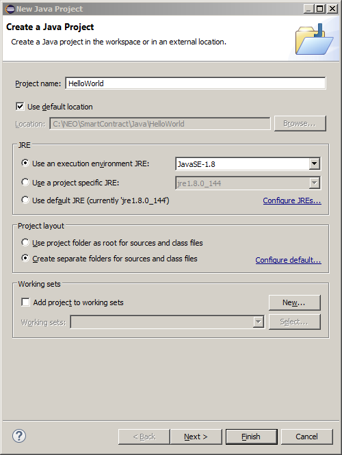

Una vez asignado el nombre del proyecto, click en `Libraries` y click en `Add External JARs...`

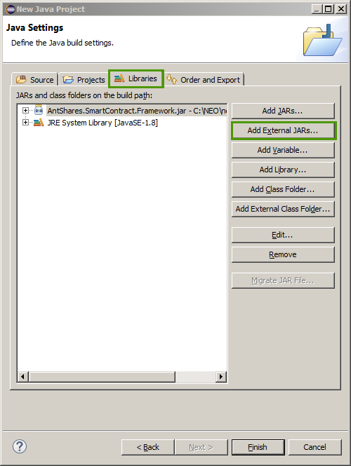

En este paso tenemos que añadir el archivo JAR que viene incluido dentro del compilador `neoj`. Selecionamos
el archivo y click en `Abrir`

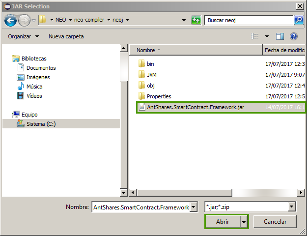

Una vez añadido el archivo JAR, desde la vista del Proyecto, debemos añadir una clase. Para eso, click con el botón derecho sobre la carpeta `src` y click `New` y click en `Class`. 

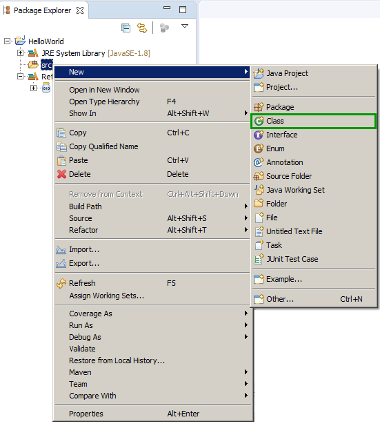

En el nombre de la clase, a modo de ejemplo, le llamamos `HelloWorld`. Click en `Finish`.

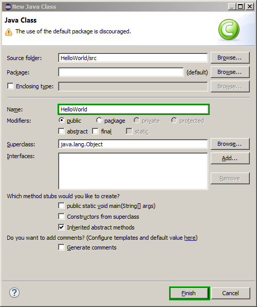


## Compilar el proyecto.

Ahora todo está listo para agregar el método entrada (Main) que define nuestro ejemplo de contrato inteligente:

```java
import AntShares.SmartContract.Framework.FunctionCode;
import AntShares.SmartContract.Framework.Services.AntShares.Storage;


public class HelloWorld extends FunctionCode {
	public static void Main () {
		Storage.Put(Storage.getCurrentContext(),"Hello","World");
		
	}
}
```
El siguiente codigo creará en el contexto del almacenamiento del contrato un valor del tipo key-value. En este caso la clave `Hello` y el valor `World`.

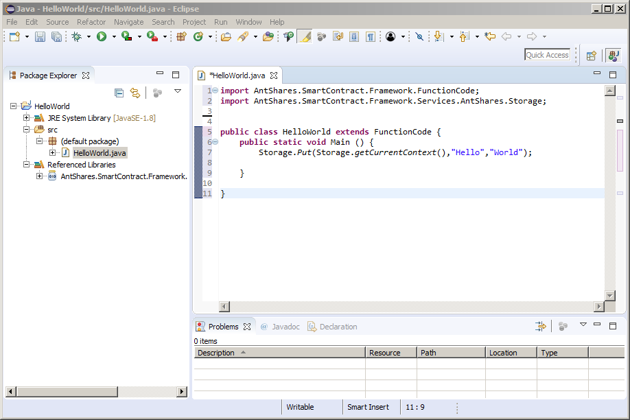

Para compilar la clase, en nuestro ejemplo concreto, desactivamos primero el `Build Automatico`, click en `Clean All` y click en `Build All`

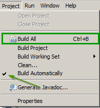


Si la compilación se ha realizado correctamente veremos el fichero `HelloWorld` con extensión `class` generado en el directorio `bin\` del Workspace del proyecto.

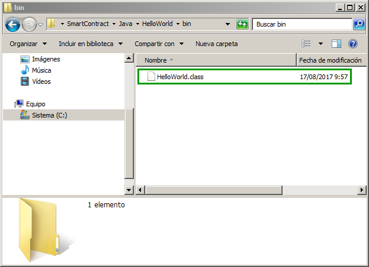

>[!TIP] Si el JDK de Java está añadido al PATH del sistema puedes compilar la clase HelloWorld desde la linea de comandos
>con la siguiente instrucción: `javac.exe -cp <ruta_archivo_jar> <ruta_archivo_java>`
> 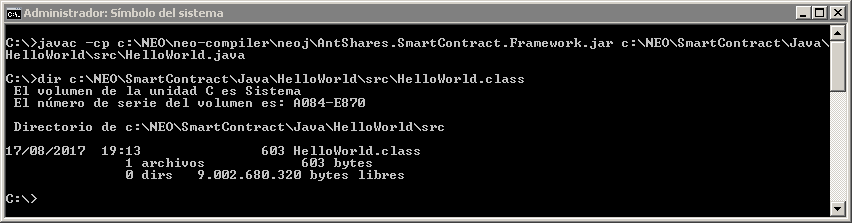

Una vez compilada la case debemos compilarla con el compilador `neoj` para obtener el contracto inteligente. Ejecutamos el comando `neoj.exe <nombre_de_la_classe>`

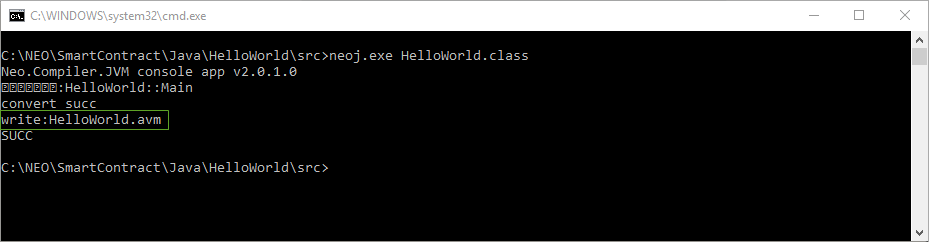


Ahora que ha completado la configuración del entorno de desarollo consulte el [Tutorial contratos inteligentes NEO](tutorial.md)
