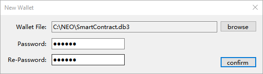
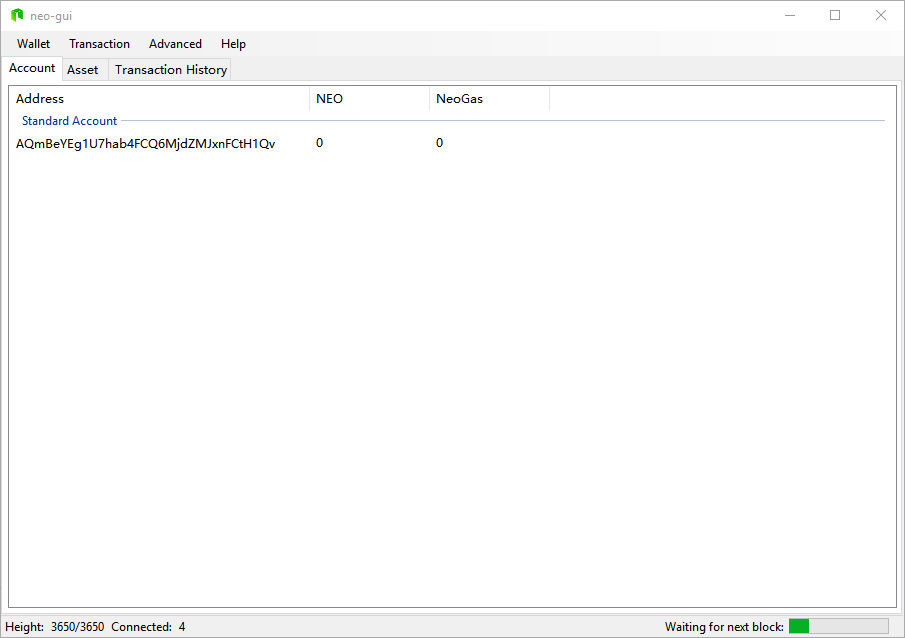
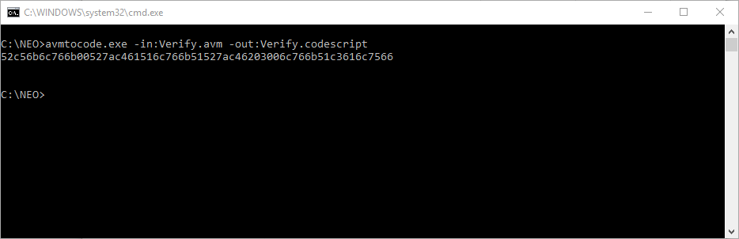
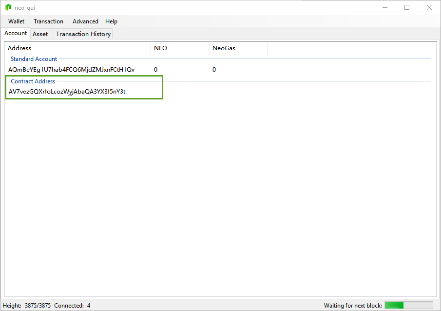
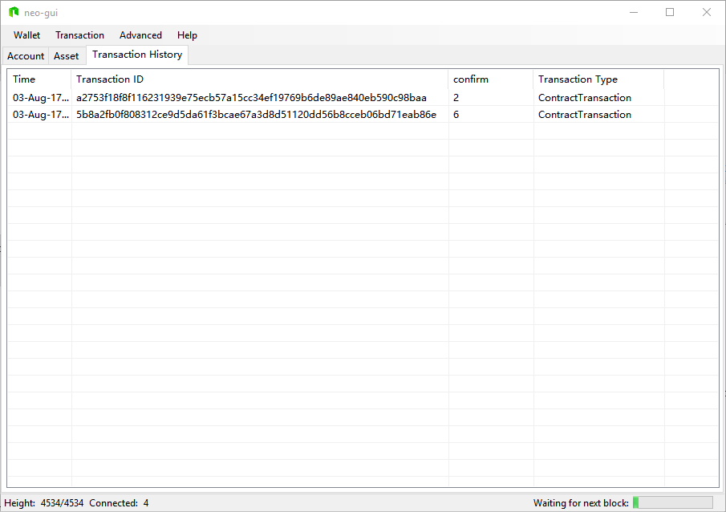

# Ejemplo de contrato inteligente - Verificación

El siguiente tutorial está basado en Visual Studio 2017

## Compilar el contrato

```c#
using Neo.SmartContract.Framework;
using Neo.SmartContract.Framework.Services.Neo;
using System;
using System.Numerics;

namespace NEO.SmartContract
{
    public class Test : VerificationCode
    {
        public static bool Verify(byte[] signature)
        {
            return true;
        }
    }
}
```


> [!Note] Revisa la documentación de como escribir contratos inteligentes aquí, [Crear un contrato inteligente con CSharp](../getting-started-csharp.md)

El contrato anterior una vez compilado, generará un fichero con extensión `avm`. En mi ejemplo será `Verify.avm`
El script del contrato es: **52c56b6c766b00527ac461516c766b51527ac46203006c766b51c3616c7566**

En la proxima sección se explicará como obtener el script del contrato del fichero `avm`

## Crear un monedero

Crea un nuevo monedero, siguiendo los siguientes pasos:

1. Click en `Wallet`, click en `New Wallet Database`. Una vez pulsado aparecerá la ventana `New Wallet` y click en `Browser`


2. Seleciona una ubicación donde crear el fichero. Escribe el nombre del fichero y click en `Guardar`.



3. Una vez guardado, click en `Confirm`.



## Obtener el script del contrato

Exiten distintas formas de obtener el script de contrato, una de ellas es obtenerla directamente del fichero `avm`, usando el siguiente codigo en C#.

```c#
using System;
using System.IO;
using System.Text;

namespace avmtocode
{
    class Program
    {
        static void Main(string[] args)
        {
            if (args.Length < 1)
                fnShowHelp();
            if (args.Length > 2)
                Console.WriteLine("Too many input arguments!!");
            else
            {
                string infile = "";
                string outfile = "";

                foreach (string prmt in args)
                {
                    switch (prmt.Substring(0, prmt.IndexOf(":")))
                    {
                        case "-in":
                            infile = prmt.Substring(prmt.IndexOf(":")+1);
                            break;
                        case "-out":
                            outfile = prmt.Substring(prmt.IndexOf(":")+1);
                            outfile = (string.IsNullOrEmpty(outfile) ? Environment.CurrentDirectory + "\\codesscript.txt" : outfile);
                            break;
                    }
                }

                if (!string.IsNullOrEmpty(infile))
                    fnReadAVMFile(infile, outfile);
                else
                    fnShowHelp();
            }

            Console.ReadLine();
        }

        static void fnReadAVMFile(string infile, string outfile)
        {
            byte[] bytes = File.ReadAllBytes(infile);
            string filedata = BitConverter.ToString(bytes);

            filedata = filedata.ToLower().Replace("-", "");

            Console.WriteLine(filedata);
            
            if (!string.IsNullOrEmpty(outfile))
                File.WriteAllText(outfile, filedata);
        }

        static void fnShowHelp()
        {
            Console.WriteLine("avmtocode -in:'avm file path' [-out:'destination file path']");
            Console.WriteLine(" -in: path to avm file to read.");
            Console.WriteLine(" -out: optional. If present, it must be accompanied file destination path.");
        }
    }
}


```

Si compilamos el codigo, podemos obtener el scripthash ejecutando:




Si no quieres obtener el script del contrato vía código se puede obtener a través del cliente `Neo-gui`. En las opciones avanzadas, click en `Advanced` y click en `Deploy Contract`. Una vez dentro de la pantalla Deploy Contract, click en `Load` y seleccionamos el fichero `avm`

En la parte `Code`, nos aparecera el script del contrato.


## Crear una dirrección de contrato

Una vez creado el monedero, click en con el botón derecho, y click en `Create Contract. Add` y click en `Custom`


Asocia la dirección de contrato con la clave pública de tu cuenta estandard y completa los parámetros. Debido a que nuestro contrato tiene parámetros del tipo `Signature`, debes introducir `00` en al apartado `Parameter List`. Para más detalles, consulta el documento [Parámetros](Parameter.md), e introduce el script del contrato en el apartado `Code`.


La razón por la cual se debe asociar la dirección contrato a una cuenta estándar es para enlazar la pareja de claves pública-privada, de esta forma, cuando el contrato necesite firmase se realizará de forma automática con la clave privada que tiene asociada de la cuenta.


Después de hacer click en `Confirm`, la cuenta de autentificación del contrato inteligente se habrá creado.



## Pruebas

A continuación se muestra una prueba de verificación/autenticación de cuenta del contrato inteligente. Se transferirá un activo desde la cuenta contrato y no se validará la transacción hasta que el nodo consenso valide y ejecute el contrato. Si la verificación/autenticación se realiza correctamente (devuelve el resultado `true`), entoces la transacción se confirma. Hasta que no se reciba el resultado `true` la transacción tendrá el estado `Unconfirmed`; Para probarlo, trasferiremos un activo a la cuenta contrato y luego los tranferiremos a otra cuenta.

> [!NOTE]
> Para realizar correctamente la prueba, asegúrate de no tener ningún otro activo en el monedero. De lo contrario, es posible que no sepas si el activo se transfirió de la cuenta estándar o se transfirió de la cuenta del contrato, a menos que entiendas "el algoritmo de búsqueda de cambios del cliente" y puedas confirmar que la transacción se transfirió desde la dirección del contrato inteligente.

### Transfiere activos a la cuenta contrato

Tranfiere una cantidad de activos a la cuenta contrato:


### Transfiere activos desde la cuenta contrato a otra cuenta

Tranfiere una cantidad de activos desde la cuenta contrato a otra cuenta.


Una vez transferido, vemos como se ha realizado la transacción.



> [!NOTE]
> El saldo de los activos en el cliente es la suma del saldo de la cuenta estándar y el saldo de la cuenta contrato, es decir, los activos de todas las direcciones combinadas. El uso de los activos de la cuenta contrato dependerá del resultado de la ejecución del contrato inteligente. Si el contrato se ejecuta con éxito (el resultado es true) los activos se podrán transferir a otra cuenta, de lo contrario no podrán ser transferidos.

