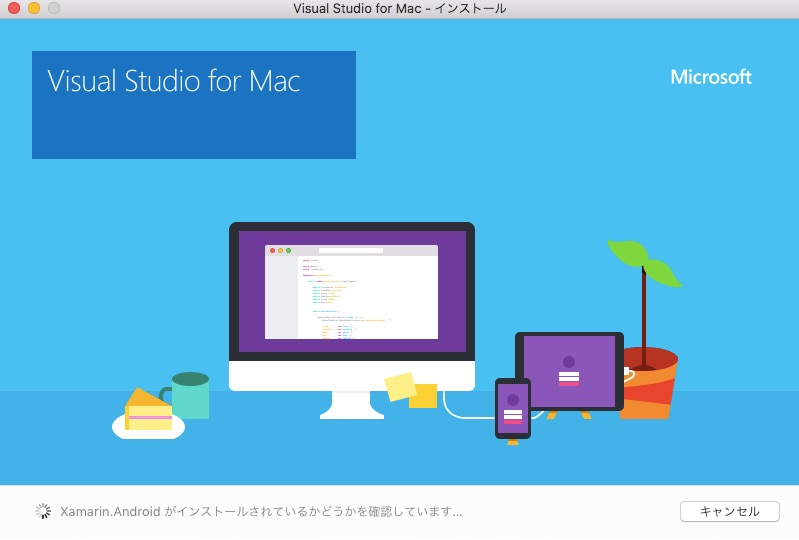
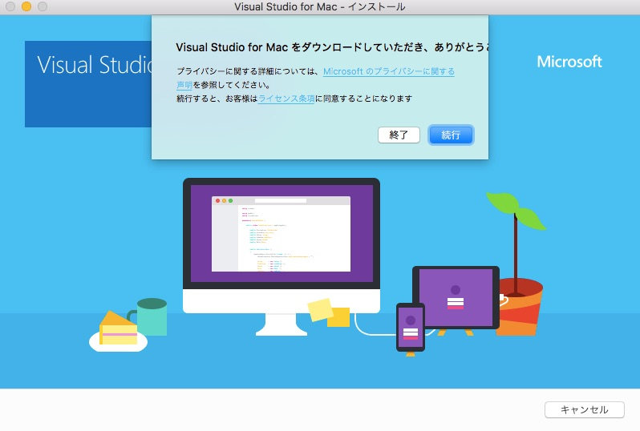
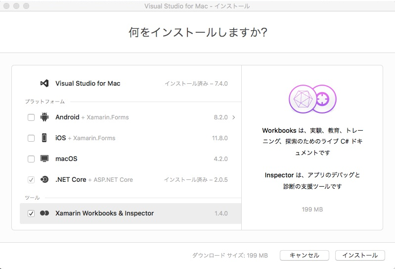
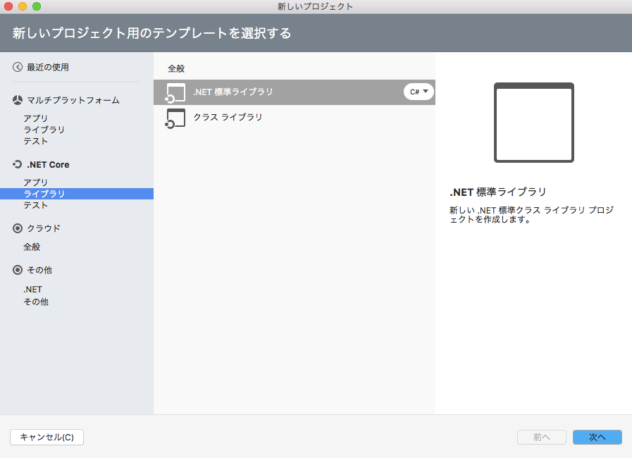
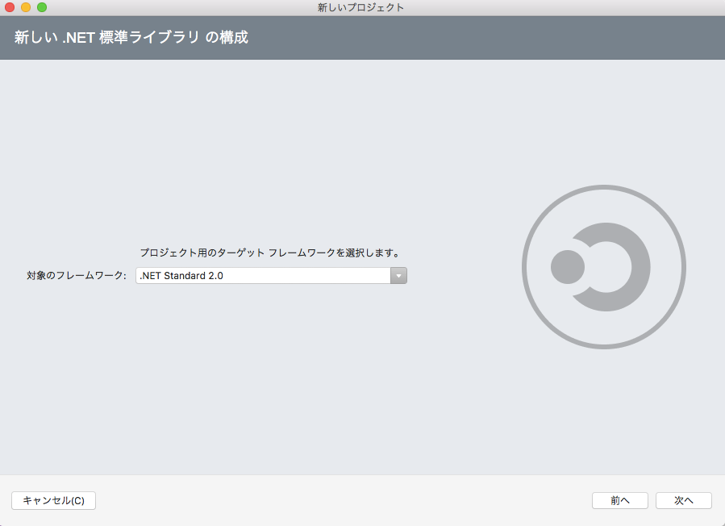
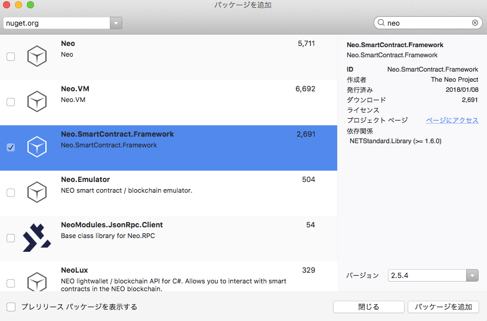
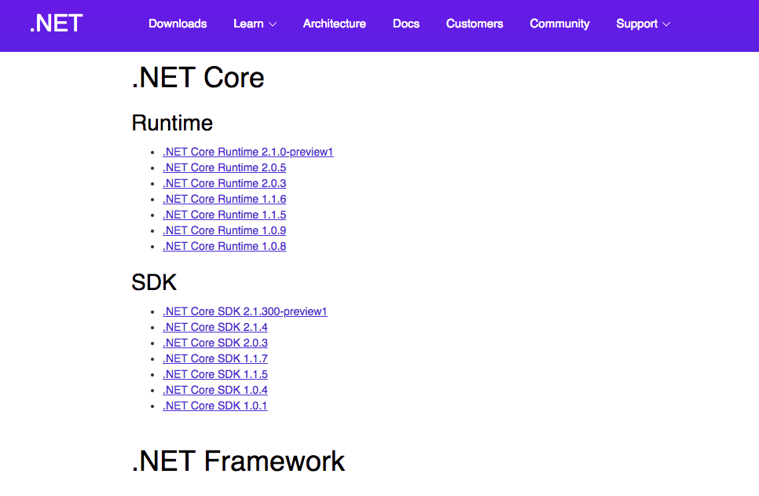

# macOSにおいてC#を使用してNeoスマートコントラクトを作成する方法

### 1. Visual Studio for Mac

お使いのコンピュータにVisual Studio for Macが既にインストールされている場合は、このセクションをスキップしてください。

[Visual Studio for Mac ダウンロード](https://www.visualstudio.com/ja/vs/visual-studio-mac/)

インストールは基本機能のみで構いません。Android / iOS / macOS のプラットフォームをインストールする必要はありません。







> [!Note]
> 基本、インストールは数十分で終わりますが、Android / iOS / macOS のプラットフォームのインストールにチェックを入れた場合はインストールに数時間かかることがあります。また、ネットワークの状況によっては何度か失敗する可能性があるので、今回、プラットフォームのインストールは推奨していません。

### 2. プロジェクトを作成

Visual Studio for Mac を起動し、新しいプロジェクト、.NET標準ライブラリを選択します。（.NET Core → ライブラリ）。



> [!Note]
> 新しいプロジェクトを作成するときは、.NET Coreバージョンの1.xを選択すると、次の「Neo.SmartContract.Framework」の追加が失敗するため、.NET Coreバージョンは2.0を選択します。


次に `依存関係`を右クリックし、`パッケージの追加...`をクリック。次に “neo”を検索し“Neo.SmartContract.Framework”を選択し、 `パッケージを追加`をクリック。



NEOスマートコントラクトのフレームワークを追加します。このパッケージの追加には数分かかります。

インストールが成功したら、次に以下のサンプルコードを上書きします：

```c#
using Neo.SmartContract.Framework;
using Neo.SmartContract.Framework.Services.Neo;

public class Class1: SmartContract
{
    public static bool Main()
    {
        return true;
    }
}
```

`Build`，`Build All` をクリックして、コードをコンパイルします。コンパイルが成功すると、bin/Debug/netstandard2.0/に.dllファイルが生成されます。 この .dllファイルは.NET IL言語ファイルで、後でneonコンパイラによって.avmスマートコントラクトファイルにコンパイルされます。

この例では、プロジェクトの名前はtest1です。コンパイル後、test1.dllが生成されます。このファイルは後で使用されます。

### 3. neo-compiler

GitHubで [neo-compiler](https://github.com/neo-project/neo-compiler) をダウンロードし、Visual Studio for Mac でソリューションを開き、neonプロジェクトをコンパイルします。

   > [!Note]
   > 最初にneonをコンパイルする場合、NuGetパッケージを復元する必要があります。ネットワークの速度によっては、このプロセスに数十分から数時間かかることがあり、途中で10回以上失敗する可能性がありますので、辛抱強く試してみてください。
   >
   > 今回の例では Visual Studio for Mac を使用してプロジェクトを復元しました。また Visual Studio Code と dotnet を用いてのプロジェクトの復元も行いました。それは何度も失敗し、数時間かかりました。
   >
   > NuGetの復元ができない場合はWindows上でneonプロジェクトを開き、復元されたプロジェクトをリリースし、macOSにコピーすることもできます。
   >
   > WindowsでmacOS版のneonをリリースする前にneon.csprojを開いて \<RuntimeIdentifiers>win10-x64\</RuntimeIdentifiers>を\<RuntimeIdentifiers>osx.10.12-x64\</RuntimeIdentifiers>に変える必要があります。
   >
   > RIDの詳細についてはこちらから参照できます [.NET Core Runtime IDentifier (RID) catalog](https://docs.microsoft.com/en-us/dotnet/core/rid-catalog)

リリースが成功すると、bin\Releaseディレクトリ以下にneon.dllファイルが生成されます。このフォルダの場所はあとで使用するので覚えておいてください。

### 4. .NET Core

ダウンロードしてインストールしてください。
[.NET Core Runtime 2.0.5](https://www.microsoft.com/net/download/all)



### 5. コマンドの入力

neon.dllのリリース先に先ほど作ったtest1.dllを移動させ、
`dotnet neon.dll test1.dll`を入力、実行します。

その際に次のエラーが出る人は次の手順を実行してください。

#### エラー1
```
It was not possible to find any compatible framework version
The specified framework 'Microsoft.NETCore.App', version '1.0.4' was not found.
  - Check application dependencies and target a framework version installed at:
      /
  - Alternatively, install the framework version '1.0.4'.
```

これはインストールした .NET Core Runtime のバージョンとneonコンパイラがデフォルトで使用しようとしている .NET Core Runtime のバージョンが違う為に起こるエラーで、次のように修正します：

neon.dllとどうディレクトリにある`neon.runtimeconfig.json`を開き、次のように編集します。

```
{
  "runtimeOptions": {
    "tfm": "netcoreapp1.0",
    "framework": {
      "name": "Microsoft.NETCore.App",
      "version": "2.0.5"
    }
  }
}
```

また以下のエラーが出る方は次を参照してください。
#### エラー2

```
Unhandled Exception: System.TypeInitializationException: The type initializer for 'Crypto' threw an exception. ---> System.TypeInitializationException: The type initializer for 'CryptoInitializer' threw an exception. ---> System.DllNotFoundException: Unable to load DLL 'System.Security.Cryptography.Native': The specified module could not be found.
```

これはmacOS上の .NET Core の問題で、一般的な現象であり、次のように修復することができます：

`ターミナル`を開き、次のコマンドを打ち込みます

```
sudo install_name_tool -add_rpath /usr/local/opt/openssl/lib /usr/local/share/dotnet/shared/Microsoft.NETCore.App/1.0.4/System.Security.Cryptography.Native.dylib
```
詳細は、以下のWebサイトを参照してください：

[https://github.com/dotnet/cli/issues/2229](https://github.com/dotnet/cli/issues/2229)

[https://stackoverflow.com/questions/39133356](https://stackoverflow.com/questions/39133356)

### 6. コンパイル

`ターミナル`を開き、`cd`を用いてステップ3の最後のフォルダに移動し、以下のコマンドを実行します。

```
dotnet neon.dll test1.dll
```

これでコンパイルを実行することができます。ここの test1.dll はステップ2で作成したものです。

```
Neo.Compiler.MSIL console app v2.0.3.1
Find entrypoint:System.Void test1.Class1::Main()
convert succ
gen abi succ
write:test1.avm
write:test1.abi.json
SUCC
```

上記のメッセージが表示されればコンパイル完了です。ディレクトリに test1.avm ファイルが生成されます。
