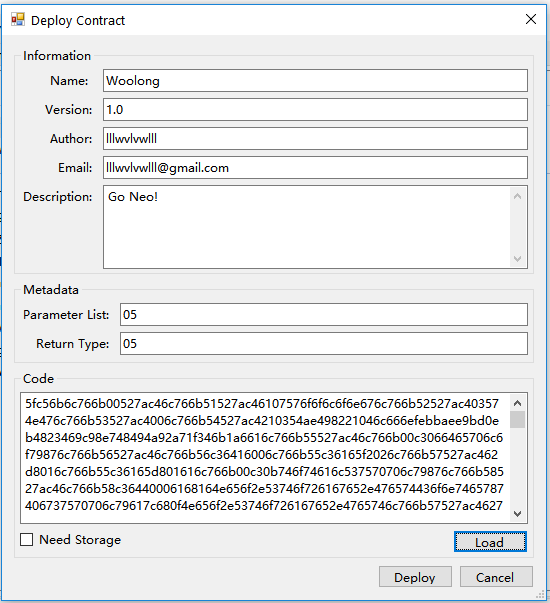

# パラメータを使用したスマートコントラクトのデプロイ

## 1 - はじめに
このチュートリアルでは、デスクトップGUIを使用してNEOブロックチェーンにスマートコントラクトをデプロイして呼び出す方法について説明します。このチュートリアルは汎用的なもので、NEP5トークンを含むすべての種類のコントラクトに適しています。このチュートリアルでは、コントラクトが既に.avmファイルにコンパイルされていることを前提としています。そうでない場合は、最初に他のチュートリアルを参照してください。このチュートリアルで使用されているソースコードとコンパイル済みのコントラクトは提供されています。

## 2 - 役に立つリソース

このチュートリアルでは以下のリソースを使用しています。スマートコントラクトを作成する際の参考にすることができます。

1. [ロックコントラクトのデプロイ](Lock2.md)
2. [スマートコントラクトパラメータと戻り値](Parameter.md)
3. [Woolong NEP5 スマートコントラクト](assets/examples/Woolong/Woolong/Woolong.cs)
4. [デベロッパーGUI](https://github.com/CityOfZion/neo-gui-developer)
5. [NEO API](../api/neo.md)
6. [NEP5トークン標準](https://github.com/neo-project/proposals/nep-5.mediawiki)

## 3 - SCコード
このドキュメントでは、Woolongサンプルで提供されているサンプルコードを使用してチュートリアルを進めます。楽しむために、このコントラクトはすべての呼び出しイベントに対して1つのWoolongを生成します。

この例は、テストネットにデプロイされており、次のスクリプトハッシュでアクセスできます。

    
    dc675afc61a7c0f7b3d2682bf6e1d8ed865a0e5f
    


## 4 - パラメータを使用したスマートコントラクトのデプロイ

1. スマートコントラクト（.avm）をブロックチェーンにデプロイするには、NEOデスクトップウォレットの**Advanced**メニューオプションをクリックし、**Deploy Contract**を選択します。開発用コントラクトの場合は、NEOデベロッパーGUIを使用することをお勧めします。

<p align="center"></p>

2. 表示されるウィンドウの**Information**セクションにあるすべてのフィールドを入力します。コントラクトをデプロイするには、すべてのフィールドに値を入力する必要があります。
3. **Load**ボタンを使用して.avmファイルをロードします。 **Code**フィールドにスクリプトハッシュが入力されます。 **Code**フィールドの内容を後で使用するためにコピーします。
4. [スマートコントラクトパラメータと戻り値](Parameter.md)のドキュメントを参照して、**Metadata**フィールドを入力します。

    **Woolongサンプルトークンは次のように定義されています:**  
     
    ```csharp
    public static object Main(string method, params object[] args)  
    ```  
	
    その為、以下を使用します:  
    * **Parameter List:** 05
    * **Return Type:** 05  
  
5. コントラクトにストレージが必要な場合は（[読み取り/書き込みAPI](../api/neo.md#readwrite-api)を使用）、**Need Storage**チェックボックスをオンにします。 NEP5標準では、アカウントを維持するためにストレージを使用しているため、NEP5トークンをデプロイする際は、チェックされていることを確認してください。
    
6. **Deploy**ボタンをクリックします。


## 5 - スマートコントラクトの表示

1. NEOウォレットのメインウィンドウで、アドレス領域を右クリックし、（Create Contract Add > Custom）を選択します。
2. **Related Account**ドロップダウンからコントラクトを関連付けるアカウントを選択します。
3. **Parameter List**フィールドに、**パラメータを使用したスマートコントラクトのデプロイ**セクションのステップ4で使用されている**Parameter List**値を入力します。
4. **Script**フィールドに、**パラメータを使用したスマートコントラクトのデプロイ**セクションののステップ3で指定された値を入力します。
5. **Confirm**をクリックして、コントラクトをウォレットウィンドウにロードします。
 
  
 
## 6 - スマートコントラクトの呼び出し

NEOブロックチェーンでスマートコントラクトを呼び出すには、スマートコントラクトスクリプトハッシュが必要です。
1. コントラクトハッシュを取得するには、**スマートコントラクトの表示**の結果としてアドレスウィンドウに入力されたコントラクトアカウントを右クリックします。
2. **View Contract**を選択し、スマートコントラクトに関する情報を含むウィンドウを開きます。**Script Hash**フィールドの値をコピーします。
3. **Advanced**メニューオプションをクリックし、**Invoke Contract**を選択します。
4. **Script Hash**フィールドに、ステップ2でコピーした値を入力します。例として、**セクション3**のスクリプトハッシュを使用してWoolongを呼び出すことができます。
5. スマートコントラクト情報は、残りの**Invoke Function**フィールドに自動的に入力されます。
6. 入力パラメーターを入力するには、パラメーターフィールドの隣にある「**...**」ボタンをクリックして、パラメータ入力ウィンドウを開きます。
7. 左のフィールドでパラメータを選択し、右下のフィールドに変数の値を入力します。

  **呼び出し例:**
  * `6e616d65` でWoolongを呼び出すと 'Woolong'を返します。
    ```csharp
    if (method == "name") return name;
    ```  
  * `73796d626f6c` は'WNG'を返します。
    ```csharp
     if (method == "symbol") return symbol;
    ```  
  * `62616c616e63654f66, 5fe459481de7b82f0636542ffe5445072f9357a1261515d6d3173c07c762743b` は、テストネット上で lllwvlvwll が保持するWoolongの現在の残高を返します。
    ```csharp
    if (method == "balanceOf") return Storage.Get(Storage.CurrentContext, (byte[]) args[0]);
    ```
  
8. **OK**をクリックして、パラメータ入力ウィンドウを閉じます。
9. **Invoke**ボタンをクリックして、スマートコントラクトを呼び出します。

**注意：** 現在の標準デスクトップGUIでは戻り値の表示はサポートされていません。実行時はデベロッパーGUIを使用することをお勧めします
