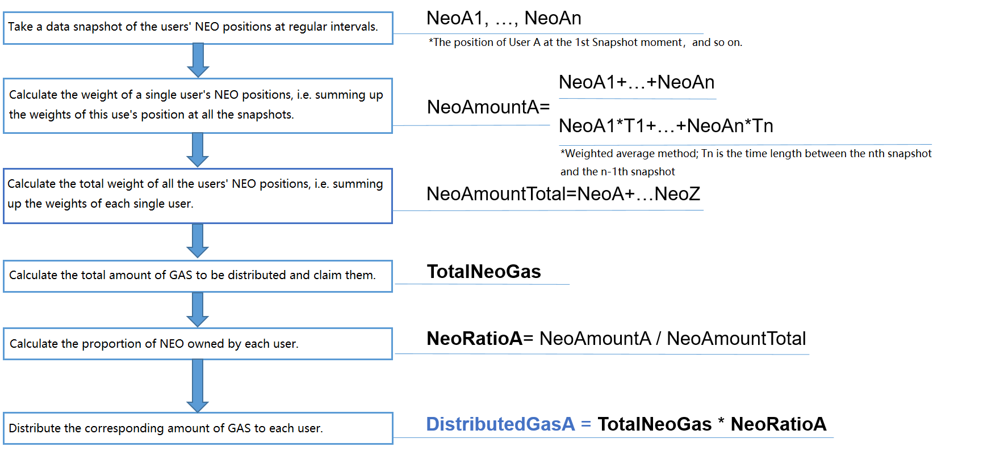

# Документация для разработчиков биржи криптовалют

> [!Note]
>
> Информация, содержащаяся в данном документе, относится к  [Neo CLI v2.9.1](https://github.com/neo-project/neo-cli/releases/tag/v2.9.1). 

NEO обладает двумя типами цифровых активов: глобальные активы (например, NEO, GAS) и контрактные активы (например, активы NEP-5). Это основные биржи, с которыми необходимо иметь дело в случае вывода и внесения активов, а также других операций. Клиент NEO-CLI функционирует как обычный узел в сети P2P, а также как межплатформенный кошелек, обрабатывающий транзакции различных активов. 

Биржа реализует следующие задачи：

- [NEO-CLI Plug-ins](#neo-cli-plug-ins)
- [Deploying a NEO Node on Server](#deploying-a-neo-node-on-server)
- [Using NEO-CLI](#using-neo-cli)
- [Dealing with Global Assets Transactions](#dealing-with-global-assets-transactions)
- [Dealing with NEP-5 Assets Transactions](#dealing-with-nep-5-assets-transactions)
- [Distributing GAS to Users](#distributing-gas-to-users)

## NEO-CLI Plug-ins

Начиная с NEO-CLI 2.9.0, в плагины были инкапсулированы дополнительные функциональные возможности, нацеленные на повышение безопасности узла, усиление его стабильности, а также увеличение гибкости (что значительно облегчило разработку на биржах). Пользователь может выбрать желаемую функциональность расширения вместо того, чтобы вызывать ее (каждый раз при запуске neo-cli) при помощи дополнительных параметров. Это позволяет избежать человеческих ошибок и избавиться от утомительных команд, таких как открытие кошелька и вызов applicationlogs. Нажмите [здесь](https://github.com/neo-project/neo-plugins/releases) чтобы скачать плагины.

> [!Note]
>
> Вы должны установить плагин ApplicationLogs еще до того, как начать синхронизацию клиента NEO (в противном случае журнал в блоках, синхронизированный ранее, будет утерян).

| Плагин                                                       | Описание                                                     |                                      |
| ------------------------------------------------------------ | ------------------------------------------------------------ | ------------------------------------ |
| [ApplicationLogs](https://github.com/neo-project/neo-plugins/releases/download/v2.9.0/ApplicationLogs.zip) | Автоматически синхронизирует журнал смарт-контракта (ApplicationLogs) в режиме RPC. В настоящее время журнал был изменен таким образом, чтобы его можно было хранить в формате LevelDB. | Обязателен для бирж              |
| [ImportBlocks](https://github.com/neo-project/neo-plugins/releases/download/v2.9.0/ImportBlocks.zip) | Синхронизирует клиента, используя оффлайн-пакеты. Данный плагин включен в дистрибутив. | Обязателен для бирж              |
| [RpcDisabled](https://github.com/neo-project/neo-plugins/releases/download/v2.9.0/RpcDisabled.zip) | Отключает все сервисы RPC.                                   | Опционально                             |
| [SimplePolicy](https://github.com/neo-project/neo-plugins/releases/download/v2.9.0/SimplePolicy.zip) | Реализует политики для консенсуса.                              | Обязателен для создания приватной сети |
| [StatesDumper](https://github.com/neo-project/neo-plugins/releases/download/v2.9.0/StatesDumper.zip) | Экспортирует данные статуса NEO-CLI.                                 | Опционально                             |

## Развертывание узла NEO на сервере

Для развертывания узла NEO выполните следующие действия:

1. Установите [.NET Core Runtime](https://www.microsoft.com/net/download/core#/runtime) на сервере (2.0 и более поздняя версия).

2. Скачайте программу [NEO-CLI](https://github.com/neo-project/neo-cli/releases) с GitHub, чтобы реализовать узел NEO .

3. Скачайте [ApplicationLogs](https://github.com/neo-project/neo-plugins/releases/download/v2.9.0/ApplicationLogs.zip) и [ImportBlocks](https://github.com/neo-project/neo-plugins/releases/download/v2.9.0/ImportBlocks.zip) в каталог [Plugins](https://github.com/neo-project/neo-plugins/releases) с Github, чтобы получить все функции, предназначенные для API журнала транзакций и автоматическую синхронизацию с автономным пакетом.

4. Создайте новую папку Plugins (первая буква в названии должна быть заглавной) в корневом каталоге NEO-CLI и скопируйте в нее разархивированные плагины. 

   

5. Перед запуском NEO-CLI настройте файл config.json таким образом, чтобы клиент мог вызывать API, относящиеся к кошельку. См. пример ниже:  

   ```
    {
     "ApplicationConfiguration": {
       "Paths": {
         "Chain": "Chain_{0}",
         "Index": "Index_{0}"
       },
       "P2P": {
         "Port": 10333,
         "WsPort": 10334
       },
       "RPC": {
         "Port": 10332,
         "SslCert": "",
         "SslCertPassword": ""
       },
       "UnlockWallet": {
         "Path": "wallet.json",
         "Password": "11111111",
         "StartConsensus": false,
         "IsActive": true
       }
     }
   }
   ```

   Когда вы открываете NEO-CLI (после настройки файла), клиент автоматически откроет указанный кошелек и загрузит индекс кошелька после его синхронизации с последней высотой блока. 

   > [!Note]
   >
   > API, которые требуют открытия кошелька, можно вызывать только из кошелька, который был указан в config.json. При вызове данных API из других кошельков, возвращается код ошибки «доступ запрещен». 

Дополнительную информацию см. в [Installation and deployment of NEO node](../node/cli/setup.md).

## Использование NEO-CLI

### Политики безопасности NEO-CLI

> [!Warning]
>
> Во избежание значительных рисков, связанных с безопасностью, биржа должна использовать белый список или брандмауэр, блокирующий запросы внешнего сервера.

NEO-CLI не предоставляет функцию удаленного включения / выключения кошелька и не верифицирует весь процесс при открытии кошелька. Именно поэтому биржам следует устанавливать собственные политики безопасности. Кошелек должен всегда оставаться открытым, чтобы отвечать на запросы пользователей о выводе средств. В целях безопасности кошельки должны работать на независимом сервере с правильно настроенным брандмауэром (как показано ниже). 

|                    | Mainnet | Testnet |
| ------------------ | ------- | ------- |
| JSON-RPC via HTTPS | 10331   | 20331   |
| JSON-RPC via HTTP  | 10332   | 20332   |
| P2P                | 10333   | 20333   |
| websocket          | 10334   | 20334   |

### About NEO-CLI

NEO-CLI – это клиент (кошелек), работающий в формате командной строки и предназначенный для разработчиков. Разработчики могут взаимодействовать с NEO-CLI двумя способами： 

- Используя команды CLI (интерфейс в формате командной строки). Например, вы можете создать кошелек, сгенерировать адрес и тд.
- Используя удаленный вызов процедур (RPC). Например, вы можете осуществлять передачу в указанный адрес, собирать информацию о блоке и информацию назначении платежа, и т.д.

NEO-CLI предоставляет следующие функциональные возможности： 

- Выступая в роли кошелька, управляет активами с помощью командной строки.

  Чтобы "включить" кошелек, введите следующую команду в каталоге NEO-CLI：


  ```
  dotnet neo-cli.dll
  ```

  Чтобы получить информацию о всех доступных командах, введите следующую команду：

  ```
  help
  ```

  Дополнительную информацию см. в [CLI Command Reference](../node/cli/cli.md).

- Предоставляет API для получения данных блокчейна из узлов. Интерфейсы реализуются с помощью [JSON-RPC](http://www.jsonrpc.org/specification)，В качестве базовых средств коммуникации используются протоколы HTTP/HTTPS.

  Чтобы запустить узел, который предоставляет сервис RPC, введите следующую команду в каталоге NEO-CLI：

  ```
  dotnet neo-cli.dll --rpc
  ```

  Больше информации по API см. в [API Reference](../node/cli/apigen.md).


- Предоставляет информацию о транзакции активов NEP-5

  > [!Note]
  >
  > Чтобы синхронизировать журнал активов NEP-5, необходимо установить только плагин [ApplicationLogs](https://github.com/neo-project/neo-plugins/releases/download/v2.9.0/ApplicationLogs.zip) и включить `--rpc`. Дополнительную информацию см. в [NEO-CLI Installation](../node/cli/setup.md).

- Подключаемся к seed-узлам напрямую

  Если после открытия NEO-CLI число соединений всегда равно 0, вы можете напрямую подключить seed-узлы, чтобы синхронизировать блоки с помощью следующей команды：

  ```
  dotnet neo-cli.dll --nopeers
  ```

| #    | Функция                                                                   | Команда              |
| ---- | ------------------------------------------------------------------------- | -------------------- |
| 1    | Запустить NEO-CLI                                                         | `dotnet neo-cli.dll` |
| 2    | Открывает RPC и записывает в журнал информацию о транзакции активов NEP-5 | `--rpc`              |
| 3    | Подключает к seed-узлам                                                   | `--nopeers`          |

> [!Note]
>
> Вы можете реализовывать множественные функции (например, чтобы выполнить все перечисленные выше функции, введите следующее):
>
> ```
> dotnet neo-cli.dll --rpc --nopeers
> ```

### Создание кошелька

Чтобы управлять адресами депозитов пользователей, бирже необходимо создать онлайн-кошелек. Он используется для хранения информации о счетах (как открытые, так и закрытые ключи) и контрактах. Это самое важное доказательство, которое есть у пользователя. Пользователи должны хранить файлы кошелька и его пароли в секрете (эти данные нельзя терять или раскрывать другим лицам). Биржи  не обязаны создавать кошелек для каждого адреса. Обычно онлайн-кошелек хранит все адреса с депозитами пользователя. Холодный кошелек (оффланй-кошелек) является еще одним вариантом хранения депозитов, который обеспечивает бОльшую безопасность.

> [!Note]
>
> NEO-CLI поддерживает два формата кошелька: кошелек sqlite (.db3) и новый кошелек [стандарта NEP6](https://github.com/neo-project/proposals/blob/master/nep-6.mediawiki) (.json). Для биржи мы рекомендуем использовать кошелек sqlite.

Чтобы создать кошелек, выполните следующие действия：

1. Введите  `create wallet <path>`.

   <path> путь кошелька и имя файла кошелька. В зависимости от типа кошелька, который вы используете (например,  `create wallet /home/mywallet.db3`), расширением файла может быть .db3 или .json. Если расширение файла не указано, то по умолчанию используется формат NEP6 (.json). 

2. Задайте пароль кошелька. 

### Генерирование адреса депозита

Кошелек может хранить несколько адресов. Биржа должна генерировать адрес депозита для каждого пользователя.

Существуют два способа, позволяющих сгенерировать адрес депозита: 

- Когда пользователь вносит активы (NEO/NEO GAS) впервые, программа динамически генерирует новый адрес NEO. Преимуществом данного подхода является отсутствие необходимости генерировать адреса в заданные промежутки времени (однако этот подход неудобен для   резервирования).

  Чтобы разработать программу, которая будет динамически генерировать адреса, используйте API-метод NEO-CLI [getnewaddress](../node/cli/2.9.1/api/getnewaddress.md). Будет возвращен созданный адрес.

- Биржа имеет заранее созданный пакет адресов NEO. Когда пользователь вносит активы (NEO / NEO GAS) впервые, биржа присваивает ему или ей адрес NEO. Преимущество данного способа заключается в удобстве резервного копирования кошелька, а недостатком является необходимость генерировать адреса NEO вручную.
  Чтобы сгенерировать адреса в пакете, выполните команду NEO-CLI `create address [n]`. Адреса автоматически экспортируются в файл address.txt.
  [n] опционален, его значение по умолчанию равно 1. Например, чтобы сгенерировать 100 адресов единовременно, введите `create address 100`.

> [!Note]
>
> Биржа должна, используя один из перечисленных способов, импортировать адреса в базу данных и распространить их между пользователями. Рекомендуется, однако, применять второй способ, который позволяет уменьшить контроль извне и надежнее реализовать кошелек.


## Транзакции глобальных активов

### Разработка программ для внесения и снятия активов пользователями

В случае с глобальными активами бирже необходимо разработать специальные программы, чтобы выполнить следующие функции:

1. Мониторинг новых блоков с помощью NEO-CLI API-метода ([getblock](../node/cli/2.9.1/api/getblock2.md)).
2. Обращение с депозитами пользователя согласно информации о транзакции. 
3. Хранение записей о транзакциях, имеющих отношение к бирже.

#### Депозиты пользователя 

В случае с депозитами пользователя биржа должна обратить внимание на следующее: 

- Блокчейн NEO имеет только одну главную цепочку (без боковых цепочек), поэтому он не будет разветвляется и иметь изолированные блоки.

- Транзакция, записанная в блокчейне NEO, не может быть подделана, то есть подтверждение транзакции говорит о том, что операция внесения активов прошла успешно.

- Как правило, баланс адреса депозита на бирже не равен балансу, который есть у пользователя на бирже. Это объясняется следующим：
  - При переводе или снятии активов кошелек NEO просматривает один или несколько адресов в кошельке, находит минимальную сумму, которая соответствует требованию, добавляет ее к общей сумме транзакции, а затем использует это в качестве входа вместо того, чтобы снимать актив из указанного адреса (если биржа не переписывает некоторые функции кошелька NEO для удовлетворения собственных потребностей).
  - Другие операции, которые могут привести к различиям в балансе (например, биржа переводит часть активов в свои холодные кошельки).

- В адресе NEO находятся более двух активов (NEO и NEO GAS). В нем могут храниться также другие активы, выпущенные пользователями (такие как пакет акций или токен). Биржа должна определить тип актива, который вносит пользователь (она не может классифицировать другие активы как NEO или GAS или перепутать снятие NEO со снятием GAS). 

- Кошелек NEO – это полный узел, который, чтобы  синхронизировать блоки, должен всегда оставаться он-лайн. Вы можете видеть статус синхронизации блока с помощью состояния показа в NEO-CLI, например:

  ```
  ... 
  neo>show state
  Height: 99/99/99, Nodes: 10 
  ...
  ```

  Это обозначает следующее: высота блока составляет 99/ высота блокчейна составляет 99/высота заголовка блокчейна составляет 994; число подключенных узлов равно 10.

  Предположим, что данный узел полностью подключен к сети P2P. Когда высота блока становится равной высоте заголовка блока, синхронизация узла завершена. Кроме того, когда высота кошелька, высота блока и высота заголовка блока одинаковы, это говорит о том, что синхронизация узла и создание индекса кошелька завершены. 

- Перевод между пользователями на бирже не должен записываться через блокчейн. Как правило баланс пользователя изменяется непосредственно в базе данных. В блокчейн должны записываться только депозиты и снятия активов.

#### Запись депозита

Биржа должна писать код для мониторинга каждой транзакции в блоке, а также записывать все транзакции, связанные с адресами биржи в базе данных. В случае внесения депозита необходимо обновить баланс пользователя. 

Разработчики могут воспользоваться API-методом NEO-CLI `getblock <index> [verbose]`, чтобы получить информацию о блоке. `<index>` это индекс блока. `[verbose]` по умолчанию равен 0. Когда `[verbose]` равен 0, метод возвращает сериализованную информацию о блоке в шестнадцатеричном формате. Когда `[verbose]` равен 1, метод возвращает подробную информацию о соответствующем блоке в формате JSON. Дополнительную информацию см. в [getblock](../node/cli/2.9.1/api/getblock2.md).

Информация о блоке включает в себя вход и выход транзакций. Биржа должна записывать все связанные с ней транзакции. Выход транзакций - это фактически запись о транзакции снятия активов пользователем. Когда биржа видит какой-либо из своих адресов в выходе транзакций, она обновляет баланс NEO/ GAS  пользователя, которому принадлежит данный адрес депозита. Некоторые биржи могут поступать также следующим образом: если они находят адрес внутри биржи в виде выхода транзакции, они записывают депозит в свою базу данных и изменяют баланс пользователя после нескольких подтверждений (мы не рекомендуем использовать этот способ, если только бирже не надо соответствовать работе других блокчейнов). 

> [!Note]
>
> - Метод `getblockcount` возвращает количество блоков в главной цепочке. Первый параметр метода `getblock` это `<index>` являющийся индексом блока. Индекс блока = Высоте блока = Количество блоков - 1. Если `getblockcount` возвращает 1234, вы должны использовать `getblock 1233` чтобы получить информацию о последнем (новом) блоке. 
> - Транзакции внесения и снятия (NEO/GAS) относятся к типу под названием ContractTransaction. Когда биржи просматривают транзакции в блоке, они должны обращать внимание только на те транзакции, которые относятся к типу ContractTransaction. 
> - Поскольку первая транзакция каждого блока должна быть MinerTransaction, вы можете не учитывать ее или «перепрыгнуть" через нее при обходе  блокчейна. 
> - В системе NEO за единицу записи принята транзакция.
>

### Снятие актива пользователем 

Чтобы работать со снятием глобальных активов пользователем, биржа должна выполнить следующие действия:

1. В NEO-CLI выполнить `open wallet <path>` чтобы открыть кошелек.

2. Записать транзакцию снятия актива пользователем и изменить баланс пользователя.

3. (Опционально) Служба поддержки клиентов работает с заявками на снятие.

4. Отправить транзакцию в адрес снятия активов пользователя, используя API-метод NEO-CLI,`sendtoaddress <asset_id> <address> <value> [fee=0]`. Дополнительную информацию см. в [sendtoaddress Method](../node/cli/2.9.1/api/sendtoaddress.md).

   - `<asset_id>` : ID актива
   - `<address>` : адрес списания
   - `<value>` : сумма списания
   - `[fee]`: Опциональный параметр. Оплата комиссии за обработку помогает повысить приоритет сети, в которой происходит передача активов. Данный параметр по умолчанию равен 0 (0.00000001 – это минимальное значение, которое можно задать).

   Вы также можете отправить транзакцию в пакет адресов, используя API-метод [sendmany Method](../node/cli/2.9.1/api/sendmany.md).

5. Извлечь ID транзакции из сведений о возвращенной транзакции в формате JSON, а затем записать его в базу данных.

6. Когда блокчейн подтвердит транзакцию снятия, отметить ее как успешно проведенную. 

   Помимо отслеживания внесения активов необходимо также отслеживать их снятие. Если ID транзакции снятия можно найти в блокчейне, это означает, что данная транзакция уже подтверждена и успешно проведена.

> [!Note]
>
> -  <value> относится к фактической сумме, а не к сумме, умноженной на 10^8.
> -  Сумма перевода NEO должна быть целым числом; в противном случае, перевод останется не подтвержденным (хотя транзакцию можно создать в NEO-CLI). Это повлияет на статус изменения кошелька и приведет к ошибке в отправке других транзакций. В данной ситуации вам надо перестроить индекс кошелька для того, чтобы пересчитать транзакцию и изменить кошелек.

## Транзакции активов NEP-5

### Получение уведомления о внесении средств пользователем

Как в случае с глобальными активами,  биржа может получить информацию о пользовательских депозитах активов NEP-5, выполняя следующие действия:

1. Получить сведения о каждом блоке (включая сведения обо всех транзакциях в блоке), используя API `getblock`.
2. Проанализировать тип каждой транзакции и отфильтровать все транзакции, относящиеся к типу InvocationTransaction. Для передачи активов NEP-5 не может быть использована никакая другая транзакция кроме InvocationTransaction.
3. Вызвать API-метод `getapplicationlog`, чтобы получить сведения о каждой транзакции InvocationTransaction, и проанализировать содержание транзакции, чтобы завершить внесение депозита пользователя.

#### Вызов getapplicationlog

Данный API используется для получения информации о транзакции.

Папка ApplicationLogs генерируется в корневом пути. В данном каталоге записывается заполненный журнал контракта, а каждая транзакция NEP-5 записывается в файле leveldb.

Далее продемонстрирован пример с результатом вызова API. Обратите внимание: структура ответа изменилась (начиная с версии 2.9.0) по сравнению с предыдущими версиями.

```JSON
{
    "jsonrpc": "2.0",
    "id": 1,
    "result": {
        "txid": "0xff488264c1abf9f5c3c17ed8071f6dd3cd809b25797a43af49316490ded8fb07",
        "executions": [
            {
                "trigger": "Application",
                "contract": "0x0110a8f666bcc650dc0b544e71c31491b061c79e",
                "vmstate": "HALT, BREAK",
                "gas_consumed": "2.855",
                "stack": [
                    {
                        "type": "Integer",
                        "value": "1"
                    }
                ],
                "notifications": [
                    {
                        "contract": "0xb9d7ea3062e6aeeb3e8ad9548220c4ba1361d263",
                        "state": {
                            "type": "Array",
                            "value": [
                                {
                                    "type": "ByteArray",
                                    "value": "7472616e73666572"
                                },
                                {
                                    "type": "ByteArray",
                                    "value": "e3069da508f128069a0cd2544b0728ccbacdfb43"
                                },
                                {
                                    "type": "ByteArray",
                                    "value": "d142f89e93b2717426a8130c37dad93aad70cff5"
                                },
                                {
                                    "type": "ByteArray",
                                    "value": "00e1f50500000000"
                                }
                            ]
                        }
                    }
                ]
            }
        ]
    }
}
```


> [!Note]
>
> - Не проведенная транзакция NEP-5 может быть записана также в блокчейн, поэтому вам нужно определить, является ли верным параметр состояния виртуальной машины "vmstate". 
> - "vmstate" обозначает состояние виртуальной машины после того, как она выполнила контракт. Если данный параметр содержит "FAULT", значит, контракт не выполнен, и транзакция недействительна. 

Ниже перечислены параметры, относящиеся к транзакции в файле:

-  **contract**: хэш скрипта смарт-контракта, по которому биржа может идентифицировать тип активов. Например, "0xb9d7ea3062e6aeeb3e8ad9548220c4ba1361d263" является хэшом скрипта и уникальным идентификатором актива QLC.

-  Четыре объекта, включенные в массив "value", относящийся к "state":

   [event, from account, to account, amount]

   - Первый объект, имеющий тип «байтовый массив» и значение 7472616e73666572 (как показано в примере), может быть преобразован в строку transfer. Transfer – это метод в NEP-5, который представляет передачу активов.

      ```json
      {
        "type": "ByteArray",
        "value": "7472616e73666572"
      }
      ```

   - Второй объект в массиве – это адрес счета, с которого переводится данный актив. Он имеет тип «байтовый массив», значение e3069da508f128069a0cd2544b0728ccbacdfb43 может быть преобразовано в AcUGxiaPjCiD74VWiFqPzudJHZo4QMza5Q. Обратите внимание: для шестнадцатеричной строки с префиксом 0x он обрабатывается как big endian (обратный порядок байтов), в других случаях он обрабатывается как small endian (прямой порядок байтов).

      ```json
      {
        "type": "ByteArray",
        "value": "e3069da508f128069a0cd2544b0728ccbacdfb43"
      }
      ```

   - Третий объект в массиве – это адрес счета, на который переводится данный актив. Он имеет тип «байтовый массив». Значение d142f89e93b2717426a8130c37dad93aad70cff5 может быть преобразовано в AarM6q48K55EBHhuRRRPVsGByrqBKoQoWf. Если адрес является адресом счета на бирже, то это транзакция внесения.

      ```json
      {
        "type": "ByteArray",
        "value": "d142f89e93b2717426a8130c37dad93aad70cff5"
      }
      ```

   - Четвертый объект в массиве – это сумма перевода. Данный объект обрабатывается как little endian, после инвертирования он превращается в 0000000005f5e100  со значением 100000000. Поскольку десятичное число – это 8 бит, то фактическое значение – это 100000000. Существует два типа amount, integer и bytearray. Обратите внимание, что при обращении с amount типа interger метод преобразования значения отличается от того, что используется для типа bytearray.

      ```json
      {
        "type": "ByteArray",
        "value": "00e1f50500000000"
      }
      ```

> [!Note]
>
> Вы можете написать инструмент для конвертирования значений в файле уведомления в формат, более пригодный для чтения. Пример см. в  [ApplicationLogsTools](https://github.com/chenzhitong/ApplicationLogsTools).

### Запрос баланса пользователя

Чтобы запросить баланс пользователя, биржа должна выполнить следующие действия:

1. Создать файлы JSON для того, чтобы вызвать три метода (`balanceOf`, `decimals`, and `symbol`) , используя RPC API invokefunction.
2. Отправить файлы JSON на RPC-сервер NEO.
3. Посчитать баланс пользователя согласно возвращенным значениям.

#### invokefunction

В JSON тело общего запроса invokefunction выглядит следующим образом:

```
{
  "jsonrpc": "2.0",
  "method": "invokefunction",
  "params": [
    "script hash",
    "method name",
    [
      {
        "optional arguments"
      }
    ]
  ],
  "id": 1
}
```

При запросе баланса пользователя необходимо заменить следующие строки:

- script hash

  Хэш скрипта токена NEP-5, который вы запрашиваете. Например, вы можете увидеть следующий хеш скрипта RPX : *0xecc6b20d3ccac1ee9ef109af5a7cdb85706b1df9*.


- method name

  Имя метода, который вы вызываете. Чтобы запросить баланс пользователя, вам нужно вызвать три метода, перечисленные ниже:

  **balanceOf**

  - Ситаксис: `public static BigInteger balanceOf(byte[] account)`
  - Примечание: "balanceOf" возвращает баланс токена в '''account'''.

  **decimals**

  - Ситаксис: `public static byte decimals()`
  - Примечание: "decimals" возвращает количество десятичных знаков, использованных токеном.

  **symbol**

  - Ситаксис: `public static string symbol()`
  - Примечание: "symbol" возвращает символ токена.

- опциональные аргументы

  Опционально. Если метод, который вы вызываете, требует аргументы, вы можете передать их, встроив данные параметры в массив. Например, "balanceOf" в NEP-5 возвращает баланс токена в "account":

  `public static BigInteger balanceOf(byte[] account)`

  Поэтому в методе "balanceOf" вам необходимо передать account в виде аргумента.

#### Пример

##### **Вызов balanceOf**

Предположим, что AKibPRzkoZpHnPkF6qvuW2Q4hG9gKBwGpR – это адрес account. Вам нужно преобразовать его в тип Hash160 и создать этот параметр в виде объекта JSON:

```json
{
    "type": "Hash160",
    "value": "0xa7274594ce215208c8e309e8f2fe05d4a9ae412b"
}
```

Затем вы можете создать JSON- сообщение, как показано ниже:

Пример запроса：

```json
{
  "jsonrpc": "2.0",
  "method": "invokefunction",
  "params": [
    "0xecc6b20d3ccac1ee9ef109af5a7cdb85706b1df9",
    "balanceOf",
    [
      {
        "type": "Hash160",
        "value": "0xa7274594ce215208c8e309e8f2fe05d4a9ae412b"
      }
    ]
  ],
  "id": 3
}
```

После отправки запроса вы получите следующий ответ：

```json
{
    "jsonrpc": "2.0",
    "id": 3,
    "result": {
        "script": "142b41aea9d405fef2e809e3c8085221ce944527a751c10962616c616e63654f6667f91d6b7085db7c5aaf09f19eeec1ca3c0db2c6ec",
        "state": "HALT, BREAK",
        "gas_consumed": "0.338",
        "stack": [
            {
                "type": "ByteArray",
                "value": "00c2eb0b"
            }
        ]
    }
}
```

Он возвращает "00c2eb0b" которое можно преобразовать в целое число **200000000**.

##### **Вызов decimals**

Пример запроса：

```json
{
  "jsonrpc": "2.0",
  "method": "invokefunction",
  "params": [
    "0xecc6b20d3ccac1ee9ef109af5a7cdb85706b1df9",
    "decimals", 
    []
    ],
  "id": 2
}
```

После отправки запроса вы получите следующий ответ：

```json
{
    "jsonrpc": "2.0",
    "id": 2,
    "result": {
        "script": "00c108646563696d616c7367f91d6b7085db7c5aaf09f19eeec1ca3c0db2c6ec",  
        "state": "HALT, BREAK",
        "gas_consumed": "0.156",
        "stack": [
            {
                "type": "Integer",
                "value": "8"
            }
        ]
    }
}
```

Он возвращает целое число 8.

##### **Вызов symbol**

Пример запроса：

```json
{
  "jsonrpc": "2.0",
  "method": "invokefunction",
  "params": [
    "0xecc6b20d3ccac1ee9ef109af5a7cdb85706b1df9",
    "symbol", 
    []
    ],
  "id": 1
}
```

После отправки запроса вы получите следующий ответ：

```json
{
    "jsonrpc": "2.0",
    "id": 1,
    "result": {
        "script": "00c10673796d626f6c67f91d6b7085db7c5aaf09f19eeec1ca3c0db2c6ec",          "state": "HALT, BREAK",
        "gas_consumed": "0.141",
        "stack": [
            {
                "type": "ByteArray",
                "value": "525058"
            }
        ]
    }
}
```

Он возвращает "525058", которое можно преобразовать в строку "RPX".

##### **Подсчет баланса пользователя**

Учитывая все возвращенные значения, мы можем посчитать баланс пользователя следующим образом:
Баланс = 200000000/10<sup>8</sup> RPX = 2 RPX

### Снятие актива пользователя

Чтобы отправить активы NEP-5 пользователям, биржа может воспользоваться одним из следующих способов: 

- NEO-CLI команда: `send`
- RPC метод: `sendfrom`
- RPC метод: `sendtoaddress`
- RPC метод: `sendmany`

> [!Note]
>
> Для использования данных API вам необходимо открыть кошелек в NEO-CLI.

#### NEO-CLI Command: send

##### Синтаксис

`send <txid|script hash> <address> <value> [fee = 0]`

##### Параметры

- txid|script hash: ID актива.

- address: адрес получателя.

- value: сумма перевода.

- fee: Опциональный параметр. Оплата комиссии за обработку помогает повысить приоритет сети, в которой происходит передача активов. Данный параметр по умолчанию равен 0 (0.00000001 – это минимальное значение, которое можно задать).


Данная команда потребует пароль кошелька. 

##### Пример

Чтобы перевод 100 RPX в адрес AeSHyuirtXbfZbFik6SiBW2BEj7GK3N62b имел приоритет над другими обычными переводами, введите следующее:

```
send 0xecc6b20d3ccac1ee9ef109af5a7cdb85706b1df9 AeSHyuirtXbfZbFik6SiBW2BEj7GK3N62b 100 0.00000001
```

IЕсли вам нужно отправить глобальный актив, просто замените первый параметр на txid. Например, 
TXID NEO: 0xc56f33fc6ecfcd0c225c4ab356fee59390af8560be0e930faebe74a6daff7c9b
TXID GAS: 0x602c79718b16e442de58778e148d0b1084e3b2dffd5de6b7b16cee7969282de7

#### RPC метод: sendfrom

Ключевой параметр ("params") включают в себя массив, состоящий из по меньшей мере четырех параметров.

`"params":[script hash, address from, address to, amount, fee(optional), change address(optional)]`

Например, чтобы отправить 1 RPX из AKibPRzkoZpHnPkF6qvuW2Q4hG9gKBwGpR в AVECC4AcGXfDjm7cGmfGuxVRGTu6FxoQ7h, создайте JSON-файл (как показано ниже) и отправьте его в RPC-сервер.

Пример запроса:

```json
{
  "jsonrpc": "2.0",
  "method": "sendfrom",
  "params": ["0xecc6b20d3ccac1ee9ef109af5a7cdb85706b1df9","AKibPRzkoZpHnPkF6qvuW2Q4hG9gKBwGpR","AVECC4AcGXfDjm7cGmfGuxVRGTu6FxoQ7h",1],
  "id": 1
}
```

После отправки запроса вы получите следующий ответ：

```json
{
    "jsonrpc": "2.0",
    "id": 1,
    "result": {
        "txid": "0xec413354b76fc50a614419f76f131c873da0b17e0fd2dd9170c955b667de08ef",
        "size": 219,
        "type": "InvocationTransaction",
        "version": 1,
        "attributes": [
            {
                "usage": "Script",
                "data": "2b41aea9d405fef2e809e3c8085221ce944527a7"
            }
        ],
        "vin": [],
        "vout": [],
        "sys_fee": "0",
        "net_fee": "0",
        "scripts": [
            {
                "invocation": "401743a9c3fc91f131aea1c872d166e9c6fae577647884cd8511986041561c2b3e574c1708f662e570688d1a31db7cea281d43615b7fa64d7fa3babf0f6477c31e",
                "verification": "2103c532d9335f512e1198ede5c3d35524e6a3b4598f1eb335193b09c4cd52591927ac"
            }
        ],
        "script": "0400e1f505149393ee15ce6612484ab5be3bbc78c82af8dc0e07142b41aea9d405fef2e809e3c8085221ce944527a753c1087472616e7366657267f91d6b7085db7c5aaf09f19eeec1ca3c0db2c6ecf166c72745294a433e52",
        "gas": "0"
    }
}
```

#### RPC метод: sendtoaddress

Ключевой параметр ("params") включают в себя массив, состоящий из по меньшей мере трех параметров. 

`"params":[script hash, address, amount, fee(optional), change address(optional)]`

Например, чтобы отправить 1 RPX в AbP3FU3YcqBrWh72nc9deyQB99eazG9XUg , создайте JSON-файл (как показано ниже) и отправьте его в RPC-сервер.

Пример запроса：

```json
{
    "jsonrpc":"2.0",
    "method":"sendtoaddress",
    "params":[
        "0xecc6b20d3ccac1ee9ef109af5a7cdb85706b1df9",
        "AbP3FU3YcqBrWh72nc9deyQB99eazG9XUg",
        "1",
        "0",
        "ARkJ8QcVdYL68WRvN3wj3TSvXX8CgmC73Z"
    ],
    "id":1
}
```

После отправки запроса вы получите следующий ответ：

```json
{
    "jsonrpc":"2.0",
    "id":1,
    "result":{
        "txid":"0xc6d4bf7c62fb47e0b2a6e838c3a1ca297622a1b1df7ceb2d30fa4ef8b7870700",
        "size":219,
        "type":"InvocationTransaction",
        "version":1,
        "attributes":[
            {
                "usage":"Script",
                "data":"5305fbbd4bd5a5e3e859b452b7897157eb20144f"
            }
        ],
        "vin":[

        ],
        "vout":[

        ],
        "sys_fee":"0",
        "net_fee":"0",
        "scripts":[
            {
                "invocation":"4054fbfca678737ae164ebf0e476da0c8215782bc42b67ae08cf4d8a716eeef81fcc17641e7f63893c3e685fb7eb1fb8516161c5257af41630f4508dde3afa3a8c",
                "verification":"210331d1feacd79b53aeeeeb9de56018eadcd07948675a50258f9e64a1204b5d58d1ac"
            }
        ],
        "script":"0400e1f50514d710f6f3f0bad2996a09a56d454cfc116a881bfd145305fbbd4bd5a5e3e859b452b7897157eb20144f53c1087472616e7366657267f91d6b7085db7c5aaf09f19eeec1ca3c0db2c6ecf166187b7883718089c8",
        "gas":"0"
    }
}
```

#### RPC метод: sendmany

Ключевой параметр (params) включают в себя массив, состоящий из по меньшей мере одного параметра:

`"params":[[], fee(optional), change address(optional)]`

Например, чтобы отправить 15.5 RPX и 0.0001 GAS в AbP3FU3YcqBrWh72nc9deyQB99eazG9XUg (при этом  AbP3FU3YcqBrWh72nc9deyQB99eazG9XUg является еще change address), вы можете создать JSON-файл (как показано ниже) и отправить его в RPC-сервер.

Пример запроса：

```json
{
    "jsonrpc":"2.0",
    "method":"sendmany",
    "params":[
        [
            {
                "asset":"0xecc6b20d3ccac1ee9ef109af5a7cdb85706b1df9",
                "value":"15.5",
                "address":"AbP3FU3YcqBrWh72nc9deyQB99eazG9XUg"
            },
            {
                "asset":"0x602c79718b16e442de58778e148d0b1084e3b2dffd5de6b7b16cee7969282de7",
                "value":"0.0001",
                "address":"AbP3FU3YcqBrWh72nc9deyQB99eazG9XUg"
            }
        ],"0.00001","AbP3FU3YcqBrWh72nc9deyQB99eazG9XUg"
    ],
    "id":1
}
```

После отправки запроса вы получите следующий ответ：

```json
{
    "jsonrpc": "2.0",
    "id": 1,
    "result": {
        "txid": "0xe1351c9c9f2205a801d1b04f0df2d65fb4b1692d7d3b06cf41e0712fd1b12c9c",
        "size": 373,
        "type": "InvocationTransaction",
        "version": 1,
        "attributes": [
            {
                "usage": "Script",
                "data": "6d64dc9e50af8e911247436b264c8f7d791ad58c"
            }
        ],
        "vin": [
            {
                "txid": "0x9f0a28a912527604ab4b7d5e8b8d1a9b57631fcbab460132811ae7b6ed1ccaff",
                "vout": 1
            }
        ],
        "vout": [
            {
                "n": 0,
                "asset": "0x602c79718b16e442de58778e148d0b1084e3b2dffd5de6b7b16cee7969282de7",
                "value": "0.0001",
                "address": "AbP3FU3YcqBrWh72nc9deyQB99eazG9XUg"
            },
            {
                "n": 1,
                "asset": "0x602c79718b16e442de58778e148d0b1084e3b2dffd5de6b7b16cee7969282de7",
                "value": "0.01359",
                "address": "AbP3FU3YcqBrWh72nc9deyQB99eazG9XUg"
            }
        ],
        "sys_fee": "0",
        "net_fee": "0.00001",
        "scripts": [
            {
                "invocation": "40644ab915419dbf855a52d5c75596e80b78c8e928cc0ce91ae6afc3b75a0c31ee54efe1836f9ec232f6c42dcb3ace0bfdc688e626944fa20970a76064975eade9",
                "verification": "2103d4b6fc2d116855f86a483d151182f68e88e6ddd13f3f1f3631e36300aac122bfac"
            }
        ],
        "script": "04801f635c14d710f6f3f0bad2996a09a56d454cfc116a881bfd146d64dc9e50af8e911247436b264c8f7d791ad58c53c1087472616e7366657267f91d6b7085db7c5aaf09f19eeec1ca3c0db2c6ecf166f871fb30fc859b77",
        "gas": "0"
    }
}
```

### См. также

[NEP-5 Token Standard](https://github.com/neo-project/proposals/blob/master/nep-5.mediawiki "NEP5")

[Data Transformation Examples](https://github.com/PeterLinX/NeoDataTransformation)

## Выдача GAS пользователям

Биржа может решать, выдавать ли GAS пользователям. GAS используются для того, чтобы оплачивать им запись и дополнительные сервисы в блокчейне NEO. 

### What is GAS ?

NeoGas (сокращенно GAS) предоставляет право пользования Neo Blockchain. Общее сумма GAS составит в будущем 100 миллионов. GAS генерируются при создании нового блока. Темп их выпуска будет медленно снижаться, пока GAS будут генерироваться до достижения ими показателя 100 миллионов. Когда получен NEO, GAS wбудет генерироваться в системе по следующим алгоритмам.

### Подсчет суммы доступных GAS

- Доступный *GAS = f(neo_amount, Δt_const)*

  -  Δt_const = t_end - t_start
    -  t_end = момент времени, когда Neo переходит в состояние
    -  t_start = момент времени, когда Neo переходит в состояние «не потраченного»

  Δt_const является фиксированным параметром, поэтому доступные Gas тоже имеют фиксированное количество. Данное количество – это функция количества Neo, которыми обладает пользователь, и промежуток между отрезками времени, когда пользователь перевел данное количество Neo в/ из своего адреса. 


- Недоступный *GAS = f(neo_amount, Δt_var)*

  - Δt_var = t - t_start
    - t = текущее время
    - t_start = момент времени, когда Neo переходит в состояние «не потраченного»

  Поскольку текущее время является переменной величиной, количество недоступных GAS со временем растет. Таким образом, GAS можно так же назвать переменной величиной.

### Выдача GAS пользователям

Предположим, что все адреса биржи хранятся в одном кошельке. На схеме ниже показаны процедура выдачи GAS пользователю A, а также формула для ее вычисления.





Чем короче интервал между снэпшотами, тем точнее вычисление. Если интервал между снэпшотами разный, используйте метод средневзвешенных значений.

### Запрос GAS

Пользователь может запросить GAS после того, как он перевел свои NEO. Например, **если у пользователя есть NEO в адресе A (при этом GAS он запросить не может), то, чтобы он смог запросить NEO GAS, он должен перевести свои же NEO самому себе (адрес A).**

В таблице ниже перечислены шаги по запросу GAS и соответствующие команды.

| #    | Шаги                                                         | Команда                                         |
| ---- | :----------------------------------------------------------- | ----------------------------------------------- |
| 1    | Запуск NEO-CLI                                               | `dotnet neo-cli.dll --rpc`                      |
| 2    | Проверить версию клиента                                     | `version`                                       |
| 3    | Проверить синхронизированную высоту клиента (Height: высота/высота заголовка, Nodes: число соединенных узлов). | `show state`                                    |
| 4    | Создать кошелёк                                              | `create wallet /home/NeoNode/test.db3`          |
| 5    | Открыть кошелёк, созданный на предыдущем шаге                 | `open wallet /home/NeoNode/test.db3`            |
| 6    | Проверить список адресов в кошельке                          | `list address`                                  |
| 7    | Проверить активы кошелька                                    | `list asset`                                    |
| 8    | Проверить сведения о балансе GAS в кошельке                  | `show gas`                                      |
| 9    | Отправить NEO на свой адрес (например AaAHt6Xi51iMCaDaYoDFTFLnGbBN1m75SM 1), чтобы можно было запросить Gas. | `send NEO AaAHt6Xi51iMCaDaYoDFTFLnGbBN1m75SM 1` |
| 10   | Снова получить сведения о балансах GAS в кошельке. Теперь все GAS должны иметь статус доступных. | `show gas`                                      |
| 11   | Запросить GAS                                                | `claim gas [all]`                               |
| 12   | Проверяем баланс снова.                                      | `list asset`                                    |
