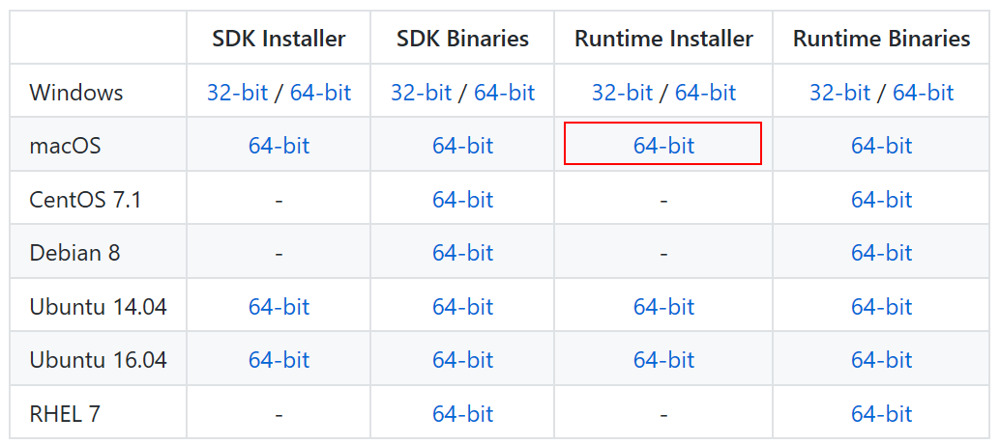

# Как написать смарт-контракт на C# в macOS

### 1. Visual Studio для Mac 

Если вы уже установили Visual Studio для Mac на своем компьютере, то можете пропустить этот шаг. Если нет, скачайте [Visual Studio for Mac](https://www.visualstudio.com/vs/mac/)

При установке выберите только базовые функции, не устанавливайте платформо-зависимые компоненты.


### 2. Создание фреймворка для смарт-контракта NEO
В отличие от Windows, где `Neo.Smartcontract.Framework` можно установить с помощью `NuGet`, в OSX мы должны скомпилировать его самостоятельно, иначе шаг 6 (см. ниже) не пройдет (если использовать какой-либо специальный метод NEO smartcontract).  

Скачайте [neo-devpack-dotnet](https://github.com/neo-project/neo-devpack-dotnet) с GitHub. Откройте `neo-devpack-dotnet.sln`. На экране может появиться сообщение об ошибке "Unknown solution item type" для проектов Installer и 2 Template. Данную ошибку можно смело игнорировать. Закройте окно-предупреждение, кликните правой кнопкой мыши по проекту `Neo.Smartcontract.Framework` и выберите `Build`. Запомните, где хранится `Neo.Smartcontract.Framework.dll` . Он понадобится вам для следующего шага.
 
```
<neo-devpack-dotnet download folder>/bin/Debug/netstandard2.0/Neo.SmartContract.Framework.dll.
```

### 3. Новый проект

Откройте Visual Studio для Mac, создайте новый проект и выберите .NET Standard Library（.NET Core → Library).


> [!Примечание]
> При создании нового проекта выберите версию .NET Core 2.0.

Затем разверните проект，кликните правой кнопкой мыши по `Dependencies` и выберите `Edit references...`. Затем откройте вкладку `.NET Assembly`, выберите `Browse` и добавьте `Neo.Smartcontract.Framework.dll` из шага 2. 


Поставьте галочку и нажмите ОК, чтобы закрыть диалоговое окно. Затем напишите следующий код в файле Class1.cs.

```c#
using Neo.SmartContract.Framework;
using Neo.SmartContract.Framework.Services.Neo;

public class Class1: SmartContract
{
    public static void Main()
    {
        Storage.Put(Storage.CurrentContext, "Hello", "World");
    }
}
```

Выберите в меню `Build`，`Build All`, чтобы скомпилировать код. Библиотечный файл .dll будет создан в папке `bin/Debug/netstandard2.0/`. Файл Dll - это файл языка .NET IL, который мы затем передадим в `neo-compiler` , чтобы преобразовать его в .avm файл смарт-контракта и развернуть в блокчейне.

Контракт в примере назван `sample_contract`. После компиляции генерируется файл `sample_contract.dll` , который мы будем использовать в следующем разделе.

### 4. neo-compiler

Скачайте [neo-compiler](https://github.com/neo-project/neo-compiler) с GitHub. Перед открытием решения в Visual studio необходимо сначала отредактировать `neon.csproj` , чтобы изменить настройки среды выполнения (runtime identifiers). Разместите файл в `/neo-compiler/neon/neon.csproj`, откройте его в текстовом редакторе и замените  

```
<RuntimeIdentifiers>win10-x64</RuntimeIdentifiers>
```
на
```
<RuntimeIdentifiers>osx.10.12-x64</RuntimeIdentifiers>
```
Затем откройте решение `neo-compiler` и создайте проект. Теперь файл `neon.dll` расположен в `/bin/Debug/netcoreapp2.0/`.


### 5. .NET Core

Скачайте и установите  [.NET Core 2.0.3](https://www.microsoft.com/net/download/macos), если вы не сделали этого ранее.




### 6. Компиляция смарт-контракта в .avm

Основной синтаксис 

```
dotnet neon.dll <your smart contract.dll>
```

 `neon.dll` это файл из шага 3. В нашем примере `sample_contract.dll`  -- это смарт-контракт. Вывод должен выглядеть так


```bash
Eriks-Air:netcoreapp2.0 erik$ dotnet neon.dll ~/Projects/sample_contract/sample_contract/bin/Debug/netstandard2.0/sample_contract.dll
Neo.Compiler.MSIL console app v2.0.3.5
Find entrypoint:System.Void Class1::Main()
convert succ
gen abi succ
write:sample_contract.avm
write:sample_contract.abi.json
SUCC
```

Теперь вы должны увидеть файл `.avm` в папке sample_contract.
```
Eriks-Air:netcoreapp2.0 erik$ ls -1 ~/Projects/sample_contract/sample_contract/bin/Debug/netstandard2.0/
sample_contract.abi.json
sample_contract.avm
sample_contract.deps.json
sample_contract.dll
sample_contract.pdb
```
